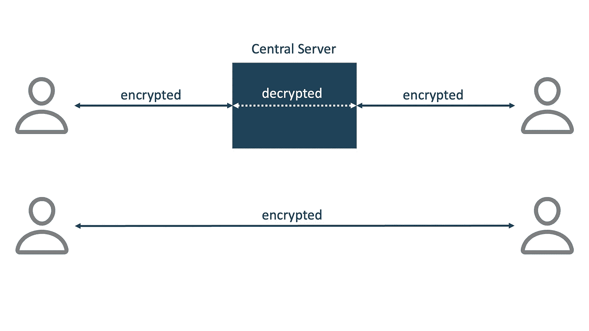

# 视频会议中使用对等架构的 7.5 个理由

> 原文：<https://betterprogramming.pub/7-and-a-half-reasons-for-a-peer-to-peer-architecture-in-video-conferencing-6cb4209be3d6>

## 为点对点视频会议提供理由，即使它不会随着参与者的数量而增加


照片由[上的](https://unsplash.com?utm_source=medium&utm_medium=referral)[面](https://unsplash.com/@surface?utm_source=medium&utm_medium=referral)拍下

似乎没有多少视频会议应用程序使用对等(P2P)架构，原因很简单——它们无法扩展。对于某些应用程序来说，可伸缩性是必要的，但是不能使用这些类型的连接来构建它们。我们在[游艇上。然而，相信我们有充分的理由让它们发挥作用。以下是其中的 7 个半。](https://www.yacht.chat/)

# 视频会议架构

让我们从解释 P2P 视频会议的工作原理和它的替代品开始。有三种方法可以构建视频会议应用程序:使用 P2P 网络、选择性转发单元(SFU)或多点控制单元(MCU)。在这一节中，我不会深入讨论任何技术细节，但让我们简单地讨论一下，让大家达成共识。

## 点对点

可以想象，P2P 意味着每个人都与每个人相连，这意味着每个参与者都将自己的视频流(和音频流)发送给每个人，并从每个人那里获得视频流。每对对等体之间的连接初始化称为信令过程。只有在这个初始化阶段才涉及到一个中央服务器，即信令服务器。每个对等体让信令服务器知道如何连接到它，信令服务器将该信息转发给所有其他对等体。对等体使用该信息来建立彼此之间的直接连接，然后使用该连接来传输视频流。从下图中我们可以看到，即使是 6 个对等点的 P2P 网络也已经有了很多连接，这就清楚了为什么 P2P 不会随着会议参与者的数量而扩展。


对等体使用信令服务器建立相互连接。一个有 6 个对等点的 P2P 网络已经有 30 个(有向边)连接:#Connections(n) = n(n-1)。

## 选择性转发单元

SFU 是一个中央服务器，每个参与者都向其发送视频流。然后，该流被转发给会议中的其他每个人。因此，每个参与者只需要发送一次他的视频流，使得会议更具可扩展性。此外，SFU 可以根据接收参与者的网络质量来调整传输的视频质量。


SFU 是转发视频流的中央服务器。

# 多点控制单元

MCU 也是一个中央服务器，它接收来自每个参与者的视频流，将它们组合成一个流，然后转发给每个人。因此，每个参与者只有一个输出流和一个输入流，这使得该体系结构最具可伸缩性。


MCU 组合所有输入的视频流，并将组合的视频流发送给所有参与者。

# 对等架构的 7.5 个理由

好的，听起来 MCU 显然是最好的选择？嗯，没那么容易。在 SFU 或 MCU 上使用 P2P 架构有很好的理由。让我们来看看它们。

## 1.最简单的入门方法

设置 P2P 会议应用程序比处理需要配置的中央服务器更容易。现在，你可能会争辩说，我们刚刚了解到仍然涉及到一个中央服务器，即信令服务器。虽然这是正确的，但是信令服务器很容易设置，因为它只是将信息从一个参与者转发到另一个参与者。我们在[游艇上的第一个视频会议原型。Chat](https://www.yacht.chat/) 仅仅运行了几天，如果我们必须弄清楚如何让 SFU 或 MCU 工作，这肯定是不可能的。对我们来说，决定 P2P 架构意味着建立一个 MVP，并更快地找到适合市场的产品。

建立一个信令服务器可以像编写 20 行代码一样简单。

## 2.轻松扩展并发视频会议

虽然 P2P 应用程序不能根据会议中的参与者数量进行扩展，但是您的 P2P 应用程序可以轻松地扩展到许多单独的会议。这归结为不是所有的用户流都通过您的服务器运行。另一方面，运行 SFU 或 MCU 的服务器必须同时管理许多流。您必须根据您希望主办的会议数量来扩展您的基础设施。使用 P2P 架构从根本上改变了这一点。事实上，您的基础设施(信令服务器)只会在初始化过程中使用，在初始化过程中它会转发几千字节的数据。在很长一段时间内，您将不必担心基础架构的扩展。

## 3.部署一次服务所有人

构建会议应用程序的一部分是决定首先瞄准哪个市场/国家。您可能认为您的服务器位置暗示了您能够服务的市场，尤其是当涉及到视频会议这样对延迟敏感的事情时。但是，同样，视频流不会发送到您的服务器，而是在会议中的每个人之间直接传送。您的服务器位置并不重要。假设你在欧洲部署了你的信令服务器，美国的用户将会和亚洲或欧洲的用户有同样的体验。


在使用信令服务器建立 P2P 连接之后，视频流将在每对对等点之间采取直接方式。

## 4.成本效率

中央服务器的设置和运行是视频会议的主要部分——你必须将成本转嫁给你的用户。使用 P2P 架构并消除这个主要的成本点，可以让你以更低的费用提供你的应用程序(你可能不需要在 40 分钟后把你的免费用户踢出去)。

## 5.视频质量

没有视频流先去中央服务器，然后再到它的接收器，这是一个很好的视频会议体验。采用直接方式总是更快，因此延迟更短。此外，您可以让视频会议的参与者以高分辨率和高帧率共享他们的视频(或者他们的屏幕)，因为您不必担心服务器上潜在的网络负载。

## 6.隐私

为了让人们使用你的会议应用程序，他们需要对你有一定程度的信任，尤其是当你还没有任何可信度的时候。例如，他们当然希望确保你维护他们的隐私，不要出于广告目的出售他们的谈话内容。P2P 连接的一个主要优点是它可以进行端到端加密。[事实上，如果你使用 WebRTC](https://webrtc-security.github.io/#4.3) ，就必须如此。在信令过程中，即连接的初始化过程中，一对对等体交换他们的密钥，以确保只有目标接收者才能解密视频流。

这同样适用于使用 SFU/ MCU，不同之处在于接收器是中央服务器。这意味着数据流可以通过网络以加密的形式发送，但是，中央服务器必须对其进行解密才能转发或编辑。因此，不依赖于 P2P 架构的视频会议提供商将总是能够分析其用户的视频流。用户可能愿意相信视频会议市场上的大公司(或者他们根本不在乎)，但是他们可能不相信你的新应用，他们从来没有见过。如果你的应用程序使用 P2P 连接，并且你声称你尊重用户的隐私，你的用户就不必相信你了——他们知道你不能访问他们的视频流



虽然 P2P 连接可以进行端到端加密，但在转发流之前，中央服务器总是会先解密，然后再加密。

## 7.设备和网络不断改进

P2P 视频会议无法扩展，因为计算和网络流量是从中央服务器转移到每个参与者的设备上的。一个会议能容纳多少参与者的问题是一个关于他们的设备能处理多少计算以及他们的网络能处理多少流量的问题。[随着时间的推移，这两项指标都明显改善](https://www.businessinsider.com/internet-speeds-have-gotten-dramatically-faster-over-past-decade-2019-11)。今天，P2P 会议比以往任何时候都更加可行，这一趋势将继续下去。这当然不会从根本上改变 P2P 会议的规模，但多 1-2 名参与者已经可以有所作为。

## 7.5 环境

一些 P2P 应用提供商甚至声称 P2P 方法更环保、更节能。作为提供商，你当然可以通过将计算转移到用户的设备上来节省能源。会议的净能源成本是否真的更低值得怀疑。如果有人试图证明 P2P 会议的“绿色性”，那可能是这样的:P2P 架构让更多人负担得起视频会议，让他们更容易在家工作，节省通勤时间。

# 结论

P2P 会议糟糕的可伸缩性确实是反对使用它们的唯一理由，但这当然也是一个重要的理由。你应该问问自己，你是否需要在你的会议中有 5-6 个以上的同时与会者。如果没有，P2P 会议可能对你有用。

```
**Want to Know More About the Author?**We at Yacht.Chat went with a P2P architecture because it was just easier and faster to get started, not very deliberately we have to admit. But [Yacht.Chat](https://www.yacht.chat/) is not trying to replace big static meetings with a lot of participants and, therefore, it might work for us ([Have a look here to see what we are doing](https://www.yacht.chat)).
```