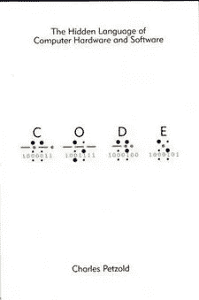
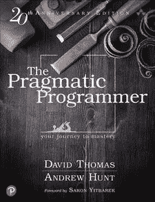
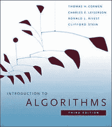
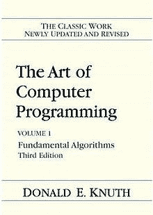
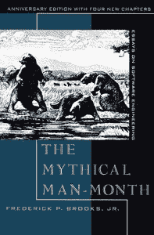
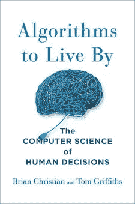

# 程序员必备的 7 本书

> 原文：<https://betterprogramming.pub/7-essential-books-for-programmers-869bca83b360>

## 一本给那些对编程很认真的人的阅读指南

埃胡德·纽豪斯在 [Unsplash](https://unsplash.com?utm_source=medium&utm_medium=referral) 上拍摄的照片

如果你和我一样，你第一次学习如何编码是因为你喜欢做东西(也许有点太喜欢电脑了)。

计算机编程在某种程度上是人类创造力的终极实践。当我曾经作为一名志愿青年辅导员工作时，我们将创造力定义为“无中生有”的过程。

这正是我们作为程序员所做的:我们无中生有。

给我们一个空文本编辑器，我们会还给你自动驾驶汽车、互联网和超现实虚拟现实。

作为一名程序员，磨练自己的技能不是一件容易的事情，但是可以变得很有趣。

学习一些编程语言可能看起来像是结束，但这仅仅是开始。

你有工具，现在你必须学会如何使用它们。当然，如果你非常了解一门编程语言，那会很有帮助，但是诀窍在于你如何使用它。

如果你有解决难题的诀窍，也有一点耐力，你就能看完这些书，从熟练程序员变成专家。

注意:书籍封面图片的所有权利属于其各自的所有者。

# 代码:计算机硬件和软件的隐藏语言

查尔斯·佩佐德

[代码:计算机硬件和软件的隐藏语言](http://www.charlespetzold.com/code/)

查尔斯·佩佐德，微软出版社出版。

这本书不会教你如何编程，也不会教你如何在科技行业找到工作。

另一方面，这是迈向这一旅程的第一步。很多时候，我看到人们在编程上苦苦挣扎，因为他们缺乏完成工作所需的技术知识。这本书解决了这个问题。

> “计算机处理器做的事情很简单——它将一个字节从内存移到寄存器，将一个字节加到另一个字节上，然后将结果移回内存。任何实质性的事情得以完成的唯一原因是这些操作发生得非常快。引用罗伯特·诺伊斯的话，“当你适应了纳秒之后，计算机操作在概念上就相当简单了。”"

即使您已经与计算机打交道很长时间了，Petzold 也有可能教会您一些新东西，或者至少从您以前没有考虑过的角度向您展示一些东西。

这是所有技术事物的一个入口点，并且作为一个有成就的程序员完成你的教育是必要的。

# 务实的程序员

安德鲁·亨特和迪夫·托马斯

[实用程序员，20 周年纪念版，第二版](http://www.informit.com/store/pragmatic-programmer-your-journey-to-mastery-20th-anniversary-9780135957059)

安德鲁·亨特和迪夫·托马斯著，艾迪森-卫斯理专业出版社出版。

在本书中，安德鲁·亨特和迪夫·托马斯为读者提供了一系列提高编程输出的技巧。

这些技巧主要围绕这样一个原则，即编程本质上是一种协作追求。如果你渴望成为一名软件工程师或任何类型的程序员，你将要使用的大部分代码都不是你的。亨特和托马斯的建议指导你在这样的环境中工作。

他们的建议很实用，最好通过实践来学习。当你拿起这本书时，试着慢慢来，并在下次编程时思考作者的建议。这不是一次性阅读，而是良好实践研讨会。

一些例子:

提示 11:干—不要重复自己
提示 30:你写不出完美的软件
提示 44:不要巧合编程
提示 50:不要使用你不懂的向导代码
提示 70:在你的作品上签名

“务实的程序员”为任何从事代码工作的人提供了宝贵的建议，它应该出现在每个程序员的图书馆里。

# 算法简介

托马斯·h·科尔曼，查尔斯·e·莱瑟森，罗纳德·L·李维斯特和克利福德·斯坦

[算法简介，第三版](https://mitpress.mit.edu/books/introduction-algorithms-third-edition)

作者托马斯·h·科尔曼、查尔斯·e·莱瑟森、罗纳德·L·李维斯特和克利福德·斯坦，麻省理工学院出版社出版。

如果你有计算机科学的学士学位，你可能已经知道这个了。你可能也已经完成了一些练习。如果你没有，请原谅我。

在没有老师的情况下阅读这样的一本书可能会令人望而生畏，但不再上学的好处是你可以慢慢来。不管花多长时间，本书中介绍的基本数据结构和算法对任何认真对待其职业发展的程序员来说都是无价的。

当然，你可以作为一名软件工程师工作几年而不记得快速排序的时间复杂性。如果不从堆栈溢出中粘贴 DFS 或者不使用内置库，您也可以编写 DFS。

但是过了学校就不需要数据结构和算法的概念是幼稚的。它们是程序员解决问题的工具。他们是现代软件工程师的面包和黄油。

如果你不熟悉这本书(或者你选择的算法书)的内容，你就不能指望成为程序员、软件工程师或者计算机科学家。

# 计算机编程的艺术:第 1 卷

唐纳德·克努特

计算机编程的艺术:第一卷基础算法

唐纳德·e·克努特著，艾迪森-韦斯利专业出版社出版。

就像这个列表中的前一个条目一样，通过“计算机编程的艺术”是一项艰巨的任务。很少有人能够始终如一地通读整本书。甚至更少有人花时间在最初几章中研究所有的数学知识。

我没有通读整本书，但我仍然不能推荐更多。它有自己的问题，主要是关于 Knuth 的混合语言对现代观众的支持程度，但如果你超越这一点，他对基本算法和数据结构提供了令人难以置信的洞察力和深度。

这本书是对智力和毅力的真正挑战，但它也是巨大信息财富的来源。

比尔·盖茨本人[说](https://www.businessinsider.com/bill-gates-loves-donald-knuth-the-art-of-computer-programming-2016-4?r=US&IR=T)如果你读完这本书，你应该给他寄一份简历。值得一试，对吧？

# 破解编码面试

盖尔·拉克曼·麦克道尔

[破解编程面试:150 个编程面试问题及解答，第 6 版](http://www.crackingthecodinginterview.com/)

由盖尔·拉克曼·麦克道尔著，作者出版。

想找一份软件工程师的工作吗？不管你的答案是什么，这本书仍然值得一读。

虽然算法和数据结构教科书是必不可少的读物，但它们很少甚至没有提供实际的练习。我知道我在这本书之前列出的两本书对它们介绍的每个概念都有无数的练习，但是有一个问题:你总是知道使用什么工具。

在现实世界中，软件问题并没有提示使用什么数据结构、算法或技术。

在解释了基本的数据结构和算法之后(顺便说一句，不要直接跳到这本书)，作者在本书的结尾包括了两个额外的部分，列出了中等难度和硬难度的问题。

这些问题随机出现，挑战读者找出解决它们的最佳方法。如果您在阅读前面的章节时一直在关注，那么在选择正确的数据结构或算法来解决问题时，您会发现不同的模式和线索。

这本书让你在计算机编程的背景下成为一个更好的问题解决者，所以它是必不可少的，即使你近期没有面试的打算。

# 神话中的人月

小佛瑞德·P·布鲁克斯

神话中的人月:软件工程论文集，周年纪念版，第二版

由小佛瑞德·P·布鲁克斯著，艾迪森-卫斯理专业出版。

这本关于软件工程的历史书籍取代了关于管理软件项目的必读书籍的位置。

如果你打算和一个工程师团队一起工作，本书中介绍的概念将会拓宽你的视野，让你知道在软件开发的环境中什么是可行的，什么是不可行的。

核心信息是，软件工程不能直接与人力可以直接与时间互换的其他学科相比。如果有什么不同的话，布鲁克斯声称，事实正好相反。“好的烹饪需要时间。如果让你等待，那是为了更好地为你服务，也是为了取悦你，”布鲁克斯引用了这本书第二章的副标题。

这篇文章和其他十几篇关于软件工程实践的文章有助于任何程序员了解这个学科中的陷阱。这本书可以确保你不会误解自己在团队、组织和整个科技行业中的角色。

这是一本值得一读的好书，然后巧妙地推荐给你的经理。

# 赖以生存的算法

布莱恩·克里斯蒂安和汤姆·格里菲斯

[赖以生存的算法:人类决策的计算机科学](https://us.macmillan.com/books/9781627790369)

布莱恩·克里斯蒂安和汤姆·格里菲斯，亨利·霍尔特出版公司。

这个列表中的最后一本书并不完全与编写代码相关，而是研究从某些算法的设计中衍生出来的解决问题的技术(在这个列表中，你可能已经遇到了)。

这本书的作者在人类心理学和计算机科学之间建立了辉煌的联系，将一些精心挑选的算法背后的基本原理与日常问题联系起来。

程序员有时会怀疑他们所学的概念在计算机上编写代码之外的应用性，这并不罕见。幸运的是，Christian 和 Griffiths 对此提供了一个答案，将常见算法应用于非计算机科学问题，并将日常关注的答案量化。

虽然学习使用算法和数据结构来编写更好的代码是一项值得追求的目标，但学习如何在文本编辑器之外的环境中使用它们会让学习它们变得更有趣。

在 [ko-fi](https://ko-fi.com/giorgospetkakis) 上支持我或者通过[成为一个媒介成员](https://blog.giorgospetkakis.me/membership)。