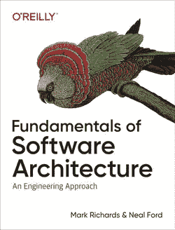
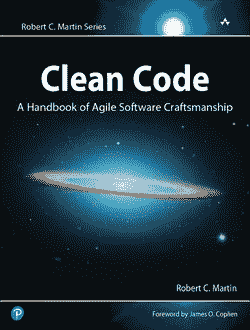
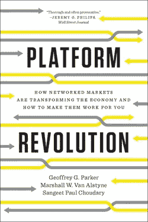
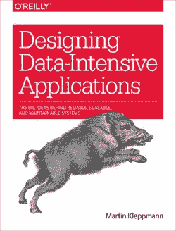
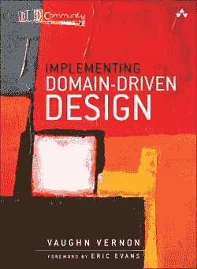
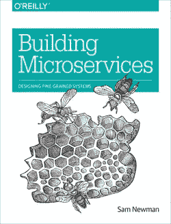

# 7 本给有抱负的软件工程师和架构师的精彩书籍

> 原文：<https://betterprogramming.pub/7-fabulous-books-for-aspiring-software-engineers-and-architects-a9388ae56b4f>

## 通过这些主要的工程主题增加你的知识面

马修·费尼在 [Unsplash](https://unsplash.com?utm_source=medium&utm_medium=referral) 上的照片

我去非虚构派对已经很晚了。当我高三的时候，我开始阅读与软件工程相关的书籍。这绝不是世界末日，相反，我从网上资源中学到了很多，但从书中也可以学到很多东西。

看似无穷无尽的技术书籍清单，我挑选了其中七本我最喜欢的。这份清单涵盖了从基础软件概念到架构，再到数据工程的所有内容，所以这份清单上应该有适合每个人的东西！

# 软件架构的基础&软件架构:难的部分

尼尔·福特、马克·理查兹、普拉莫德·萨达拉吉和扎马克·德赫加尼

图片来源:[奥莱利传媒](https://www.oreilly.com/library/view/fundamentals-of-software/9781492043447/)

2019 年，我去了柏林的 O'Reilly 软件架构会议，这些书的四分之三的作者在那里主持研讨会和会议。

这些会议是从这两本书中摘录的，这两本书对于任何想要扩展他们的架构知识的人来说都是极好的。在这两本书之间，它们涵盖了从架构基础到架构风格，到软技能，到权衡分析，到数据所有权&模块化的所有架构。

听起来要涵盖的内容很多，的确如此。然而，它非常容易理解，解释得很好，对于任何设计系统的人来说都是学习的关键。

# 干净的代码:敏捷软件工艺手册

罗伯特·c·马丁(鲍勃大叔)

图片来源:[奥莱利传媒](https://www.oreilly.com/library/view/clean-code-a/9780136083238/)

《干净的代码》是我阅读的第一本工程书籍，纯粹是为了学习如何以可持续的敏捷方式编写代码。如果你想学习写更好的代码，这是你应该读的第一本书。到目前为止，第二部分是我最喜欢的，这里的案例研究用于识别和清理一组类。

我学到的知识包括如何识别好代码和坏代码，最小化我创建的类之间不必要的耦合，更深入地理解测试驱动开发，以及在我的代码中寻找一系列气味。

# 平台革命:网络市场如何改变经济

杰弗里·g·帕克、马歇尔·w·范·阿尔斯廷和桑吉特·保罗·乔达里

图片来源:[亚马逊](https://www.amazon.co.uk/Platform-Revolution-Networked-Transforming-Economy/dp/0393249131)

平台革命是我在本文中的通配符条目，主要是因为它不像其他书籍那样深入技术。相反，它解释了技术的商业方面，重点是最新的革命——平台。

大多数科技公司都在向平台模式发展，所以工程师和架构师理解这种模式是非常重要的。阅读这本书，你会明白什么是平台模式，如何开始，如何将你的平台货币化，以及如何管理你的平台。

# 设计数据密集型应用程序:可靠、可伸缩和可维护系统背后的重要思想

马丁·克莱普曼

图片来源:[奥莱利媒体](https://www.oreilly.com/library/view/designing-data-intensive-applications/9781491903063/)

许多年前，数据是实际应用程序本身的次要考虑因素。然而，现在数据被认为是一等公民，是构建任何新应用程序时必不可少的考虑因素。

有大量的技术可供您吸收、处理和分析数据，您选择哪一种？

只需设计数据密集型应用程序。这本书涵盖了所有当前最受欢迎的内容，包括关系和 NoSQL 数据库、流和消息。这不仅仅是一个高层次的概述，这本书还涵盖了每种方法的优缺点，一些潜在的用例，以及如何在不同的情况下进行选择。最后，这本书使用一些主要的技术公司作为案例研究，将现实世界的镜头应用到技术中。

# 实现领域驱动的设计

沃恩·弗农

图片来源:[奥莱利传媒](https://www.oreilly.com/library/view/implementing-domain-driven-design/9780133039900/)

这里列出的几本书将会涉及领域驱动设计(DDD)，但是没有一本深入到足够理解它以使你自己利用它的细节。

根据我的经验，领域驱动设计现在是任何工程师的基本概念。理解你工作的领域，定义你的组织的核心实体和价值目标，以及领域事件等概念是至关重要的。

这本书将会介绍上述所有内容，以及你可以用来帮助你理解你的领域的 DDD 技术。它将这些技术与 REST 和事件驱动等架构模式相结合，让您能够理解如何在自己的架构中利用它们。

# 构建微服务:设计细粒度系统

山姆·纽曼

图片来源:[奥莱利传媒](https://www.oreilly.com/library/view/building-microservices/9781491950340/)

最后的书籍推荐侧重于构建微服务，但要以可持续的方式。优步从惨痛的教训中认识到，创建微小的、细粒度的服务会给任何科技组织带来相当大的麻烦。

在本书中，Sam Newman 为一家虚构的公司构建了一个架构，每一步都详细介绍了微服务架构的一个重要方面。涵盖的主题包括微服务的优缺点、微服务的集成模式、安全性和可伸缩性。

这本书是任何使用微服务或考虑迁移到微服务的人的必读之作！

# 结论

希望你喜欢这些书，我一直在寻找我的下一本书，所以你有什么推荐的书可以读吗？

我计划明年读的一本书是扎马克·德赫加尼的《T2 数据网》。数据网格作为一个概念正在迅速获得关注，所以如果你不熟悉的话，[这篇文章](https://martinfowler.com/articles/data-mesh-principles.html)现在提供了这个概念的一个很好的概述。

> 希望扩展您的技术知识，但不确定阅读什么？我办了一份免费的时事通讯，提供两周一次的技术书籍推荐，包括我从书中获得的关键信息。感兴趣吗？[在这里报名吧！](https://subscribe.technicalbookclub.com/?utm_source=medium&utm_medium=article&utm_campaign=fabulousbooks)