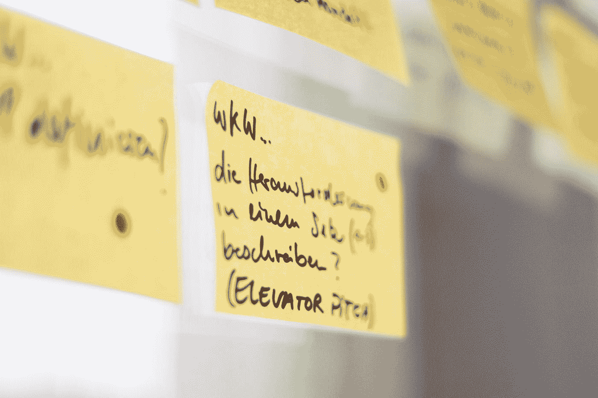

# 伟大团队回顾的 7 种形式

> 原文：<https://betterprogramming.pub/7-formats-for-great-team-retrospectives-185ebcbd4992>

## 反思工作的策略

图片由 [Unsplash](https://unsplash.com?utm_source=medium&utm_medium=referral) 上的[新数据服务](https://unsplash.com/@new_data_services?utm_source=medium&utm_medium=referral)提供

团队回顾是在冲刺、项目或里程碑结束时召开的会议，团队在会上反思过去的工作周期并确定改进。

它包括庆祝成就以提高团队精神，收集挑战反馈，以及计划如何在即将到来的冲刺或项目中更好地执行。回顾对于持续改进和团队成长是必不可少的。

回顾会议旨在促进团队讨论和有益的成果。他们通常从介绍开始，然后收集、展示和讨论每个团队成员的意见，最后确定下一步。

收集输入通常并行进行。在回顾式问题的引导下，每个团队成员在便笺上写下他们的想法，并放在白板上(或远程会议中的数字等效物)。

我有机会参与、促进和尝试几种回顾性的形式。有些格式更适合经常出现的情况，例如在冲刺阶段结束时，而其他格式则适合混合使用，例如在完成一个大型项目后。以下是我对你可以经常使用的七种回顾形式的想法和经验。

# 标准

*   什么进展顺利？
*   什么不顺利？
*   我们能改进什么？

标准格式涵盖了主要领域(积极方面、消极方面和改进方面),提出了一些实实在在的问题，易于理解。然而，随着时间的推移，它可能会变得无聊，并且专注于负面经历和改进的倾向可能会导致庆祝活动失败。

# 带有感谢符号的标准

*   什么进展顺利？
*   什么不顺利？
*   我们能改进什么？
*   你欣赏谁的贡献？

有助于欣赏团队及其成就的标准回顾的变体是欣赏的象征。除了这三个问题之外，每个团队成员都可以说出其他人的贡献。然后，他们会收到一份感谢状(如一朵花或巧克力)和团队的积极反馈。这种变体有助于使标准回顾更加积极，并加强团队精神。

# 开始-停止-继续

*   我们应该从什么开始？
*   我们应该停止什么？
*   我们应该继续什么？

开始-停止-继续是另一种广泛使用的回顾形式。它非常面向解决方案，关注开始和停止活动的形式变化。必要时，会讨论积极和消极的方面。

“开始-停止-继续”模式的优势在于，它着眼于变革，并为引入新思想留有余地。然而，这种回顾性的形式可能不会深入到原因和问题中，这可能是所希望的，也可能不是所希望的。另一个缺点是庆祝和欣赏不是这种形式的直接组成部分。

# 海星

*   我们应该从什么开始？
*   我们应该多做些什么？
*   我们应该继续什么？
*   我们应该少做些什么？
*   我们应该停止什么？

[海星回顾展](https://www.funretrospectives.com/starfish/)是开始-停止-继续的延伸。它增加了“我们应该做些什么？”以及“我们应该少做些什么？”经常出现的问题。通常，它通过将白板分成五个区域(海星)来表示，团队成员在相应的区域贴上他们的便笺。

虽然海星回顾改进了开始-停止-继续，但它在问题和欣赏方面仍然有所欠缺。此外，不得不预先将想法分为“少做”和“停止”通常没有帮助。

# 4L

*   你喜欢什么？
*   你学到了什么？
*   缺少什么？
*   你渴望什么？

[4L 回顾](https://conceptboard.com/blog/4l-retrospective-technique/)比标准回顾更积极，它鼓励通过“你学到了什么？”来分享知识问题。

在实践中，“缺乏”和“渴望”之间的区别相对较小且不明确，有一个 [3L 回顾展](https://www.funretrospectives.com/the-3-ls-liked-learned-lacked/)省略了“你渴望什么？”问题。

# 疯狂-悲伤-高兴

*   什么让你生气了？
*   是什么让你难过？
*   什么让你开心？

疯狂-悲伤-高兴回顾格式使用团队成员的情绪来引出问题，识别积极因素，并以这种方式建立团队凝聚力。疯狂-悲伤-高兴偶尔使用会很有效。

然而，当在每个周期使用时，它会导致反复的发泄和挫折，特别是当一些让团队成员不高兴的问题超出了团队的控制范围，不容易改变时。在这种情况下，团队可能更关注他们的负面情绪，而不是改善他们控制下的事情。

# 快乐-讨论-改进

*   我对什么满意？
*   我想讨论什么想法和话题？
*   我认为有哪些需要改进的地方？

快乐-讨论-改进回顾是我和我的团队在经历了上述形式后想出的一种形式。它创造了一种积极的欣赏、改进和开放的氛围，这是引入新思想和讨论问题所必需的。从“我”的角度提出问题，强调每个人都有自己的观点，并支持平衡的讨论。

总的来说，我们对这种形式非常满意。它对远程回顾很有效。快乐讨论改进的一个可能的增强是添加一个表示感谢的符号。

有许多回顾格式可供选择。我希望这篇博文能给你一些新格式的想法，你可以在自己的回顾中尝试一下。