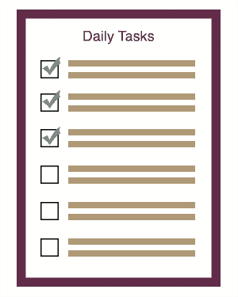
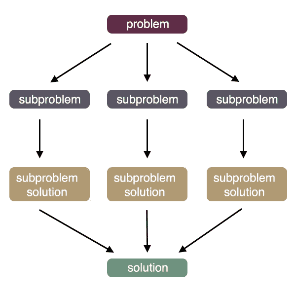

# 高效开发人员的 7 个习惯

> 原文：<https://betterprogramming.pub/7-habits-of-productive-developers-bce60d880907>

## 建立正确的习惯来保持每天的工作效率

照片由 [XPS](https://unsplash.com/@xps?utm_source=medium&utm_medium=referral) 在 [Unsplash](https://unsplash.com?utm_source=medium&utm_medium=referral) 上拍摄。

世界正变得日益竞争激烈。保持一致的生产力是所有开发人员每天可能面临的最大挑战之一。公司一直在衡量我们的表现。我们被监控是可以理解的，但这可能会导致焦虑。

要想富有成效，需要什么？光有技术技能还不够吗？有秘制酱吗？

最重要的是在日常生活中养成正确的习惯。就像坐在椅子上一样。是的，你可以想怎么坐就怎么坐，但是长此以往，你的背会疼的。

坏习惯会让任何人变成没有生产力的人。它们很危险，因为你养它们的时间越长，就越难摆脱它们。

有很多好习惯你可以采纳。在这篇文章中，我将涵盖那些最大的差异。如果坚持应用，它们将帮助你有一个更快乐和更有成效的工作生活。

# 1.计划你的每日目标

你能做的最好的事情就是做好准备。你如何准备自己？通过提前计划！

通过计划一些你想在一天中实现的目标来开始你的一天。想一想你今天能完成的最少的任务。

不需要一开始就非常特别。随着你养成这个习惯，你将学会微调自己。如果你觉得你的目标在一天结束时没有达到，第二天重复这个过程。你怎么能看出一个目标是否不现实？你将在实践中学习。

如果你的目标是现实的，并且你提前完成了，你就可以走了。不要为此感到难过。你今天刚刚杀了它！相反，如果你没有达到你的目标，而它们又是现实的，你会觉得有义务去完成它们——即使这意味着一点额外的工作。

待办事项列表。作者照片。

半途而废从来都不是一种好的感觉。它最终会影响你的个人生活。通过承诺并完成你的每日目标，你将永远保持良好的精神状态。

# 2.走出你的舒适区

这个习惯听起来确实有点违反直觉。舒适区不是最有生产力的地方吗？是的……但只是在短期内。编程发展很快，如果你拒绝走出你的舒适区，你可能一夜之间变得没有生产力。

走出你的舒适区让你每天都在学习。它让你跟上时代。它有助于提高你解决问题的能力。

一开始听起来可能超级恐怖，但也可能很好玩。每天做同样的工作可能会让你厌烦。它不会让任何人感到无聊。

然而，这不是你每天都需要做的事情。那可能太多了。反正你可能每天都没有机会。所以一旦看到机会就要抓住。你会马上开始注意到它的好处。

# 3.不要一心多用

把多重任务当成你的敌人。你可能会有一种错觉，认为同时做几件事会让你进步更快。在大多数情况下，这只是一种错误的看法。

> "多任务处理——一种做两倍于你应该做的事，而只做你能做的一半的艺术."

事实证明，从一项任务转换到下一项任务会严重影响工作效率。通过转换任务，你正在改变你正在做的事情的背景。这不会马上发生。你的大脑需要一些时间来适应。当你安定下来的时候，你可能需要换回来。

一心多用是非常诱人的。如今，似乎只有聪明人才能做到这一点。所以当你陷入这个坏习惯时，你是在把自己当成一个更聪明的人。

不幸的是，多任务的负面影响需要一段时间才能显现出来。突然，有太多并行的事情要处理，你发现自己在走捷径。这些捷径是有代价的。

如果你退后一步，从你的同龄人的角度来看，它确实看起来像你在同时做许多事情，但什么也没做。你正在做多少任务并不重要。重要的是你完成了多少，以及完成得有多好。

# 4.务实点

应用实用编程的基本原理将会对您的结果产生巨大的影响。

像“吻”、“干”、“YAGNI”等概念应该在你的日常编程生活中扮演重要角色。如果你不知道这些概念，你可以查看[我关于这个话题的文章](/7-software-development-principles-that-should-be-embraced-daily-c26a94ec4ecc)和/或阅读*《务实的程序员*。

插图过渡到 YAGNI，吻，干。

接受这些基本原则将使你免受这些常见问题的困扰:

*   过度工程解决方案
*   紧密耦合和低内聚力
*   意大利面条代码
*   糟糕的计划
*   过早优化
*   过早重构
*   创建不必要的实体

养成应用这些原则的习惯将会产生积极的影响。他们会给你一个更清晰的想法，告诉你为什么要做事，并帮助你找到正确的*方式*。它们将帮助你更好地规划、构建、执行和测试你的代码。

拥有正确的技能和知道如何应用它们一样重要。一旦你体验了它的所有优点，你一定会成为一个实用的编程传道者。

# 5.保持专注

专注是说起来容易做起来难的事情之一。很难正确聚焦并进入状态。然而，很容易分心。

进入状态和不被拉出来一样重要。所以，尽你所能确保这种情况不会发生。当然，这并不意味着对别人不友好。

以下是一些可能对你有帮助的提示:

*   无缘无故禁止自己浏览网页。利用你的休息时间。
*   忘记工作中的社交媒体。把那个留给你的业余时间。
*   把你的手机调到免打扰模式。只需在紧急情况下启用重要呼叫以绕过该模式。
*   孤立自己。用点耳机或者找个安静的地方。
*   防止被打断。打破人们走到你办公桌前进行社交的习惯。远离它去社交吧。

另一个重要的方面是专注于会议。确保你不会忽略正在说的话。大多数会议都是有原因的，你应该充分利用它们。

# 6.避免兔子洞

兔子洞最有可能影响你的工作效率。他们不请自来。有时候一个任务看起来很小，但是你越钻研，你发现的工作就越多。在早期阶段发现这一点并采取行动至关重要。否则你可能会浪费很多时间。

有很多方法可以解决这个问题。我最喜欢的方法是使用分而治之的范式:

> “在[计算机科学](https://en.wikipedia.org/wiki/Computer_science) , **分而治之**是一种[算法设计范式](https://en.wikipedia.org/wiki/Algorithm_design_paradigm)。分治[算法](https://en.wikipedia.org/wiki/Algorithm)递归地将一个问题分解成两个或更多相同或相关类型的子问题，直到这些子问题变得足够简单，可以直接解决。然后将子问题的解决方案组合起来，给出原问题的解决方案。”— [维基百科](https://en.wikipedia.org/wiki/Divide-and-conquer_algorithm)

通过将这个永无止境的任务分成小单元，你会对自己的前进方向有一个更清晰的认识。这也有助于他人了解你的进步。

分而治之。

所有的小任务完成后，解决方案就会展现在你面前。

# 7.学会休息

休息有很多好处:

*   提高你的记忆力
*   起到增强能量的作用
*   减轻压力
*   改善你的健康
*   激发你的表现和创造力

不要找借口不休息。即使你被困在一项任务中，最好离开你的办公桌十分钟，带着一个新鲜的精神状态回来。我知道有时候感觉你不能休息，但是你可以。如果你拒绝，完成一项任务可能会花费你更长的时间，最终你会更加沮丧。有时候你必须后退一步才能前进两步。

不过，不要休息太久。就像生活中的所有事情一样，你需要找到一个平衡点。否则，会导致:

*   低生产率
*   消遣
*   扰乱流动

总之，这是一个需要经验才能纠正的习惯。休息的时间长短和频率因人而异。随着时间的推移，你会学会找到你的最佳点。

# 最后的想法

养成好习惯需要一些练习和努力。然而，从长远来看，这是值得的。

最好的开始方式是什么？随便挑一个自己喜欢的，试着应用到日常生活中。你很快就会看到好处。一旦你更自信了，就试着再领养一个，以此类推。

要知道这不是可以也不应该操之过急的事情。耐心，练习，再重申，这是对我有效的方法。

有一些扎实的习惯会对你的日常表现产生很大的影响。他们将是你在这个竞争激烈的世界中不迷失的指南针。

干杯！

# 相关文章

 [## 每天都应该遵循的 7 个软件开发原则

### 《吻》、《干》、《YAGNI》等等

better 编程. pub](/7-software-development-principles-that-should-be-embraced-daily-c26a94ec4ecc)  [## 您应该掌握的五大打字稿功能

### 使用这些必须知道的特性来提高您的打字稿知识

better 编程. pub](/top-5-typescript-features-you-should-master-2358db9ab3d5)