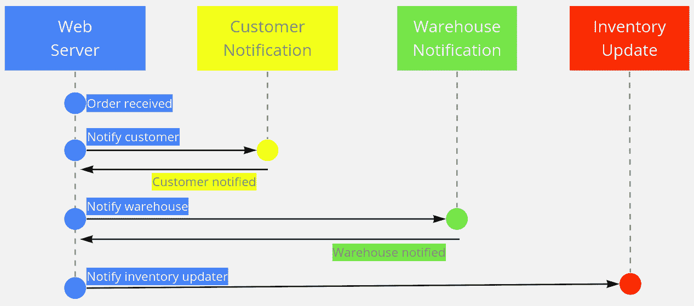
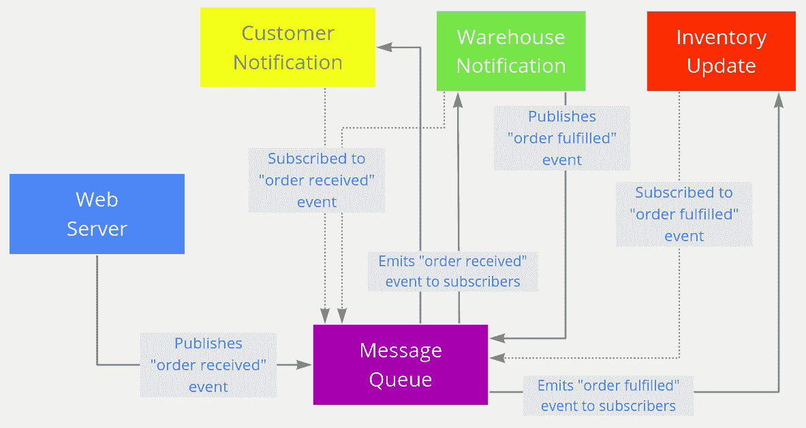

# 软件开发人员的 7 项微服务最佳实践

> 原文：<https://betterprogramming.pub/7-microservices-best-practices-for-software-developers-99dd92f2022c>

## 数据存储、通信通道等的分离


斯蒂芬·克罗利在 [Unsplash](https://unsplash.com?utm_source=medium&utm_medium=referral) 上的照片

除非你一直在山洞里开发软件，否则你很可能听过人们对微服务的赞美。它们敏捷、简单，是对 T4 和面向服务架构时代的全面改进。当然，伴随着微服务的所有好处而来的是一系列新的挑战。

在本文中，我们将了解一些微服务最佳实践。此外，我们将建议一些行之有效的方法来帮助您设计、协调和保护您的微服务架构。通过理解这些实践，您将在一个成功的项目上有一个良好的开端。

# 微服务的优势和挑战

然而，在我们深入研究微服务最佳实践之前，我们应该先谈谈微服务的一些[优势](https://konghq.com/learning-center/microservices/?utm_source=guest&utm_medium=devspotlight&utm_campaign=community)和挑战，以及为什么你会想首先使用它们。

简而言之，微服务是一种改进的软件架构，允许您:

*   **更快地部署和扩展**。较小的应用程序域责任允许自动化，从而加快部署和扩展。
*   **减少停机时间**。限制一项不可用的服务对您的主要业务功能的影响，提高您的总体业务正常运行时间。
*   **确保可用性**。保持微服务之间的功能分离，限制实例停机时的影响。

当然，有了这些好处，我们也面临一系列新的挑战，包括服务间通信、[安全性](https://konghq.com/learning-center/api-gateway/building-a-secure-api-gateway/?utm_source=guest&utm_medium=devspotlight&utm_campaign=community)和可伸缩性。

*   **军种间通信**。对于一个单一的应用程序，所有的模块都可以相互通信。您只需管理一个证书，一旦请求通过了身份验证和授权，它就可以顺利地遍历代码路径。当您从 monolith 架构中提取一个功能到微服务应用程序时，曾经的内部功能调用变成了外部 API 调用，需要对外部微服务进行[认证](https://konghq.com/learning-center/microservices/microservices-security-and-session-management/)和授权。
*   **安全层**。在 monolith 应用程序中，身份验证和授权可以在入口点一次性处理。随着向微服务的过渡，每个微服务都需要执行一些身份验证和授权，以实施访问控制。要求用户每次使用不同的微服务都要登录是不太现实的，所以需要建立一个全面的 auth 策略。
*   **可扩展性**。尽管微服务允许你快速扩展独立的功能，但是有效地这么做需要良好的应用程序管理甚至更好的工具。您的可扩展性的有效性取决于您的微服务[编排平台](https://konghq.com/learning-center/microservices/microservices-orchestration/?utm_source=guest&utm_medium=devspotlight&utm_campaign=community)，我们将在下面详细讨论。

简要概述了微服务的优势和挑战后，现在让我们深入了解一些最佳实践。这些最佳实践将帮助您创建一个健壮的、易于管理的、可扩展的、安全的交互微服务系统。

# 1.小型应用领域

采用微服务策略需要采用[单一责任原则](https://en.wikipedia.org/wiki/Single-responsibility_principle)。通过限制任何单个服务的责任范围，我们限制了该服务失败的负面影响。如果单个微服务的责任太大，它的故障或不可用将对系统的其余部分产生多米诺骨牌效应。

一个*微*服务应该就是:微。保持微服务的应用领域较小，专用于一个逻辑功能。如果出现任何问题，这将减少给定微服务的影响。此外，较小的服务更容易维护。结果是更新更容易，开发更快。

这在实践中是什么样子的？例如，让我们假设我们的微服务是一个 API 服务器，它接受获取数据的请求，并且授权令牌必须伴随这些请求。当您刚刚开始时，这是唯一需要授权令牌的微服务。为什么不把认证和令牌生成作为微服务的一部分呢？乍一看，它的优点是移动部件更少，管理更少。

当然，总有一天会有其他服务需要授权令牌。您很快就会发现，原来的微服务充当 API 服务器*和认证服务器*。如果您的 API 服务器宕机，那么您的身份验证服务器也会随之宕机。这样，其他所有需要授权令牌的服务也需要授权令牌。

为未来的自己考虑:保持你的微服务小。

# 2.数据存储分离

连接到同一个数据库的多个微服务本质上仍然是一个整体架构。这个整体只是在数据库层，而不是在应用层，这使得它同样脆弱。每个微服务应该尽可能拥有自己的数据持久层。这不仅可以确保与其他微服务的隔离，还可以在特定数据集不可用时将爆炸半径降至最低。

有时，不同的微服务访问同一个数据库中的数据似乎是有意义的。然而，更深入的研究可能会发现，一个微服务只处理数据库表的子集，而另一个微服务只处理完全不同的表子集。如果这两个数据子集是完全正交的，那么这将是将数据库分成不同服务的好例子。这样，单个服务依赖于其专用的数据存储，并且该数据存储的故障不会影响除此之外的任何服务。

我们可以为文件存储做一个类似的例子。当采用微服务[架构](https://konghq.com/learning-center/microservices/microservices-architectures/?utm_source=guest&utm_medium=devspotlight&utm_campaign=community)时，不需要单独的微服务使用相同的文件存储服务。除非文件确实有重叠，否则不同的微服务应该有不同的文件存储。

这种数据分离带来了灵活性的提高。例如，假设我们有两个微服务，都与云提供商共享相同的文件存储服务。一个微服务经常接触许多资产，但是文件很小。另一个微服务只有几个定期接触的文件，但这些文件的大小是数百千兆字节。

对两种微服务使用通用的文件存储服务会降低优化成本的灵活性，因为您混合了大文件和小文件以及常规和定期访问。如果每个微服务都有自己的数据持久层——当然，这可能是一个单独的微服务——那么您就可以更加灵活地找到最适合该微服务需求的提供商或服务。

成本优化、选项的灵活性以及减少对可能失败的单一解决方案的依赖——这些都是将不同微服务的数据分开的原因。

# 3.沟通渠道

微服务如何相互通信——特别是关于感兴趣的事件——需要深思熟虑。否则，单个不可用的服务可能导致通信中断，从而导致整个应用程序崩溃。

想象一个网上商店的微服务系统。一个微服务接受网站下的订单。另一个微服务向客户发送文本通知，告知其已收到订单。另一个微服务通知仓库把产品发出去。最后，另一个微服务更新库存计数。

微服务之间的通信有两种类型:同步和异步。如果我们使用同步通信来处理上面的示例，web 服务器可能会通过首先向客户通知服务发送请求来处理新订单。在客户通知服务响应之后，web 服务器向仓库通知服务发送一个请求，并再次等待响应。最后，web 服务器向库存更新程序发送一个请求。我们的同步方法如下所示:



微服务之间的同步通信

当然，假设客户通知服务碰巧关闭了。在这种情况下，通知客户的请求可能会超时或返回错误，或者让 web 服务器无限期地等待响应。仓库通知服务可能永远不会收到完成装运的请求。微服务之间的同步通信可以创建一个依赖链，如果链中的任何一个环节断开，这个依赖链就会断开。

在异步通信中，服务发送请求并继续其生命，而不等待响应。在一种可能的异步方法中，web 服务器可能会发送“通知客户”请求，然后完成其任务。客户通知服务负责通知客户并向仓库通知服务发送异步请求，仓库通知服务负责向库存更新服务发送请求。它可能看起来像这样:


微服务之间的链式异步通信

当然，在这个模型中，我们看到异步通信仍然会导致链依赖，并且单个服务的失败仍然会中断应用程序。

一种简单而有效的异步通信方法是采用发布/订阅模式。当感兴趣的事件发生时，生产者——在本例中是微服务——将该事件的记录发布到消息队列服务。对该类型事件感兴趣的任何其他微服务都作为该事件的消费者订阅消息队列服务。微服务只和消息队列服务对话和监听，不互相对话。

对于我们的示例，它可能看起来像这样:



由消息队列服务促进的异步通信

消息队列是一个独立的服务，与所有微服务相分离。它负责接收发布的事件并通知订阅者这些事件。这确保了一个微服务的故障(这可能意味着消息传递的延迟)对其他相关但无关的服务的影响最小。

有许多工具可以完成这种异步通信(例如，Kafka 或 RabbitMQ)。寻找方法将这些工具集成为您的微服务的异步通信主干。

有些情况下，微服务之间的同步通信是必要的。出于需要，大多数请求-响应交互都是同步的。例如，查询数据库的 API 服务器必须等待查询响应；获取缓存数据的 web 服务器必须等待键值存储响应。

当需要同步通信时，您会希望使用开源的 [Kong Gateway](https://konghq.com/kong/?utm_source=guest&utm_medium=devspotlight&utm_campaign=community) 来确保您的通信快速可靠地路由到正确的微服务。

# 4.和睦相处

尽可能地保持向后兼容性，这样您的消费者就不会遇到中断的 API。流行的方法是遵循路径级兼容性保证，比如`/api/v1`或`/api/v2`。任何向后不兼容的变化都会像`/api/v3`一样走向一条新的路径。

然而，尽管我们作为软件工程师尽了最大努力，有时我们还是需要贬低 API，所以我们不会永远运行它们。借助 [API 网关请求转换](https://konghq.com/blog/api-gateway-request-transformation/)插件，您的微服务可以通过在原始 API 响应旁边轻松注入反对通知或附加类似于 [Kubernetes](https://kubernetes.io/docs/reference/using-api/deprecation-policy/#rest-resources-aka-api-objects) 的“反对头”来提醒您的 API 消费者。

# 5.编排微服务

微服务的编排是流程和工具成功的关键因素。从技术上讲，您可以使用类似于`systemd`和 Docker 或 podman 的东西在虚拟机上运行容器，但这并不能提供与容器编排平台相同的弹性。这不利于采用微服务架构带来的正常运行时间和可用性优势。为了实现有效的微服务编排，您需要依赖一个久经考验的容器编排平台；这一领域的明显领导者是 T2。

Kubernetes 管理所有容器的供应和部署，同时处理负载平衡、伸缩、高可用性副本集和网络通信问题。

您可能会在内部部署裸 Kubernetes，或者您可能会使用云分发，如 Azure Kubernetes 服务、Red Hat OpenShift 或 Amazon Elastic Kubernetes 服务。Kubernetes 内置的调度、复制和联网功能使得微服务编排比传统操作系统上的要容易得多。

将 Kubernetes 与[、](https://kuma.io/)服务网格和 [Kong 入口控制器](https://konghq.com/solutions/kubernetes-ingress/?utm_source=guest&utm_medium=devspotlight&utm_campaign=community)相结合，您就拥有了可发现、可监控且具有弹性的微服务——就像魔法一样。

# 6.微服务安全性

随着您的应用包含越来越多的微服务，确保适当的安全性可能会变得非常复杂。用于实施安全策略的集中式系统对于保护您的整个应用程序免受恶意用户、入侵性机器人和错误代码的攻击至关重要。无论您是在虚拟机上运行还是在 Kubernetes 上运行，微服务都应该是您的安全故事的开始。Kong 维护的[安全插件](https://docs.konghq.com/hub/#security)的丰富性使得解决一些最常见的微服务需求变得很容易，包括[认证](https://konghq.com/blog/kong-gateway-key-authentication/)，授权，流量控制[，速率限制](https://konghq.com/blog/kong-gateway-rate-limiting/)。

# 示例:使用 Kong 入口控制器进行速率限制

为了演示一个正在工作的安全插件的例子，我们将部署 Kong 的[速率限制插件](https://docs.konghq.com/hub/kong-inc/rate-limiting/)来展示 Kong 如何阻止对您的应用程序的过多入站请求。我们将使用[种类](https://kind.sigs.k8s.io/)创建一个本地 Kubernetes 集群，然后按照这些[指令](https://docs.konghq.com/kubernetes-ingress-controller/1.3.x/deployment/k4k8s/)部署 Kong 入口控制器。

在创建集群和部署 Kong 入口控制器之后，我们的第一步是设置速率限制插件。你可以为不同的范围设置插件。对于我们的用例，我们将使用 Kubernetes 集群上的默认项目，并将插件的范围扩展到该默认名称空间。

```
$ echo ‘apiVersion: configuration.konghq.com/v1
kind: KongPlugin
metadata:
 name: rate-limiting-example
 namespace: default
config:
 second: 5
 hour: 10000
 policy: local
plugin: rate-limiting’ | kubectl apply -f -
kongplugin.configuration.konghq.com/rate-limiting-example created
```

现在，我们将创建一个“echo 服务”和该服务的入口。在这种情况下，我们借用 Kong 的【Kubernetes 入口控制器文档中的示例:

```
$ kubectl apply -f [https://bit.ly/echo-service](https://bit.ly/echo-service)
service/echo created
deployment.apps/echo created$ echo “
apiVersion: extensions/v1beta1
kind: Ingress
metadata:
 name: demo
 annotations:
 kubernetes.io/ingress.class: kongkonghq.com/plugins: rate-limiting-example
spec:
 rules:
 — http:
 paths:
 — path: /foo
 backend:
 serviceName: echo
 servicePort: 80
“ | kubectl apply -f -
```

我们需要做的最后一件事就是测试！我们将借用 Kubernetes [文档中的 shell 演示来进行集群内测试](https://kubernetes.io/docs/tasks/debug-application-cluster/get-shell-running-container/):

```
$ kubectl apply -f [https://k8s.io/examples/application/shell-demo.yaml](https://k8s.io/examples/application/shell-demo.yaml) -n default
```

在进入 shell pod 之前，我们需要 kong-proxy 的集群 IP:

```
$ kubectl get svc/kong-proxy -n kong -o jsonpath=’{.spec.clusterIP}’
10.96.74.69
```

现在，我们可以让 shell 访问我们的 pod 并测试速率限制:

```
$ kubectl exec — stdin — tty shell-demo — /bin/bash
# curl -I 10.96.74.69/foo 
HTTP/1.1 200 OK 
Content-Type: text/plain; charset=UTF-8 
Connection: keep-alive 
X-RateLimit-Limit-Second: 5 
X-RateLimit-Remaining-Hour: 9998 
X-RateLimit-Limit-Hour: 10000 
RateLimit-Reset: 1 
RateLimit-Remaining: 4 
RateLimit-Limit: 5 
X-RateLimit-Remaining-Second: 4 
Date: Sat, 24 Jul 2021 20:01:35 GMT 
Server: echoserver 
X-Kong-Upstream-Latency: 0 
X-Kong-Proxy-Latency: 0 
Via: kong/2.4.1
```

对于大多数云提供商来说，使用中间 pod 测试速率限制的额外步骤是不必要的，这为您提供了一个开箱即用的负载平衡器。在这种情况下，因为我们使用 kind，所以没有提供负载平衡器，所以我们的测试来自集群内部。如果有负载均衡器，同样的测试可以在外部进行。

速率限制只是 Kong 适合您的整体微服务策略和最佳实践的安全考虑的一个例子，但可以轻松地提供一个全面的解决方案。Kong 维护了几个插件和产品，以保持您的通信通道防弹，API 变化影响最小，您的应用程序域可管理。此外，它与大多数编程语言和供应商选项兼容。

# 7.度量和监控

基于微服务构建的架构可以实现数百或数千个小型模块化服务的大规模扩展。虽然这为提高速度、可用性和覆盖范围带来了巨大的潜力，但微服务的庞大系统需要战略性和系统性的监控方法。通过密切关注您的所有微服务，您将确保它们发挥应有的功能，对您的用户可用，并适当地使用资源。当这些期望中的任何一个没有被满足时，你可以采取适当的行动来应对。

幸运的是，在监控方面，您不需要重新发明轮子。有几种广泛采用的监控解决方案可以无缝集成到您的基础架构中。一些解决方案使用度量导出器 SDK，可以通过在您的微服务中添加一两行代码来集成。其他的可以作为插件与 API 网关或服务网格集成，用于监控网络问题和资源使用。

当您的监控工具收集指标时，这些指标可以由可视化工具使用，这些工具是漂亮的仪表盘，可以帮助您看到微服务背后的数字。上周四晚上 8 点有多少用户在线？自从我们发布新特性以来，CPU 负载增加了多少？我们的产品运输 API 和发票 API 之间的延迟有多长？

通过监控您的微服务并清楚地展示您的硬数字，您可以就如何保持微服务的健康和可用性做出明智的决策。当你这样做的时候，你会让你的用户满意。

# 别忘了你的大腿杆

微服务是一个疯狂的旅程！您将从更快的部署和可扩展性、更少的停机时间以及业务可用性的整体提高等难以置信的好处开始。然后，你再加上你的编排平台，以及一些由 Kong 及其插件支持的最佳实践。

您拥有一个在您的安全、可靠、防弹的微服务之间来回流动的交响乐包。我们只介绍了 Kong 所能做的一小部分，所以我强烈推荐您访问 [Kong Hub](https://docs.konghq.com/hub/) 查看所有可用的功能，以简化您的微服务涅槃之旅！