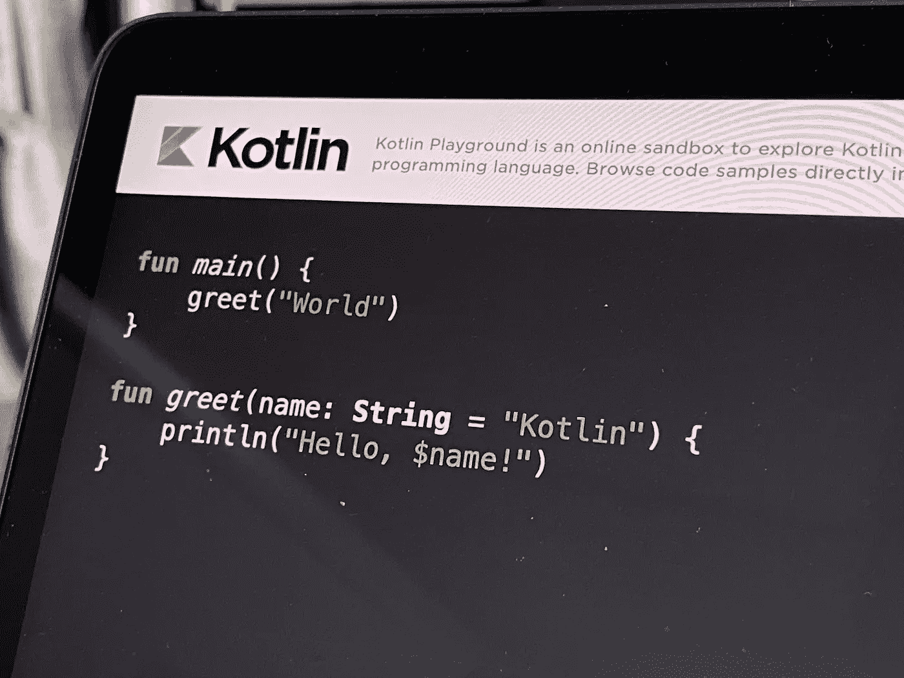

# Android 开发人员的 7 个快速 Kotlin 技巧

> 原文：<https://betterprogramming.pub/7-quick-kotlin-tips-for-android-developers-884d1021ab1d>

## 用 Kotlinic 的方式写代码，提高你的 Android 技能



照片由[路易·蔡](https://unsplash.com/@louis993546?utm_source=unsplash&utm_medium=referral&utm_content=creditCopyText)在 [Unsplash](https://unsplash.com/s/photos/kotlin?utm_source=unsplash&utm_medium=referral&utm_content=creditCopyText) 上拍摄

Kotlin 的推出是为了让 Android 开发变得更加容易和快速。在被命名为 Android 的官方语言后，它已经慢慢接管了 Java，成为当今 Android 开发者的首选。

对于转换到 Kotlin 的 Java 开发人员来说，这种转换再容易不过了，因为它们有相似之处。但与此同时，人们很容易忽略科特林的独特性，或者更确切地说是惯用的方面。这可能导致编写类似 Java 的代码。

很高兴，我们可以利用一些*kotrinic*(一个受*python*启发的术语)的方式在 Android 中编写不太冗长的代码。让我们开始吧。

# 使用“let”函数检查可为空的属性

在继续之前，使用“if not null”控制结构对类型进行空检查是相当常见的。使用 Kotlin 的`let`扩展函数有助于避免复杂的分支逻辑。

Kotlin 的`let`是一个作用域函数，因此在它内部声明的属性不能在外部使用。你可以用它来嵌套`let`或者链接一堆可空的。这里有一个例子:

```
val a: Int? = null
if (a != null) {
    doSomething(a)
}//less code
a?.let { doSomething(it) }
```

使用 Kotlin 的 Elvis 操作符(`?:`)有助于为可空属性提供默认值。例如，在上面的代码中，您可以调用函数`doSomething(a ?: 0)`——从而确保`a`有一个默认值。

# 用一行代码生成 Kotlin 列表

如果你想创建一个带有默认值的列表，这相当简单。下面一行代码创建一个长度为 10 的整数数组，每个元素初始化为 1。

```
IntArray(10) { 1 }.asList()
```

虽然这既快速又简单，但有人可能想知道如何创建一个包含不同元素的列表。当然，传统的做法是使用`for`循环。但是通过利用 Kotlin 的能力，您可以在一行中完成。

```
val list = arrayListOf<Int>()
for (x in O until 10 step 2){
list.add (x)
} //in a single line
val newList = List(5, {it*2})
//prints: [0,2,4,6,8]
```

# 使用“要求”或“检查”功能提前退出条件

`require`函数验证传递的参数，如果是`false`则抛出一个`IllegalArgumentException`。

另一方面，当对象状态为假时，`check`函数抛出`IllegalStateException`。

在 Android 的 Kotlin 代码库中设置早期退出条件时，这两种方法都很方便。

```
if (n < 0) {
   throw IllegalArgumentException("message")
}//use this instead
require(n >= 0) { "Number must no be negative" } //check function throws IllegalStateException
checkNotNull(arg){
"message"
}
```

# 使用“apply”和“with”函数来减少样板代码

`Apply`和`with`是两个重要的作用域函数，有助于在设置对象属性时消除对对象的显式引用。在某种程度上，这两个函数都允许您在返回对象之前对其进行转换。

在对象初始化时调用`apply`函数，而`with`函数需要将对象作为参数传递。

通过利用它们，我们可以减少一些样板代码，使我们的代码库清晰简洁。

# “partition”和“groupBy”运算符允许您轻松地拆分列表

`partition`允许你将一个列表分成两个子列表，其中第一个包含满足指定条件的元素，其余的放在第二个子列表中。

另一方面，`groupBy`以键值对的形式返回子列表的映射。通过调用`groupBy`上的 values 属性，可以得到一个列表列表。下面的示例演示了每种方法的一个使用案例。

# 用一行代码交换两个属性

交换两个变量是开发人员面临的第一个编程问题。传统上，您需要定义一个临时变量来交换属性。虽然有一种方法可以消除这种情况并将代码减少到两行，但是使用`a = a-b`和`b = b-a`，我们可以做得更好。

通过使用 Kotlin 的惯用表达式，可以在一行代码中交换两个属性，如下所示:

```
a = b.**also** { b = a }
```

# 对于简单的场景，方法引用优于 Lambda 表达式

虽然 lambda 表达式在大多数用例中是好的，但有时当你只需要访问一个属性时，使用方法引用比使用`it`更好。

成员引用用`::`表示。类或对象写在左边，它的调用属性写在右边。这里有一个示例场景，使用成员引用代替 lambda 表达式可以使代码更短、更易于阅读。

```
data class Person(var name: String, var age: Int)val listOne = personList.map{it.name}
val listTwo = personList.map{person -> person.name}//using member reference
val nameList = personList.map(Person::name )
```

希望你觉得上面提到的科特林招数有用。感谢阅读。