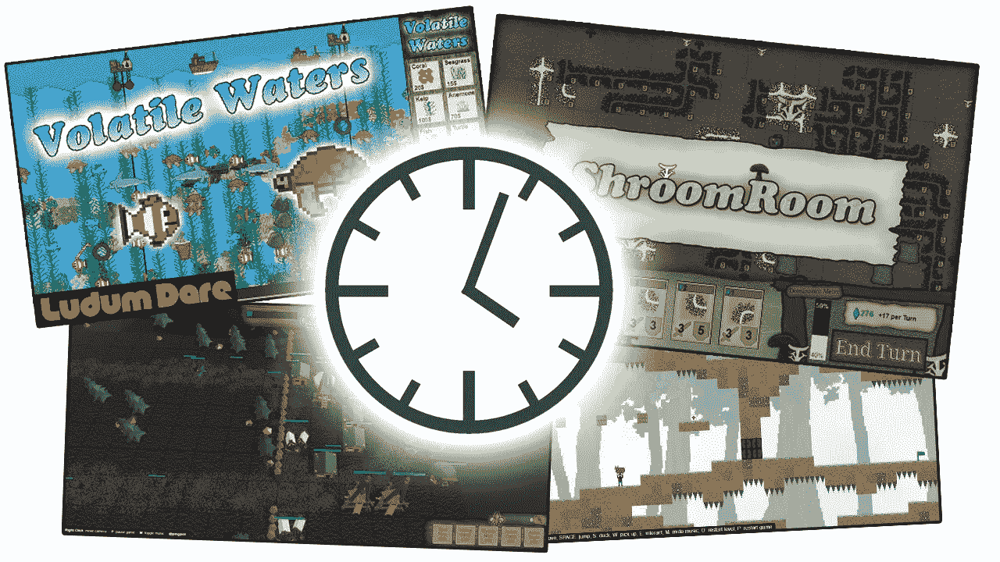

# 为什么计算机科学学位应该包含游戏的 7 个理由

> 原文：<https://betterprogramming.pub/7-reasons-why-computer-science-degrees-should-include-a-game-jam-c4af1836c8a9>

## 你可以从短时间内创建一个游戏中学到很多

在时间的压力下，在一个拥挤的游戏中创造一个游戏是一个有价值的学习经历。作者图片。

游戏堵塞可能是计算机科学学位课程的一个有价值的补充。让我解释一下。

game jam 是一种游戏开发竞赛，你只有非常有限的时间来创建一个游戏。最著名的游戏之一是 [Ludum Dare](https://ldjam.com/) ，你要么在 48 小时内独自工作，遵守非常严格的规则，要么在 72 小时内加入一个规则稍微宽松的团队。

上周末[参加了我的第 10 次 Ludum Dare](https://levelup.gitconnected.com/ludum-dare-49-post-mortem-unstable-2331f9db6466) 之后，我和一个朋友谈起了这件事，他目前正在攻读计算机科学硕士学位，我意识到这样的活动有很多好处，对计算机科学专业的学生来说，这将是一次宝贵的学习经历。虽然我在完成硕士学位后才加入我的第一个游戏 jam，[我仍然从参加](/10-game-jam-strategies-92c88c81f834)中学到了很多。

# 1.时间管理

参与游戏堵塞的最大好处可能是学习时间管理。当你开始一个空项目，你只有 48 小时来完成游戏，管理你的时间是极其重要的。

首先，48 小时并不是真的 48 小时，因为你要减去睡觉和吃饭的时间。跳过任何一个都是非常糟糕的想法，永远不会有回报。但是你如何最有成效地度过剩下的时间呢？对于完成这个项目，哪些任务是最关键的？

在你的第一次游戏堵塞中，你可能没有有效地利用你的时间。你几乎肯定会陷入试图完善一个小功能的困境，而这个小功能在整个游戏中并不重要。尤其是开发过程的后期阶段经常被低估，因为抛光、添加指令和平衡将花费惊人的大量时间，并且您必须事先为此做好计划。

许多软件工程项目也有截止日期(尽管大多数都超过 48 小时)，所以管理你的时间分配也同样重要，你会发现你从游戏中学到的许多经验也适用于正常的项目。

# 2.真实世界的体验

计算机科学学位的大部分作业都非常学术性:实现一个[二叉查找树](https://en.wikipedia.org/wiki/Binary_search_tree)、[合并排序](https://en.wikipedia.org/wiki/Merge_sort)，或者[旅行推销员问题](https://en.wikipedia.org/wiki/Travelling_salesman_problem)。理解和编写这样的基本问题当然很重要，但是现实地说，未来 95%的 IT 工作都不需要它们。然而，创建一个游戏是你在现实世界中可能遇到的许多项目的一个非常好的近似，因为它是一个面向用户的交互式程序/应用。在很多情况下，只要可行，解决方案是否完美并不重要。

当你在做一个大项目时，你有时希望你能花几个星期做一个小功能，并使它变得完美，但大多数时候，你必须很快转移到下一个问题或客户要求。这是你在游戏卡壳时会经历的事情。当你有成百上千的其他事情要在截止日期前完成时，你不能花太多时间为开始游戏按钮制作完美的动画。

# 3.浓缩学习

在 48 小时内创建一个游戏也是在短时间内学习很多有用技能的好机会。显然，你需要知道一些基本的知识，然后才能参加一个 jam 游戏。在活动中，从零开始学习一项新技能是不可能的。然而，当你在游戏中工作时，总会发现一些小事情，你会发现哪些工作流程是高效的，哪些是低效的。

游戏开发还涵盖了非常广泛的不同技能，如编程、艺术、音乐、音效、UI/UX 设计、平衡等。它教会你成为一名多才多艺的开发人员，这对一些公司来说是非常有价值的(尽管一些公司仍然喜欢狭隘的专家)。

# 4.测试你的技能

比在活动中学习新技能更重要的是，这是对你现有技能是否能胜任这样一项任务的考验。如果你不知道你正在使用的任何工具的基本原理，并且你需要每隔一秒钟就查找一次，那么你就不能足够快速有效地工作以在截止日期前完成你的游戏。但是，即使你这样做了，你也会意识到你需要在哪些领域和工作流程上进行改进，以便将来更加高效。

# 5.项目管理

除了 48 小时的 Ludum Dare 版本，你必须独自工作，还有 Jam 版本，团体可以参与。当你独自工作时，项目管理和时间管理非常相似。然而，当多人一起工作时，有人还必须管理各个部分，这样每个人都可以高效地工作，而不必浪费大量时间等待其他人完成他们的部分。每个计算机科学学位可能已经包括一些小组项目，但加入多人游戏是学习如何在非常短和严格的截止日期的额外压力下一起工作的另一个好方法。

# 6.营销

参与游戏堵塞的另一个小部分是营销。根据活动的不同，评判可能由陪审团进行，或者像 Ludum Dare 一样，由活动的其他参与者进行。在 Ludum Dare 中，有数以千计的提交内容，游戏列表是按分数排列的，当你玩和评判其他游戏时，分数会增加。

然而，即使你的游戏接近列表的顶端，也不能保证其他人会点击它；我通常会点击带有有趣缩略图的游戏。因此，你应该在活动快结束时花点时间想出一个好名字，写一个简短但内容丰富的描述，并附上一些截图，特别是为你的游戏创建一个好看的缩略图。

无论如何这都不是真正的营销，但是如果你想发布你自己的游戏或者其他软件，你也需要做这些步骤。像这样的小事情是有价值的，不属于正常的计算机科学学位。

# 7.反馈

任何游戏堵塞的最有价值的部分之一是在事件结束和其他人玩你的游戏之后你得到的反馈。当你完成一项普通的学位作业时，你的教授可能会看一下并给它打分，但是除了一个总体趋势之外，从一个单一的分数(或分数字母)中你几乎不能学到什么。

你需要的是来自用户的实际反馈，以便在未来改进，这就是你在 Ludum Dare 中得到的。很多人在玩了游戏后会留下评论，评价他们喜欢什么和不喜欢什么，但特别是对 bug、缺失的功能或可能的改进的建设性批评。不像 YouTube 或 Twitter 上有很多负面评论，Ludum Dare 上的总体氛围通常非常积极，批评是建设性的和有益的。

Ludum Dare 上有一个评级系统，可以在评审期结束时确定一个排名。然而，我个人更关心其他玩家对我的游戏留下的评论和反馈，而不是最终的排名位置，正因为如此，我也为几乎每一个我玩的游戏写一个简短的评论，并自我评判。

像 Ludum Dare 这样的游戏堵塞应该成为计算机科学学位课程的一部分。你可以在很短的时间内从创建一个游戏中学到很多东西，并且许多任务和问题对于现实世界中的项目来说比你通常必须完成的非常学术的任务要现实得多。

我不认为许多大学会将 Ludum Dare 纳入他们的课程中，但是如果你目前正在学习计算机科学，或者已经完成了学位，参加 game jam 是一个很棒的非常有益的体验。