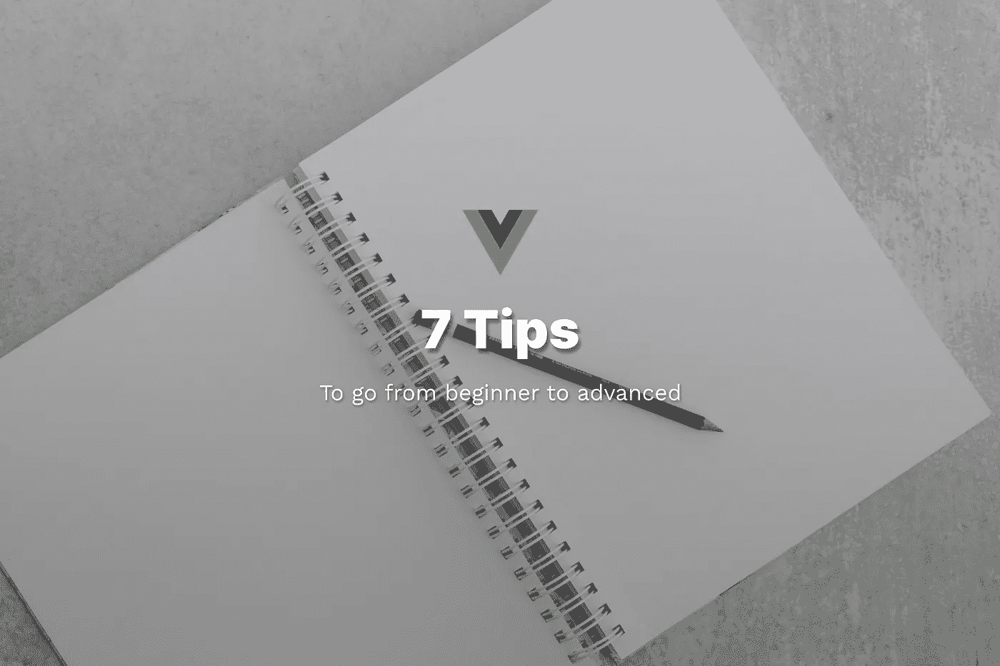

# 在 Vue.js 中从初级到高级的 7 个技巧

> 原文：<https://betterprogramming.pub/7-tips-to-go-from-beginner-to-advanced-in-vue-js-af7ca56ea31d>

## 升级你的 Vue.js 游戏



阿什利·爱德华兹在 [Unsplash](https://unsplash.com/s/photos/pencil?utm_source=unsplash&utm_medium=referral&utm_content=creditCopyText) 上拍摄的照片。

Vue.js 是我前端开发的首选框架，原因有很多。我喜欢它的简单性、强大的功能和出色的性能。

我从 Vue 开始，因为一开始我觉得它很容易。我一直用它，因为我喜欢它。

我掌握 Vue 的技巧可以帮助你成为一名更好的前端开发人员，并让你在未来找到更好的工作机会。我将逐一介绍这些技巧，解释要想变得更高级，你必须学习些什么。

# 1.完全了解反应性

## 反应如何工作

反应性是前端开发库和框架中的一个简单概念。然而，深入理解它是如何工作的可能很难。但是它非常值得你花时间。

这里有一个小例子:

```
<h1>{{ name }}</h1>
```

当`name`的值改变时，UI 会相应更新。这是解释反应性的一个非常基本的方法，但是还有许多更高级的例子来帮助你理解它是如何工作的。

## 哪里的反应出了问题

如果您正在访问对象中的属性，事情可能会出错，如下例所示:

在上面的例子中，我们在数据方法中将`myObject`定义为一个空对象。后来，我们给`myObject.message`一个值。

这导致`{{ myObject.message }}`永远不会显示任何东西，即使它在某个时候收到了一个值。这是为什么呢？

这基本上是因为 Vue 不知道`myObject.message`属性的存在，因此无法对其值的变化做出反应。

## **我如何解决这个问题？**

有几种方法可以确保 Vue 对`myObject.message`属性的变化做出反应。最简单的方法是用空值或 null 值初始化它:

```
myObject: {
  message: ''
}
```

如果`myObject.message`存在于数据方法中，那么 Vue 将监听其值的变化并对其做出反应，并相应地更新 UI。

确保 UI 更新的另一种方法是以这种方式更新整个`myObject`对象:

```
this.myObject = {message: 'Hello'}
```

由于 Vue 监听并对`myObject`中的变化做出反应，因此它将获得这种变化并相应地更新 UI。

简而言之，Vue 不监听对象的属性变化，除非它知道这些属性。需要在数据方法中定义属性，或者需要更新整个对象而不是属性，以确保 Vue 跟踪更改。

通过阅读官方文档的“[反应深度](https://vuejs.org/v2/guide/reactivity.html)”部分，了解更多有关反应的信息。

通过充分了解反应能力，您可以:

*   调试这样的场景:当你期望 UI 更新时，它没有更新。
*   确定视图更新和重新渲染的时间。
*   了解计算属性是如何计算的。
*   测量需要一些 CPU 工作来进行计算的反应值的成本(例如，表单条件)。

# 2.最佳亲子沟通

作为一个新手，我一直有一个问题，那就是如何将数据从子组件传递到父组件。或者，当父组件发生变化时，我如何确保子组件得到更新？

这些问题与组件应该如何相互通信有关。最基本的方法就是使用道具。道具将数据从父代传递给子代。它们是不可变的，可以是多种类型，如字符串、布尔值、数组等。

```
<component :message="myObject.message" />
```

道具形成了一个单向的数据流，这意味着每当`myObject.message`在父组件中发生变化的时候，`message`道具也会随之更新。相反的是*不成立*。

你不应该改变子组件中 props 的值，因为它们是不可变的。更新它们将导致 Vue 警告，并且不会触发父组件中的更新。

那么，如果道具“下降”，你如何让价值“上升”？要使值上升，需要使用事件。通过注意以下几点，你可以很容易地记住这一点:道具向下，事件向上。

您可以使用 props 将值传递给子组件，就像您在前面的示例中看到的那样。如果需要将值从子组件向上传递到父组件，可以发出事件。这里有一个例子来说明它是如何做到的:

您可以使用`$emit`将值或事件从子组件发送到父组件。您可以使用`v-on:`或`@`以及事件名称(在本例中为`@button-clicked`)来监听来自父组件的事件。使用`$emit`，您可以传递一个或多个值，它们可以是任何类型。

如果你想知道如何在父组件和子组件之间传递值，只要记住“道具放下，事件向上”的策略，你就能以一种干净的方式让它工作。

# 3.了解性能瓶颈

缓慢的应用程序让人头疼。作为软件开发人员，我们的工作是确保我们的应用程序运行顺畅。编写 Vue 应用程序时很容易陷入某些陷阱，所以从初学者到高级，你需要很好地理解它们，并能够处理它们。

## 内存泄漏

内存泄漏是 web 应用程序中常见的性能问题。即使 Vue 本身不会无缘无故导致内存泄漏，但通过合并第三方库或编写错误代码，也可能会发生这种情况。在创建单页应用程序(SPAs)时，避免内存泄漏尤为重要，因为根据设计，用户不会刷新浏览器，所以应用程序必须完成所有的垃圾收集工作。

没有进入太多的细节，Vue 有一个官方指南，关于如何[避免内存泄漏](https://vuejs.org/v2/cookbook/avoiding-memory-leaks.html)。如果你是一个试图掌握 Vue 的开发者，我强烈建议你去读一读。

## 渲染成本

React 和 Vue 等前端库和框架正在让我们变得“懒惰”。我们看不到渲染时到底发生了什么。我们只是使用一个`v-for`并期望事情能够成功。这太好了，让我们更强大！

问题是很难理解渲染“成本”是多少 Vue 应用程序可能会有许多意想不到的高渲染成本:

*   生成了太多的 DOM 元素。
*   该页面更新过于频繁。
*   使用需要大量时间渲染的第三方组件。

在很多情况下，您的应用程序会有很高的渲染成本，因此，您的用户会体验到延迟。在[这篇文章](https://medium.com/better-programming/6-ways-to-speed-up-your-vue-js-application-2673a6f1cde4)中，我深入探讨了如何在 Vue 中处理性能问题。

## 优化事件处理

这与 JavaScript 的关系比严格意义上的 Vue 更大，但无论如何都要注意。有些事件可能触发得太频繁了。如果你添加一个滚动监听器或者一个`@mouseover`事件，那么这个事件处理程序可能会被调用很多次。

如果事件处理程序没有做很多事情，那么这可能不是问题。但是，如果您的事件处理程序做了大量的计算并且需要时间来运行，那么它会导致您的应用程序严重变慢。发生这种情况的原因是 scroll、mouseover 和其他事件每秒钟可以触发事件处理程序几十次。

这个问题的解决方案是在你的事件处理程序中使用一个`throttle`或`debounce`函数来限制你的事件处理程序进行实际计算的次数。 [Lodash](http://lodash.com/) 包含了这两种功能，并提供了一种简单的使用方法。我强烈建议尝试一下。

了解这一点将有助于你为浏览器编写更好的 JavaScript，但由于这是一个在 Vue 中容易发生的问题，所以在你掌握 Vue 的过程中了解这一点很重要。

# 4.了解 Vue 生态系统

要成为 Vue 开发的高级人员，您必须了解构成 Vue 生态系统的包和组件。大多数应用程序至少需要以下一项，但是要掌握这个框架，我相信您应该熟悉这三项。

## Vuex

大多数现代前端应用程序，尤其是 spa，依赖于某种状态管理。Vuex 是 Vue 应用的官方状态管理库，可以很好地与官方 Vue 开发工具集成。

它作为一个集中的存储，所有组件都可以访问它来获取或修改全局应用程序数据。组件可以而且应该有本地数据，但是使用状态管理对于应用程序来说是必须的，因为它们变得越来越复杂，并且多个组件依赖于相同的全局数据。

## Vue 路由器

在没有 [Vue 路由器](https://router.vuejs.org/)的情况下使用 Vue 可能很少见，但我在某些项目中见过。由于这里的大多数人都已经熟悉 Vue 路由器，我就不赘述了。我只想提一下，学习`vue-router`是创建 SPAs 的必要条件，SPAs 是大多数现代前端应用程序的必经之路。

## Vue SSR

要想真正让自己脱颖而出，你应该通过使用官方的 [Vue 库](https://ssr.vuejs.org/)或者通过学习 [Nuxt.js](https://nuxtjs.org/) 来学习 SSR。当浏览器应用程序的性能开始下降时，或者当您无法依靠用户的设备来处理渲染并且最好在服务器端进行渲染时，通常会出现对服务器端渲染的需求。它有助于优化获取内容的时间——特别是在慢速设备或慢速互联网上——而且它对 SEO 也很有用。

由于大多数工作和自由职业项目至少需要以上三项中的两项，我相信学习它们对 Vue 开发者来说是一条单行道。

# 5.正确使用组件

我看到缺乏经验的 Vue 开发人员犯的一个错误是他们如何构造组件。很多时候，Vue 应用程序只包含一个或几个完成所有工作的大型组件。当然，这不是构建组件的正确方式。

您越有经验，就越会意识到将应用程序组织成更小的组件的重要性，在这些组件中，每一个组件都能做好一件(或几件)事情。使用较小的组件有助于您的应用程序，原因有很多:

*   您可以在整个应用程序中重用小组件。
*   你的代码更干净，更有条理。
*   Vue 可以在`v-for`循环中更高效地渲染子组件。

如果你有一个 Vue 面试，你被要求做一个测试项目，提交一份组织良好的申请肯定会给你的面试官留下深刻印象！

# 6.让 Mixins 成为你最好的朋友

我真的很喜欢 Vue 中的 Mixins，并在我的整个项目中使用它们。不幸的是，我看到许多开发人员甚至不使用它们，这是一种耻辱。Mixins 允许您:

*   在整个项目中重用代码。
*   只写一次代码(干原理)。
*   更容易重构和维护您的代码。

Mixins 提供了很多自由，你可以随心所欲地使用它们。例如，您可能有一组具有相似特性的组件，因此您可能希望创建一个包含所有公共特性、组件和计算属性的 mixin。或者，您可能有在整个应用程序中经常使用的某些动作、过滤器或条件，因此您可以创建一个小的 mixin 来包含它们。

可能性是无穷的，但是教训是明确的:你需要开始使用 mixins 来成为一个高级 Vue 开发者。

# 7.学习高级指令

除了`v-for`、`v-if`和其他常见的指令之外，Vue 还有一些不太常见但了解起来仍然非常有用的指令。

## v-once

可以用`v-once`输出一次值，使其不反应。这意味着在随后的更改中，不会再次呈现该值。这可以帮助您在某些情况下优化性能:

```
<span v-once>{{ name }}</span>
```

## 事件指令修饰符

对于`v-on`事件，你可以使用一些非常方便的修饰语。我个人经常用的一个是`@click.prevent`，在点击事件上自动调用`preventDefault()`。

```
<a href="#" @click.prevent="processClick">Click me</a>
```

您可以在文档中看到事件修饰符的完整列表。

## 自定义指令

Vue 允许你注册你自己的定制指令，正如在[文档](https://vuejs.org/v2/guide/custom-directive.html)中所解释的。如果您发现自己在整个应用程序中一次又一次地重复相同的行为，那么创建一个可以重用的自定义指令可能是有意义的。

此外，许多第三方软件包会引入您可以使用的自定义指令。

使用定制指令的关键是只在需要的时候创建它们，避免使用只使用一两次的定制指令。

# 继续练习

你可以从阅读更多关于我概述的所有概念开始，或者你可以阅读一部分你没有读过的官方文档。阅读、学习，并确保你付诸实践。即使你今天只向掌握 Vue 迈出了一小步，如果你坚持不懈，它也会走很长的路。