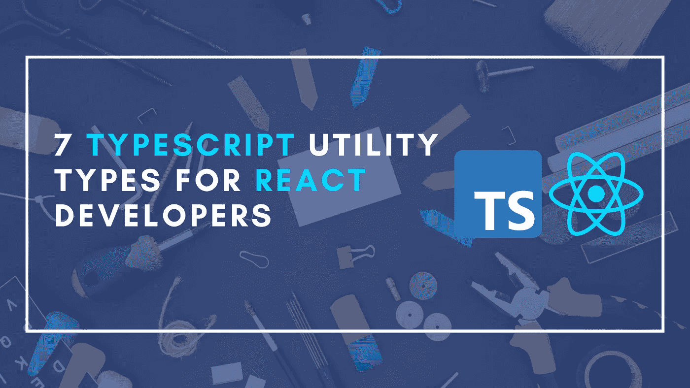

# React 开发人员的 7 种类型脚本实用程序类型

> 原文：<https://betterprogramming.pub/7-typescript-utility-types-for-react-developers-9c16fc99647f>

## 促进你每天的发展



作者图片

在没有 TypeScript 的情况下进行 React 开发几乎是不可想象的。这两种技术已经成为非常强大的组合，使开发人员能够大规模地创建高质量和可维护的 React 应用程序。TypeScript 在这个过程中起着不可或缺的作用。

然而，成为一名优秀的 React 开发人员并不会自动转化为优秀的 TypeScript 开发人员。编写高质量的 TypeScript 代码是一项独立的技能，就像编写高质量的 React 代码一样。当两种技能结合在一起时，这一点更加突出。

为了帮助解决这个问题，本文介绍了七种不同的 TypeScript 实用工具类型。根据个人经验，这些实用程序类型对开发人员的日常工作非常有帮助。它们适用于常见的 React 开发实践或面向 React 开发。掌握它们将显著提高您作为 TypeScript React 开发人员的素质。

# `Pick`

`Pick`实用程序类型允许您基于现有的对象类型或接口构建一个新的对象类型。它接受两个参数:现有的对象类型或接口，以及应该包含在结果对象类型中的键的字符串文字或字符串文字的联合。

对于 React 开发人员来说，当一个组件的 props 与另一个组件或数据类型共享类型时，这尤其有用。您可以使用`Pick`实用程序，而不是在新类型中手动指定所有类型。这也在类型之间创建了一个显式的连接，并在所有相关的类型之间自动对齐类型。

# `Omit`

`Omit`实用程序类型与之前讨论的`Pick`实用程序类型非常相似，但基本上相反。不是用键指定要包含在构造的对象类型或接口中，而是指定应该排除的对象类型或接口。当您想要重用现有对象类型的大部分或者只想排除其中的一小部分时，这将非常有用。

就 React 开发中的用例而言，它们类似于`Pick`的用例。考虑从另一个组件的 props 或数据类型中接管类型。然而，微小的区别是`Omit`对于应该排除而不是包含的条目更加明确。

# `Partial`

`Partial`实用程序类型允许您构建一个新的对象类型，其中原始对象类型或接口中的所有属性都设置为可选。基本上，它创建了一个与原始类型相比的类型子集。

对于 React 开发，这在为组件提供支持的测试或实用函数中尤其有用。在这些场景中，通常不需要一次提供所有的道具。道具的不同部分可能来自不同的来源或功能，而所有这些部分一起构成了一套道具。

# `NonNullable`

在 React 中，您经常会处理可选或可空的值。考虑可选的属性、可能丢失的数据或过滤丢失的值。在所有这些情况下，TypeScript 会让你知道这些变量也可以是`undefined`或`null`。

但是在某些场景中，你想要向 TypeScript 指明这是不可能的，或者它们不能是`undefined`或`null`。想象一下初始化一个组件的属性，这个属性被标记为可选的，但是在使用它的组件中是明确设置的。在这些情况下，`NonNullable`实用程序类型可以用来构建一个没有`null`和`undefined`的新类型。

# `React.ComponentProps`

有时，您无法访问组件的 prop 的 TypeScript 类型，而只能访问组件本身。当不希望向外界公开组件的属性类型时，可以考虑使用外部库的组件。虽然这是可以理解的，但它使得重用或扩展现有类型变得困难。手动实现它们会引入冗余并增加维护负担。

相反，在这些场景中，您可以使用 React 的`ComponentProps`实用程序类型来访问 props 的组件类型。顾名思义，它接受组件的类型作为它的参数，并将使用组件的属性类型构造一个新的类型。

# `React.MouseEventHandler`

React 应用程序不可或缺的一部分是用户交互性。实现这一点的常见方式是通过事件处理程序，最突出的是鼠标事件。键入这些事件处理程序的困难之处在于它有多个部分。有完整的事件处理程序本身、提供给处理程序的事件和潜在的返回值。

当开始使用 React 中的 TypeScript 时，很容易分别键入这些部分。虽然这是一个短期的解决方案，但它不能很好地适应未来。相反，您可以利用 React 的实用程序类型`MouseEventHandler`。它是专门为这些用例设计的，并为目标 HTML 元素接受一个可选参数。

# `React.PropsWithChildren`

React 最大的特点之一是它的可组合性，允许组件从外部嵌套到其他组件中。大多数时候，这是通过 React 中的自然`children`道具完成的。

告诉 TypeScript 组件接受`children`属性的方法之一是在属性的类型中显式声明。许多采用了 TypeScript 的 React 开发人员会对类似于`children: ReactNode`的东西很熟悉。

然而，实现这一点的另一种方法是通过 React 的实用程序类型`PropsWithChildren`。它自动用各自的类型构造一个新的类型，并把它标记为可选的和可空的。

# 最后的想法

在现代 React 开发中，不涉及 TypeScript 几乎是不可想象的。它极大地提高了代码的质量和可维护性。然而，能够正确使用 TypeScript 本身是一种完全独立的技能。这尤其适用于 TypeScript 和 React 的组合。

为了帮助解决这个问题，本文介绍了对 React 开发人员有用的七种不同的 TypeScript 实用工具类型。这些实用程序要么在常见的 React 开发实践中有用，要么专门面向 React 开发。理解和掌握这些类型将显著提高您键入的 React 代码的质量。

```
**Want to Connect?**If you liked this article, consider checking out the other entries in the [Uncommon React](https://www.getrevue.co/profile/chakshunyu) newsletter and my [Twitter](https://twitter.com/keraito) for future updates.
```