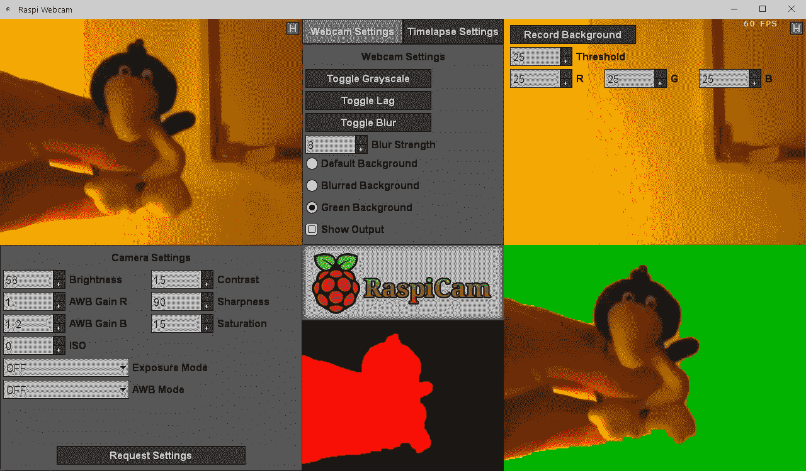

# Python 对 C++开发人员来说不可思议的 9 个原因

> 原文：<https://betterprogramming.pub/9-reasons-why-python-is-weird-for-c-developers-b37e650471d6>

## Python 是唯一打破了许多 C/C++惯例的主要编程语言

亚历克斯·丘马克在 [Unsplash](https://unsplash.com?utm_source=medium&utm_medium=referral) 上的照片

Python 是一种奇怪的编程语言。

至少当你来自其他语言如 C、C++、C#、Java、PHP 或 JavaScript 时。所有这些语言都遵循一种通用的语法，并共享许多概念。虽然您也可以在 Python 中找到大多数概念，但它选择打破其中许多概念的常规，有时更好，有时更差。在 [TIOBE 排名](https://www.tiobe.com/tiobe-index/)的前五种编程语言中，Python 是唯一一种不使用 C 风格的花括号语法的语言。

我一直在做[把我的 Raspberry Pi 变成一个网络摄像头](/turning-a-raspberry-pi-into-a-controllable-webcam-with-background-removal-54e06a194d6a)，我必须用 Python 实现服务器，因为与 Pi 的摄像头接口的最佳 API 就写在里面。我以前使用过几次 Python，但这是我用它做的一个较大的项目，我很快就记住了它的一些怪异之处，并发现了一些新的。

# 1.空白

每当有人问我为什么不喜欢 Python，我的第一个回答总是空白。当程序的流程仅由它们控制时，会出现两个问题。首先是制表符和多个空格之间不存在的区别:您编写一些 Python 代码，所有内容看起来都正确缩进了，您按下 run，它崩溃并出现空白错误，因为一些行使用制表符，而其他行使用空格。幸运的是，这些类型的错误很容易找到，只需要几秒钟就可以修复，但它们每次都让我很恼火。当我切换到 [Visual Studio 代码](https://code.visualstudio.com/)时，它变得更好，这很好地避免了大多数空白错误，但我每天仍然会遇到一些空白错误，特别是当从某个地方复制代码时，它有制表符而不是空格。

然而，还有其他类型的错误更难发现。当您有一个包含多层嵌套循环和 if 的复杂代码段，并且您不注意缩进时，您很容易错误地缩进一行。不像制表符和空格，这不是一个语法错误，你不会得到一个错误信息。显然，您也可以在 C++程序中错误地放置一行代码，但是您需要将它移到封装该部分的花括号之外，这种错误不会经常发生。

# 2.句法

就像 Python 是唯一一个空格发挥如此重要作用的主要编程语言一样，它也是唯一一个在 [TIOBE 排名](https://www.tiobe.com/tiobe-index/)前五名中没有使用 C 风格的花括号语法结构的语言。因为 C 是最早被广泛采用的编程语言之一，许多人习惯了它的语法，因此，许多较新的语言都模仿了它。

对我来说，与 Python 的纯空白结构相比，C/C++花括号语法看起来和感觉起来更有结构，但这可能取决于您首先学习了哪种语言。

对于那些刚开始使用 Python 的人来说，花括号可能看起来很奇怪和令人困惑。然而，如果你是从 C/C++开始的，那么学习 Python 可能要比其他语言复杂得多，比如 Java、PHP 或 JavaScript，它们都有非常相似的基本语法结构。

尽管我已经习惯了 Python 的语法，但是从 C++转换到 Python 仍然比从 C++转换到 PHP 需要更多的精神负担。

# 3.类别变量

下面是一个非常简单的 C++代码段，其中有一个带有字节数组成员变量的类。我们创建两个对象，每个对象给字节数组分配一个惟一的值。然后我们打印出这些值，它们就是我们期望的那样。

以下是 Python 中的相同代码段:

除了 C++和 Python 之间的一些语法差异之外，它看起来非常相似。然而，当我们打印字节数组值时，它们都是相同的，这是非常怪异和意想不到的。

在我最近的 Python 项目中，我有一段非常相似的代码，因为它看起来与我习惯的 C++非常相似，所以我没有多想。但是我的程序不工作，我花了很长时间才找到问题。当你在 Python 的类中声明一个变量时，默认情况下它是一个类变量，类似于 C++中的静态变量。

然而，这还有更多的问题。看看这段代码:

如果数字变量真的像一个 C++静态变量，它将只存在一次，并且总是有相同的值。但是，当我们在两个对象中改变它时，输出是不一样的。事实证明，当您通过 Python 中的对象引用更改类变量的值时，会创建一个新的基于实例的变量，我们必须通过类名来访问它，以获得真正的类变量的值。

但是在字节数组示例中，情况并非如此，没有创建新的每个实例的变量，这非常令人困惑。我猜这与幕后的指针和引用有关，但我不理解这种 Python 行为，在未来，我将远离类变量。

# 4.没有指针和引用透明度

除此之外，Python 在指针和引用方面缺少透明性。有些值是通过引用传递的，但是仅仅通过查看代码，您并不知道哪些是，哪些不是。很多人不喜欢 C++指针和引用，如果你只是在学习这门语言，我理解他们会让它变得更复杂。然而，一旦你对它们的工作原理有了基本的了解，它们就给代码增加了很多透明度，因为你可以清楚地看到发生了什么。

# 5.私有类成员

Python 还缺乏对类变量和函数的访问控制特性；一切总是公开的。这不是一个大问题，但是我仍然喜欢使用私有函数和变量来实现更好的封装和访问控制。这使得代码更加干净和安全。

我的[树莓 Pi 网络摄像头](/turning-a-raspberry-pi-into-a-controllable-webcam-with-background-removal-54e06a194d6a)程序。服务器用 Python 写，客户端用 C++写。图片作者。

# 6.自我对这个

当您从 Python 切换到 C++时，需要习惯的另一个小区别是使用`self`而不是`this`。`Self`和`this`指的是当前的对象实例，但是由于某种原因，Python 是唯一一种使用`self`而不是`this`来实现这个目的的主流编程语言。此外，您必须在 Python 函数中显式传递`self`引用，而在 C++中`this`总是隐式可用。

# 7.多个返回值

Python 函数可以返回多个值，当我第一次发现这一点时，我觉得这很奇怪。不过，这并不是真正的多个返回值，因为在幕后，函数返回的是一个不带括号的元组。在 C++中返回多个值没有这样好，所以一旦你习惯了 Python，这可能是编写更易读的代码的好方法。

# 8.没有强数据类型

与 C++不同，Python 不使用强数据类型，这意味着在创建变量类型时不需要声明变量类型。在 Python 中只是`number = 5`，而 C++需要 int 或 float 之类的类型，例如`int number = 5;`。

我更喜欢强类型编程语言，因为它更容易避免某些类型的错误，但我也喜欢许多弱类型语言，如 PHP 或 JavaScript。然而，关于 Python 有一点需要记住。在我最近的程序中，我必须通过网络发送二进制数据，隐式 Python 数据类型和强 C++数据类型之间的差异是一个障碍(例如，Python 中的所有浮点数都相当于 c++ double，而不是 floats)。

# 9.没有常数

Python 也没有内置的方法来声明常量，这可能有点烦人。通过使用所有大写字母命名常量的约定，您可以向其他人表明一个变量应该是一个常量，但是没有什么可以阻止任何人对它进行重新赋值。实际上，在 C++中将一个变量声明为`const`要好得多，并且使代码更加清晰和安全。

在不同的编程语言之间切换总是需要一段适应期，因为它们之间总是有一些小的差异。然而，Python 做的很多事情非常不同，所以从 C++之类的东西切换到 Python 尤其令人困惑。

当你知道 Python 的所有小怪癖是一回事，但是当你只是偶尔使用它时，你会对一个你以前不知道的新细节感到惊讶——就像这次隐式静态类变量对我来说一样。

尽管如此，我最近的 Python 项目进行得相当顺利，我计划更频繁地使用 Python，因为它对于一些任务来说非常方便。