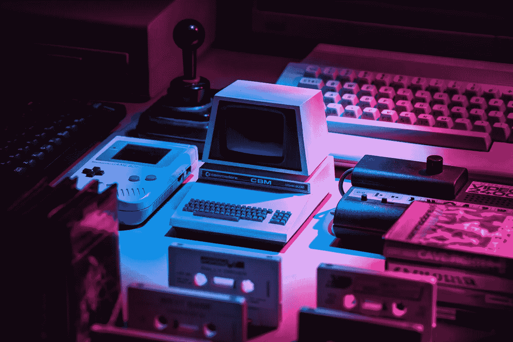

# 每个开发人员应该做的 9 件事

> 原文：<https://betterprogramming.pub/9-things-every-developer-should-do-f1aebd395b98>

## 网上一个随机的家伙告诉你 9 件与开发不太相关的事情

洛伦佐·埃雷拉在 [Unsplash](https://unsplash.com/search/photos/computer?utm_source=unsplash&utm_medium=referral&utm_content=creditCopyText) 上的照片

嘿，又是我。你可能会从一些不太受欢迎的经典作品中想起我，比如“[人不是资源](https://medium.com/@peterfraedrich/people-are-not-resources-f8f23f9fa76b)”和“[厄运的六条腿的三角形](https://medium.com/@peterfraedrich/the-six-legged-triangle-of-doom-b538a0ba3d50)”，但更有可能是因为我的前一篇文章，“[每个开发人员都应该学习的 10 件事](https://medium.com/better-programming/10-things-every-developer-should-learn-72697ed5d94a)”欢迎来到“每个开发人员都应该做的 9 件事”它不完全是“10 件事”的后续——更像是精神上的继承者。

# 坚韧是你的第一技能

每个开发者都会遇到问题。这是工作的一部分，也是更有回报的一部分。但是你的事业成败取决于你如何处理这些问题；我的职业生涯是成为一名工程师，解决别人无法解决的重大棘手问题。能够解决其他人试图解决的问题，无论是编码问题、某项操作的功能问题，还是让一项新技术发挥作用；只要你能做到，其实并不重要。最大的秘密是，它不需要任何特殊的知识或技能，你只需要坚持下去，直到你完成它。就是这样。你会怀疑自己是否能做到吗？是啊，你当然是。我也有过。你会想要放弃吗？是的，但那是你需要坚持下去的时候，而*只是完成它*。

我在技术领域的第一份工作是在一家零售公司做现场 IT 人员。作为公司唯一的 IT 人员有起有落(有时我真的很怀念我拥有的自由，因为我基本上可以实现、构建和处理我想做的任何事情)，但有一件事标志着一个分水岭时刻，那就是我未能升级我们的 Active Directory 域版本。作为一名绿色工程师，我想到了一个好主意，将我们的域从 Server 2003 升级到 Server 2008R2，因为我正在拆除我们的 2003 域控制器。所以我拿出 MSDN 指南，收拾好所有的东西，一头扎进了这个过程。

然后失败了。星期二下午 3 点。

一切都完了。电子邮件，RDP 登录，一切。时间快进到第二天凌晨 3 点，我仍然在办公室:疲惫、饥饿、沮丧，站在服务器机房拼命地试图恢复我们的主域控制器，这时我有了这样的想法:*我可以离开，再也不回来。我可以屏蔽掉所有的公司号码，把钥匙留在办公室，拿上我的东西，然后走掉。没人知道我曾在这里工作过。其他人可以解决这个问题。*

我什么都没做。我留下了。我解决了这个问题，最终把它解决了。当然，我首先引起了这个问题，但同时修复它感觉很棒。顽强赢了。

# **永不停止学习**

我怎么强调这一点都不为过:如果你想在职业生涯中成长，你必须愿意学习。如果你不想成长并且乐于做一个[。NET 4](https://dotnet.microsoft.com/download/dotnet-framework/net40) 对你的整个职业生涯来说，每个人都有自己的想法，但是如果你有哪怕是一丁点儿想要提升、改变职位或者做一些不同的事情，你必须愿意学习新的东西。“新事物”可以是新语言、新技术、新方法等。，但是你需要以某种身份继续你的教育。这样做不仅会让你对现在的雇主更有价值，还会让你在谈判薪酬时有更多的筹码，如果你决定去别的地方，也会带来更多的机会。

# 挑战现状，问一些“愚蠢”的问题

我最喜欢问的问题是“为什么？”我认为它也应该成为你的。挑战现状不会总是让你成为房间里最受欢迎的人，但是创新要求我们停下来问为什么。保持平衡不会带来任何好处——要么我们看不到最初的目标，我们的目标变成了保持现有的目标，要么我们后退一步，检查为什么事情会是现在这样，并找出是否有更好的方式来做事情。

我发现最好的方法是回到基础，问一些“愚蠢的问题”你不必站出来说“我们为什么要这么做？”—不仅有些人会认为这很粗鲁，而且这也很含糊。相反，你可以问这样的问题:“我们在这部分使用 X 产品有什么特别的原因吗？”会给你同样的结果，但是会更集中和直接。

# 阅读日志/手册/文档

我真的不能强调这一点:你必须真正地*阅读给你的*。任何应用程序、库、包、语言或任何有价值的东西都有足够好的文档集。即使是像 API 引用这样简单的东西，您也必须实际使用它。

太多次了，我让某人在一个问题上寻求帮助，一个他们已经努力了很长时间的问题，结果我发现答案就在他们面前。日志输出和错误消息是有原因的，您应该阅读它们。通常他们会告诉你到底哪里出了问题，如果没有，通常会有一个堆栈溢出或服务器故障的人来解决你的问题。在您跳进兔子洞开始查看内核参数或试图在 Bugzilla 上找到解释您的症状的模糊错误之前，您应该尝试停下来，阅读输出，并从表面上接受它。如果它说它在某个 XML 标记中缺少一个字段值，请尝试将该字段值添加到 XML 中，如果答案是*字面上的*写在您面前的日志文件中，那么不要去追查一个在您升级 [Tomcat](http://tomcat.apache.org/) 版本时可能会或可能不会引入的幽灵问题。

在我加入目前的团队后不久，这种情况就发生了。我们被网络运营中心呼叫，因为他们在生产中发现了一个问题，一些消息队列无法连接。我和三个经理在下班后留下来(嘿，免费晚餐！)就这个问题和我们的集体讨论了几个小时*。*我们尝试了我们能想到的一切:重建 Tomcat 集群，更新机器映像，检查加载了哪些内核模块，运行我们能想到的每一个 DNS 故障模式:凡是你能想到的，我们都做到了。当时我是这个特殊团队的新成员，我出现在那里只是因为我想给我的新老板留下深刻印象，也因为我可以成为这个问题的新面孔。然而，我犯了一个严重的错误，那就是我没有重新检查其他人的工作。当你处理一个生产问题时，没有时间去“友好地对待”或者试着不去冒犯每个人，因为在那个时刻没有人会在意(更确切地说没有人应该在意)你是否检查他们的工作或者试图找到他们遗漏的东西。当我最终决定回去查看日志时，尽管有人说他们已经查看过了，我发现了根本原因:Tomcat 在它的 XML 配置中更改了一个标记名。我们一直使用的标签不再有效，我们需要将其更改为一个新值。我赶紧测试了一下*噗！* 雄猫果然上来开始工作了。

这个故事的寓意不是我如何解决这个问题，而是通常日志或错误或文档告诉你的正是问题或错误所在。从表面上看，先试试那个解决方案，如果那个方案不起作用，那么你可能会掉进兔子洞。

# **站起来，走开，去拿咖啡**

没有规定说你必须呆在办公桌前。当你感到沮丧，被某件事卡住，或者只是累了，除非你真的被拴在你的桌子上，站起来四处走走。去喝杯咖啡，和同事聊聊天，做点什么让你的注意力从工作上移开。人类的大脑是一个奇怪的器官——即使你没有积极地思考一个问题，它仍然试图在后台解决问题。让你的大脑放松和漫游不是浪费时间，而是花时间让你的大脑异步处理事情。

我是个洗澡思想家。对于在办公室工作来说不太实际，但是当我在家工作或者我有一个问题在办公时间之外困扰着我的时候，我喜欢冲个澡，让我的思想开小差。至少对我来说，在淋浴的时候，会让我的思想以一种当我只是坐着想别的事情的时候不会有的方式游荡。我的一些更棒的想法来自于坐在淋浴间里发呆。这听起来违反直觉，但这又回到了让你的大脑在后台解决问题:它总是在思考，总是在工作，所以给它思考和工作的时间。

# **可用**

现在，我不是在谈论 24/7 永远在线，永远回复电子邮件的可用性，但一般来说，有人应该能够在他们需要的时候联系到你。无论你是否随叫随到(如果你有随叫随到的轮值制度),如果众所周知的粉丝受到任何众所周知的排泄物的打击，你的团队或管理层级中的某个人应该能够联系到你。如果你在远程工作，这一点就更重要了:在办公时间，你可以随时联系到他。不管是 Slack、电子邮件、短信、电话、Skype、Facebook Messenger、AIM、Twitch 还是其他什么，你的团队都需要能够联系到你，可能更重要的是，你需要能够参与团队的讨论。

# **作为团队获胜，作为个人死去**

和你与经理的关系一样重要的是你与同事的关系。你需要建立并巩固这种对等的关系——你作为一个团队生存，也作为一个团队死亡。尤其是如果你是团队中的资深成员，你需要在你的同事工作出色时认可他们，并在他们发生失败时为他们承担责任，因为他们会发生。没有经理会因为你犯了错误而责备你(至少好的经理不会)，更大的罪过是没有从这些错误中吸取教训(见第 7 条)。所以当你搞砸了，就承担责任，从中吸取教训，不要再犯。你能做的最糟糕的事情就是把你的错误归咎于你的同事。

然而，对于成功来说，情况正好相反。当你们作为一个团队取得胜利时，不要把个人荣誉据为己有。如果有人想表扬你的贡献，那就让他们去做，但是把团队努力的成果据为己有也是你能做的最糟糕的事情。

# **有毒作业场所致死**

没有比你的个人幸福更重要的软件工作了。让我重复一遍:

没有比你的个人幸福更重要的软件工作了。

没有老板，没有同事，没有代码，没有公司比你的幸福更重要。离开你的工作是可以的，尤其是当你发现自己处在一个有毒的环境中，并且在公司内部没有办法把自己从这个环境中解脱出来的时候。找份新工作，递交辞呈，然后走人。

在我职业生涯的早期，我在一家小软件商店工作，为数字通信系统做商业和政府合同。那是一个大约 20 人的小办公室(不包括狗)，在那里每个人都认识每个人，我从第一天起就觉得自己是个异类。不过，我很高兴从那里开始，因为虽然我在以前的职位上是全职管理员，但这个职位在技术和学习开发和 DevOps 的机会方面提供了更多(事实上，这是驱使我学习 Python 和 [AngularJS](https://angularjs.org/) 的职位，所以我想这是一个胜利)。他们吹捧他们的“扁平结构”是一种方式，表明每个人都是平等的，你是自己的老板，但事实上，很快就很清楚，有两三个人*真正*管理办公室，不管头衔什么的。总的来说，办公室是一个高度紧张、暗箭伤人、窃窃私语的地方，这使得它一点也不是一个令人愉快的工作场所。问问题是不被允许的，我的同事(资深 IT 人员)有愤怒管理问题，这意味着如果你发现他在糟糕的一天/一小时/一分钟，他可能会对你大喊大叫。不用说，在那里是行不通的。

那个星期五，我最后一次走出家门，意识到我已经将如此多的压力和紧张情绪内化了，以至于永远不必与那些混蛋打交道的解脱超过了我对没有有酬职业的任何沮丧或恐惧。这真的让我如释重负。到周二，我在一家小 MSP 找到了一份新工作，我非常喜欢这份工作，在那里我遇到了我的一个好朋友。这个故事的寓意很简单:滚出去。Monster.com 有一个非常棒的指南，可以帮助你检查你的工作环境是否恶劣。我强烈建议你去看看，评估一下你目前的工作环境。

# 如果你不想做某事，就不要把它写进简历

这是我犯过的错误，我确信我会再犯同样的错误。当你在找新工作时，很明显你想让你的简历看起来尽可能的好。那我们该怎么办？我们把所有努力过的事情都写进了简历。每一项技术，每一种工具，每一种我们用来编写的语言，都在那里。但不知何故，当我们被聘用时，我们总是会感到惊讶，他们会要求我们使用或管理一项我们非常不喜欢的技术。通常是这样的:

“你的简历上写着你以前用过[詹金斯](https://jenkins.io/)。我们没有其他人认识[詹金斯](https://jenkins.io/)，所以你将成为我们的詹金斯管理员。”

现在你只能做“詹金斯的人”

那么如何避免这种情况呢？不要把你的简历仅仅看作是你过去职业生涯的目录，也要把它看作是你职业道路上的下一步。你的简历设定了人们雇佣你的界限。如果你尽可能地拓宽这些界限，你会得到更多的回应，但很可能大多数回应都不是你真正想要的职位。通过将你简历的焦点缩小到你真正擅长和真正想要使用的技术，你可以确保你不会发现自己处于一个你并不真正喜欢的位置，从而不得不再次寻找工作。

我错过了什么吗？你认为每个开发人员都应该做哪些事情？请在评论中告诉我！