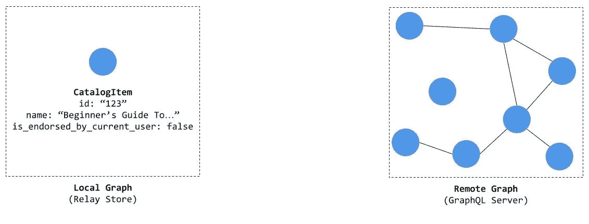
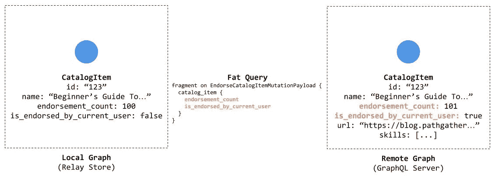
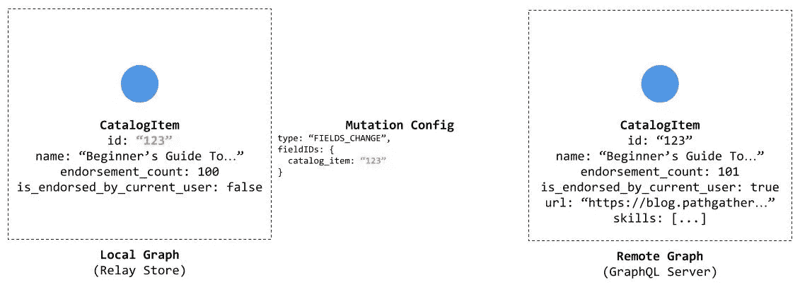
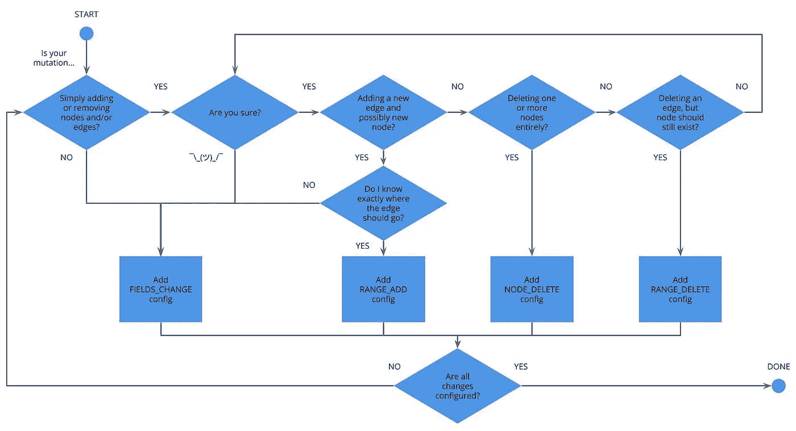
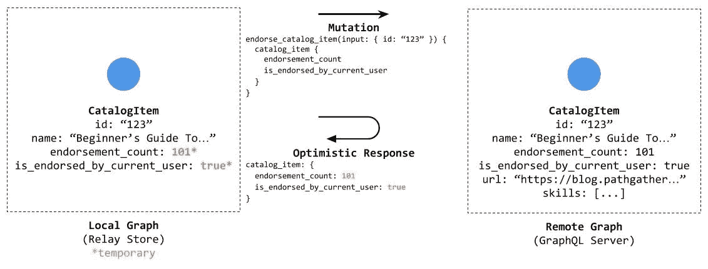
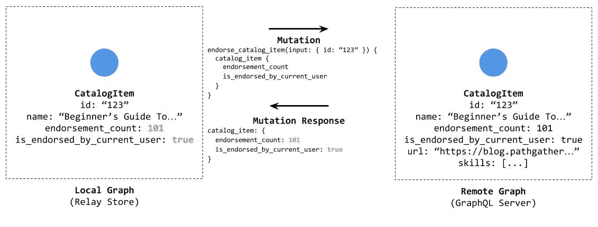

# 中继(经典)突变初学者指南

> 原文：<https://betterprogramming.pub/a-beginners-guide-to-relay-classic-mutations-9941537da442>


约书亚·阿拉贡在 [Unsplash](https://unsplash.com/search/photos/code-brick-wall?utm_source=unsplash&utm_medium=referral&utm_content=creditCopyText) 上拍摄的照片

## 超越“变异砖墙”

*最初于 2016 年 1 月 8 日在 pathgather.com 出版。自发布以来，中继突变 API 发生了*显著*的变化，因此这里的具体建议不像 2016 年那样相关，但希望您仍然会发现其中一些有趣的内容！*

# 介绍

当我一两个月前开始使用 Relay 时，一切似乎都很容易。我在我的组件中编写 GraphQL 片段，使用容器一起编写查询，并且，由于所有内容都缓存在中继存储中，我以疯狂的速度浏览应用程序。这就像魔术一样。

然后我开始尝试突变，碰壁了。它们似乎没有意义。我读了所有的指南，看了所有的视频，但我似乎仍然不能很好地理解每件事，并让它真正发挥作用。

这个指南是为像我这样撞上“突变砖墙”的人写的它是为那些玩过 Relay 一点点，编写过一些组件，能够很舒服地使用 GraphQL 查询呈现从服务器获取的数据，但是不能很好地理解变化的开发人员准备的。如果这听起来像你，那么继续读下去！相反，如果你是接力赛的新手，你首先要做一些功课——官方接力赛文档是一个很好的起点。

# 一个真实的例子:背书目录项突变

如果你和我一样，你讨厌阅读关于待办事项的应用程序。到目前为止，您可能已经看过了中继的 TodoMVC 代码，并且仍然发现自己对诸如“胖查询”、“突变配置”和“乐观响应”之类的事情感到困惑不解…

在这篇文章中，我们将通过讨论在 Pathgather 使用中继来使用一个“真实世界”的例子。先介绍一下 Pathgather 的一些背景，这样就更有意义了:我们是一个企业学习平台，让员工可以在一个地方轻松找到优秀的学习内容，分享他们最喜欢的网络资源，并跟踪他们的进度。这意味着我们花费大量时间和精力向用户展示学习内容:来自 Lynda 等在线提供商的课程，来自 YouTube 等网站的视频，其他用户分享的博客帖子等。在这个 GraphQL 模式的例子中，我们将其中的每一项都称为“CatalogItems”

在这篇文章中，我们将关注一个相对简单的例子:一个用户发现一个 CatalogItem 非常有价值，所以他们想“认可”它，这样他们的同事也可以发现它。当然，这是一个非常简单的交互，但是我们将在最后增加一点复杂性。让我们看看如何将这个特定的动作建模为接力突变。

# 编写中继突变的五步指南

我将向你介绍我认为你应该如何通过五个简单的步骤来编写突变。现在，让我们假设我们已经编写了一个 React 组件，它正在客户端上愉快地呈现我们的 CatalogItem，这意味着我们的本地图已经以 CatalogItem 节点的形式存储了一些数据(如果您想要更多关于中继存储如何实际记录这些数据的信息，我强烈推荐[这篇深入所有细节的精彩文章](http://hueypetersen.com/posts/2015/09/30/quick-look-at-the-relay-store/)。当然，GraphQL 服务器上的远程图要复杂得多。这可能是这样的:



## #1:定义输入变量，即“我们的目标是图表的哪一部分？”

对于这个突变，用户认可一个特定的**目录项**。不过，我们需要用图来思考，而不是用数据库行来思考——在图中，您只能真正针对一个节点或一条边。在这种情况下，我们的目标肯定是一个特定的 **CatalogItem** 节点，找到该节点最简单的方法是使用节点的全局 ID (Relay 要求这样做)，所以这就是我们要做的。在其他情况下，您将最终以边、多个节点或两者的某种组合为目标——但是，无论如何，请记住，您将针对图的一部分。

我们可以通过变异的输入变量向服务器提供我们的 **CatalogItem** 节点的 ID。Relay 通过 **getVariables()** 方法收集这些变量，该方法希望我们返回一个对象，其中包含每个变量名的键:

```
getVariables() {
  return {
    id: this.props.catalogItem.id // === "123"
  }
}
```

定义了输入变量之后，这意味着我们的服务器应该有足够的信息来定位我们想要在远程图中变异的节点(尽管必须有人来编写代码！).我们的情况是这样的:


## #2:定义名称——即“为了清楚起见，我们应该如何称呼这个操作？”

**给东西命名很难**。你可能会笑说我甚至包括了这一步，但我是那种认为命名非常重要的工程师，所以我想在这里分享一些建议。对我来说，名字排在第二位，因为我相信突变应该遵循这样的基本格式: **<动作名> <目标名>突变**。既然我们已经决定我们的目标是一个单独的 **CatalogItem** 并认可它，名字就很明显了:**认可 CatalogItemMutation** 。

对于我们的模式，我们对所有内容都使用 snake case(不要问)，因此它对应于一个名为**approval _ catalog _ item**的变体。我们使用 **getMutation()** 方法告诉 Relay 这一点，该方法需要一个 GraphQL 查询:

```
getMutation() {
  return Relay.QL `mutation { endorse_catalog_item }`
}
```

既然我们已经告诉 GraphQL 服务器运行哪个变体，它实际上可以对远程图进行更改。进步！


## #3:定义胖查询——即“这种突变会影响图表的哪些部分？”

传统上来说，你的旧端点(比如“ **POST /comments** ”)可能没有详细说明所有可能改变的结果——它们怎么可能呢？实际上，它们可能会返回一个包含操作结果的定制文档，以及客户当时需要的任何东西:新的注释、错误消息等。

GraphQL 对此采取了一种非常不同的方法。客户机需要询问它想要什么，而不是服务器指定返回什么。你可以把突变想象成一个**写紧跟着一个**读——我们已经指定了写部分(名称和输入变量)，所以现在我们必须弄清楚客户端需要读取什么数据。这是通过**变异查询**完成的。

然而，我们不直接编写突变查询…这是人们开始感到困惑的地方。既然您已经熟悉了 Relay，那么您将知道您的组件使用 GraphQL 片段来声明它们想要的数据。变异查询不是这样的。Relay 并没有通过一个片段来明确声明您*想要*什么数据，而是试图计算出您*为了更新您的本地图而需要*的最小数据量。然后，Relay 通过将三个信息源组合在一起，自动构建变异查询*:*

1.  *变异胖查询*
2.  *突变配置*
3.  *本地图(中继存储)*

*中继需要我们提供的第一条信息是“胖查询”fat 查询指定了整个图的哪个部分受到了突变的影响。您可以通过编写一种特殊的 GraphQL 查询来做到这一点，该查询使用 Relay 可以理解的一些特殊语法来指定哪些字段可能已经更改。通常在 GraphQL 中，如果你有一个非标量字段，你必须指定你想要获取的子字段(即，一个有子字段的字段，比如一个**用户**字段可能有**名称**、 **id** 等。).但是胖查询实际上并不执行，所以您不必说得那么具体——如果您只是知道该字段中的某些内容以某种方式发生了变化，您可以只说“ **user** ”。所以这个查询最终不如一个真正的查询具体…我想这使它变得“胖”了吧？*

*例如，在我们的**背书 CatalogItemMutation** 中，我们知道我们正在影响图中一个非常特殊的部分——突变所针对的 **CatalogItem** 节点。我们可以指定一个胖查询，声明关于 **catalog_item** 的任何内容都可以像这样更改:*

```
*getFatQuery() {
  return Relay.QL`
    fragment on EndorseCatalogItemMutationPayload {
      catalog_item
    }
  `
}*
```

*…或者，如果我们想更具体地了解可能发生了什么变化，我们可以指定将受到影响的子字段(像**approval _ count**这样的字段)。这限制了可能的突变查询，以确保我们不会过度提取不可能改变的内容:*

```
*getFatQuery() {
  return Relay.QL`
    fragment on EndorseCatalogItemMutationPayload {
      catalog_item {
        endorsement_count
        is_endorsed_by_current_user
      }
    }
  `
}*
```

*然而，我们实际上可能不会在任何地方呈现**背书 _ 计数**，因此获取它是不必要的。这是接力开始炫耀的地方。与其构建一个获取 fat 查询中定义的所有字段的变异查询，不如 Relay *将 fat 查询与您的应用程序在本地图中拥有的数据进行交集*来构建一个查询，该查询*只查询您之前获取的数据*！*

*例如，假设您在本地图中有这个 **catalog_item** :*

```
*catalog_item: {
  id: "123",
  is_endorsed_by_current_user: false
}*
```

*如果我们将 fat 查询与在那个 **catalog_item** 节点上定义的字段相交，我们会得到下面的变异查询:*

```
*fragment on EndorseCatalogItemMutationPayload {
  catalog_item {
    is_endorsed_by_current_user
  }
}*
```

*注意，我们在这里没有请求**背书 _ 计数**，因为我们之前没有获取它。如果我们在网站上再玩一会儿，某个组件在某个时候获取了**approval _ count**,那么本地图将被更新为:*

```
*catalog_item: {
  id: "123",
  endorsement_count: 100,
  is_endorsed_by_current_user: false
}*
```

*然后，我们重新应用交集来形成新的变异查询:*

```
*fragment on EndorseCatalogItemMutationPayload {
  catalog_item {
    endorsement_count
    is_endorsed_by_current_user
  }
}*
```

*很酷，对吧？Relay 消除了构造变异查询的猜测，因为它*知道*您当前没有在任何地方显示**背书 _ 计数**。*

*因此，我们编写了一个很好的大型查询，指定远程图中可能受到突变影响的部分。视觉上看起来是这样的:*

**

*但是这里还缺少一点——在本地图中可能有 100 个不同的 **catalog_item** 节点。Relay 如何知道与 fat 查询相交的是哪一个？这就是变异配置出现的原因。*

## *#4:使用 FIELDS_CHANGE 定义配置，即“Relay 应该如何将 fat 查询与您的本地图相交以构建变异查询？”*

*对于我们的变异示例，唯一缺少的是如何在本地图中找到与 fat 查询相交的正确节点。由于所有节点都可以通过它们的 **id** 来识别，这实际上很容易做到——只需配置变异来查找具有**id“123”**的 **catalog_item** 节点，并更新可能已经改变的字段。在中继变异术语中，这是通过向 **getConfigs()** 方法提供一个 **FIELDS_CHANGE** config 对象来实现的:*

```
*getConfigs() {
  return [{
    type: "FIELDS_CHANGE",
    fieldIDs: {
      catalog_item: this.props.catalogItem.id // === "123"
    }
  }]
}*
```

*这是让 Relay 在本地图中查找适当的父节点以与 fat 查询相交的缺失信息。它看起来像这样:*

**

*如果我们将 fat 查询、突变配置和本地图的状态结合起来，Relay 现在可以构造发送到服务器的突变查询:*

**

## *旁白:关于突变配置*

*目前有四种*不同的有效变异配置类型: **FIELDS_CHANGE** 、 **NODE_DELETE** 、 **RANGE_ADD** 和 **RANGE_DELETE** 。每种配置类型都采用一组不同的支持数据来配置交集和本地图的后续更新。几乎所有和我交谈过的人都被这些配置对象搞糊涂了！事实上，你可能在[突变指南](https://web.archive.org/web/20160310012953/https://facebook.github.io/relay/docs/guides-mutations.html)中读到了不同的配置，感到困惑，并发现了这篇博文。别担心，我们会解决的。以下是我对任何接力新手的建议:*

> *使用 **FIELDS_CHANGE** 做任何事情。*

*所有其他配置都是对 **FIELDS_CHANGE** 的性能改进，构建了更高效的变异查询(即请求更少的数据)。您现在不需要为此进行优化！您使用 Relay 并在客户机上维护本地图这一事实意味着您已经比任何不使用缓存的客户机应用程序(包括您最近的项目)更加高效；老实说)。现在专注于使用**FIELDS _ CHANGE**——这很容易推理和理解，因为您所需要做的就是在 fat 查询上的字段名(例如 **catalog_item** )和本地图中这些项目的 id(例如**“123”**)之间提供一个映射。*

*一旦我决定非**字段 _ 变化**变异配置只是性能改进，我发现变异使*很多*更有意义，希望这对你也有帮助。这里有几个例子来证明我的观点。*

*给**帖子**添加新的**评论**？不是使用 **RANGE_ADD** 只请求新的**注释**，而是重新获取整个**注释**集合:*

```
*getFatQuery() {
  return Relay.QL`
    fragment on AddCommentToPostPayload {
      post {
        comments
      }
    }
  `
}
getConfigs() {
  return [{
    type: "FIELDS_CHANGE",
    fieldIDs: {
      post: this.props.post.id
    }
  }]
}*
```

*改变主意想删除那个**评论**？现在不要担心 **NODE_DELETE** ，只需重新提取所有的**注释**！*

```
*getFatQuery() {
  return Relay.QL`
    fragment on DeleteCommentPayload {
      post {
        comments
      }
    }
  `
}
getConfigs() {
  return [{
    type: "FIELDS_CHANGE",
    fieldIDs: {
      post: this.props.post.id
    }
  }]
}*
```

*明白了吗？我相信每一个变异都可以被准确地描述为 **FIELDS_CHANGE** 变异，因为在绝对最坏的情况下，你可以重新抓取*整个本地图*并保证是最新的。当然，这有点极端，实际上我并不建议你这么做！虽然公平地说，请记住您的中继组件只要求它们需要呈现的最小数据集，所以即使在重新提取整个本地图的极端例子中，产生的 GraphQL 响应可能比您当前应用程序正在下载的其他一些文档要小，并且只使用了来自…*

*不过，我们不需要走极端。如果感觉您使用 **FIELDS_CHANGE** 请求了太多的数据，或者如果您不能通过命名受影响的父节点来合理地表达正在发生的变化，那么是时候进行一点迭代了。让我们简单地谈一谈。*

## *#4.5:定义更优的配置，即“中继如何猜测实际图形如何变化并将该变化应用于本地图形？”*

*对于某些类型的突变，我们可以使用 **NODE_DELETE** 、 **RANGE_ADD** 和 **RANGE_DELETE** 来“猜测”服务器在远程图中更改了什么。通过猜测，我们避免了重新提取同样多的数据——Relay 可以构造一个更小的变异查询，并依靠我们，即开发人员，做正确的事情。*

*为了决定我们是否可以使用这些更优化的突变配置，我们可以遵循这个方便的流程图:*

**

*如果你对突变有足够的了解，可以自信地回答图表上的问题，你可能不需要我帮助你理解如何配置那些更高级的类型。*

## *#5:如果可以的话，定义乐观响应，即“我可以伪造一个服务器响应来让中继立即更新本地图吗？”*

*现在您已经理解了突变真正在做什么——导致服务器图的一部分发生变化，然后查询服务器以便相应地更新本地图——我们可以完成我们的突变定义了。你会注意到客户对正在发生的事情了解很多。它精确地定义了图的目标部分(通过输入变量)，它理解了图的哪个区域受到了影响(通过 fat 查询)，并且它构造了一个查询来重新提取受影响的部分(通过配置和本地图)。既然客户机对变异将要做什么知道得如此之多，那么它可以简单地*在客户机*上模拟变异，而完全不依赖于服务器，除了永久地记录变化！如果我们完全不依赖服务器，我们可以立即*做出改变*，对吗？这就是乐观的回应给我们的。*

*我发现把乐观的响应想象成客户端的“模拟突变”是很有用的，但实际上并不完全正确。我们实际需要做的不是手动执行变异和转换本地图，而是伪造一个服务器响应，Relay 会假装这是真实的响应。我们也不必纠结于做出完美的响应——Relay 只会暂时使用乐观的响应，直到真正的服务器响应到达，这将对本地图做出永久的改变。非常酷。*

*对于我们的示例变体，编写如下的服务器响应相当简单:*

```
*getOptimisticResponse() {
  return {
    catalog_item: {
      id: this.props.catalogItem.id,
      endorsed_count: this.props.catalogItem.endorsed_count + 1,
      is_endorsed_by_current_user: true
    }
  }
}*
```

*您可能会发现将乐观响应想象为对现有片段的“转换”的输出是有帮助的。像示例中那样直接创建响应通常很容易，但我也可以这样做:*

```
*getOptimisticResponse() {
  let simulateEndorseCatalogItem = (catalogItem) => {
    let mutatedCatalogItem = Object.assign({}, catalogItem)
    mutatedCatalogItem.endorsed_count += 1
    mutatedCatalogItem.is_endorsed_by_current_user = true
  }
  return { 
    catalog_item: simulateEndorseCatalogItem(this.props.catalogItem)
  }
}*
```

*定义了乐观响应后，我们可以在本地图中放置一些临时数据，同时等待真正的突变响应到来。由于我们正在更新本地图形，这也触发了使用该数据的任何组件的重新呈现，因此我们的 UI 会立即更新。看起来是这样的:*

**

## *将这一切结合在一起*

*在这一点上，我们的突变是可用的。我们已经定义了输入变量，给了操作一个名称，添加了胖查询，指定了配置，并编写了乐观响应。我们可以把它打包成一个扩展 **Relay 的类。变异**到此为止。*

```
*class EndorseCatalogItemMutation extends Relay.Mutation {
  getMutation() {
    return Relay.QL `mutation { endorse_catalog_item }`
  }getVariables() {
    return {
      id: this.props.catalogItem.id
    }
  }getFatQuery() {
    return Relay.QL `
      fragment on EndorseCatalogItemMutationPayload {
        catalog_item {
          endorsed_count
          is_endorsed_by_current_user
        }
      }
    `
  }getConfigs() {
    return [{
      type: "FIELDS_CHANGE",
      fieldIDs: {
        catalog_item: this.props.catalogItem.id
      }
    }]
  }getOptimisticResponse() {
    return {
      catalog_item: {
        id: this.props.catalogItem.id,
        endorsed_count: this.props.catalogItem.endorsed_count + 1,
        is_endorsed_by_current_user: true
      }
    }
  }
}*
```

*现在，我们可以在任何 React 组件中使用这种变异，方法是用正确的输入变量调用其构造函数，并将其传递给 Relay。Store.update()，它将把突变发送到服务器，应用乐观更新，然后在对存储进行永久更改之前等待突变响应。成功！*

**

# *提炼我们的例子*

*这里提供的例子是一个影响单个节点的突变，所以一切都相对简单。事实上，即使像这样的小突变也会影响比我在这里展示的图表更大的部分。例如，此操作(认可一个**目录项目**)肯定会影响**目录项目**节点，但它也可能会影响最初共享该**目录项目**的用户的**总计 _ 认可 _ 计数**字段，或者向当前用户的**认可 _ 目录项目**连接添加一个新边。在这两种情况下，我们都需要更新 fat 查询(以指定受影响的其他节点)并向我们的 **FIELDS_CHANGE** 配置提供额外的**field id**。希望现在你能想象这是如何工作的，但这里有一个理论上的例子来帮助说明这一点:*

```
*getFatQuery() {
  return Relay.QL `
    fragment on EndorseCatalogItemMutationPayload {
      catalog_item {
        endorsed_count
        is_endorsed_by_current_user
      }
      sharer {
        total_endorsement_count
      }
      current_user {
        endorsed_catalog_items
      }
    }
  `
}getConfigs() {
  return [{
    type: "FIELDS_CHANGE",
    fieldIDs: {
      catalog_item: this.props.catalogItem.id,
      sharer: this.props.catalogItem.sharer.id,
      current_user: this.props.currentUser.id
    }
  }]
}*
```

*随着您的变异变得更加复杂，它们将开始拥有自己的数据依赖，因此您还需要在变异上定义片段，以便在构建变异之前获取数据(当然，是通过中继容器组合的美妙之处！).*

# *摘要*

*理解中继突变的关键是开始“用图表思考”。这是我开始时最大的绊脚石，因为我来自一个 REST 世界，在那里突变总是带有自定义输入数据和自定义响应的自定义端点。“接力方式”包括将你的突变表达为图形操作；如果你这样做了，其他的一切都会变得井井有条。*

*首先，你可以遵循这个五步半指南来设计你所有的突变:*

1.  *定义输入变量，即“我们的目标是图表的哪一部分？”*
2.  *定义名称——即“为了清楚起见，我们应该称这个操作为什么？”*
3.  *定义胖查询，即“这种突变会影响图表的哪些部分？”*
4.  *使用 FIELDS_CHANGE 定义配置，即“Relay 应该如何将 fat 查询与您的本地图相交以构建变异查询？”
    (4.5):定义更多的最优配置，即“中继如何猜测实际图形是如何变化的，并将该变化应用于本地图形？”*
5.  *如果可以的话，定义乐观响应，即“我可以伪造一个服务器响应来让中继立即更新本地图吗？”*

*一旦你对接力更加熟悉，你就会对走出边界更加自信。你也会开始注意到一些还不太有意义的特质。例如，为什么胖查询是客户端关注的问题？当您实际上不知道图中的哪些节点会提前受到影响时，您如何从客户端准确地描述图操作呢？并非所有这些问题都有很好的答案…目前还没有。你认为你有吗？提交一份简历:[https://github.com/facebook/relay](https://github.com/facebook/relay)。*

*继续学习！*

***还有一个秘密的“REQUIRED_CHILDREN”配置，您可以使用它向变异查询添加任何您想要的字段。要了解更多关于这种神秘类型的信息，请在中继源中找到它:)**