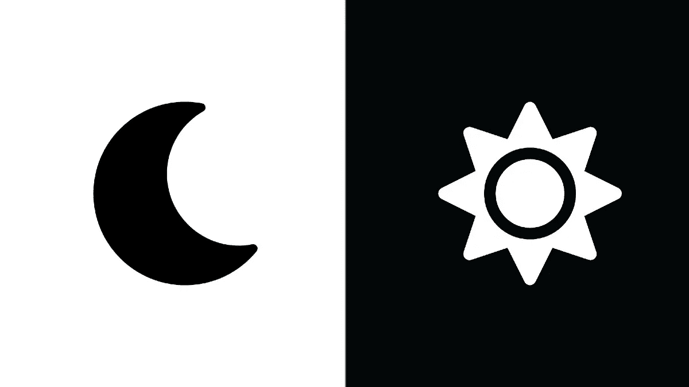

# 在你的网站上一个更好的黑暗模式

> 原文：<https://betterprogramming.pub/a-better-approach-to-dark-mode-on-your-website-dadbe8c55b40>

## 立即了解如何实施黑暗模式



作者图片

黑暗模式似乎会持续下去。最初，它主要由开发人员在他们的代码编辑器中使用，但现在它无处不在，从移动设备、桌面，现在甚至是 web。支持黑暗模式越来越从一个美好的必须变成一个必须。当然，这取决于你的定位，但是如果你在这里，很有可能，你想在你的站点上或者为你的客户实现黑暗模式。

当谈到网站的黑暗模式时，网络上有多种方法，我想和你谈谈两种不同的方法——其中一种是最容易实现的，第二种是我的首选，也是我实际上用来在 [livecodestream.dev](https://livecodestream.dev/) 上实现黑暗模式的选项。

让我们从第一个选项开始。

# 黑暗模式中的几行代码

第一个选项通过使用“黑暗”魔法工作:p，玩笑归玩笑，它非常简单和优雅，只包含一行 CSS。

```
html[data-theme='dark'] {
    background: #000;
    filter: invert(1) hue-rotate(180deg)
}
```

什么？你可能想知道这是如何工作的，你的怀疑也许是正确的，但它确实如此。在我们谈论为什么我不太喜欢这个选项之前，让我们先看看它的运行情况:

从例子中可以看出，它工作得非常好，但是有一个问题:它也反转了图像。这是因为 filter 属性还适用于图像、背景和边框。现在，通过避免图像上的变化(或者更好地说，通过反转反转?)可以很容易地解决这个问题。):

```
html[data-theme='dark'] {
    background: #000;
    filter: invert(1) hue-rotate(180deg)
}html[data-theme='dark'] img {
  filter: invert(1) hue-rotate(180deg)
}
```

不错！但是一切过渡得如此突然，让我们用一些漂亮的过渡和一些颜色让它变得更好:

```
html {
    transition: color 300ms, background-color 300ms;
}html[data-theme='dark'] {
    background: #000;
    filter: invert(1) hue-rotate(180deg)
}html[data-theme='dark'] img {
  filter: invert(1) hue-rotate(180deg)
}
```

漂亮！它只是工作。现在，并不总是看起来很棒，在某些情况下，它可能看起来有点奇怪，我们可能希望对每种颜色有更多的控制。

# 带有 CSS 变量的黑暗模式

这是我在我的网站上使用的技术，效果很好。CSS 允许自定义属性(变量)的定义，自定义属性是可以在 CSS 中用特定值定义并在整个网站中重用的实体。您可以在 [MDN 文档](https://developer.mozilla.org/en-US/docs/Web/CSS/Using_CSS_custom_properties)上找到详细信息，但是，我们将在这里快速回顾如何创建变量以及如何使用它。

```
:root {
    --my-var: blue;
}element {
    color: var(--my-var);
}
```

很简单，要命名一个变量，我们需要在变量名前面加上`--`，要使用它，我们使用函数`var()`。

现在让我们回到我们的场景，并尝试以这种方式实现黑暗模式。

```
html {
  --background-primary: #fff;
  --color-primary: #333;
}html[data-theme='dark'] {
  --background-primary: #030303;
  --color-primary: #ccc;
}html {
  transition: color 300ms, background-color 300ms;
  background: var(--background-primary);
  color: var(--color-primary);
}h1, h2, p {
  color: var(--color-primary);
}
```

就麻烦多了。现在，我们需要为我们网站上使用的每个元素分配我们想要的文本和背景颜色，否则，它将无法工作。但是可以让你完全控制正在发生的事情，你可以为标题、按钮、标注等等创建不同的变量。

让我们看看一个真实的例子:

这是我喜欢的黑暗模式。到目前为止，我们已经解释了事情的 CSS 方面，但我们还将研究 JavaScript 代码来进行切换，甚至将它保存在本地存储上，这样下次用户进入站点时，我们就会记住他的偏好。

# 主题切换逻辑

现在让我们来研究使这种转换成为可能的 JS。事实上，同样非常简单:

```
const htmlEl = document.getElementsByTagName('html')[0];const toggleTheme = (theme) => {
    htmlEl.dataset.theme = theme;
}
```

主题的工作方式是通过在 HTML 元素上应用一个数据属性，为此我们需要在变量`htmlEl`中捕获元素，然后最后我们有一个接收主题名称并改变属性的函数。

但是我们也想确保我们的更改被保存在浏览器中，这样我们就能记住用户下次访问我们网站时的偏好。为此，我们将使用`localStorage` API。

```
// Capture the current theme from local storage and adjust the page to use the current theme.
const htmlEl = document.getElementsByTagName('html')[0];
const currentTheme = localStorage.getItem('theme') ? localStorage.getItem('theme') : null;if (currentTheme) {
    htmlEl.dataset.theme = currentTheme;
}// When the user changes the theme, we need to save the new value on local storage
const toggleTheme = (theme) => {
    htmlEl.dataset.theme = theme;
    localStorage.setItem('theme', theme);
}
```

搞定了。让我们看看现场直播:

# 结论

今天我们讨论了启用黑暗模式的两个选项；然而，在如何实现这些结果的问题上，非常有创造力的人们有更多的选择。如果你有你认为更好的解决方案，请 ping 我，我会添加到帖子中与他人分享(适当参考作者)。

我希望你今天学到了一些新东西，感谢你的阅读！