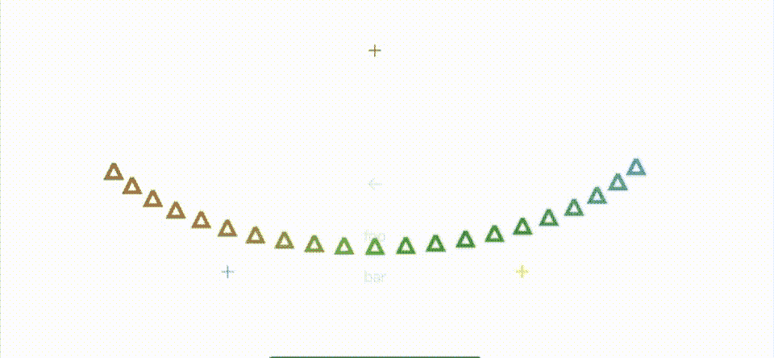
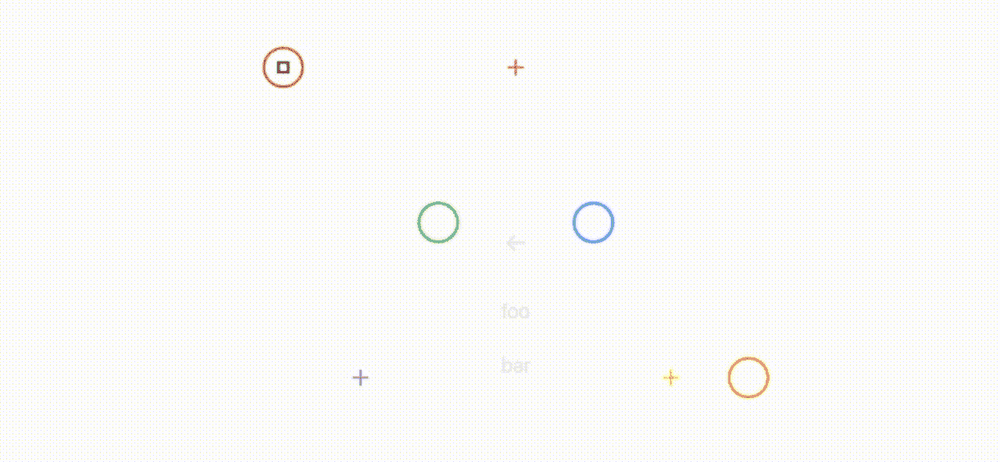
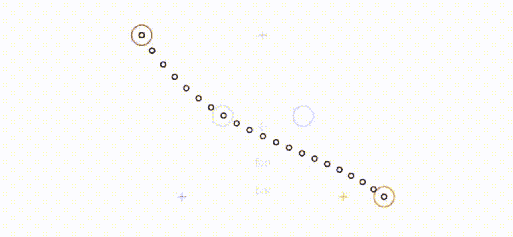
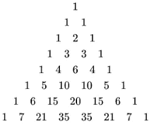

# 更好的贝塞尔曲线 SwiftUI 中的多项式

> 原文：<https://betterprogramming.pub/a-better-bezier-curve-a-polynomial-in-swiftui-e0807e9cc214>

## 伯恩斯坦多项式是德·卡斯特尔约·贝齐尔的替代物



伯恩斯坦多项式曲线。

本月早些时候，我发表了两篇关于 iOS 中贝塞尔曲线的文章——第一篇是关于在 iOS 中使用范例的文章，第二篇是关于上述曲线背后的数学/代码的文章。

在我为第二篇文章做研究的过程中，我发现自己在和一个叫艾伦·沃尔夫的美国人交谈。一个似乎在这方面做了很多工作的人。Alan 不仅帮助我理解了 De Casteljau 的公式并修复了我代码中的一个 bug，而且他还建议我尝试使用 Bernstein 的幂基多项式作为构建 Bezier 曲线的替代公式。

多项式有时更有意义。首先，德卡斯特尔约方法到底有什么问题？问题是，嗯，它的复杂度是 *O(n2)* 。这基本上意味着，随着添加的控制点数量的增加，计算量会很快变大。

让我们简单回顾一下。现在，我写的第二幅作品的开头 GIF 有三个控制点和六个开始/结束点，这是有意义的…只是它没有。你看，你看到的不是 GIF 上的一条贝塞尔曲线。你现在看到的是我标记在一起的三条独立的贝塞尔曲线。我修改了端点的位置，并创建了另一个 GIF 来说明这一点。这里的控制点是紫色、红色和黄色的十字。起点/终点是红色、绿色、蓝色和黄色圆圈:



三条贝塞尔曲线

如果我画一条有两个控制点的贝塞尔曲线，我会得到一个运动少得多的东西。你可以在这张 GIF 中看到一条贝塞尔曲线:



四条贝塞尔曲线——一条长，三条短

单一贝塞尔曲线要稳定得多，至少部分是因为相对的粉红色控制点。你还可以看到，随着灰色曲线上的点越来越多，当它扭曲时，与灰色线有些不协调。一个经典的“少即是多”的例子，因为你没有注意到它会有更少的点数(在之前的 GIF 中)。

嘿，你可能还是没发现问题。事实上，线索就在代码中。具有讽刺意味的是，要计算这里的黑线(具有多个控制点的单个贝塞尔曲线)，我需要十几行代码和组合集的临时存储。如果我使用伯恩斯坦的方法，事情会简单得多。

那么如何使用伯恩斯坦的幂基多项式呢？他们是这样工作的。变量 *t* 是时间，变量 *s = 1 -t* 。您有一个与所需控制点数量相关联的独特公式。下面有三个等式。显然，您可以使用相同的模式构建更大的:

*   线性贝塞尔(又名线性插值): *y = A*s + B*t*
*   二次贝塞尔: *y = A*s + 2*B*st + C*t*
*   三次贝塞尔: *y = A*s + 3*B*s t + 3*C*st + D*t*

公式中的幻数对应于帕斯卡三角形，看起来像这样:



帕斯卡三角形

这在代码中是什么样子的，也许更重要的是，在纸上是什么样子的(也就是一些电子网格纸)？给你:

我在代码中用一行代码调用这个方法:

```
altPoints = bPolyCubicBezier(fp:redPoint,sp:purplePoint,tp:yellowPoint,lp:orangePoint)
```

这将建立一个三次贝塞尔曲线，在这里用三角形绘制。黑线上有更多的移动，因为它没有考虑红色控制点。如果红点以与紫色和黄色十字相同的方式摆动，那么这些线将会相互跟踪。


伯恩斯坦多项式和贝塞尔曲线

你在什么情况下用什么方法？好吧，如果你有一个非常具体的例子，你知道控制点的数量不会改变，那么伯恩斯坦的解决方案看起来更好。它占用更少的 CPU 和代码。但是如果您的需求更加通用，并且可能会改变，那么 De Casteljau 方法更有意义——即使它需要更多的 CPU 和代码。

这就把我带到了文章的结尾。我希望你能像我写这本书一样喜欢读它，并在这个过程中学到一些新的东西。

下面是生成多项式并制作动画的代码。正如您所看到的，95%的时间都是简单地设置初始值，然后更改其中的值。`poly`函数本身只有十几行:

保持冷静，继续编码…