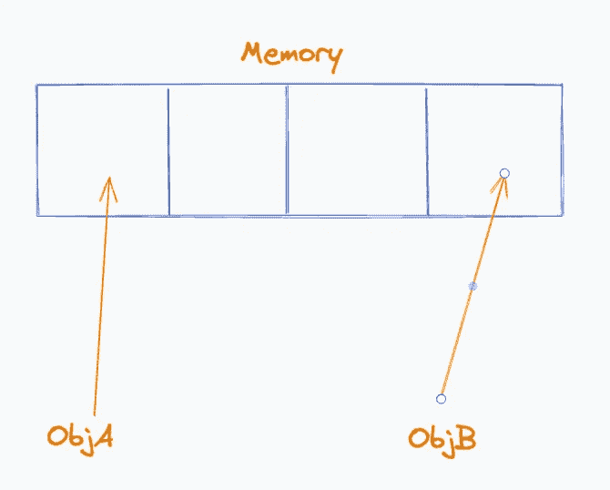
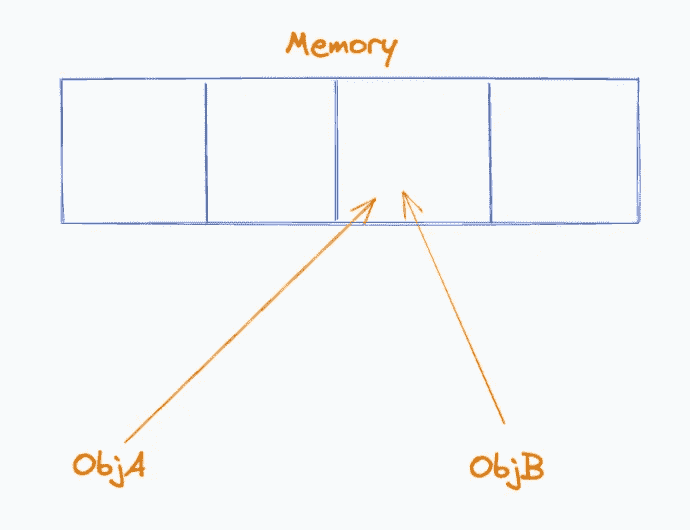
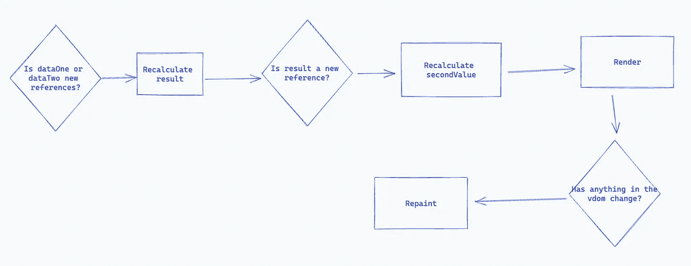
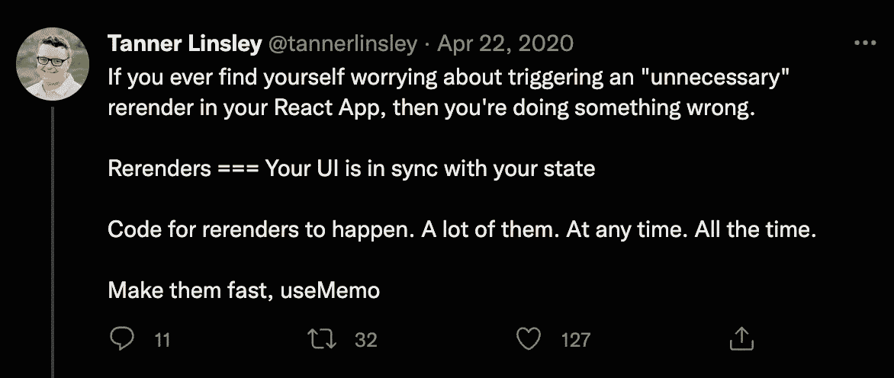
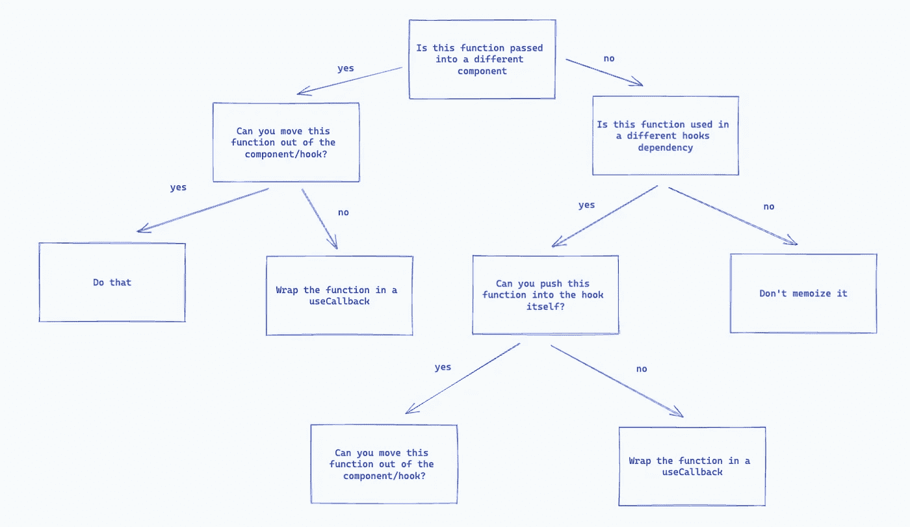

# 使用备忘录和使用回调更好方法

> 原文：<https://betterprogramming.pub/a-better-way-to-usememo-and-usecallback-58288a19f91c>

## 诉诸权威谬论


照片由[卡斯滕·沃思](https://unsplash.com/@karsten_wuerth?utm_source=medium&utm_medium=referral)在 [Unsplash](https://unsplash.com?utm_source=medium&utm_medium=referral) 上拍摄

首先，这篇文章不是对 Kent C. Dodds 的文章[何时使用备忘录和使用回电](https://kentcdodds.com/blog/usememo-and-usecallback)中所陈述的事实的争论。相反，它是反对过度推广应用它的明确论据。让我特别抓狂的是，我居然还能记得这篇文章是什么时候发布的。我不能对其他文章这么说。在过去的三年里，通过不同的公司、程序员、评论者等等，这是我遇到的被引用最多的文章。不是一点点，而是一英里！

它也经常被错误地应用。

在我们深入研究之前，我强烈建议阅读原文。这是一篇非常棒的文章，包含了非常有用的信息。在深入探讨什么是“反”论点之前，理解这一点也至关重要。称之为反驳是不公平的。我的论点更接近于“这个信息是好的，直到……”。

让我们来看一个非常常见的场景。有一天你在工作，一个会议刚刚结束。你不能急于求成，因为马上要开会了。实际上有一个小时的路程，但是你知道吗，那已经够近了，不要一头扎进去，然后不得不马上停下来。

一位同事在 slack 上向您发送 pings 命令，希望您帮助他们快速完成他们已经准备好的拉取请求。您很确定他们只是想让您点击 approve，但是您决定快速浏览一下代码，发现一个新的组件，看起来像这样:

```
function List({items}) {
  const activateItem = () => {
  // Do something here
 };
  return(
    {items.map(item => 
      <Item onClick={activateItem}>{item.name}</Item>
    )}
  )
}
```

当您经过时，您在`activateItem`函数上添加了一条注释，提醒作者将他们的函数包装在一个`useCallback`中。您继续传递代码，发现了另一个代码块:

```
function Body() {
  const {cats} = useCats();
  const catsWithLongFur = cats.filter(cat => cat.hasLongFur);
  return (<List items={catsWithLongFur} />);
}
```

简单点说，你会给作者一个提示，提醒他们应该`useMemo`过滤器。

反馈完成！但是，唉，你的同事再次 pings 你。信息内容为“我已回复您的反馈”。

哦不。

这种情况在我脑海中出现过很多次，几乎每次回复都是处理同样的分歧。你从你的同事那里得到一个信息，在这些情况下不需要`useMemo`和`useCallback`，因为你过早地优化了。在几乎 90%的情况下，上面 Kent C. Dodds 的文章将被链接以供进一步阅读。

你站在哪一边？他们是对的吗？

这就是这篇文章的问题所在。Kenny D 使用的大多数例子都非常非常简单，但选择这些类型的例子也隐藏了作者所做的一个重要区分。他的例子中没有一个将这些变量传递给另一个 React 组件。你会注意到这两个例子都是一个“叶子”组件，我们只使用语义 HTML，而不是其他组件。这是明智的，这是一个简单的指南。但是它确实混淆了一个架构问题。

为什么这很重要？嗯，说轻一点，`useMemo`或者说`useCallback`真的有两个作用:

1.  最佳化
2.  指称平等

# 最佳化

第一个原因是优化。这是一个关于`useMemo`的非常明显的例子。如果您正在对不需要每次渲染都更新的数据进行昂贵的计算，那么记忆数据会非常方便。

举个例子:

```
import { generate } from './utils';
import { useDataOne, useDataTwo } from './stores';
function Example() {
  const { dataOne } = useDataOne(); // Only queries on component init
  const { dataTwo } = useDataTwo(); // Only queries on component init
  const result = useMemo(() => generate(dataOne, dataTwo), [dataOne, dataTwo]);
  return (
    <div>
      {data.map(x => <div>{x.result}</div>
    </div>
  )
}
```

我记得我们对上面的`generate`函数的调用，因为我知道它的依赖关系很少会被改变。如果我没有这样做，对组件的任何更改都意味着计算将重新运行。

现在，也就是说，如果上面的计算很便宜，那么内存化可能不值得这样的开销。还有一种情况是`dataOne`或`dataTwo`必须在每次更新时重新收集其数据。如果发生这种情况，作为对我们的`useMemo`调用的依赖，这将意味着每次渲染也将导致生成函数再次运行，从而消除了内存化的需要。React 的性能很高，在不需要的时候使用这些内存会增加不必要的性能开销，也会增加代码的复杂性。

而这也正是上面这篇文章要讲的。理解什么时候优化是值得的，并在此基础上做出选择。这是一个很好的建议。但是在选择使用这些 react 钩子时，我们还需要考虑第二个因素。

但是文章中没有提到的是什么？

# 指称平等

让我们首先用简单的术语解释一下引用相等意味着什么，然后详细说明这对我们的组件以及在大型应用程序中需要注意的模式意味着什么。引用相等是指两个对象指向内存中的同一个对象。让我们编写一个非常简单的例子。

> 💡在这篇博文中，当我提到“对象”时，我指的是对象、数组或函数。在 Javascript 中，这三个都是“对象”类型，尽管有特殊的属性。不管怎样，它们共享引用等式机制，所以可以认为是相同的。

```
const objA = { test: 'hi' } 
const objB = { test: 'hi' }
objA === objB // returns false
```



在上面的例子中，`objA`和`objB`变量指向内存中两个不同的点。虽然从我们的角度来看，它们看起来像是“相同”的对象，但在指称上它们是两个不同的东西，因此当我们试图测试它们的相等性时，它返回 false。如果我们改变`objA`，`objB`将不会收到那个改变。另一方面:

```
const objA = { test: 'hi' } 
const objB = objA
objA === objB // returns true
```



这些对象是相同的，改变一个变量也会改变另一个变量。这些变量指向内存中的同一个点，因此它们在引用上是相等的。使用这种类型的相等性检查是一种非常简单、非常便宜的方式，React 和许多其他库在涉及到对象时跟踪状态的变化。

> 💡你可能想知道是否有其他方法来追踪平等，而且确实有！这些包括浅层比较和深层比较，也在 react 中用于不同的目的。应该注意的是，虽然这些可以更慢！每种类型的比较检查都有它的优点和缺点，所以什么时候使用每一种都是最好的！

那么，当我们谈论`useMemo`时，指称平等对我们意味着什么呢？让我们在前面的例子的基础上进行推导计算:

```
import { generate } from './utils';
import { useDataOne, useDataTwo } from './stores';
function Example() {
  const { dataOne } = useDataOne(); // Only queries on component init
  const { dataTwo } = useDataTwo(); // Only queries on component init
  const result = useMemo(() => generate(dataOne, dataTwo), [dataOne, dataTwo]);
 const secondValue = useMemo(() => data.filter(item => item.isValid), [data]);
  return (
    <div>
      {secondValue.map(x => <div>{x.result}</div>
    </div>
  )
}
```

所以，如果你是依赖数组的新手，[我有另一篇关于主题](https://www.dennyscott.io/blog/use-effect-dependency-array)的博文。但是在上面的例子中，逻辑链遵循以下步骤:



1.  `dataOne`或`dataTwo`是新的引用吗(即它们是否指向内存中的同一个点)？如果是，通过运行`generate`方法重新计算`result`。
2.  `result`是否是新的参考(即上述情况是否发生)。如果是，重新计算`secondValue`

在这个例子中，如果`dataOne`要接收一个新的引用，那么`result`将被重新计算，随后`secondValue`也被重新计算，这是预料之中的。

但是如果`dataOne`和`dataTwo`不改变它们的引用，我们将会直接跳到渲染调用，从而跳过两个完整的计算。现在，这不是免费的或有保证的。我们正在进行引用检查，以确保这确实是我们想要做的事情，同时在内存中维护内存化所需的数据和由内存化返回的数据。在任何时候，React 都可以清除可能存储该记忆的存储器，从而导致重新计算。作为一名开发人员，这取决于您决定什么时候这种权衡是值得的。稍后在博客中会有更多的介绍。

好消息是。如果这种情况发生在单个组件中(这种情况经常发生),那么计算和选择何时优化这些计算或者意识到这些依赖关系会非常简单。更好的是，开始时最好不要记忆，只有在性能成为问题时才添加记忆。

不幸的是，当我们跨多个组件工作时，事情变得有点棘手。让我们设置一些我们将在这个例子中使用的代码，它将只包含两个组件。

```
import { generate } from './utils';
import { useDataOne, useDataTwo } from './stores';
function Example() {
  const { dataOne } = useDataOne(); // Only queries on component init
  const { dataTwo } = useDataTwo(); // Only queries on component init
  const result = generate(dataOne, dataTwo);
 const onChange = () => { //doSomething }
  return (
    <List items={data} onChange={onChange} />
  )
}
const List = ({data}) => {
  return (
   <ul>
     {data.map(item => <li>{item.name}</li>)}
   </ul>
  )
}
```

`data`和`onChange`如何影响`List`组件本身，从更广泛的角度来看，它如何影响你的同事向前发展的开发者体验(DX)？这些可以追溯到我们的两个重点领域，优化和引用相等。让我们开始吧。

💡你可能想知道为什么我们没有讨论字符串、布尔值或数字。这些是不依赖于引用相等来确定变化的基本类型，因为这是一个非常廉价的相等检查来确定 7 === 7。

# 跨多个组件的优化

不管你的函数/对象引用如何变化，在上面的例子中，当父组件`Example`重新渲染时，子组件`List`总是会重新渲染。在这里维护引用相等对限制子级的呈现没有影响。然而根据我的经验，这是实现`useMemo`和`useCallback`最常用的理由，或者反过来说，也是我们不应该使用它的最常见的理由。

唯一一次`useMemo`或`useCallback`停止子组件的重新渲染是在子组件被`React.memo`(或美国婴儿潮一代的`PureComponent`)纪念的时候。很抱歉，`React.memo`是记忆的另一种形式(如果你想看 [memo vs memoize 博文](https://www.dennyscott.io/blog/qg-memo-vs-memoize)还有一个)，我们需要先讨论一下。让我们看看代码:

```
import { generate } from './utils';
import { useDataOne, useDataTwo } from './stores';
function Example() {
  const { dataOne } = useDataOne(); // Only queries on component init
  const { dataTwo } = useDataTwo(); // Only queries on component init
  const result = useMemo(generate(dataOne, dataTwo), [dataOne, dataTwo]);
 // const onChange = () => { //doSomething }
  return (
    <List items={data} />
  )
}
// This component only rerenders if the data object reference changes
const List = React.memo(({data}) => {
  return (
   <ul>
     {data.map(item => <li>{item.name}</li>)}
   </ul>
  )
})
```

在上面的例子中，只有当`result`的引用改变时，列表组件才会重新呈现。如果我们没有使用`useMemo`，那么`List`组件将重新渲染`Example`组件的每一次渲染，而不考虑`React.memo`，因为`result`将总是一个新的引用。我们没有时间深入了解`React.memo`功能是如何工作的(或者类似的`PureComponent`基于类的替代方案)。但是我最好的建议是，除非你绝对知道你需要，否则不要使用它。我认为坦纳·林斯利的这条[推特最好地概括了这一点](https://twitter.com/tannerlinsley/status/1253000896776073221?s=20&t=psnMHSEMgN5WJVWJ9nuZYw)。如果有这个选项，你应该优化每个渲染的速度，而不是“不必要的”渲染。



那么这对我们使用`useMemo`和`useCallback`意味着什么呢？我们已经决定不使用`React.memo`，所以任何优化都不会停止重新渲染。这是否意味着我们应该只使用它们来优化缓慢的计算？

答案是否定的，但是有一个大大的星号。首先，让我们来看看为什么我们不想忽略`useCallback`和`useMemo`的最坏情况，然后最后逐步完成一个流程，在决定要记录什么时，我通常会遵循这个流程。

# 不要埋地雷

因此，让我们想象一个非常非常简单的例子，可以导致这个问题，看看你是否注意到了这一点。这将是非常做作的，但目标是捕捉这些东西可以偷偷摸摸的有多简单。在我们的例子中，我们有一个正在创建的`DataModal`组件，它使用一个通用列表组件来实现。

```
function useData() {
  return [{name: 'John'}, {name: 'Paul'}, {name: 'Ringo'}, {name: 'George'}]
}
function DataModal(props) {
  const {data} = useData();
  const { metric } = useMetrics();
  return (
    <div className={styles.modal}>
      <List items={data} />
  </div>
  )
}
```

和基本列表组件:

```
function List(props) {
  const { items, onChange } = props;
  return (
    <ul>
      {items.map(item => (<li>{item.name}</li>))}
    </ul>
  )
}
```

现在，几个月后，不同的开发人员获得了一个特性:将传递的数据映射到一个大型数据集中。这显然是刻意保持简单，但这些事情还是发生了。尤其是在大型应用程序中，架构决策可能分散在多个团队中。因此，他们决定采取以下措施:

```
function List(props) {
  const { items, onChange } = props;
  const { selected, setSelected } = useState(null);
  const { urlParam } = useRouter();
  const { data } = useBigData();

 const dataSet = mapToLargeDataSet(items, data);
  return (
    <ul>
      {items.map(item => (<li onClick={onClick}>{item.song}</li>))}
    </ul>
  )
}
```

但是他们很快意识到——“这是一个昂贵的计算，我要记住它”并加上`const dataSet = useMemo(() => mapToLargeDataSet(items, data), [items, data])`。但问题是，`items`对象总是不同的对象，每一次渲染。希望开发人员注意到了，但是现在他们必须沿着链向上工作，找出是什么数据改变了每个渲染。对于一个小团队来说，这可能看起来微不足道。但是在更大的企业团队中，这个问题可能不在您的团队中，或者更糟的是，您现在不能进行这种改变，因为您不确定其他团队现在是否依赖于这个问题。

这也可能发生在数据记忆之外。假设我们对传入的函数产生了副作用:

```
import { subscribeToExternalLibrary, unsubscribeToExternalLibrary} from 'someplace';
function Example({onChange}) {
  useEffect(() => {
    window.addEventListener('scroll', onChange);
      return () => {
        window.removeEventListener('scroll', onChange);
      };
  }, [onChange]);
  <button onClick={onChange}>Click me</button>
}
<Example onChange={() => console.log('hello')} />
```

在上面的例子中，因为我们没有在`useCallback`中包装我们的函数，我们将实际上取消订阅和重新订阅每一个渲染。根据效果的用途，这可能会导致无限的重新渲染，重新初始化第三方库(通常会破坏它们)，或者只是增加连续重新连接的性能影响。

你也可能看着这个并想“嗯，当这个`useEffect`被添加时，我可以更新调用函数来使用`useCallback`”。我真的会避免这种想法，随着你的代码库的增长，随着你的团队的增长，这种维护会变得越来越昂贵。更有甚者，一些开发人员可能最终“依赖”这种不正确的。我们过去经常称之为**埋地雷。**

一个开发者要么产生了副作用，要么为将来不正确的副作用创造了机会。

例如，想象在我们上面的`Example`组件中，我们没有`scroll`效果。现在，如果有人使用这个组件而没有将他们的`onChange`包装在`useCallback`中，并且不同的开发者决定添加那个`scroll`效果，他们现在已经破坏了一些其他功能。他们不知道的功能。这就是为什么我们称之为**埋地雷**。

# 何时使用回调或使用备忘录

因此，现在问题摆在我们面前，我们应该勾勒出何时应该适当地实际应用`useCallback`和`useMemo`的流程。

# 应用 useCallback 的逻辑流程

最容易定义的一个，让我们分解一个流程，看看什么时候你应该`useCallback`。这个流程一开始可能看起来很复杂，但是这是一组很好的规则，可以简单地逐步执行。



不是一个事实上的使用回调规则列表，而是一些需要记住的东西

这里的核心目标应该是问你自己**这个功能可以被隔离到一个单独的文件中或者组件之外。**

如果函数必须存在于组件中，我们能把函数隔离到需要它的钩子上吗？基本上，我们能保持干净的代码实践吗？如果这些都失败了，那么我们应该用一个`useCallback`来包装我们的函数。

与我们将在`useMemo`流中看到的不同，我们不担心性能。对于一些人来说，这是一个常见的困惑点，但是创建回调的记忆版本对性能没有影响。它的目标纯粹是为了其他组件或依赖关系之间的引用平等。

> 💡这是一个注意的好时机，通过提取函数，它将迫使你创建一个更纯粹的**函数。这使得跟踪更容易，测试更容易，重用更容易。**

# 应用用户备忘录的逻辑流程

让我们先浏览一下一般的逻辑流程，然后讨论一些关键领域。应该注意的是，这不是一些 ***事实上的*** 规则可以遵循的。相反，它应该给我一些在记起某件事之前所采取的一般步骤的见解。最好记住，如果你能在记忆之外处理这个问题，那么走这条路通常是值得的。所以让我们看看:


不是一个事实上的使用备忘录规则列表，而是一些需要记住的东西

# 计算是在一个可重用的钩子中吗？

当你从一个钩子返回数据时，你应该总是考虑其他开发者将如何使用它。

学习用同理心设计 API 是开发人员可以学习的最强技能之一。

如果你的钩子返回一个在钩子内部创建的函数，它应该被包装在一个`useCallback`中。类似地，一个对象在两次渲染之间应该是指涉相等的，除非某些东西发生了变化。

# 你能展平/拾取它或者创建更多可组合的组件吗？

当您将道具传递给另一个组件时，一个很好的经验法则是避免传递对象。通过更好的元件设计，我们有多种方法可以做到这一点，例如:

1.  毫无疑问，最有可能的解决方案是让您的组件更加可组合。如果你的组件经常是叶子组件(即它们不接受子组件)，你应该重新考虑你的组件结构。创建可组合组件允许我们将责任推上组件链，并使流程更容易阅读，同时也创建更多可重用的组件。
2.  可以在组件列表本身中查询结果集吗？这可以在 react-query 或 redux 等各种库中实现。
3.  如果您映射一组数据，将每一项传递到一个组件中，我们可以将数据平铺到组件属性中吗？这有望意味着我们可以将数据限制为原语，使引用相等变得更加容易。
4.  类似地，如果我们映射一组数据，类似于 2，我们也可以使用传入的 id 从数据存储中获取每一项。有些人喜欢这种方法，有些人讨厌它——但这是一种选择。

# 结论:用同理心设计 API

当你在现实世界中举一个像肯特·C·多兹的文章这样的例子时，最大的挑战之一就是:它确实是一个非常小的例子。

他不得不删掉较长的解释、边缘案例和非常重要的信息，以使他的文章简单易懂。见鬼，我最初写这篇博客的时候用了很大的篇幅试图写出`useMemo`和`React.memo`之间的区别。但是这些东西需要被删除，以制作出非常有冲击力和信息量的作品。

很明显，它成功了。自从这篇文章发表以来，几乎每个月都会有人以某种方式把它链接到我身上，这是有原因的。这是一篇精彩的文章，让你对这个话题有所了解。但是当你把它扩展到一个更大的 web 应用程序时，你必须理解这个决定有更多的细微差别。你需要理解这是如何反映未来几年开发人员的，有时会做出 DX 选择而不是优化选择。

设计 API 的目标是简化过程。你不仅想创建一个有效的 API，而且应用这个 API 会给开发者带来快乐。在创建一个简单的 API 和给更复杂的过程留出退路之间有一个令人难以置信的平衡。你要考虑将来有一天可能需要如何扩展，同时还要确保关键路径不需要捷径。最后，目标之一应该是始终创建一个避免地雷的 API。我们想要处理这些案例的真正原因是，在未来的某一天、几周、几个月，甚至几年，一个开发人员将会看着时钟，手里拿着一个问题。演示在 1 小时内完成，他们花了几天时间逆向研究你的代码，试图理解为什么他们的页面会无限重载，这是因为你不想在`useCallback`中包装一个函数。