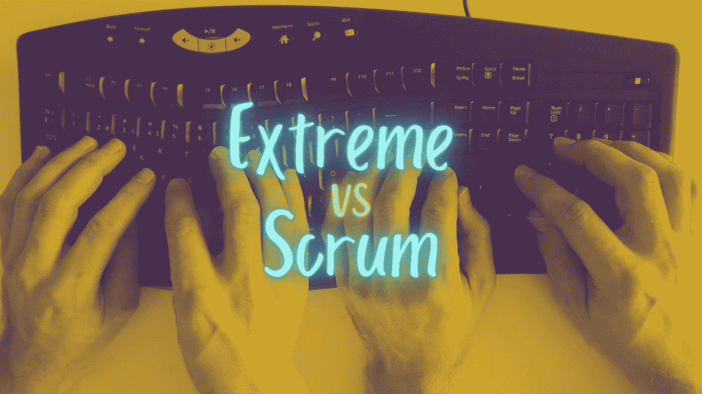

# Scrum 和极限编程的比较

> 原文：<https://betterprogramming.pub/a-comparison-between-scrum-and-extreme-programming-7c3fb7b63df6>

## 根据不同的因素选择合适的软件开发方法

图片由作者提供(使用 Canva 设计)。

阅读和聆听——为了更好的体验

对于项目经理来说，选择软件开发方法可能是最具挑战性的任务之一。软件开发可以采用不同的方法，这取决于您的开发团队和客户的需求。一些流行的开发方法包括敏捷开发、瀑布方法、精益开发等。

敏捷开发是现代软件开发中普遍采用的方法之一。许多组织和软件开发团队选择敏捷方法，因为它在软件开发过程中提供了比其他方法更多的好处。例如，它降低软件开发风险，确保客户满意，提供适应变化的能力，等等。

敏捷开发由不同的方法组成，开发团队可以根据他们的需求选择不同的方法。其中一些是极限编程、Scrum 和特性驱动开发。采用敏捷开发的组织努力确保他们选择了最好的敏捷开发方法。

有几家公司承担着开发大型项目的任务，比如建立一个电子商务网站，就是这种情况。如果你不确定是选择极限编程还是 Scrum 方法论，那么这个指南将帮助你决定什么最适合你。

# 极限编程

极限编程更关注正在开发的软件的技术方面。该方法强调快速反馈，由此要求参与软件开发的团队理解所提供的反馈并提供即时响应。

像所有其他敏捷方法一样，极限编程以增量方式开发软件。这意味着在最终软件发布之前，会对软件进行一些小的修改。

极限编程拥抱变化。

实施客户提供的变更建议。最重要的是，极限编程确保了最终产品的高质量。

高质量软件的开发是通过极限编程对各种价值观的支持来实现的，包括*沟通*、*简单*和*尊重*。其他必不可少的极限编程价值观是勇气和反馈。

沟通意味着参与软件开发的每个人都参与到软件开发的所有阶段。

对尊重的支持意味着开发团队的所有成员客观地工作以实现一个共同的目标，而勇气意味着软件开发人员应该评估他们的工作而不找借口，并且能够响应请求。

如前所述，快速反馈在极限编程中至关重要。快速反馈确保客户能够提供反馈并实施任何必要的变更。

极限编程在处理高风险项目时适合*。例如，当从事一个有严格期限的项目*时，*极限编程可以帮助避免项目风险。另外，方法论*适合小团队*。使用极限编程有很多好处:*

*   它确保了开发团队和客户之间的密切联系。
*   客户的变化可以在短时间内完成，开发过程确保开发出高质量的产品。
*   持续的测试确保最终的软件是稳定的。
*   极限编程中避免不必要的编程。

然而，尽管有许多好处，极限编程也有一些缺点:

*   极限编程的一个主要缺点是相对昂贵。
*   此外，版本管理是强制性的。
*   为了实现一个成功的项目，必须在开发团队成员中展示自律。

# 混乱

Scrum 方法论是敏捷的，它主要关注软件开发的项目管理方面。该方法最适合于更复杂且需求变化迅速的项目。

像其他敏捷方法一样，Scrum 在迭代中开发软件。迭代开发意味着，当确定最终产品的外观具有挑战性时，该方法允许频繁地将变更合并到软件产品中。在迭代中开发软件减少了开发可用产品所需的时间。

敏捷方法支持由*产品负责人*、*软件开发人员*、*和 scrum 主管*组成的项目团队。

*   产品负责人的目的是提供必须首先实现的需求。
*   scrum master 的角色是按照必要的 scrum 原则和实践来促进软件产品的开发。如果在开发过程中遇到任何问题，scrum master 负责解决。
*   开发者的角色是显而易见的。他们编写实际的软件代码并记录下来。

此外，Scrum 软件开发方法支持软件开发的三个阶段:

*   第一阶段涉及待开发系统的规划和架构设计。
*   第二阶段涉及系统的实际开发。
*   第三阶段是项目收尾。

Scrum 根据价值区分项目任务的优先级。

这意味着首先实现最重要的需求，其余的在软件开发生命周期的后期实现。产品评审在每个 sprint 结束时进行，以确定项目进度，并在进入下一个 sprint 之前进行必要的修改。

Scrum 方法的主要优势是它支持更快的项目开发。有了 Scrum，时间、金钱和资源得到了有效的利用。这种方法将大项目分解成易于管理的小项目。Scrum 开发的主要挑战是这种方法不要求项目在确定的期限内完成。因此，可能会发生范围蔓延。

此外，当团队成员数量很大时，Scrum 方法可能是无效的。由于 Scrum 开发依赖于单个团队成员的工作，如果所有团队成员都不致力于开发过程，项目可能会失败。

# 结论

Scrum 和极限编程的共同点是它们都遵循大多数敏捷开发原则。例如，两种方法都支持迭代中的软件开发。客户反馈也是软件开发过程的一个重要部分，而交付高质量的软件是开发团队的一个目标。

极限编程和 Scrum 也有不同之处:

*   一个主要的区别是，在 Scrum 中，当软件开发团队正在进行 sprint 时，不允许进行更改。开发过程中确定的任何变更都只能在 sprint 完成后实施。另一方面，极限编程更加灵活。如果客户有任何建议，可以在冲刺阶段实施
    。
*   另一个主要区别是，在 scrum 开发中，所有必要的项目沟通和变更都是由 Scrum 主管传达给开发团队的。同时，极限编程要求客户直接与软件开发团队交流反馈/变更。在大多数情况下，客户在软件开发过程中总是可以提供反馈。
*   此外，在 Scrum 中，开发团队在完成 sprint 任务的顺序上有灵活性。极限编程不支持这种灵活性，开发团队必须按照客户提供的方式来完成任务。
*   最后，Scrum 方法没有强调软件如何实现的技术方面。它更关注生产力和项目本身的管理。这就是为什么 Scrum 定义了在项目实现中应该考虑的角色。另一方面，极限编程遵循实现高质量软件的最佳技术和工程实践。

既然您已经了解了这两种方法的所有细节，那么就由您来决定哪一种最适合您。考虑这些问题:

*   你有一个小团队还是一个大团队？
*   你有严格的截止日期还是灵活的？
*   你的客户是否经常与你联系，或者他们只是给你固定的需求？

一旦你回答了所有这些问题，你需要做什么就很清楚了。

祝你好运，并度过愉快的一天！