# JavaScript 文件上传完整指南

> 原文：<https://betterprogramming.pub/a-complete-guide-of-file-uploading-in-javascript-2c29c61336f5>

## 单个文件，多个文件，拖动，粘贴，你需要知道的一切

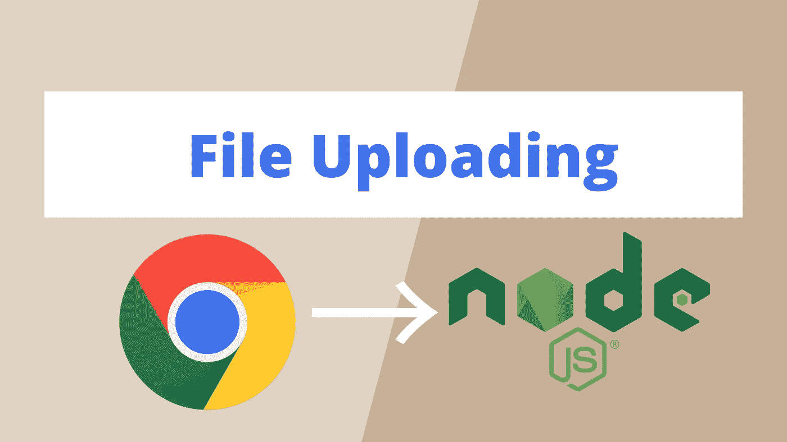

作者图片

文件上传是 web 项目的一个常见功能。相信大家在开发过程中或多或少都遇到过相关的需求。

在这篇文章中，我总结了一些场景和解决方案，希望能帮助你彻底掌握文件上传的相关问题。

# 我们的目标

首先，我们来明确一下文件上传的具体功能。

根据上传目标，有 3 种任务:

*   上传单个文件
*   同时上传多个文件
*   上传整个文件夹

根据用户操作，有:

*   选择要上传的文件
*   将文件拖到框中，然后上传
*   从剪贴板上传

从性能角度来看，我们可能需要:

*   压缩文件后上传
*   将大文件分成块，然后上传

另外，有时我们可能不会在客户端浏览器上传文件，而是通过服务器上传到另一个服务器。

我们将依次讨论这些。

# 先决条件

在开始编码之前，我们还是需要了解一些背景知识。

首先，上传文件时，我们使用最流行的 HTTP 库 [Axios](https://github.com/axios/axios) 。在实际开发中，我们一般不会直接使用 XMLHttpRequest，使用 Axios 符合真正的开发模式。

我们在前端讨论上传文件的时候，要想完全理解相关的原理，就必须了解相关的后端代码。这里我们使用 [Koa](https://github.com/koajs/koa) 来实现我们的服务器。

最后，希望大家对 [formdata](https://developer.mozilla.org/en-US/docs/Web/API/FormData) 有一个简单的了解，我们用这种数据格式上传文件。

# 上传单个文件

上传文件的需求太普遍了。比如注册 Medium，需要上传头像。

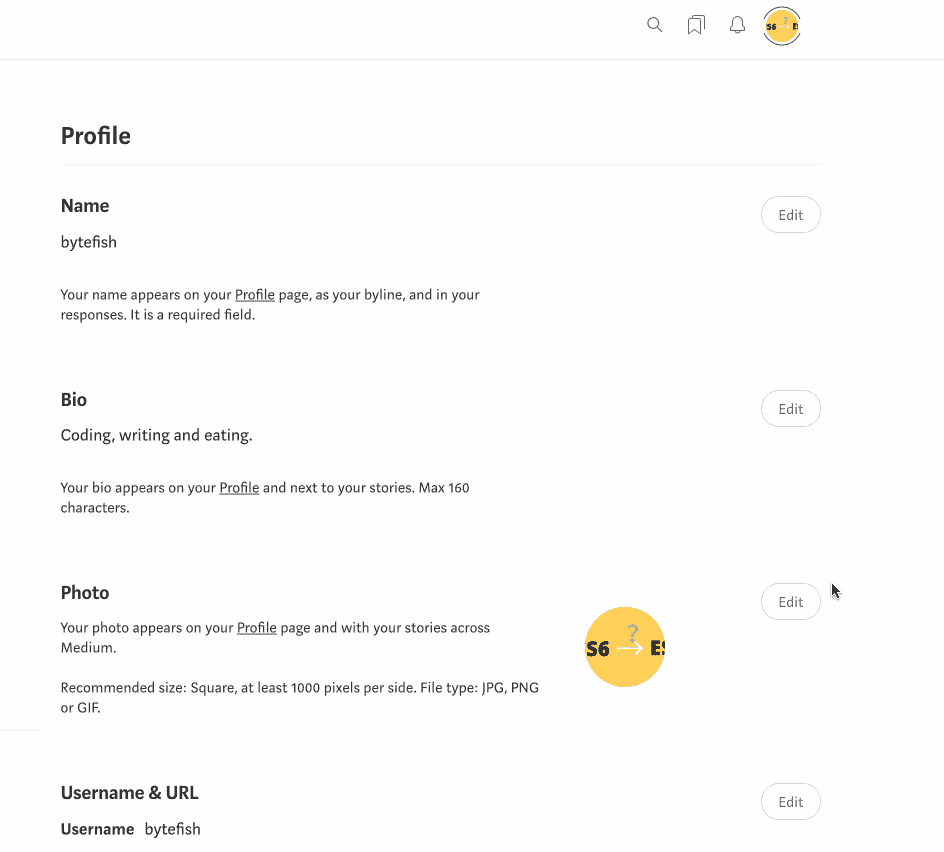

文件上传功能需要客户端和服务器之间的合作。在我们的项目中，用户在客户端选择一个文件，上传到服务器；服务器保存文件并返回它的 URL。

以下是项目预览:

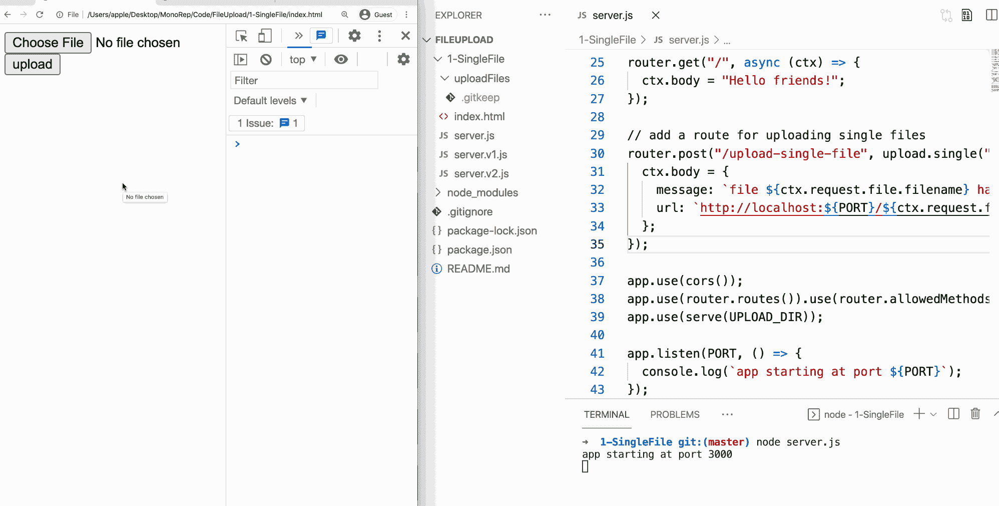

上面的 Gif 展示了文件上传的完整过程:

*   用户在浏览器中选择文件
*   用户点击上传按钮
*   上传的文件放在服务器的`uploadFiles`文件夹中
*   然后服务器返回一个 URL，这是上传文件的地址
*   用户可以通过此 URL 访问资源

## 代码

这个项目的所有代码都保存在 GitHub 上:

[](https://github.com/BytefishMedium/FileUploading) [## GitHub-BytefishMedium/file 上传

### 此时您不能执行该操作。您已使用另一个标签页或窗口登录。您已在另一个选项卡中注销，或者…

github.com](https://github.com/BytefishMedium/FileUploading) 

您可以将其克隆到您的计算机上:

```
# clone it
$ git clone [git@github.com](mailto:git@github.com):BytefishMedium/FileUploading.git# and install npm package
$ cd FileUloading
$ npm install
```

所有与单个文件上传相关的代码都放在`1-SingleFile`文件夹中。

*   `client.html`与客户端代码相关。
*   `server.js`与服务器端代码相关

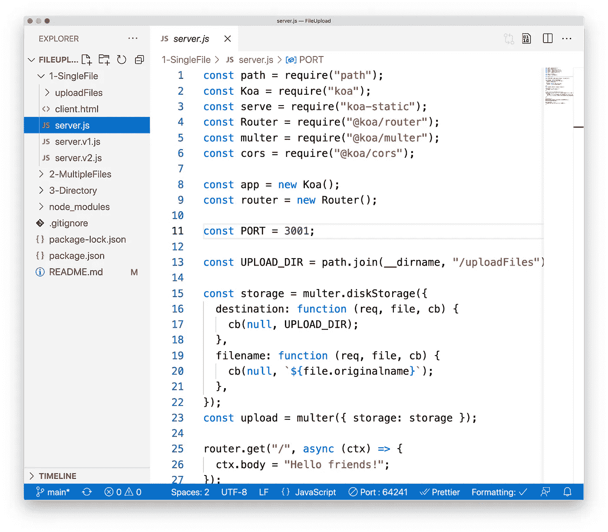

要运行服务器，您可以转到该文件夹并运行以下命令:

```
$ node server.js
```

然后就可以在任何浏览器上打开`client.html`了。

具体操作我已经在上面的 gif 里展示过了。你可以先自己试试，然后再往下读。

## 客户端代码

嗯，把长颈鹿放进冰箱需要几个步骤？

只需三步:

*   开门
*   把长颈鹿放进去
*   把门关上。

上传文件也是一样，我们只需要三个步骤:

*   让用户选择要上传的文件
*   阅读这个文件
*   使用 Axios 上传文件

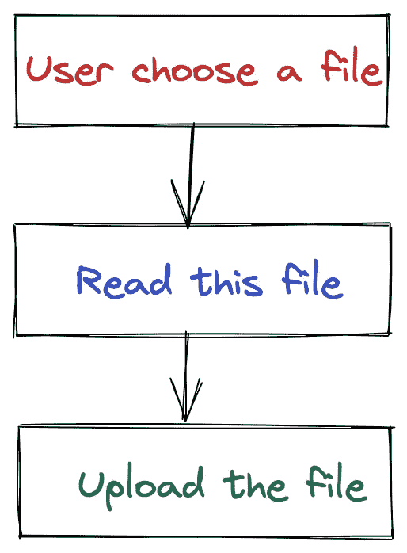

在 HTML 中，我们可以使用`input`元素。只要将该元素的类型设置为`file`，就可以使用该元素来选择文件。

```
<input id="fileInput" type="file"/>
```


用户选择一个文件后，该文件的元数据将存储在这个 input 元素的`files`属性中。

```
const uploadFileEle = document.getElementById("fileInput")console.log(uploadFileEle.files[0]);
```

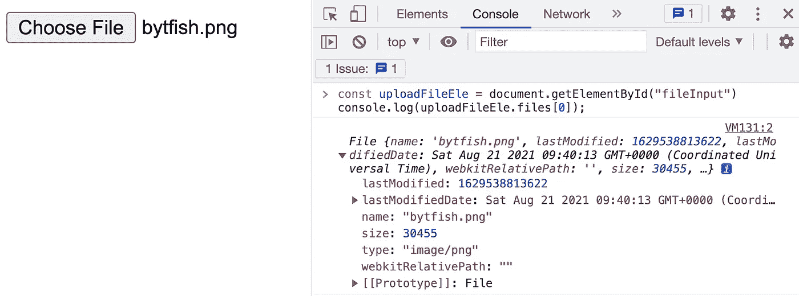

最后，我们使用 Axios 的 post 方法来上传文件。但是在上传文件之前，我们还需要将这个文件打包成 FormData 格式。

```
let file = fileElement.files[0];
let formData = new FormData();
formData.set('file', file);axios.post("[http://localhost:3001/upload-single-file](http://localhost:3000/upload-single-file)", formData)
  .then(res => {
  console.log(res)
})
```

提示:FormData 是一种键值类型的数据格式。这里有一个例子:


好了，以上是文件上传相关的知识点。更完整的代码如下:

这段代码实际上是要实现我们之前说的三个步骤:

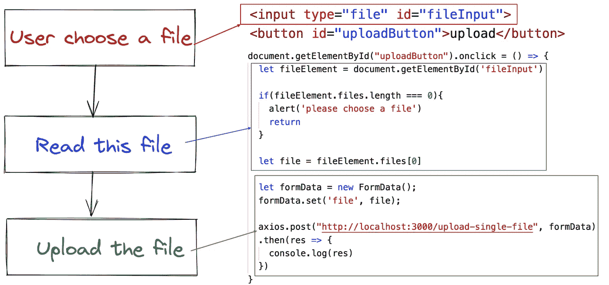

只是我们增加了两个额外的功能:

*   一个是上传按钮。当用户点击上传按钮时，我们开始执行上传逻辑。
*   那么我们就多了一个判断，确保用户真的选择了一个文件。

然后，当 Axios 上传文件时，它允许我们监控文件上传的进度。

我们知道 HTTP 是建立在 TCP 之上的。如果一个 HTTP 数据包相对较大，它可以被分解成多个不同的 TCP 数据包，以便在网络中传输。

如果您需要编写一个进度条来向用户显示上传的进度，您可以使用这个 API。

```
axios.post("[http://localhost:3001/upload-single-file](http://localhost:3000/upload-single-file)", formData, {
  onUploadProgress: (progressEvent) => {
    const percentCompleted = Math.round(
      (progressEvent.loaded * 100) / progressEvent.total
    );
    console.log(`upload process: ${percentCompleted}%`);
  },
});
```

`progressEvent.loaded`表示上传成功的字节数，`progressEvent.total`表示文件的总字节数。

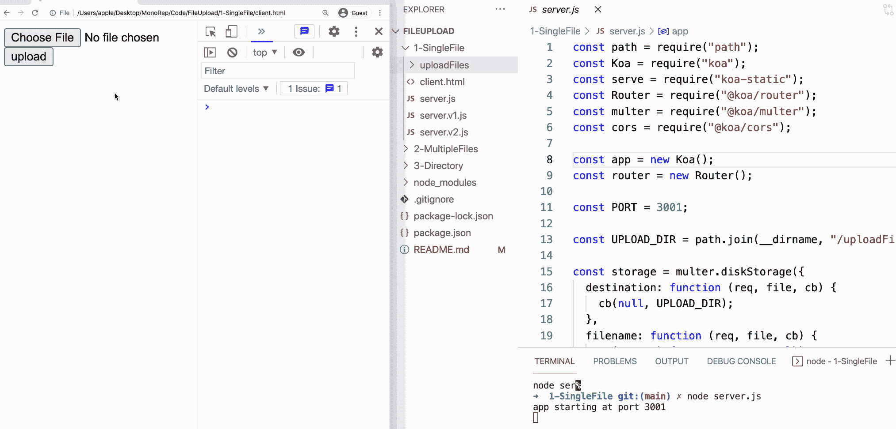

好了，这是我们的客户端代码。

## 服务器端代码

要启动服务器，我们可以使用 Koa。这是一个使用 Koa 的小型服务器:

这是最基本的 Koa 演示。由于这篇文章的重点是文件上传，所以我不会详细解释这一点。如果你不熟悉这个，你可以阅读官方文档。

*   [Koa](https://github.com/koajs/koa)
*   [Koa 路由器](https://github.com/koajs/router)

我们的客户端使用 FormData 的格式上传文件，然后我们的服务器也需要解析 FormData。Koa-multer 是一个帮助我们解析表单数据的中间件:

关于 Koa-multer，你可以阅读他们的官方文档:

*   [Koa-multer](https://github.com/koajs/multer)
*   [乘子](https://github.com/expressjs/multer)

关键代码是`uoload.single('file')`，这行代码可以帮助我们解析 FormData 的数据，然后把相应的信息放到`ctx.request.file`中。

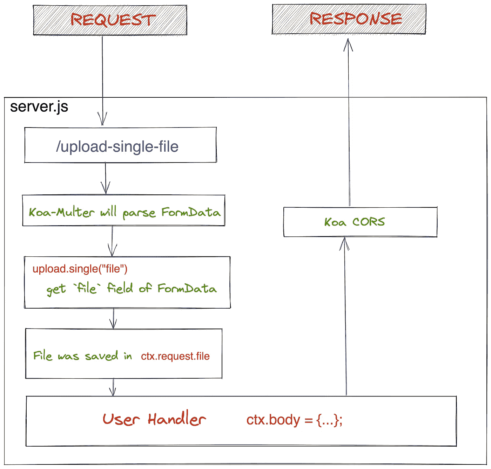

其实这个时候我们的服务器已经可以接收到客户端上传的文件了，但是它接收到文件后并没有存储到磁盘。

如果我们希望 Koa-multer 将文件保存到磁盘，我们可以添加以下配置:

```
const storage = multer.diskStorage({
  destination: function (req, file, cb) {
    cb(null, UPLOAD_DIR);
  },
  filename: function (req, file, cb) {
    cb(null, `${file.originalname}`);
  },
});
const upload = multer({ storage: storage });
```

完整的代码是`server.js`，可以直接在代码库中阅读。


当前的流程图如下所示:

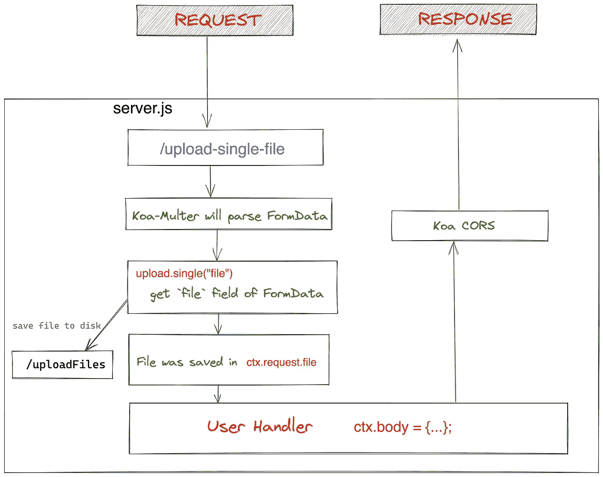

不管怎样，你应该自己尝试一下。

# 上传多个文件

有了以上基础，我们写上传多个文件的代码就简单多了。

首先，我们需要修改`input`元素，并为其添加`multiple`属性。

```
<input type="file" id="fileInput" multiple>
```

这是为了告诉浏览器，现在这个`input`元素应该允许用户同时选择多个文件。

然后用户选择多个文件后，数据会放在`fileElement.files`中。当我们构造`formdata`时，我们需要遍历这个列表并将所有文件放入`formdata`。

```
let files = Array.from(fileElement.files);let formData = new FormData();
files.forEach((file) => {
  formData.append("file", file);
});
```

然后上传文件的代码不需要修改。

以下是完整的代码:


该文件位于项目中的`2-MultipleFiles/client.html`上。

同时，我们还需要调整服务器端的代码。

首先，我们需要添加相应的路由`/upload-multiple-files`
，然后使用`upload.fields([{ name: “file” }])`中间件来处理多个文件。之后，`request`中的 FormData 数据将被放入`ctx.files.file`中。

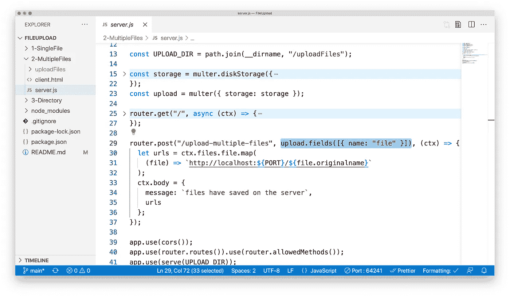

演示:

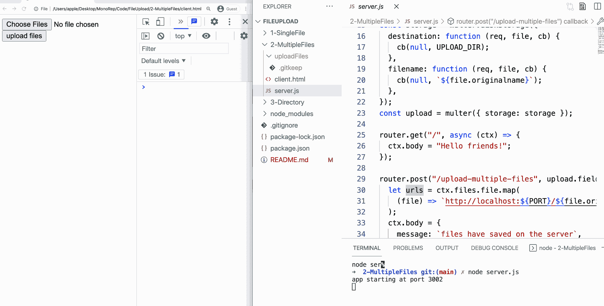

# 上传目录

现在我们来看看上传目录的步骤。

与之前类似，我们需要将`input`元素的属性设置为:

```
<input type="file" id="fileInput" webkitdirectory>
```

然后当上传目录时，input 元素的`files`对象将具有`webkitRlativePath`属性，我们也将它们添加到 formdata 中

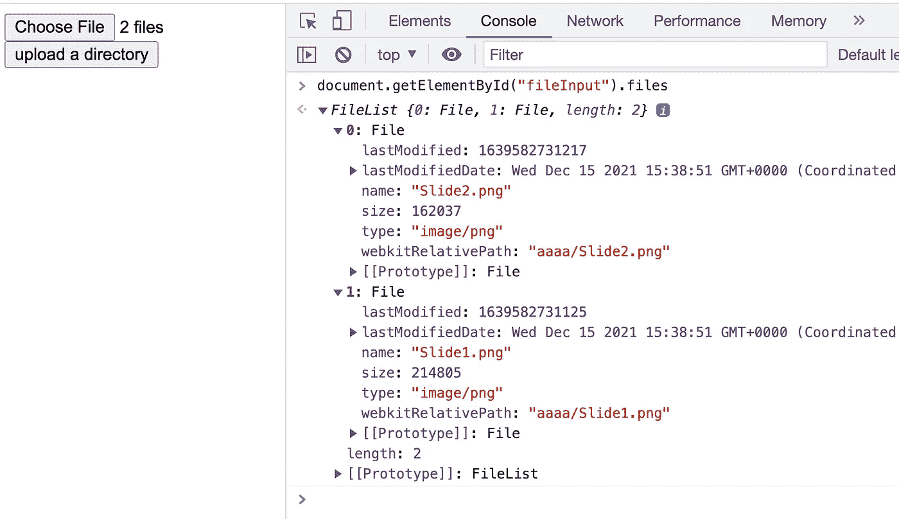

这里需要注意的是，当文件名包含`\`时，koa-multer 可能会出错。为了解决这个问题，我们需要用`@`符号替换`\`。

```
formData.append('file', file, file.webkitRelativePath.replace(/\//g, "@"));
```


然后我们还需要修改相应的服务器代码:

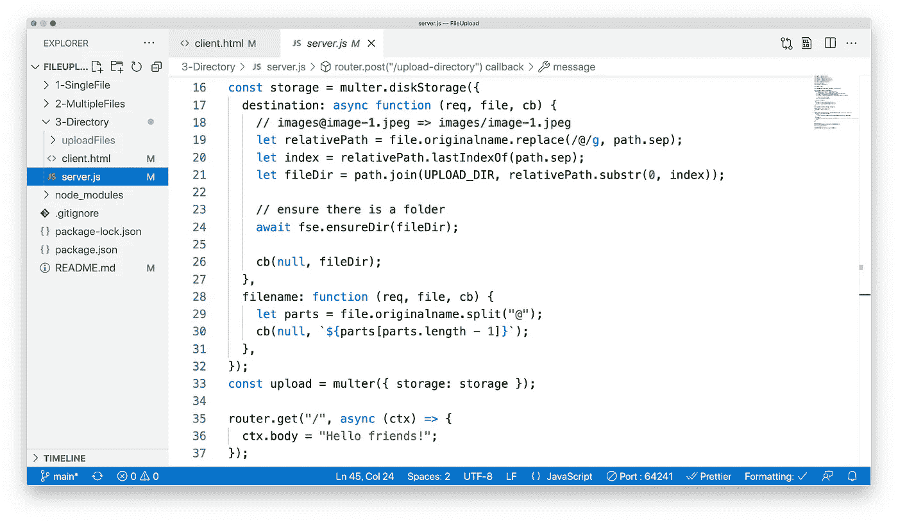

演示:

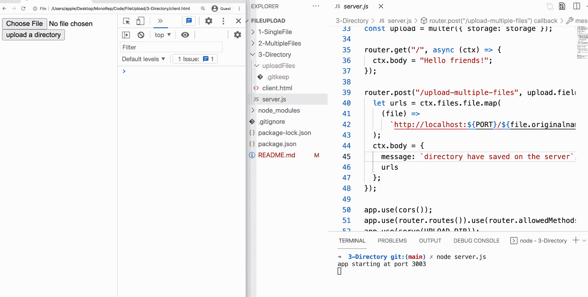

# 结论

我们已经依次分析了上传单个文件、多个文件和目录的过程。其实很简单，只要 3 个步骤:

*   使用`input`元素让用户选择一个文件
*   读取文件并构造表单数据
*   使用 Axios 上传表单数据

所有代码都在 GitHub 上，你可以自己试试。有问题可以留言评论。

由于文章的长度，上传文件的其余部分将包含在后面的文章中。如果你对这个内容感兴趣，可以关注我。

感谢阅读。