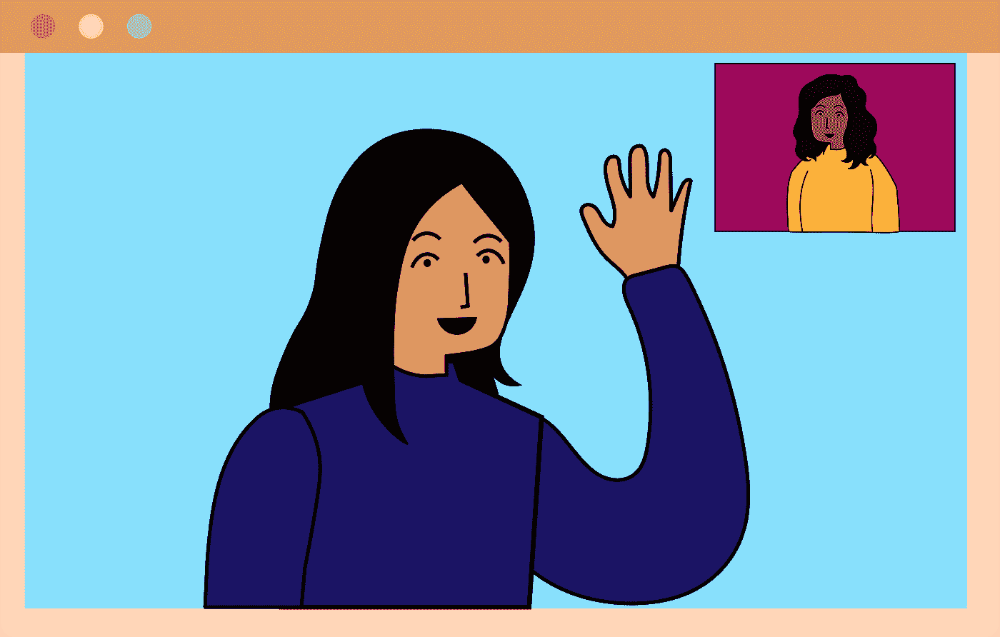
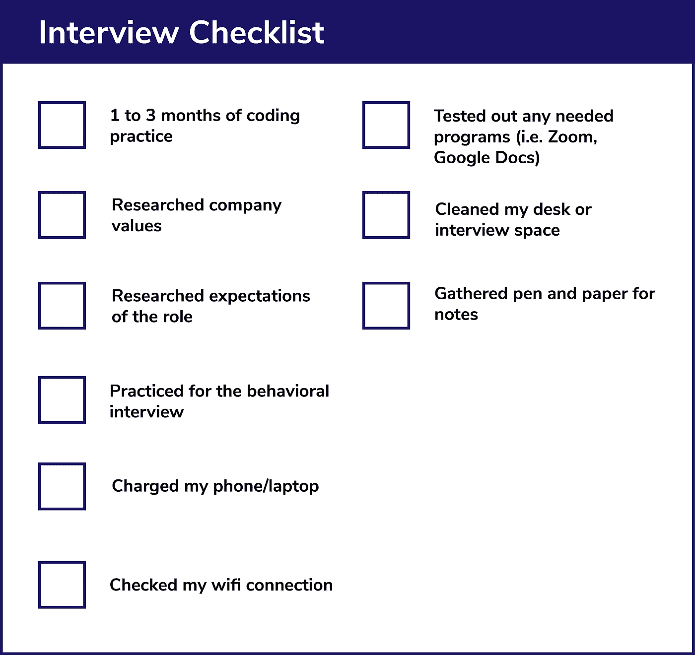

# 程序员视频面试综合指南

> 原文：<https://betterprogramming.pub/a-comprehensive-guide-to-video-interviews-for-programmers-ed92961f57c1>

## 即使不在同一个房间面试，如何得到这份工作

佩吉·科迪在 [Unsplash](https://unsplash.com/s/photos/home-office?utm_source=unsplash&utm_medium=referral&utm_content=creditCopyText) 上拍摄的照片

如今，虚拟面试已成为常态。在这个社会距离的时代，大多数大公司依靠视频和电话面试来招聘。这意味着行为和编码面试都将虚拟地进行。随着我们适应这种新的规范，人们预测面试将不再一样。虚拟面试可能会成为标准。

以下是我们今天要讲的内容:

*   [第一部分:虚拟面试常见问题解答](https://www.educative.io/blog#part-one)
*   [第二部分:远程编码面试流程](https://www.educative.io/blog#part-two)
*   [第三部分:资源](https://www.educative.io/blog#part-three)

# 第 1 部分:虚拟面试常见问题

视频和虚拟面试不同于面对面的面试。虽然问的问题基本相同，但我们说话、介绍自己和练习面试的方式需要不同的方法。以下是关于虚拟面试最常被问到的问题，以及一些可行的面试技巧。

## 什么是虚拟面试？

虚拟面试是任何一种不面对面的面试。它可以是在线评估、电话或使用网络摄像头的视频聊天。虚拟面试通常用于面试过程的早期阶段，进行初步筛选和评估，而且它们越来越受大公司的欢迎，因为它们节省时间，简化面试过程。

电话和视频面试需要不同的焦点。进行视频聊天时，通常会使用 Google Hangouts、Zoom 或 Skype 等程序。这些面试更类似于面对面的面试，因为面试官能看到你，不仅能对你的话语做出反应，还能对你的衣着和肢体语言做出反应。

另一方面，电话面试可能会消除一些如何控制自己的压力，但也会带来语气上的挑战。既然你不能用肢体语言来表达自己，那么你说话的方式和语气对接受者来说就很重要。有些虚拟面试需要其他工具或程序，你可能会被要求用 GoogleDocs、CodePen 或 CoderPad 等工具进行编码。

## 你如何介绍自己？

许多人习惯于面对面的介绍，并对开始电话或视频面试的最佳方式感到困惑。以下是虚拟介绍需要遵循的一些基本原则。一般经验法则:保持简单自然。

对于电话面试，听从面试官的暗示。当你接电话时，专业地介绍你自己，比如说*“你好，(插入姓名)我是”*或者*“下午好，我是(你的姓名)”*。

如果你在给面试官打电话，这种情况不太可能发生，只需等待他们的回应，然后按照社交暗示去做。例如，如果他们用介绍来接电话，用简单的*“谢谢你今天和我谈话，(面试官的名字)。这是(插入姓名)"*或*"我期待着我们的聊天。这是(插入姓名)*。

对于视频面试，遵循面试官的提示。视频面试官可能会先介绍自己，让你回答。其他人可能只是说“你准备好了我就准备好了”，你可以用一个简单的介绍来回应，比如“早上好，谢谢你今天邀请我。我的名字是……”你也可以先检查技术是否正常工作，然后做一个介绍，比如“你好，谢谢你今天的谈话。这是(你的名字)。我的音频在你那边传过来了吗？”

## 视频面试应该使用什么样的设置？

整洁的背景。对于你的视频面试来说，有专业背景是很重要的。既然你的面试官会看到你和你周围的环境，你想留下一个好的第一印象。我建议坐在办公桌前。这将有助于你的姿态，并建立一个专业的基调。确保你身后的空间是干净的，没有任何过于私人或不专业的东西。越简单越好。

最好关闭电脑上任何不必要的标签，以避免分心或不想要的通知。想象一下面试官可以看到你的屏幕。

我建议你在面试的时候带上纸和笔来做笔记。你甚至可以考虑提前写下一些你想在面试中问的话题或问题。你可以把这个放在一边参考。

**良好的体态和肢体语言。视频面试中，身体姿势和语言很重要。良好的坐姿会提升你的声音和自信。避免触摸你的脸，抓挠，或弹跳你的腿。如果你坐得笔直，避免拖拖拉拉，你会显得更专业。在面对面的面试中，你要保持镇定。眼神交流对于视频面试也很重要，因为它传达了参与度。一定要和面试官保持正常的眼神交流。**

准备好你的技术。充分准备好充电设备和正常工作的 WiFi。你不会想在面试过程中手忙脚乱地插上你的笔记本电脑。此外，熟悉你将使用的技术。尝试与朋友进行测试通话，以确保您的摄像头和音频工作正常。提前做好这些准备会缓解你的焦虑，让你专注于面试。

## 视频面试怎么练？

练习视频或电话面试没有对错之分，但准备是关键。准备技术问题是至关重要的，但不要忘记练习简单的说话和回答问题。如果你已经有了通过视频电话回答问题的经验，你会在实际面试中感觉更舒服。下面是一些准备的小技巧。

**记录自己。**在编码面试中，说出你的思维过程很重要，但是你的想法对外人来说真的有意义吗？当我们大声说话时，我们并不总能听到我们实际在说什么。记录你自己是一种倾听你的回答和改进你的回答的简单方法。用手机或笔记本电脑给自己录音，然后回放给自己听，或者甚至让朋友听听外界的观点。

以这种方式准备面试的一个很好的资源是[探索行为面试](https://www.educative.io/courses/grokking-the-behavioral-interview)。该课程提供了一个嵌入式视频小工具，这样你就可以录制答案，并在招聘经理的专业建议旁边回放，以供评估。

把它写在纸上。与打字或说话相比，我们在纸上写东西时使用的是大脑的不同部分。写作需要我们放慢速度，所以使用纸笔是准备技术和行为面试问题的好方法。事实上，许多大的科技公司会用白板来测试你的编码技能，所以用这种方式来准备会更好的测试你。

**研究组织和角色。不是每个组织都需要相同的知识。不是每个角色都需要同样的技能。提前做研究对你的准备是必不可少的。为你的行为面试研究公司价值观，了解他们对技术技能的期望。不要认为自己什么都知道就贸然参加面试。您可以在许多地方进行研究，包括:**

*   工作描述。
*   担任该职位的前任或现任员工(查看 LinkedIn)。
*   [行为和技术准备的编码面试](https://www.educative.io/codinginterview.com)。
*   新闻文章。
*   社交媒体平台(如推特、脸书)。
*   公司网站。

如果你对研究公司价值观和招聘流程感兴趣，看看这篇关于准备行为面试的文章**。**

## *我应该跟进吗？*

*面试后跟进通常是个好主意。它传达了兴趣，同时增加了个人风格。跟进的一个简单方法是写一封感谢邮件。简单地表达你的感激之情，明确你对这个职位的兴趣，委婉地询问时间表。例如:*

> **“感谢您抽出时间与我谈论 ______ 这个角色。很高兴见到这个团队，并对这个职位有了更多的了解。**
> 
> *我对这个机会感到非常兴奋，因为我对 _____ 特别有经验。经过我们的交谈，我相信我符合贵公司对这一角色的愿景。*
> 
> *如果您有任何其他问题，请联系我。我期待收到你的来信。”*

**要想获得更强有力的撰写跟进邮件的指南，请看一下* [*Indeed 的职业指南*](https://www.indeed.com/career-advice/interviewing/follow-up-email-examples-after-interview) *。**

## *我能从电话面试中得到什么？*

*对于软件开发职位来说，电话面试很常见。大多数大公司需要一个初步筛选电话。这些电话通常持续 30-60 分钟，通常通过电子邮件或 LinkedIn 建立。期待与招聘经理、人才合作伙伴或招聘人员交谈。*

*在电话中，你会被问到与编码相关的问题和资质问题，以衡量你是否适合这家公司。你也将有机会问自己的问题。这些筛选基本上是看你是否有足够的技能去进行更强有力的面试。*

*对这些放映的期望很大程度上取决于公司。我们将在第 2 部分详细讨论电话面试。如果你现在想了解更多，请查看 [CodingInterview](https://www.educative.io/codinginterview.com) ，它将带你了解许多科技公司的电话筛选流程。*

**

# *第二部分:远程编码面试流程*

*编码面试是出了名的具有挑战性，所以知道前面有什么很重要。在过去，编码面试通常是面对面进行的，但是现在，在全球疫情期间，面试已经变得很遥远了。虽然测试的技能通常是一样的，但是要求你展示这些技能的方式已经改变了。让我们走一遍远程编码面试的流程，让你熟悉大测试公司使用的新流程。*

*请记住，这只是一般的过程。每个公司都有自己独特的编码和行为面试流程。*

## *第一步:在线评估*

*一些公司以在线评估开始他们的面试过程。例如，Adobe 提供在线技术评估来衡量你的能力和编码技能。你可以看看他们的提问[这里](https://www.codinginterview.com/adobe-interview-questions)。*

*在大多数在线评估中，你会被问到 40-70 个问题，并有一个合适的时间窗口来完成(正常情况下大约 2 小时)。你可以在[编码面试](https://www.educative.io/codinginterview.com)上查看哪些公司需要在线评估。*

*要成功完成在线评估，您应该根据将要询问的问题进行充分的研究。别忘了他们会问行为问题，所以你也需要为这些动脑筋。*

*你需要一个可靠的工作空间，强大的互联网连接，以及解决问题的纸张。我也建议留出比你需要的更多的时间。确保你不会有任何分心或干扰。*

## *第二步:电话筛选*

*电话筛选和面试在科技面试中很常见。这是他们衡量你作为潜在雇员的兴趣、技能水平和价值的地方。你必须提前做研究，了解不同的组织对电话筛选的期望。*

*例如，Google 要求使用 Google Hangouts 进行此呼叫，并且您需要在 Google Docs 中进行编码。如果你想了解更多，请阅读本文。谷歌面试主要集中在技术评估上。以下是[在谷歌手机筛选面试中](https://www.codinginterview.com/google-interview-questions)被问到的 15 个问题。*

*另一方面，亚马逊的手机屏幕要轻得多，但同样重要。这次面试评估你的兴趣水平和价值观。他们想知道你的工作经历、期望薪资以及合作意愿。问题不太可能涵盖技术主题。*

*脸书想了解你的价值观和技能。虽然这通电话通常只持续 20 分钟，但这是你展示自己技能和对公司热情的方式。因为你不会真的编码，你不需要过度准备，但是一定要温习基本的技术知识。你还需要了解脸书的公司价值观，这是他们在电话筛选中寻找的。*

## *第三步:技术电话面试*

*在电话筛选之后，你可以期待一个技术性的电话面试。这些采访深入探究你的编码技能。您可能会使用在线协作编辑器，如 CoderPad 或 CodePen。在这个阶段，面试官最感兴趣的是*你如何*处理技术问题，所以问题会比较模糊。*

*根据公司和职位的不同，你可能会遇到一到五个问题。大多数技术面试涉及数据结构、时间复杂性和算法。*

*在疫情期间采访过的一些开发人员注意到，问题的种类和形式更加多样化。面试目前将焦点转向其他技术问题，比如调试代码和实现类。*

*通常，公司网站会澄清他们对技术电话面试的期望，但由于目前情况不确定，做一些额外的研究可能是个好主意。*

**注意:一些公司，比如谷歌，不需要电话技术面试，因为他们的预先筛选过程相当广泛。**

## *第四步:远程“现场”面试*

*通常，电话面试后的下一个阶段是现场面试。每家公司都有自己独特的现场面试流程，通常都相当冗长，平均一天要和不同的团队进行三到五次面试。目前，由于社交距离的做法，这些面试无法举行，所以公司不得不适应举行远程“现场”面试的新方式。*

*如果你转向虚拟现场面试，你通常可以期待一个与现场面试相似的风格。他们将有可能通过像变焦 VC 软件进行。你无法像面对面面试一样使用“白板”程序，所以你的一些工作可能会感觉不太流畅。*

*你需要现场回答面试官的技术问题，并讨论你的思维过程。你的面试官会听你如何处理问题，问什么问题。*

*就你的技术技能而言，像准备面对面面试一样准备这些面试。你可以查看《编码面试》的[三个月面试路线图](https://www.codinginterview.com/interview-roadmap)，了解如何为编码面试学习。*

*然而，同样重要的是要知道，虚拟面试可能是非常费力的。一些开发人员报告说，你需要额外的努力来进行虚拟交流，所以这些面试需要更多的关注和耐心。练习使用 VC 软件可能会让你更自信，或者你可以要求把面试分成两天。*

*请记住，虚拟现场面试对我们所有人来说都是新的。面试官也在适应这种评估你技能的新方式，所以你甚至可以就此建立联系。利用新环境对你有利，并对这个过程有耐心！*

# *第 3 部分:资源*

*准备编码和行为面试需要做很多事情。既然面试完全是远程的，你的准备工作就有了一个全新的层面。你需要练习行为问题，熟悉面试程序和平台。*

*我们已经收集了你充分准备面试所需的所有资源。*

**

## *技术技能准备*

*   *[编码面试](https://www.codinginterview.com/):免费获取详细的面试路线图、公司组织的常见编码问题等。*
*   *[寻找编码面试](https://www.educative.io/courses/grokking-the-coding-interview):编码面试综合指南，使用 16 种模式来编码问题和回答棘手问题的策略*
*   *[为编码面试做准备的 5 个可靠的技巧](https://www.educative.io/blog/5-tried-and-true-techniques-to-prepare-for-a-coding-interview):这篇文章根据业界的真实经验，带你了解最可靠的面试准备策略。*
*   *[leet code](https://leetcode.com/):1500 多个面试准备的技术问题。*
*   *Pramp :通过现场模拟面试练习面试*
*   *[CareerCup](https://www.careercup.com/) :演示候选人如何回答技术问题的无脚本视频。*

## *行为面试准备*

*   *[探索行为面试](https://www.educative.io/courses/grokking-the-behavioral-interview):这一综合课程提供了行为面试的内部技巧、对行为问题的深入探究，以及用于实践的嵌入式视频工具。*
*   *[如何准备和应对行为面试问题](https://www.educative.io/blog/behavioral-interviews-how-to-prepare-and-ace-interview-questions):这篇文章深入探讨了行为面试的来龙去脉。这是开始熟悉流程的好地方。*
*   *Glassdoor 行为面试指南:各行业招聘经理的问题和建议列表*

## *视频面试准备*

*   *[应对视频面试指南](https://biginterview.com/video-interview/):应对视频面试的技巧、窍门和有用的策略*
*   *[商业内幕视频面试指南](https://www.businessinsider.com/how-to-do-a-video-job-interview-2016-3):商业专家如何在视频面试中脱颖而出的八大技巧*
*   *来自 Indeed 的视频面试指南:简单而有效的视频面试技巧，以及对不同类型视频面试的深入探究*