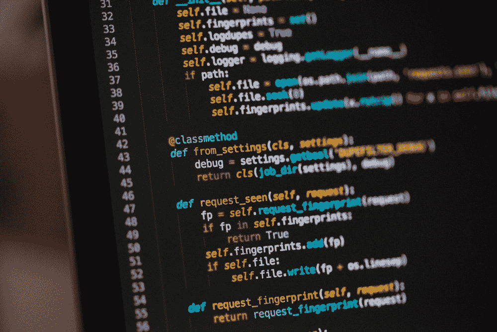
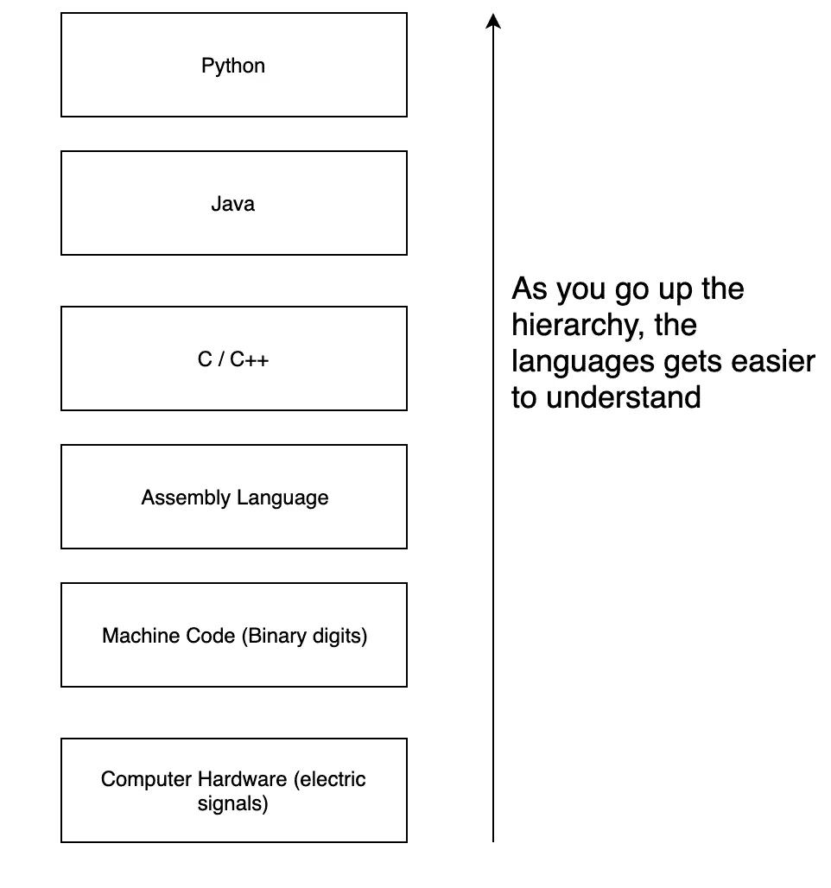
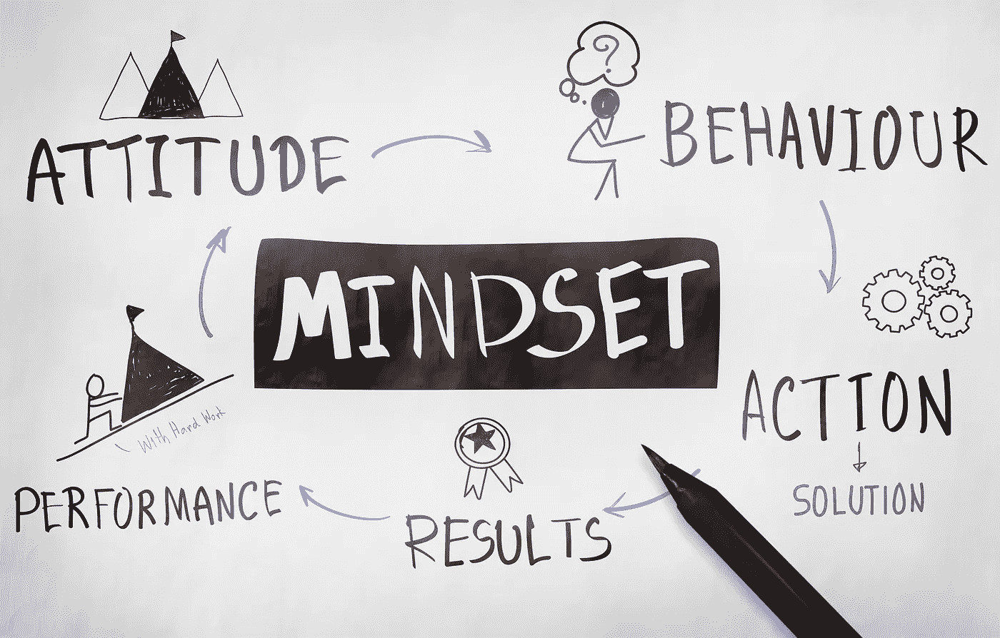
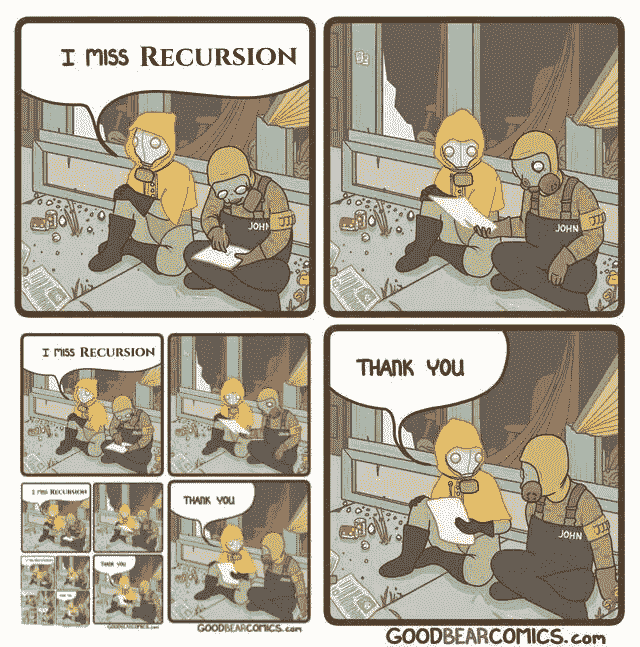
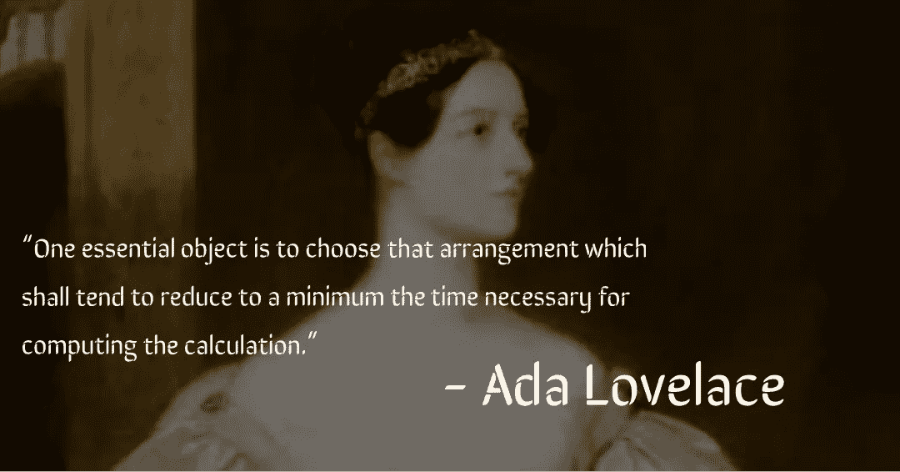
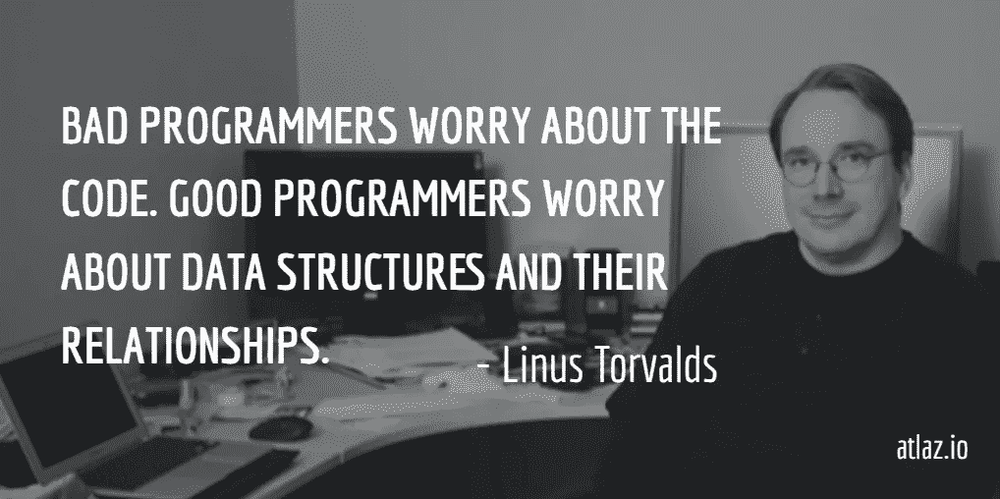
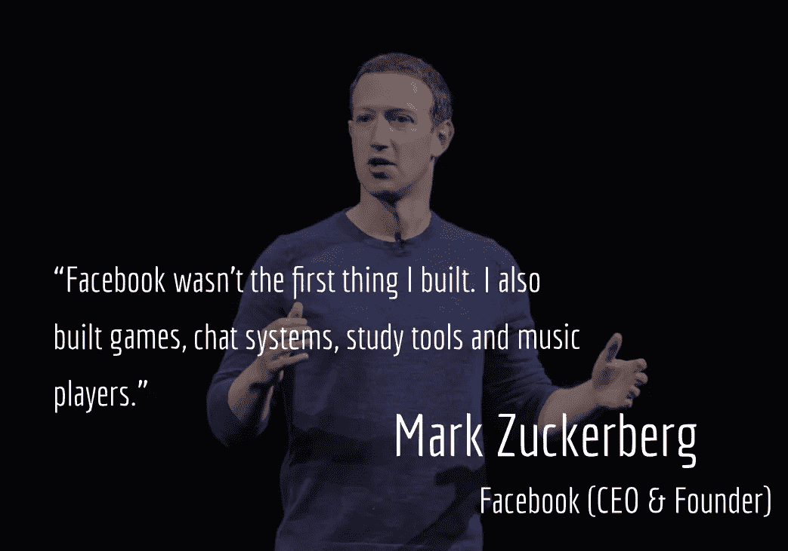

# 成为自学程序员的综合指南

> 原文：<https://betterprogramming.pub/a-comprehensive-walkthrough-to-becoming-a-self-taught-programmer-and-computer-scientist-part-i-288541b19940>

## 第一部分

正如我在[上一篇文章](https://medium.com/@AdityaPatange/learning-to-program-is-a-great-way-to-improve-yourself-and-grow-your-career-heres-why-5cc8276453fa)中承诺的，我在这里是为了开启你成为高技能、受欢迎的程序员的旅程。我还会帮助你取得职业成功，增强你现有的技能，赚钱——不管你来自哪个学科。

我是有计划的人。

**这个指南是为每个人准备的**，只要你能阅读英语并知道基本的中学数学，你就可以开始了。所以请坐好，喝杯咖啡，集中注意力！

本指南的每一部分都是为你精心策划的——我亲自浏览了我在这里推荐的每一个资源。内容、资源和建议的逻辑顺序已经放在一起，唯一的动机是在尽可能短的时间内使你成为一名熟练的程序员，而不影响质量。

# 如何使用本指南

您最有可能属于以下五类中的一类:

## 1.你已经知道编码，并想成为一名更好的软件开发人员。

太好了，在这种情况下，你已经掌握了基本知识，必须努力开发一种构建软件的整体思维方式。请特别注意第一部分和第二部分，因为它们会填补你现有知识的空白。

## 2.你在一个 [STEM](https://en.wikipedia.org/wiki/Science,_technology,_engineering,_and_mathematics) 领域，却不太懂编程。

你的分析能力已经高于平均水平，所以除了阅读材料，不要在第一部分花太多时间。特别注意第二部分和第三部分，因为你需要专注于编写代码。

> 不要加入那些看到人工智能、机器学习、区块链等流行词汇而不了解基本面就直接跳到这些技术的人的行列。那是愚蠢的，因为，过了一点，你就会不知所措，放弃或者全学错了。

## 3.你来自非 [STEM](https://en.wikipedia.org/wiki/Science,_technology,_engineering,_and_mathematics) 领域，想学习编码。

就你的情况而言，最初的障碍是训练你的思维更具逻辑性和分析性。把你的大部分时间花在第一部分上。挑战是把你现有的思维框架转移到一个全新的领域。这种转变需要时间，不能操之过急，所以要有耐心，坚持到底。一旦发生这种情况，你将处于一种有益的精神状态，以投入更多的时间和精力来加快你在后期阶段的进展。你可能比 STEM 同行进步更快，因为你的[发散思维技能](https://www.teachthought.com/critical-thinking/3-modes-of-thought-divergent-convergent-thinking/)更先进，这让你在想出解决方案时天生更有创造力和直觉。

## 4.你要去国外深造。

显然，这是将从本指南中受益最大的部分。在这篇文章中，我将教你如何将*方法*融入你的工作方式中，这样你就能高效地完成工作。随后，你的目标将是通过忘记你在印度教育系统中成功所遵循的实践来重新构建你的学习方法。

你将在国外面临的竞争是残酷的，尤其是在美国，你的同龄人已经比你领先了。在你去那里之前，先把场地平整一下。使用本指南中的知识来构建一些有趣的项目，撰写研究文章，成为一名全面发展的专业人士。

如果你想进入学术界，读一读我在第一部分推荐的书，上一些我在第三部分推荐的课程。为了创造新知识，你需要尽可能直观地理解已有的知识。如果你正在国外寻找工作机会，本指南仍将帮助你发展行业技能，抓住呈现在你面前的最佳机会。请记住，有些人在国外的好大学完成了硕士学位，但仍然没有找到工作，因为他们仍然被传统的思维方式所束缚，或者缺乏适应那里快节奏环境的相关技能。

## 5.你是一名工程专业的学生，依靠印度的教育体系为你进入现实世界做准备。

老实说，我讨厌这样做，但我有必要在这里打破你的幻想。印度的教育体系并不是为了让你为这个行业做好准备。如果你不能给雇主带来价值，那么获得电子工程/生物工程技术学位对雇主来说毫无意义。

> 有成千上万的工程师，他们花了整整 4 年时间，除了“提高他们的指针(C.G.P.A)”什么也没做，仍然没有得到他们选择的工作，或者更糟的是，仍然失业，因为他们从来不认为建立行业相关技能足够重要。
> 
> 突然，当他们大学的安置季节开始时，他们意识到他们需要改变他们有缺陷的假设，这就像一辆卡车撞上了他们。到了那个时候，再去适应几乎为时已晚。被安置的紧张感变成了一场噩梦。如果你是这些人中的一员，醒来吧，因为你还有很多时间。你足够聪明，可以取得好成绩，所以你绝对足够聪明，可以掌握相关技能，让自己变得有价值。

不管怎样，你都没什么好担心的，因为你在正确的地方。我修改了这个课程，这样你就可以让自己重回正轨，获得必要的技能。

# 这份指南与网上成吨的文章有什么不同？

这里的信息融合了近八年的编程经验、来自一些优秀书籍的智慧、来自世界一流大学的在线课程以及令人敬畏的编程社区。我自己走过这条路，在互联网上筛选所有相互矛盾的信息，走进死胡同，反复原路返回。通过遵循这个指南，你不仅会节省宝贵的时间，而且会更加享受整个过程。本课程旨在为您简化整个过程。

你们中的很多人会问为什么我在标题中加入了计算机科学(CS)。编程和计算机科学有什么关系呢？让我一劳永逸地结束这场讨论。了解计算机科学会让你成为更好的程序员——简单明了。即使没有 CS，你也可能成为一名优秀的程序员，但是你所能做的受到严重限制，因为 CS 为你提供了一个强大的工具箱来解决问题。如果你不这么想，很可能你会继续碰壁，浪费时间——就像我刚开始做的那样。

要成为一名熟练的程序员，按照本指南和提供的资源努力工作六个月到一年，你的努力将会得到回报。

说够了，让我们开始吧！

# 真实交易:成为一名合格程序员的逐步路线图

我将整个指南分为四个部分来描绘整个路径。在进入下一部分之前，花一些时间在每一部分上是很重要的，因为你的技能是建立在彼此之上的。这不是什么“21 天学会编程”的指南。你必须付出努力和时间。我只是来指导你的。定期重温这篇文章来更新你的知识，不要迷失了大方向，所以把它收藏起来。你没有固定的时间可以花在某个特定的部分，所以在你进步的时候，你可以自由地来回移动。正如我之前说过的，你所学的每一项技能都是建立在彼此的基础上的。

## 到底什么是计算机编程？

(如果你已经是一名程序员，你可以跳过这一步)

用一句话来说，编程是一门通过给计算机精确的指令来完成任务的科学。

这就是 Python 代码的样子。您将在第一部分学习 Python。

计算机比人类强大得多，因为它们可以在几毫秒内处理数十亿条指令，同时存储大量数据进行处理。人类无法做到这一点。在你需要将两个 5 位数相乘的时间里，计算机会将数十亿个更大的数相乘，并且 100%准确。

所以现在，关键问题是:你如何利用这种计算能力？很简单，你给计算机输入如何将两个数相乘的指令，它就会为你做。假设你想把两个数相乘，这是你如何指示计算机去做的。

要将 2 个数相乘，你明确告诉计算机:
第一步:取一个数 A.
第二步:取一个数 B.
第三步:设 C 为 A 和 b 的乘积
第四步:向用户显示 C 的值。

我们计算机科学家称之为算法。这只是解决问题的一系列步骤。现在不要强调术语。

## 编程语言

作为人类，我们不能用 0 和 1 来陈述整个步骤序列，这就是为什么我们使用编程语言。

它是机器级别描述和简单英语之间的桥梁。如图所示，高级语言更容易理解，而低级语言，如汇编语言，有时会变得晦涩难懂。你可以用自己选择的编程语言编写代码。在幕后，这些代码被转换(简单地说)成较低级别的描述，以便计算机可以在底层硬件上运行这些指令。

也就是说，让我们从第一部分开始。

**对于每一部分，我都提供了一个资源文档的链接，所以不要忘记查看一下！**

# 第一部分:培养程序员的思维方式

正确的心态是创造积极的反馈循环。**乔丹·彼得森**在他的书**《生活的 12 条法则》中详细谈到了这一点。**

第一步也是最重要的一步是开始像程序员一样思考。如果你来自我以前的帖子，这是你学习用算法思考的部分。这一部分的动机是训练你的大脑进行逻辑思考。如果你来自其他学科或者你的分析能力很弱，花点时间在这一部分的材料上会帮助你以新的眼光看待问题，并使你更好地将它们分解成更小的问题。

大多数初学编程的人在开始编程时，并没有意识到他们认知能力的微妙变化。明确地致力于这一点并意识到这一点是有利的，因为你学会了*解构问题的艺术*而不用考虑技术细节。用英语明确陈述你的推理，概括步骤，形成解决进一步问题的模式。

如果你有一些编码经验，你会对这种情况很熟悉。想想你曾经看到一个问题并想到“哦，这很简单，我可以使用嵌套循环”或“我可以使用数组来解决这个问题”，但后来却发现你走错了方向。发生这种情况是因为您过早地进入技术细节，而没有正确地描述您的问题。

记住这一点，第一步是用不同的方法来研究数学。

## 1.重新学习/重温基础数学

在学校和大学里，为了在数学方面出类拔萃，我们被教导插入数字和记忆方程，而没有任何公式背后的更深层次的直觉。当你想写程序时，这不是很有帮助。了解在解决数学问题时为什么要应用某个步骤。理解这个步骤是做什么的，以及它如何将问题转化为一个更简单的问题。对于你遇到的每一个问题，有意识地思考你可以用一套你已经知道的基本“工具”来解决问题的方法。通过练习和识别重复的模式，知道使用哪些工具以及如何使用它们。

这里有一个非常简单的例子来说明这一点:假设问题是将 2 乘以 10 次。我们知道这表示为 2 ⁰.一个新的 T4 工具 T5 或者叫做指数运算的操作符被用来简化这个问题。现在，您可以应用适用于指数的所有属性。通过改变问题的表现形式和使用正确的工具，你给了自己更多的力量。

如果你已经擅长数学，你可以避免在这里浪费时间，直接跳到学习离散数学的基础。方法保持不变。如果没有，就在这里做些繁重的工作，在第三部分练习离散数学。

**查看参考资料部分，了解您可以参考的资源的详细描述。**

## 2.学习 Python

我推荐学习 Python，因为它很简单，类似于用英语编写伪代码或语句。这种语言确实要求你在表达解决方案时指定许多技术细节。让自己熟悉足够的编程概念，以便将问题的数学定义转化为其等价的编程。

重点学习实现变量、整数、浮点运算、循环、条件、字符串、列表、字典和函数。我推荐的课程会完美的教会你这些概念。你所需要做的就是练习。

**注:**我之所以现阶段不推荐 C 或 C++是因为语言会惩罚你对技术规范了解不够。有时候，简单的 C++错误可能会非常大，让人不知所措——这对初学者来说真的很可怕。

## 3.使用谷歌搜索的艺术

这可能看起来很滑稽，但作为一名优秀的软件开发人员，知道如何编写有效的搜索查询是一部分。你面临的问题已经被别人解决了。大多数时候，你不需要重新发明轮子。你需要学会做的就是查找已经解决的类似问题，检查它们的解决方案，并用它们来解决你自己的问题。

## 4.大量阅读。

每天花 30 分钟阅读我在本节末尾的资源文档中指定的内容。仔细阅读每一部分，写笔记，与你的朋友讨论你学到的观点，并深入思考。当你阅读时，过滤掉重要的东西，抛弃不重要的东西。如果你有不明白的地方，可以看看 YouTube 上的视频或者在网上阅读。我试着以一种你不会遇到太多不相关信息的方式来组织内容，但不管怎样，这种情况还是会发生。

## 5.转移到 UNIX 系统(可选)

现在，这可能对许多使用 Windows 工作的人不利，因为 Windows 很容易使用。如果你想成为一名软件开发人员，我强烈建议你转向 Linux 或 Mac。就我个人而言，转向 Linux 把我推到了一个不舒服的地带，我不再害怕打破东西。如果你在工作中需要 Windows，建立一个虚拟机或双引导，并在此基础上进行开发。我把这个留给你，因为这纯粹是个人选择。

## 摘要

在这个阶段，我希望你们通过深入思考自己的问题来完成高质量的工作。你必须能够表达和集思广益，想出一个解决方案背后的思维过程。这不仅提高了你的分析能力，也让你成为一个更好的沟通者。在这个阶段，如果您写代码很慢或者很难表达解决方案的编程等价物，这没什么。重要的是你分解一个问题，使用一套工具来解决它，提出一个解决方案，并进行交流的能力。

## [第一部分资源](https://www.evernote.com/l/AiyEMUeeBdhP6p6Dxw7rIWPPNbra-h2xy7Q)

# 第二部分:像程序员一样思考、计划和执行

既然你已经知道了如何解决问题，如何推理解决方案，如何流畅地交流你的想法，是时候像程序员一样把这些技巧付诸实践了。

**唐纳德·克努特:**毫无疑问，他是这个领域有史以来最伟大的计算机科学家之一。

在这一部分，你需要学习三件事。首先，你将学习作为第二语言的 C++，与 Python 相比，它更接近于机器级别的描述。Python 更接近普通英语的范围，而 C++更接近 0 和 1 的范围。学习 C++会让你熟悉更多像指针这样的编程构造。其次，您将通过强化练习、阅读文档和进一步调整调试技能来提高编码速度。最后，你将学习递归，这是程序员和计算机科学家用来驾驭计算能力的*魔法*。

## 1.学习 C++并开始编写简单的程序

在前一部分你已经学习了 Python。Python 是一种程序员友好的语言，因为它对程序员隐藏了许多低级的细节以便于使用。但是，如果你想进步，学习 C++编程的基础知识是绝对必要的。

关注点:用 C++写代码会让你感觉更像程序员，因为你更倾向于机器级别的描述。了解语法和语义的区别。花时间学习静态和动态类型、内存管理和指针。学习在 C++中重新实现条件、循环、函数、数据类型和你在 Python 中学到的东西。如果这一切看起来像希腊语和拉丁语，不要担心。参考资料部分会让你明白一切。

**处理错误:**无论什么时候遇到错误，都不要气馁。即使是最有经验的程序员，他们的程序中也会有错误和缺陷。你所要做的就是阅读错误，做一个快速的谷歌搜索，并修复你的代码中的问题。当你这样做的时候，了解你在哪里犯了错误，纠正你的理解并继续。有时你可能需要阅读一些文档。检查下一部分。

## 2.阅读文档应该是你的第二天性

就像谷歌搜索一样，程序员的技能取决于他对文档的理解程度和编写有用程序的能力。当你学习阅读文档时，你也将学习注释你的代码，编写可读的代码，并为你编写的代码编写文档。

**为什么要学这个？**许多人在学习新技术时遇到困难，并寻找现成的课程来学习。虽然在最初阶段这很好，但随着你知识的加深，你不会找到现成的教程来填鸭式地学习。你将不得不通读文档并找到你需要的东西。再次强调，学会过滤信息，并准确提取完成工作所需的信息。

## 3.练习。重复一遍。练习。

现在你只需要继续练习。前往 [Hackerran](https://www.hackerrank.com/) k，在那里解决热身和实现部分的所有简单问题。如果有你不能解决的问题，阅读讨论，阅读社论，看看你如何自己解决它。如果有不明白的地方，用谷歌。

如果你做了前一部分的阅读，你应该不会有问题。如果你还在纠结，我建议你回去重温那些章节。你必须变得擅长写代码，所以不要跳过这一部分。这个想法是要流利地将你的简单英语解决方案表达成它们的编程等价物。一旦你不再被语言细节所困扰，你就可以继续了。把你用 Python 写的所有程序都用 C++写出来。

你可能会遇到关于竞争性编程的炒作，我建议你在这个阶段远离它，因为它弊大于利。一旦你完成了第三部分，你就可以尝试它，如果做得好，它可以极大地提高你解决问题的能力。

## 4.很好地理解递归

这将帮助你更好地理解递归。哈哈。

计算机科学家的核心在于理解递归的能力。递归的意思是用事物本身来表达。使用循环可以做的一切都可以递归地以非常优雅的方式完成。尝试直观地理解这一点，并观看我在参考资料中提供的视频。如果你是一个不太懂递归的软件开发人员，我建议你马上去做。

## 摘要

到目前为止，你已经了解了低级和高级语言，并且能够充分体会到你对程序的“控制”的不同。到目前为止，您应该能够使用 Python 和 C++编写简单的程序，并理解这两种语言之间的差异。

从这里开始，许多人陷入了学习更多语言的窠臼，这本身只是一种无用的练习。初学者问我的一个最常见的问题是“你会几种语言？”这让我意识到，当初学者将编程能力与了解更多语言联系起来时，他们通常会被误导。编程不是要懂很多语言。你使用的语言只是你有效表达和解决问题的一种方式。在这个阶段，你是一个“程序员”，但这还不够。你现在需要学习计算机科学，让你的技能更上一层楼。

## [第二部分资源](https://www.evernote.com/l/AizOpIHf1kJPmIPy1VOM33YInoimkpDNk1s)

# 第三部分:你与计算机科学的幽会

对这一阶段资源的扎实理解，会让你比同龄人中的大多数程序员更优秀。在印度，你甚至可能比大多数二/三年级的工科学生更优秀。你的进步取决于你对这部分内容的渴望。所以集中注意力。

补充一些我的哲学观点，钻研计算机科学就像打开潘多拉的盒子。

本节中的大多数主题都包含在大学计算机工程课程的第二年中。为了最大限度地满足本指南的目标，我对它们的处理方式有所不同。

**这与常规的本科课程有什么不同？普通本科课程充满了理论。我在参考资料部分推荐的课程很好地结合了理论和实践。虽然这对有抱负的工程师来说可能是件好事，但对外行人来说，用处不大。你会忘记理论的终点和实践的起点。我会准确地指出你需要从理论上学习什么，这样你就可以直接开始实践了。理论只是一个帮助你在这个阶段写出更好代码的工具，所以不要被它陷得太深。**

有趣的事实:在我工程专业的第二学期，我们有一门课叫做 DBMS(数据库管理系统)。我惊讶地发现，有些人会为他们的数据库设计画出最好的 [ER 图](https://en.wikipedia.org/wiki/Entity%E2%80%93relationship_model)，但是当涉及到为实际应用程序实际设计数据库时，他们会惨败。他们太专注于获得正确的图表细节，以至于忘记了他们最初这样做的原因。我不怪他们，因为他们从来没有被教导过，图表是用来建立更好的数据库的，而不是提高他们的素描技能。

## 1.离散数学

你已经在不知不觉中使用离散数学了。离散数学是计算机科学中重复使用的应用数学领域的结合。该领域的专家们决定把它整合在一起，并给它命名——我们现在称之为离散数学。

别担心，女孩们，她写了第一个程序

当学习离散数学时，遵循我在第一部分中概述的相同原则。从数学结构和用于操作它们的过程的角度来思考。离散数学只是增加了你处理问题的工具数量。如果你已经克服了对数学的恐惧，你将会非常喜欢我在参考资料部分链接的课程。

## 2.数据结构和算法

这是你整个旅程的支柱。事实上，你一直都在使用数据结构和算法——又是在不知不觉中。现在我们将它形式化，并更详细地研究它。

**Linus Torvalds** 构建了 Linux 内核——没有它，Android 就不会有今天

作为一个有经验的程序员，你会在任何地方使用数据结构和算法。充分理解它将扩展你的数学技能和工具，以构建有效的计算结构来解决常见问题。你还将学习不同的算法设计技术，这些技术就像是解决计算机科学中一些主题的蓝图。

很多教程会告诉你直接开始学习算法和数据结构。我没有这样做的原因是因为你会陷入[的情绪状态](https://www.exaptive.com/blog/einstellung-effect)，这是一种固定的心态和解决问题的方法。相信我，那会削弱你的思维，因为你不会跳出框框思考。到最后，你会成为一个伟大的问题解决者和程序员。

## 3.最佳实践

编写软件不仅仅是随意地将代码组合在一起以完成任务。在大多数专业环境中，你不会是唯一一个在代码库上工作的程序员。对你来说，遵循一定的指导方针和约定来使团队中的每个人更容易地编写代码库是很重要的。这使得理解别人写的代码变得更容易，从而也使得别人理解你的代码变得更容易。如果你是一个初级的软件开发人员，请关注这一部分。

你能做什么？花时间理解并实践 DRY(不要重复自己)原则。不要写重复的代码，因为这会降低你的速度，让你更容易出错。尽可能写一些有用的注释和文档。当我开始的时候，我认为这是一件愚蠢的事情，直到有一天，我打开一个旧项目，意识到我所有的代码都是无法理解的。作为一名程序员，你不需要记住太多。你记住什么是重要的，查找什么是需要的。

## 4.版本控制

这是我很早就开始做的事情，它极大地帮助了代码的组织。您跟踪您的变更，并且确切地知道您需要什么变更来实现某些特性。您还将学习如何快速预防和修复错误。我看到很多年轻的工程师甚至不知道 Git 是什么，这是非常可悲的。他们的整个职业生涯都将使用版本控制——如果你是他们中的一员，请直接访问下面的资源。

## 5.面向对象编程

介绍一种全新的编程方式。到目前为止，我们一直在做程序化编程。现在我们转向面向对象编程，这是一种全新的模式。对数据封装和抽象的介绍将进一步帮助您理解本指南的设计方式。在 OOP 中，一切都是一个*对象*，其思想是清晰地分离你的接口和实现。你也会学到类和继承。最后，你将开始设计面向对象的解决方案，并学习如何构建聪明的*黑盒*来解决问题。学习 Java 是开始使用这种新编程范式的好方法。Python 也支持 OOP，所以尝试探索一下吧！

## 6.努力练习

通过编写代码片段来练习本节中的每一项技能/概念/算法。用你获得的新知识重写旧代码。坚持写小程序，每个阶段都从中学习新的东西。

**李小龙:**那个超人类的人类。R.I.P 传奇

不断学习，不断进步。我用许多不同的方式构建了计算器、图书馆管理系统、数值计算脚本，每一次，我都学到了不同的东西。你最终会意识到没有什么灵丹妙药可以解决所有问题。生活充满了取舍。这就是不完美的美。

## 摘要

你所知道的足以构建改变游戏规则的软件。你必须把到这里为止的一切都内化，才能进入下一步。从这里开始，更多的理论对你没有任何好处。你应该只投资时间在实践和建立有用的项目上。编程是一门应用科学— [遵循 80/20 法则](https://betterexplained.com/articles/understanding-the-pareto-principle-the-8020-rule/)，这意味着花 80%的时间练习，20%的时间阅读理论。

## [第三部分资源](https://www.evernote.com/l/AiwMbWape4BMF6lnhDumgLslMgtDvffqzBo)

# 第四部分:是时候让你做一些很酷的东西了

如果你已经遵循了这个指南，那么你就已经准备好继续做一些伟大的项目，你可以把它们放在你的简历上，向你的朋友炫耀，甚至从你的工作中获得收入。在这个阶段，我想教你如何在的过程中*学习东西。你接手或被分配的每一个新项目都需要学习新的东西。重要的是你要以正确的态度对待这件事。*

我一直受到**马克·扎克伯格**的启发，因为他对消除失败的永恒态度

无论你何时着手任何项目，都有一些指导方针可以遵循。我为自己开发了这个标题，并意识到它对你们从事新项目的人来说会很方便。

1.  确定你正在解决的问题，并详细说明细节。明确你的目标和目的。
2.  查找现有的或类似的项目，找出它们的优势和不足。看看你的想法在哪里，项目如何与你心目中的目标和目的保持一致，并记下每一件事。
3.  列出做项目需要学习的所有技能，以及完成项目需要发展技能的程度。了解自己的优势和劣势。
4.  创建一个学习必要技能的计划。确定合适的人来帮助你和必要的教程开始。专注于开发完成项目的技能。很容易被带入深入。记住，你是在学习完成项目的技巧，而不是就此写博士论文。除非那是你的目标。
5.  开始这个项目，更新你的目标和目的，非常清楚你的优势和劣势。将项目分解成可行的子任务，并为每个子任务分配一个客观性指标。这意味着你需要知道什么时候停止追求完美，专注于大局。
6.  不耐烦地执行。重复，直到你所有的目标都实现了。

阅读这篇文章，了解如何成为更好的学习者的技巧和诀窍。

鉴于你现有的知识，你可以学习建立网站，移动应用程序，游戏，小脚本，Chrome 插件，桌面应用程序和数据分析软件。我会在下一篇文章中提供更多的信息。一旦你有了一些完成的项目，你将会成为一个足够好的自由职业者，并且可以兼职赚钱，如果你是学生，这是一个很大的收入来源。如果你来自另一个领域，这会给你一个足够坚实的基础，使你能够用技术来增强你目前的工作。以你目前的技能，你可以做的事情是无穷无尽的，甚至一整篇博文都无法做到。

理想情况下，我很乐意把我的项目开源给你们学习。然而，此时此刻，我正处在一个十字路口，决定我要将哪些项目转化为成熟的产品/企业。事实是，随着你不断学习更多，你可以用过去的项目做什么的可能性也是无穷无尽的。

## [第四部分资源](https://www.evernote.com/l/AiyFNI9SqyFPZYxAeHTRlDcmuqsxS6vx4h8)

# 结论

在花了相当多的时间阅读本指南中的材料后，你将会学到足够的知识，知道如何继续下去。有了从这里学到的知识，你的基础就足够强大，可以利用技术来完成你的任务。如果你已经走了这么远，给自己一点鼓励吧！

我确信你们中的很多人想了解更多关于计算机科学的其他领域。从这里你可以了解核心 CS 领域，如数据库、操作系统、分布式系统、计算机网络和理论 CS。在接下来的一篇文章中，我将详细讨论设计模式、软件架构、深度学习、人工智能、调试技巧、碰壁时该怎么做，以及更多针对新程序员的技巧。

在整个编程过程中要记住的一条经验是保持正确的态度。你会遇到代码问题，遇到似乎无法修复的 bug，处理阻碍项目开发的技术变化，努力获得似乎超出你理解范围的技能等等。你也会遇到很难共事的人。记住，这是生活的一部分。不要气馁。即使是最优秀的人也会走进死胡同。避免分析瘫痪，对你遇到的任何问题采取行动——不断适应直到你成功。

[ran veer Allahbadia(YouTube 上的 BeerBiceps)发布了一个关于拥有“战士心态”的精彩视频](https://www.facebook.com/beerbiceps/videos/200171990881677/)。就我个人而言，这帮助我对生活中的困难保持镇定，培养感恩之心，并在最艰难的情况下保持脚踏实地。

## [第一至第四部分:所有资源](https://www.evernote.com/l/AixA04GX2kRIibxSshACY9KmkWMa7kkY_NA)

# 个人笔记

我第一次学习如何编程是在 14 岁。我这样做是为了好玩，因为我喜欢让计算机做我想做的事情。就像这个国家的许多其他孩子一样，我被卷入了 IIT 和 JEE 的激烈竞争中。当时教育“专家”的普遍共识是“为 JEE 而学，你的人生就定了。”像那个年龄的每个天真的孩子一样，我接受了宣传，放弃了编码。在接下来的六个月里，我逐渐接受了这个国家灌输给我和无数其他孩子的那些废话。我很快退回去，开始专注于做我喜欢的事情，而不是盲目地跟随激烈的竞争。幸运的是，我很幸运有父母全心全意地支持我，尽管我需要努力说服他们。我必须向他们展示我的意图是努力工作，对我的行为负责，粉碎我的目标。我想用自己的方式做事。事实上，我几乎没有为我的第 12 届董事会学习，因为我知道这是多么没有意义。在那个年龄，这是关于相信我的直觉，做我相信的事情。你必须给自己时间去成长，去犯错误，不要害怕将要发生的结果。

我是这样看的:如果我听信了所有灌输给我的宣传，但我失败了，我不能为此责怪任何人。相反，我宁愿按我的方式做事，即使我失败了，在一天结束时，我也肯定知道我的失败是我自己行为的结果——我有意识地采取了行动，并且能够纠正自己。我对自己的行为百分之百负责。有时候，我一整周都在逃课，一周 7 天 24 小时都在努力提高自己的技能——结果却被一些教授弄得内疚不已，他们的初衷是好的，但并没有意识到我付出了多少努力。

听着，如果这个系统能让我得到想要的结果，我肯定会跟着它走，但是它没有，而且在内心深处，每个人都知道。我反复问自己:我是想要平庸还是卓越？这是我几年后想要过的生活吗？从长远来看，这样做会让我快乐吗？我无法逃离这个系统，也无法打败它，因为它太复杂了，我无法做到。处理这件事的唯一方法就是用我的方式解决它。今天，当我回顾并仔细审视当前的情景时，我 100% *不会做*任何不同的事情。

读这篇文章的年轻人:我并没有要求你们完全放弃学业。你必须毕业并获得学位，但要明白，除了文凭，生活中还有更重要的东西。所以花点时间培养他们。