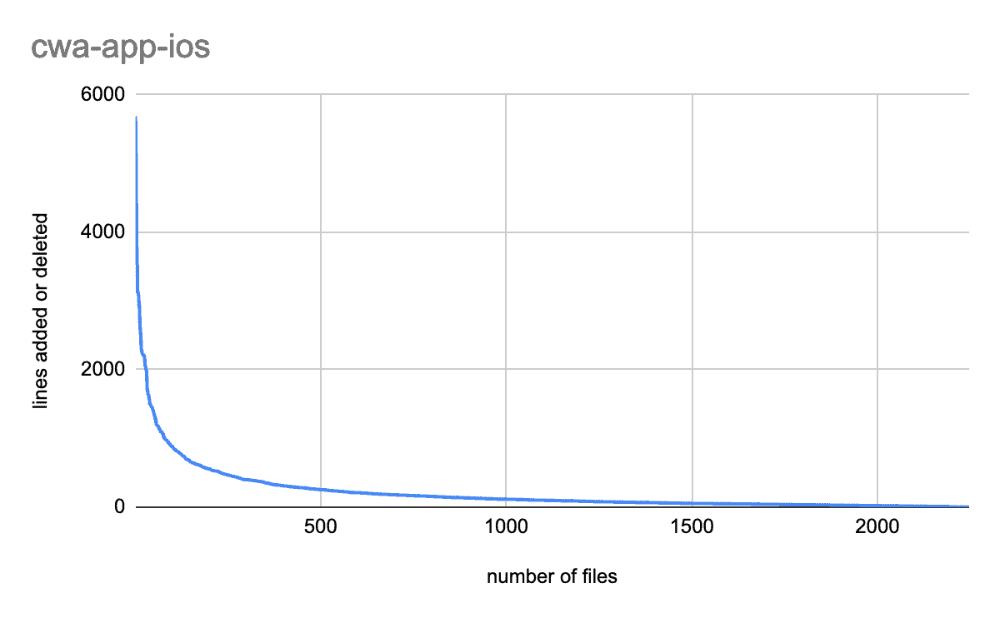
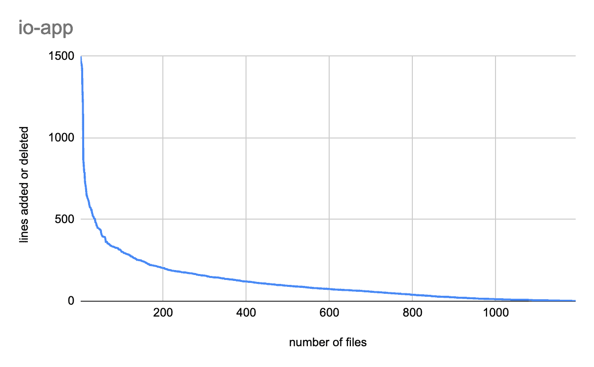
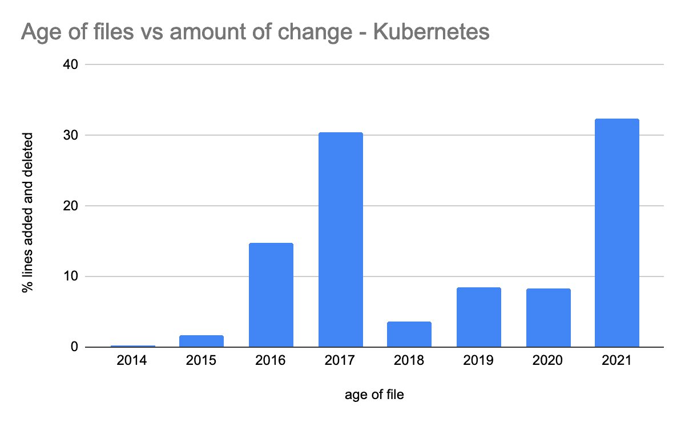
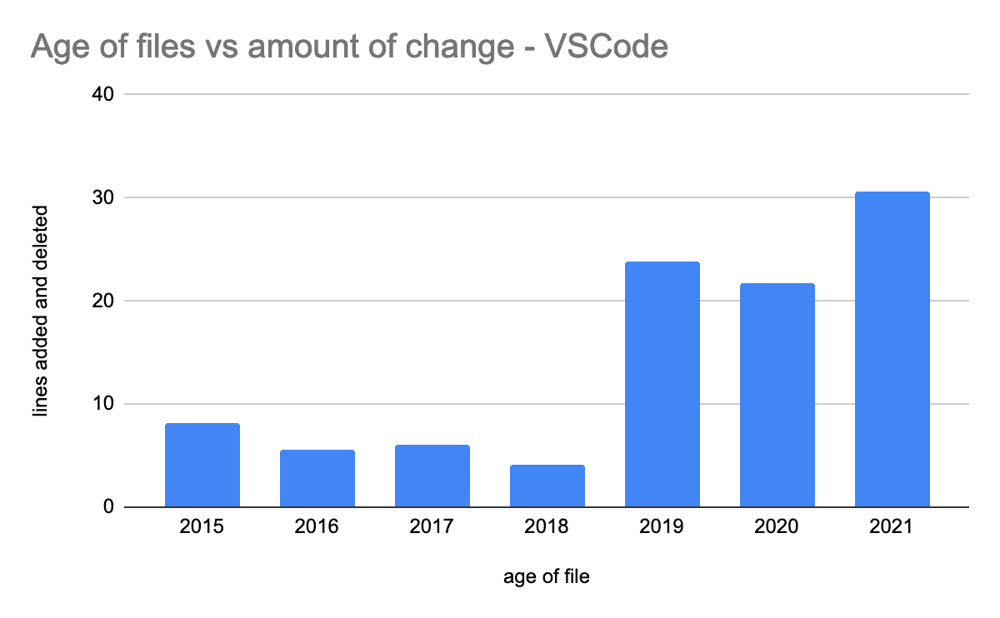

# 提高系统可理解性的数据驱动方法

> 原文：<https://betterprogramming.pub/a-data-driven-approach-to-improve-systems-understandability-d66369f75db>

## 并帮助识别组织和架构挑战

我们都知道软件系统的复杂性通常会随着时间的推移而增长。

它的成长有很多原因。它的成长是因为我们不断增加新的功能。它增长是因为人轮换，不容易保持标准。它的增长是因为我们很少有时间去解决技术债务。

此外，面向分布式系统和微服务的新架构趋势虽然由于许多原因而不可避免，但并没有帮助降低这种复杂性，恰恰相反。

复杂性越大，就越难对我们的系统有一个好的整体印象。没有一个好的大局，决策过程变得更加困难。

如果一个新的 IT 领导上任并希望对他们所处的环境有所了解，他们通常会参考一些信息来源:报告、文档和主题专家(SME)。

报告通常指“运行”部分:可用性、票证、事件。他们讲述了系统运行得有多好，但很少谈到其背后的复杂性。

文档通常不完整，也不是最新的。

中小企业可能对系统有很好的了解，但很多时候这是片面的，局限于整个环境的一些区域。因此，我们需要与许多中小企业交流，希望涵盖所有相关领域。此外，他们的知识也可能因其特定的经验而产生偏差(认知偏差在这些情况下起着重要的作用)。

因此，尽管我们尽了最大努力，但我们所能达到的最好结果往往是拼凑出一些片面和有偏见的知识。正是基于这种可能是片面的，可能是有偏见的观点，我们做出了重要的决定，比如在哪里投资重构或者如何构建团队。

这不是首席信息官和首席技术官的最佳位置。同时，我们是幸运的，因为在现代软件开发中，我们通常会留下大量关于我们做了什么和如何工作的痕迹。像 **Git，Jenkins，**以及在一定程度上，**吉拉**这样的工具不断地记录谁在什么时候做了什么。因此，值得了解的是，是否可以利用这一庞大的数据来源来提取有价值的见解，从而帮助我们做出更明智的决策。

此外，在运行时，我们的系统会在各种日志中注册另外大量的数据。这样的日志可以告诉我们哪些功能是在何时由谁使用的。还是那句话:谁在什么时候做什么，但是从最终用户的角度来看。

IT 领导层应该利用这些丰富的数据来提取有助于驾驭复杂性的见解。提高对我们系统的理解，促进决策过程。这意味着采用数据驱动的方法来治理 IT 组织。

在这篇文章中，我们关注的是我们能从 git 中得到什么，Git 保存的一些数据，以及对它可能进行的一些分析(这里解释的想法是由[亚当·托尼尔](https://www.linkedin.com/in/adam-tornhill-71759b48)的工作引发和影响的，分析是通过 [git-metrics](https://github.com/EnricoPicci/git-metrics) 定制工具进行的)。

同时，Git 只是我们可以利用的可能来源之一。一个“数据驱动的 IT 组织”应该关注其 Git repos 的背后，并找到使用其所有数据源的方法，如詹金斯和吉拉日志以及运行时日志，以提高他们对系统动态的理解，从而提高他们管理系统的有效性。

# 用于测试该方法的应用程序

为了使这个练习尽可能具体，我们决定使用一些开源应用程序作为应用 Git-data 分析的例子。

选择的应用程序是三个 COVID 跟踪应用程序，意大利开发的 **Immuni** ，德国开发的 **CWA** (COVID-warning 应用程序)，以及意大利政府开发的“一站式应用程序” **IO-app** (有关所用回购的更多详细信息，请参见附录 1)。

选择它们的第一个原因是它们是开源的，因此可以免费访问它们的 Git repos。

但是还有第二个原因。我们希望在尽可能类似于常见业务应用程序的环境中实践我们的想法。众所周知的开源项目，如 Linux 或 Docker，本质上是非常技术性的，与公司 IT 部门通常开发的项目有很大不同。另一方面，选择的应用程序(Immuni、CWA、Io-app)是交互式的，以最终用户(碰巧是意大利和德国的公民)为中心，因此本质上更接近于普通的商业应用程序。

# 使用 Git 我们收集到了什么

今天许多团队使用 Git 作为他们的代码版本系统(CVS)。

每当开发人员提交一项工作时，Git 都会保存完成的工作，并使用以下信息更新其提交日志:

*   谁犯了
*   哪些文件发生了更改，更改了多少(添加的行和删除的行)
*   提交发生的时间

可以使用“git log”命令从 git 中提取这样的日志，它将成为我们在分析中使用的主要数据源。

# 这都是关于制定正确的问题

在我们开始看例子之前，最后说一句。这种数据驱动方法背后的整个想法是帮助我们提出正确的问题，并将我们的注意力集中在更有可能遇到实际问题的领域。这不是提供直接的答案。

我们还是需要中小企业和他们的判断。但是使用数据驱动的方法可以帮助我们为他们制定正确的问题，从而最好地利用他们的知识。

# 我们把钱花在哪里？

使用 Git 数据测量完成的工作。

开发人员创建、更改和删除包含源代码的文件。这是他们在日常工作中所做的。这些动作在提交时都会被注册到 Git 中。因此，我们可以查看 Git 数据，了解在一段时间内哪些文件被修改过，以及根据添加和删除的行数，它们被修改了多少。

添加和删除的行数之和可以被认为是在一段时间内对某个文件做了多少工作的代理。这是一个近似值，但它比直觉更有效，这可能是我们通过简单地向开发人员提问所能获得的结果。

有趣的是，正如 Adam Tornhil 已经注意到的，通过分析规模不可忽略的应用程序的代码回购，我们看到大多数都显示出非常相似的模式:在代码基础上执行的大多数工作都集中在有限数量的文件中。

例如，2021 年 1 月至 9 月期间在 [cwa-app-ios](https://github.com/corona-warn-app/cwa-app-ios) (用于冠状病毒追踪的德国 ios 应用程序)的代码库中实施的所有更改的 75%发生在 23%的文件中。

同样的分析应用于 [io-app](https://github.com/pagopa/io-app) (意大利政府为其公民提供的一站式应用程序)显示，75%的更改发生在 22%的文件中。

在对许多其他回购协议进行分析时，可以获得类似的结果。

另一个值得关注的方面是经历过更改的文件的年龄以及它们收到的更改量。在 [cwa-app-ios](https://github.com/corona-warn-app/cwa-app-ios) 的情况下，25%的更改发生在 2021 年之前创建的文件中，而对于 [io-app](https://github.com/pagopa/io-app) ，这一数字变为 41.5%。这种差异可能是合理的，因为 [cwa-app-ios](https://github.com/corona-warn-app/cwa-app-ios) 比 [io-app](https://github.com/pagopa/io-app) 更年轻(前者在 2020 年 5 月首次提交，而后者在 2018 年 3 月提交)。同样，变化量是根据添加或删除的行数计算的。

在这两种情况下，我们都面临着相对较新的应用程序，这些应用程序正处于它们的增长曲线中，新功能不断增加。通常，尽管我们不得不处理处于进化模式的更老的应用程序。有一些开源应用程序正处于这一阶段，例如，微软支持的 VSCode 或 Kubernetes，它们分别于 2015 年和 2014 年在 Github 中注册了首次提交。

在这种情况下，如果我们分析在 2021 年 1 月至 11 月期间实现的所有更改(分别在 Go 文件的 Typescript 上)，我们会看到只有大约 30%的更改发生在 2021 年创建的新文件中，其余的更改涉及旧文件。

顺便说一下，即使在 [git](https://github.com/git/git) (包含 git 所有源代码的 repo)的情况下，如果我们查看更改分布的曲线，我们会看到其他应用程序显示的相同模式，其中 75%的更改发生在 18%的文件中。

还可以构建一个在 repo 中执行的工作的更聚合的视图，其中分析单元不是单个文件，而是组织代码的文件夹，如附录 2 中更详细的描述。

# 代码库文件中变更分布的图表

对这些回购进行的分析产生了下图所示的数据。底层数据可通过以下图表中的链接访问:

图 1 和图 2:在“cwa-app-IOs”repo 文件(*。swift)和“io-app”回购文件(*。ts*)从 2021 年 1 月 1 日至 2021 年 9 月 29 日。

查看上面的曲线，文件数量考虑了 Git 中跟踪的所有文件(但不包括重命名的文件)。因此，该数字可能大于在特定时间点项目中实际存在的文件数，因为它还考虑了已删除的文件。

图 2 和图 3:从 2021 年 1 月 1 日到 2021 年 11 月 29 日，Kubernetes 和 VS 代码回购的文件年限变化量

在这些情况下，只有大约 30%的更改是在 2021 年创建的文件上执行的，因此在逻辑上可以归因于新的工作。其余的更改将应用于以前创建的文件。

在 Kubernetes 的情况下，大约 30%的工作发生在 2017 年创建的文件上(恰好只有三个)，这意味着不可忽略的一部分工作发生在非常旧的文件上。处理旧文件是很微妙的，因为系统的许多部分可能依赖于它们。因此，为了有效地改变旧文件，这种文件需要高水平的质量和可读性。

# 查看 Git 数据来分析所执行的工作“那又怎么样”

我们可以从这些见解中得出许多结论。

首先，我们可以看到开发人员在哪里花费了最多的时间，因此组织在哪里花费了更多的钱。的确，我们通过添加或删除代码行来估算工作。同时，这种近似比通常使用的纯粹直觉要好。

这些数据也可以指导我们做出一些决定。例如，如果我们想要启动一个计划来提高这些代码库的质量，我们可能应该更好地开始查看大部分工作集中的区域，更具体地说，查看那些看到很多变化并且也是旧的文件。

我们可能有许多显示出低质量的文件(例如，具有高复杂性或者缺乏足够的测试)，但是如果这些文件不属于我们工作最多的“20%”，可能就不值得攻击它们。改善它们的投资回报将微乎其微。事实上，质量很重要，因为它使理解代码和在需要时修改代码变得更容易。如果代码没有改变，我们为什么要费心去改进它呢？

为什么关注旧文件而不是新文件？嗯，如果一个文件是旧的，但它仍然有显著的变化，那么这意味着开发人员可能必须不断地对它们进行工作，最好是返工。旧文件很可能代表应用程序许多部分的依赖关系。因此，改变它代表了回归的高风险，所以建议非常小心地对待它，并确保它被自动测试很好地覆盖。

最后，我们不得不持续处理旧文件的事实可能预示着重构的机会。也许我们可以让这部分逻辑更具可配置性，这样开发人员就可以使用参数值来控制它的行为，而不必去改变它。

# 用其他来源增加 Git 数据，甚至是运行时观察

我们还可以用来自其他数据源的数据补充从 Git 提取的数据，以更好地理解我们的系统并改进我们的决策过程。

例如，让我们假设我们在运行时收集了测量某个特性被使用了多少的数据。这些度量可以以不同的方式收集，例如，在每个功能的入口点引入日志指令，或者使用服务网格平台的日志记录功能，或者可能只是查看数据库日志。在这种情况下，将开发人员所做工作的数据与功能的实际使用相匹配会很有趣。例如，我们可能会发现，我们在很少使用的功能上做了很多工作，因此我们可以开始问我们在构建和维护该软件上的投资是否真的值得。

如前所述，这些迹象总是要面对中小企业的意见。它们是正确对话的触发器，而不是答案本身。尽管如此，从这个证据出发来提高我们理解真正问题和击中真正目标的机会是值得的。

# 团队中的“巴士因素”是什么？

从 Git 衡量的知识共享

IT 领导层面临的一个主要难题是他们对代码库的了解程度。有时可能会发生这样的情况，系统的关键部分被非常少的关键人员所了解和管理，这给组织带来了巨大的风险(这种风险就是[“总线因素”](https://en.wikipedia.org/wiki/Bus_factor)所度量的)。

同样，在这种情况下，对 Git 持有的数据的分析可以帮助我们。事实上，在任何提交时，Git 都会保存提交作者的姓名，以及哪些文件发生了更改以及更改的位置。通过分析这些数据，我们可以了解在一段时间内谁处理了哪些文件。

例如，如果我们分析 [cwa-server](https://github.com/corona-warn-app/cwa-server) (用于冠状病毒追踪的德国应用程序的服务器组件)，我们看到 27%的代码库仅由一个作者开发(在 2021 年 1 月至 9 月期间)。这意味着三分之一的代码库的知识都有不被共享的风险。

同时，有趣的是，在同一时期，超过三个开发人员接触了 34%的代码库。这可能会导致一个问题，为什么某些文件需要被这么多开发人员接触。虽然我们确实不希望将知识集中到一个人身上，但我们也不喜欢太多人接触同一个代码库。

该数据中出现的另一个元素是，在 2021 年 1 月至 9 月期间，16 名开发人员为该代码库做出了贡献，但三个最大的贡献者完成了 66%的工作。只是为了比较，在同一时期的 [git](https://github.com/git/git) 中，有 104 个贡献者——前九名覆盖了 65%的工作。

一个不同的案例是 [immuni-app-ios](https://github.com/immuni-app/immuni-app-ios) (用于冠状病毒追踪的意大利 ios 应用程序)。在 2021 年 1 月至 9 月期间，只有三名开发人员接触过这个代码库，我们可以假设他们非常善于分享他们的知识，因为只有 19%的代码是由一名开发人员编写的。

即使在这种情况下，用来自运行时的数据补充从 Git 提取的数据也可以提高我们对真正的“总线因素”的理解

# 从 Git 数据看控制知识共享的“那又怎样”

我们已经看到，Git 数据可以给我们一些指示，说明某个代码库的知识在团队的开发人员之间共享得如何。

如果我们想要对开发团队或者开发组织的健康状态进行评估，这种类型的分析可以一次性运行。但是它也可以定期运行，甚至可以集成到 CI/CD 管道中，以允许团队持续控制这一重要方面，并在情况需要时实施适当的纠正措施。

# 知识在开发人员中的分布图

“cwa-server”repo 文件中的分发知识(*。java)从 2021 年 1 月 1 日至 2021 年 9 月 29 日

该图显示了由多少作者创作的“cwa-server”报告中出现的代码行的百分比。例如，27%的代码行仅由一个开发人员编写。

# 我们的组件真的解耦了吗？

从 Git 测量的元件耦合

如果两个源文件经常一起更改，很可能它们之间存在强耦合。

耦合实际上意味着组件是分离的，因此表面上是自治的，实际上不是。换句话说，如果组件 1 的每一个变化都需要组件 2 的变化，那么我们可以说这两个组件是强耦合的，两者之间的分离是人为的。

强耦合可能是合理的。一个类和它的测试类需要一起改变。如果我们接触到这个类实现的行为，我们可能需要改变它的测试伙伴。

在其他情况下，强耦合是一个负号，因为它容易产生混淆。一个开发人员看到两个独立的源文件，它们的名字链接到一些不同的概念，可能会认为这些文件覆盖了不同的关注点。但是如果它们是强耦合的，它们可能在不同的地方实现同一个逻辑单元的不同部分。

从这个考虑出发，我们可以使用 Git 中包含的数据来衡量某个代码库的组件之间强耦合的可能性。

让我们以 [cwa-app-android](https://github.com/corona-warn-app/cwa-app-android) (用于冠状病毒追踪的德国 android 应用)为例。

如果我们查看 2021 年 1 月至 9 月期间发生的变化，我们可以看到`VaccinationDetailsFragment.kt`在 32 次提交中发生了变化。

在这 32 个提交中的 25 个中，也有`TestCertificateDetailsFragment.kt`。这意味着 78%的时间`VaccinationDetailsFragment.kt`会变化，同样`TestCertificateDetailsFragment.kt`也会变化。

这可能是完全可以接受的；我们对应用程序逻辑一无所知。然而，如果我们要评估这个代码库，这个证据将允许我们提出一个特定的问题:为什么这两个独立的组件经常一起改变？

也许原因是完全合理的，也许原因是他们持有同一逻辑的不同副本，而这些副本尚未被隔离在一个共享组件中。

如果我们看看 [io 后端](https://github.com/pagopa/io-backend)(意大利政府一站式应用的后端)，我们会看到一个不同的场景。例如，从数据中似乎可以看出`cgnService`和`cgnController`之间的耦合，在业务逻辑和测试层面都是如此。

大约 80%的时间，这些组件中的一个发生变化，另一个也发生变化。

同样，这可能是合法的。但是，如果我们要评估这个代码库，这些数据应该鼓励我们向应用的 SMEs 提出一个问题。

我们还可以使用 Git 数据来估计代码存储在不同仓库中的微服务之间的耦合程度。关于这一点的更多细节可以在附录 3 中找到。

# 静态和运行时的附加数据源

正如我们已经提到的，来自 Git 的数据可以用其他有趣的信息源来补充。在我们之前的分析中，我们实际上已经完成了，混合了来自 Git 提交日志的数据和关于项目中每个文件的代码行数(loc)的信息，这些信息是用 [cloc](https://github.com/AlDanial/cloc) 工具收集的。

静态分析数据的其他有趣来源可以是执行质量检查的工具，例如 SonarQube。用代码质量工具来衡量，高度复杂的文件是旧的并且经常改变的，很明显是立即重构的好对象。

还有来自运行时的数据源，这些数据源描述了某个软件在运行时是如何使用的。例如，这些是应用程序日志、API 网关或服务网格工具日志。

我们已经提到了在决策制定过程中的潜在力量，这种力量可以来自混合关于“大部分工作在哪里执行”(由某个文件或模块中发生了多少变化来表示)和“哪些是最常用的功能”(根据运行时间度量来计算)的数据。

但它并没有就此停止。想象一下，从我们的服务网格工具中收集关于两个微服务之间对话强度的数据(换句话说，它们相互调用的频率)。能够知道某个微服务 API 被另一个微服务调用了多少次，并将这些知识与来自耦合的证据联系起来。

如果我们看到一个微服务以非常低的耦合调用其他微服务(无论以何种形式，同步或异步)，我们可能会发现我们的设计是干净的。

在相反的极端，我们可能会看到很少一起操作的微服务之间存在高级别的耦合。这将是一个迹象，表明这两个组成部分背后可能隐藏着一些技术债务。

在任何一种情况下，我们从不同来源收集的硬数据都可以帮助我们提出有价值的问题，并值得一些答案。

# 不仅仅是一次性分析，将它们作为适合度函数放入 CI 渠道并衡量趋势

当我们必须将代码库的状态评估为一次性分析时，这些技术会很有帮助。但是如果我们想要控制一个正在进化的代码库，它们也可以是有用的适应函数。

例如，我们可能希望定期控制我们的团队是否开始集中处理系统的旧部分，或者一个开发人员是否是新的关键功能的唯一作者。

因此，我们可以将这些检查作为 CI 流程的步骤引入，可能每月运行一次。

这些重复出现的分析可能会突出有趣的趋势，反过来，这些趋势可以用来在流程的早期将我们的注意力集中在潜在的风险领域。

这种方法重要的是趋势，而不是绝对值。项目不同，语境不同。为组件之间的耦合和共享知识这样的概念设置阈值是没有意义的。同时，尽可能早地发现我们的代码是否正在走向更高的耦合性，或者代码库知识是否倾向于围绕少数个人极化，这可能是非常重要的。

# 明天我回办公室后要做什么？

如果所有这些推理已经引发了一些好奇心，明天我们可以开始做一些事情。

也许我们可以从我们拥有的几个相关存储库开始，使用下面提到的工具，看看我们是否能得到任何有趣的数据。例如，评估知识分布(多少开发人员接触了多少文件)以查看是否存在过多依赖于过少个人的风险信号。

然后，我们还可以考虑哪些其他数据源可以用来深入了解我们的工作方式:CI/CD 工具(Jenkins)，票务工具(吉拉)，或者我们的运行时系统收集的各种日志。

我们可以评估和开发我们自己的分析工具来合并来自各种来源的数据并进行分析。

每个组织都有自己的特点，因此没有一种方法适用于所有人。与此同时，在一个日益复杂的世界里，放弃利用数据所能告诉我们的东西将是一件憾事。

# 这些分析中使用的工具

本文中描述的分析所基于的数据使用“git log”和“cloc”作为来源，并通过定制工具 [git-metrics](https://github.com/EnricoPicci/git-metrics) 进行了阐述。

[CodeMaat](https://github.com/adamtornhill/code-maat) 是一个开源工具，可以用来挖掘 Git 提供的数据。

# 感谢

如前所述，这些思考是由亚当·托希尔的作品引发的。他围绕“行为代码分析”的概念写了几本有趣的书，开发了开源工具 [CodeMaat](https://github.com/adamtornhill/code-maat) ，并提供了 [CodeScene](https://codescene.io/) ，这是一个基于云的工具，使用“行为代码分析”方法进行深入分析。