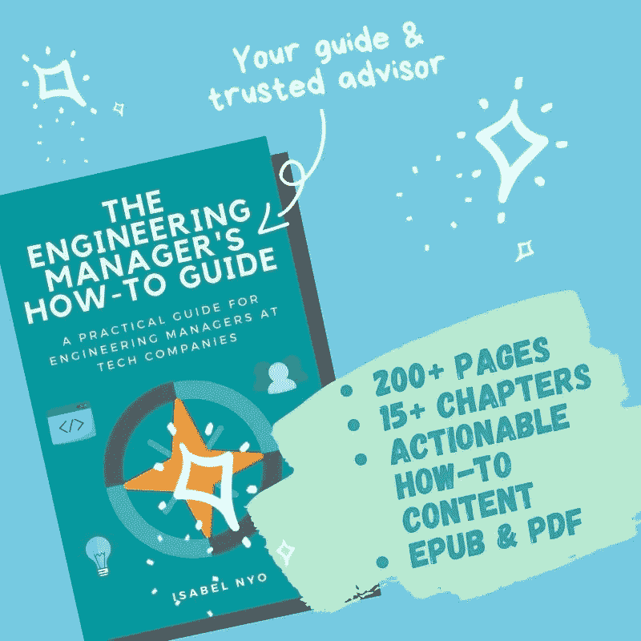

# 工程领导者的一天

> 原文：<https://betterprogramming.pub/a-day-in-the-life-of-an-engineering-leader-532eba36b721>

## 当你脱离日常编程时会是什么样子

照片由[思想目录](https://unsplash.com/@thoughtcatalog?utm_source=medium&utm_medium=referral)在 [Unsplash](https://unsplash.com?utm_source=medium&utm_medium=referral) 上拍摄

我目前在澳大利亚悉尼的一家企业软件公司担任高级工程经理。我的公司为敏捷团队开发产品，敏捷团队由软件开发人员、产品设计人员、产品经理等组成。

同样，我的工作包括与敏捷团队一起工作。但是因为我不是个人贡献者，也不是一线经理，所以我不是敏捷交付团队的直接成员。

我一天中的大部分时间都在与来自不同领域的人合作，包括工程、产品、招聘、营销、项目管理、支持等。，在一对一或一对多的设置中，我们称之为“会议”。

这与日常运营关系不大，更多的是商业战略、[产品目标](https://gum.co/productgoals)、增长、文化等等。

# 工程领导者的一天

让我与你分享一个工程领导者的一天生活。

叶卡捷琳娜·卡西莫娃在 [Unsplash](https://unsplash.com?utm_source=medium&utm_medium=referral) 上的照片

## 上午 8:30-9:00

我把这称为我的安静期，集中精力，设定目标，并掌握当天重要的事情。

我在办公桌前吃早餐，看我的待办事项清单，决定我要在一天结束前完成的事情，了解各种项目和人事的状态。我有每月的优先事项，我用每月的优先事项交叉检查我的每日待办事项清单。引用《高效能人士的 7 个习惯》一书的作者斯蒂芬·柯维的话，“关键不在于优先安排你日程表上的事情，而在于安排你的优先事项。”如果你需要更多的指导，看看这个[数字计划器](https://gum.co/techcareerplanner)，我亲自设计并使用它来确保我专注于重要的事情。

有时候，我有一个小时的时间来做这个，但是有时候，我只有 15 分钟。

如果我有一个来自世界另一个地方的人的晨会或面试，比如说在早上 8 点，我会尽量早点去办公室，这样我就可以做我早上的例行工作。

## 上午 9 时至 10 时

我加入了我的一个团队的产品智囊团(PBT ),该团队由工程主管、设计主管和产品主管组成。作为一家产品公司，PBT 是我们确保团队中每个人都致力于与我们的[产品目标](https://gum.co/productgoals)一致的计划的一种方式。

我通常会倾听，试图理解他们的观点。我已经知道我的团队在做什么，但这通常是领导三人组第一次听到和看到想法、概念，有时是低保真度设计。

我还记录重要的讨论，以积累我对产品和客户的了解，并与我的团队分享这些知识。一个小时的 PBT 通常过得很快。

## 上午 10 时至 10 时 30 分

大多数团队每天在上午 10:00 到 10:30 之间做站立练习，因为这是大多数人开始一天工作的时间，无论他们是在办公室还是远程工作。

如果我有一个特殊的项目，我和一个像老虎队这样的临时团队一起管理，我会加入这个团队。如果我在照看一个交付团队，因为他们的工程经理不在，我会在必要时加入他们。

我的原则是，如果我能在那里增加一些价值，无论是提供见解、指导、支持、反馈，我都会在那里。

否则，我认为团队应该是自组织的和足够自治的，以促进他们自己的站立。

[女同胞](https://unsplash.com/@cowomen?utm_source=medium&utm_medium=referral)在 [Unsplash](https://unsplash.com?utm_source=medium&utm_medium=referral) 上的照片

## 上午 10 时 30 分至下午 12 时

在这段时间里，我通常会召开小型的重点会议。有的是 1:1，有的涉及 3-4 人。

我的 1 对 1 不仅仅是与我的直接下属和直属经理。我也可以和来自不同领域的人进行一对一的交流，比如支持、营销、产品管理、项目管理、人才获取、设计等等。

有时候，这些会议变成了三个人；例如，客户访谈包括我自己、产品或设计部门的人员以及我们产品的客户或潜在客户。

## 中午 12 时至下午 1 时

我在日历上划出了这段时间，因为这是我的阳台时间。我通常会快速吃 15-20 分钟的午餐，然后利用剩下的时间走出大楼，在街区周围散步，听播客，或者只是观察这个世界。

我很幸运，我的办公室在悉尼 CBD 这意味着我有时会去达令港或著名的悉尼歌剧院周围散步。

有时候，我只是看着游客享受这个城市，看着街头艺人表演他们的魔术。它真的帮助我正确看待事物。

苏珊·库里亚科斯在 [Unsplash](https://unsplash.com?utm_source=medium&utm_medium=referral) 上拍摄的照片

## 下午 1 时至 2 时 30 分

我回到办公室，在这段时间里，我通常会与候选人进行领导力或价值观面试。自从我加入以来，我的公司一直在积极发展，因此，我们随时都有许多职位空缺。

作为一名领导者，为公司招募优秀人才是我的职责之一。我每周接受两到三次采访，如果需要的话，有时会更多。

我努力成为一名优秀的面试官，去真正了解被面试者，积极倾听，问清楚问题，因为我相信这是你提供的一项服务。

我不想撒谎，有时候我发现问题和答案都有点过时了，但是总会有一个候选人会给我惊喜，让我觉得总会从面试中学到一些新东西。

## 下午 2:30-3:30

在领导力或价值观面试之后，我还有另一组一对一的面试。例如，在我的一个团队中，有一个空缺职位，我联系了一名内部招聘人员。

我还与作为工程经理的直接下属进行一对一的交流，以提供和接收反馈，就项目达成一致，讨论他们的发展，或者与作为首席工程师的直接下属进行一对一的交流，以提供和接收反馈，就技术架构和技术愿景展开讨论。

最后，我与我的经理一对一地讨论产品、流程和人员，是的，你猜对了，给出和接受反馈。如果你想知道的话，它们不会在同一天，在同一个时段发生。

照片由[乔舒亚·内斯](https://unsplash.com/@theexplorerdad?utm_source=medium&utm_medium=referral)在 [Unsplash](https://unsplash.com?utm_source=medium&utm_medium=referral) 拍摄

## 下午 4 时至 4 时 30 分

有些日子，我会有安静的时间来补上松弛的消息，有些日子，我会参加一系列的 Scrums 会议、techOps 会议或其他部门范围的会议。

我在下午 4:45 离开办公室，因为我需要去学校接我的女儿，通勤至少需要一个小时。

Sebastien Gabriel 在 [Unsplash](https://unsplash.com?utm_source=medium&utm_medium=referral) 上拍摄的照片

# 成为一名经理

现在，你可能会问，作为一名经理，所有的事情都是会议吗？当然不是，仅仅开会还不足以产生结果。以上是我一周中几天的例子。

我通常会为自己的一天设定主题，并仔细安排我的日历，这样我一周中至少有一天可以有一段时间，即:两个多小时，来适应一些不参加或促进会议的战略或执行工作。

有时候，我会忍不住在和家人吃完饭，和女儿写完作业后，挤出两三个小时的工作时间。但是我尽量不让它每天都发生，因为我不想被烧坏。

我也有其他的创意渠道和我喜欢花时间去做的副业。更多的时候，它们与我作为一名高级工程负责人的全职工作间接相关。

例如，当我被邀请参加工作中的多元化和包容性小组时，我不必做太多的研究，因为我之前已经为我的文章做了研究。

或者，当我在工作中提供指导和职业辅导时，我会利用我在全职工作之外作为职业教练获得的知识和经验。

【womenintechnology.threadless.com 号

# 我学到了什么

在我作为管理者和领导者的职业生涯中，最大的收获之一就是你必须灵活，你必须能够适应人们和企业不断变化的要求。

很多事情往往是未知的。当你是一名从事项目的开发人员时，你知道你下周甚至下个月要做什么。

大多数时候，你的交付能力取决于你的能力。当你是一名经理时，事情可能会变得更频繁，你不再能控制你周围的大多数事情。

你不能命令市场、季节或人们的欲望。经理的角色也是保护他们的团队免受来自外部的不断变化和噪音的影响，这样他们就可以专注于为客户提供价值，无论是新功能、改进还是对现有功能的错误修复。

由[凯利·西克玛](https://unsplash.com/@kellysikkema?utm_source=medium&utm_medium=referral)在 [Unsplash](https://unsplash.com?utm_source=medium&utm_medium=referral) 上拍摄

# 从来没有沉闷的一天

几个月后，我作为工程领导者的一天从外面看起来可能是一样的，但我可以向你保证，当你深入研究时，每一天都可能完全不同。

例如，在第一天，我们可能会讨论几个月后我们要去的新市场，但在第 15 天，我们可能会讨论更新的组织结构，以支持人们的职业发展。

然后，在第 30 天，我们可能会讨论我们将在几周内进行的绩效评估，以及如何在整个组织中保持流程的公平和一致性。

我的日子、星期和月份是变化的，它们通常是不可预测的。我不得不说，作为一名工程领导者，没有一天是无聊的。

虽然不可预测，有时感觉你没有贡献任何值得一提的东西，因为反馈循环太慢了，但我从经验中知道，工程经理的工作可以通过流程、产品和最重要的人来真正产生影响。

丹·梅耶斯在 [Unsplash](https://unsplash.com?utm_source=medium&utm_medium=referral) 上的照片

感谢您的阅读！

如果你喜欢这篇文章，你可能想看看我最新的关于工程管理的书。

***科技公司工程经理实用指南。***

[工程经理的操作指南](https://gumroad.com/l/emhowto)对工程经理来说很有针对性，在这本书里，你找不到一般的建议，比如定期一对一、给予反馈等。是的，这些事情是绝对重要的，但它们并不特定于工程经理的角色。我的目标是确保这本书为工程经理提供一个简明和可操作的指南，为工程经理提供你在其他领导和管理书籍中找不到的具体和合适的内容。

📩[注册](https://eisabainyo.net/weblog/subscribe/)订阅作者的时事通讯，定期获得关于你科技职业的建议和资源。您还将立即收到一个链接和密码，为您的职业发展下载免费赠品。