# 深入了解 SwiftUI 预览

> 原文：<https://betterprogramming.pub/a-deep-dive-into-swiftui-previews-66d53469ee43>

## 利用强大的预览功能，更快地开发您的 SwiftUI 视图

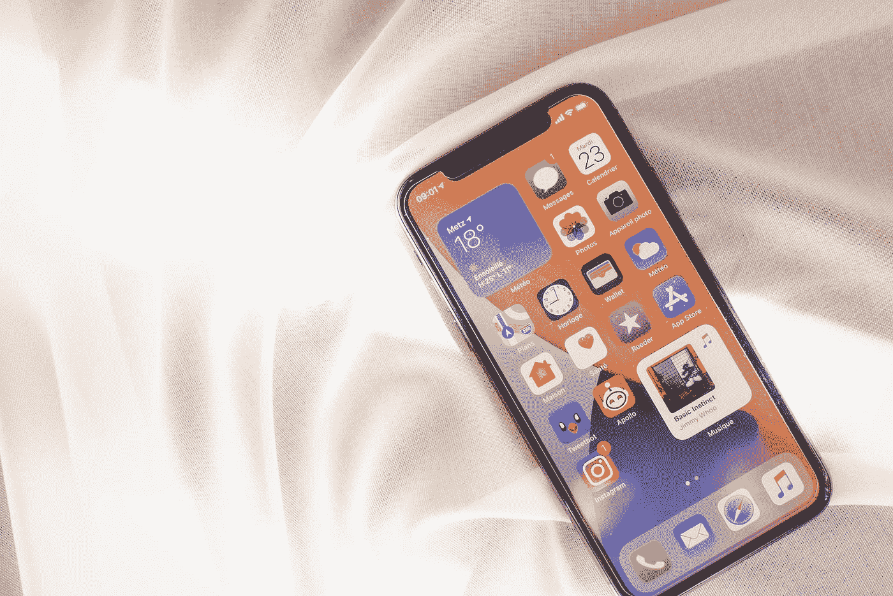

照片由[大卫·格兰穆金](https://unsplash.com/@davidgrdm?utm_source=medium&utm_medium=referral)在 [Unsplash](https://unsplash.com?utm_source=medium&utm_medium=referral) 上拍摄

随着 SwiftUI 的发布，苹果不仅为我们提供了一个新的漂亮和轻量级的 API 来创建用户界面，还引入了 Xcode 预览。

现在，我们可以将视图代码和它的可视化表示并排放在一起。两端都是同步的，任何一端的更改都会导致另一端的更新。

显然，Xcode 预览的最大好处是我们不必每次都重新构建我们的项目。在引入预览之前，我们必须一遍又一遍地启动模拟器，即使是最小的变化。

对我来说，一个典型的场景如下:

1.  我创建了一个带有`UIStackView`的用户界面。
2.  我在模拟器上运行应用程序。
3.  我等了 20 秒直到应用程序启动。
4.  我浏览整个应用程序来访问包含我的`UIStackView`的`UIViewController`。
5.  看起来糟透了。我意识到我没有将分布设置为`fillEqually`。
6.  我回到代码或界面构建器，并相应地设置属性。
7.  我再次在模拟器上运行应用程序。
8.  我等了 20 秒直到应用程序启动。
9.  我浏览整个应用程序，访问包含我的`UIStackView`的`UIViewController`。
10.  现在一切正常。

您可以看到这是一个繁琐的过程，导致了大量的等待和浏览应用程序。

使用 SwiftUI 预览，您可以省略上面的大多数任务。您只需启动预览并进行更改，同时在代码编辑器旁边立即看到它们的影响。

本文将涵盖 SwiftUI 或 Xcode 预览，从基础开始，然后慢慢进入更高级的主题，如显示`UIViewControllers`或本地化您的预览。

我们将构建一个小项目，您稍后可以将其用作参考。

# 为本文设置项目

在我们预览任何东西之前，我们需要一个项目。打开 Xcode，在“欢迎使用 Xcode”屏幕上，选择“创建新的 Xcode 项目”


作者创作的照片

在接下来的屏幕上，选择平台 iOS 的默认应用模板。然后点击“下一步”

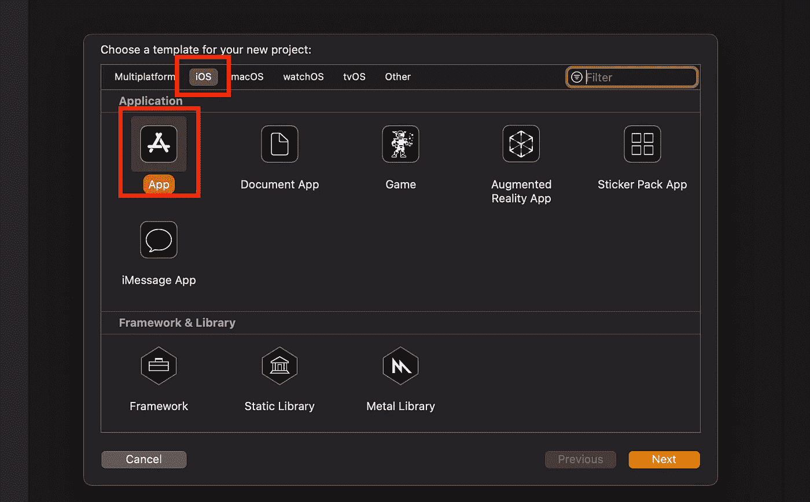

作者创作的照片

对于标题，你可以随便选——我准备用`BudgetPreview`。在您再次单击“下一步”之前，请确保您已经将界面设置为“SwiftUI”并将生命周期设置为“SwiftUI App”取消选择“使用核心数据”和“包括测试”这篇文章不需要它们。

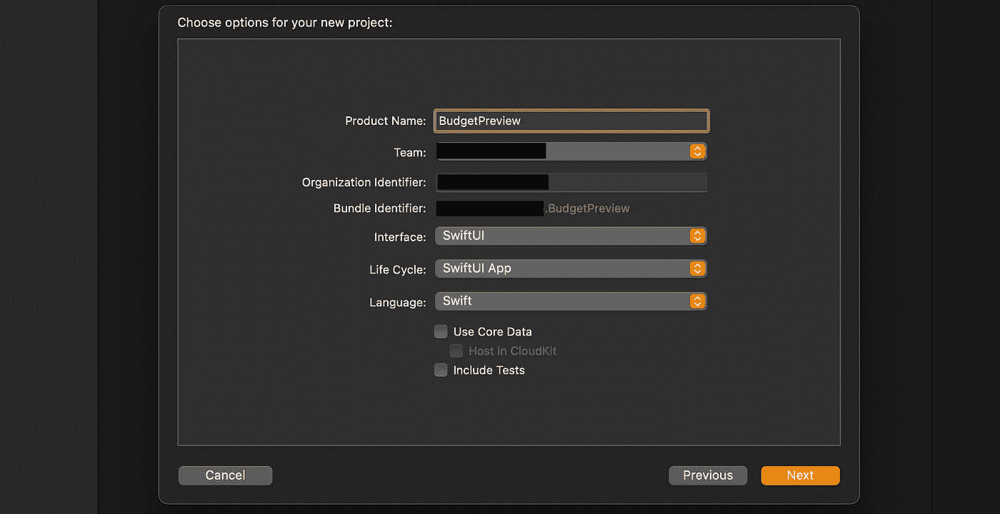

作者创作的照片

最后，单击“下一步”，并选择项目在文件系统中的存储位置。然后点击“创建”按钮。

如果您以前没有，现在您已经成功地设置了您的第一个 SwiftUI 项目，名为`ContentView`的 SwiftUI 视图应该是打开的。

让我们深入了解一下预览功能。

# 一般如何使用 SwiftUI 预览

如果文件`ContentView.swift`是打开的，你应该会看到下面的屏幕。


作者创作的照片

左边是您从 UIKit 项目中了解到的代码编辑器。右边是本文有趣的部分:预览部分。

如果您没有看到右边的画布，或者您只是需要更多的空间在代码中工作，您可以使用这个简洁的快捷方式来显示和隐藏预览。

```
Option + Command + return (⌥ + ⌘ + ↩)
```

到目前为止，您可能不会在右侧看到预览。那是因为你需要启动/恢复预览功能。如果您编写了导致预览崩溃的完全无效的代码，这也是必需的。

您可以按下“暂停自动预览更新”旁边的“继续”按钮来继续


作者创作的照片

或者，因为这种情况每小时都会发生几次，我强烈建议你学习这方面的捷径。

要恢复预览，只需使用:

```
Option + Command + P (⌥ + ⌘ + P)
```

[](https://medium.com/better-programming/xcode-8-swiftui-keyboard-shortcuts-that-will-make-you-even-faster-bc3967b75224) [## Xcode: 8 SwiftUI 键盘快捷键，让你更快

### 掌握 Xcode 并更快地构建应用程序

medium.com](https://medium.com/better-programming/xcode-8-swiftui-keyboard-shortcuts-that-will-make-you-even-faster-bc3967b75224) 

你的预览看起来应该和这个差不多:

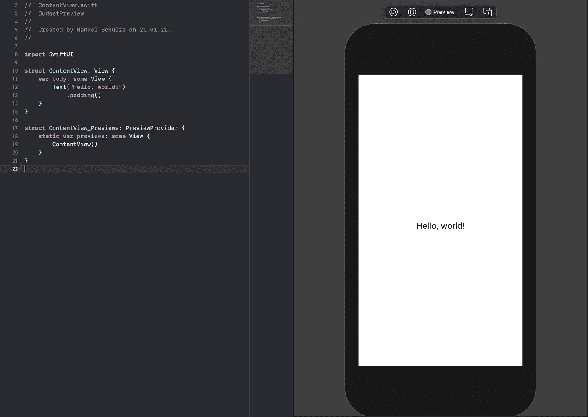

作者创作的照片

在我们真正开始预览我们构建的真实视图之前，我还想向您展示一个特性。您可以开始实时预览。这将需要多一点时间来建立，可悲的是没有捷径。相反，您必须在预览中单击运行图标。

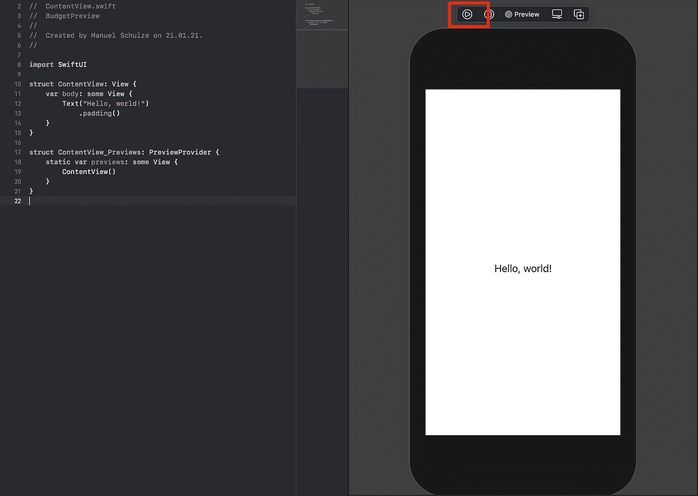

作者创作的照片

与常规预览相比，实时预览有一个好处。您还可以与 UI 进行交互，例如，单击一个按钮，您的点击处理代码将被触发。如果你想知道你的按钮点击处理是否有效，这是一件很酷的事情。

然而，在 99%的情况下，你要么使用常规预览来查看你的用户界面，要么在模拟器中运行应用程序来测试按钮点击。尽管如此，知道这一点还是很好的。

# 用数据填充 SwiftUI 预览

现在，右边是活动的预览，左边是我们的代码，让我们做一些更改，看看预览是如何工作的。

对您的`ContentView`类进行如下修改。

在上面的代码中，我们添加了一个可以从外部传递到视图中的绑定。我们在`Text`视图中显示绑定的值，并使用格式说明符将其显示为美元值。

为了用数据填充预览，我们必须在符合`PreviewProvider`协议的结构`ContentView_Previews`中提供绑定。

在 computed property `previews`中，我们提供了所有想要显示的预览。

出于本教程的考虑，我们简单地传递了一个常量值作为绑定，这在使用预览时很常见。

在这些更改之后，您会注意到预览无法恢复。原因是我们已经在文件中正确地设置了一切，但是在项目的其他地方有一个编译错误。

因此，一定要将新参数`moneyLeft`添加到`BudgetPreviewApp.swift`文件中。您可以简单地复制并粘贴我们用于预览的`ContentView`。

之后，导航回你的`ContentView`并继续预览。现在，您应该在屏幕中间看到一个格式良好的美元值。

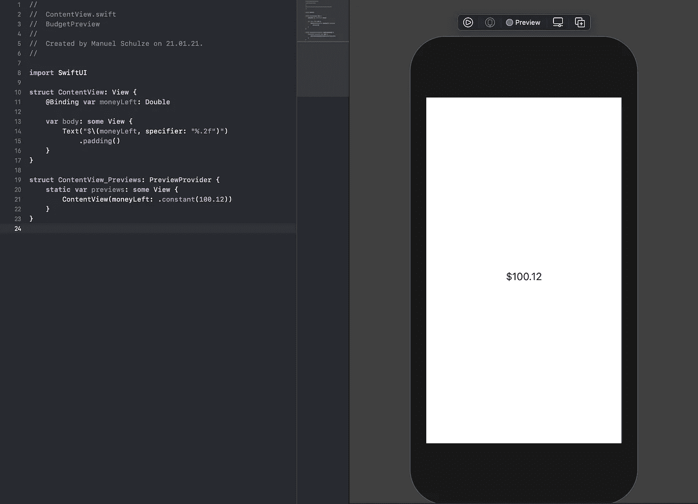

作者创作的照片

# 如何并排显示多个 SwiftUI 预览

虽然在一个屏幕尺寸上预览视图有助于开发，但它也欺骗了我们，让我们认为我们的视图无论如何看起来都很棒。用户可以通过动态字体大小使用另一种设备或非常大的字体，这会破坏我们的布局。

不要担心，SwiftUI 预览功能已经覆盖了您。您可以同时在画布中显示多个预览。这可以通过`ContentView_Previews`结构的计算属性`previews`来实现。然而，仅仅在这里添加另一个预览是不够的。

每个 SwiftUI 视图需要有一个根元素。属性也有一个不透明的返回类型`View`。这就是为什么我们需要返回一个包含多个预览的视图。为此，我们可以使用`Group`视图。

您的`ContentView_Previews`结构现在应该如下所示:

现在，您的预览应该包含两个显示相同视图的设备。

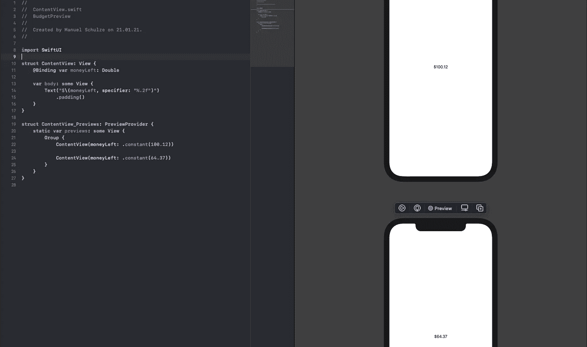

作者创作的照片

# 不同设备或框架上的 SwiftUI 预览

如果我们使用不同的输入参数(例如，非常短和非常长的文本)来提供预览，那么在相同的设备类型上查看我们的视图两次是有帮助的。

但是我们甚至可以在不同的设备上预览我们的视图。让我们通过添加修改器`previewDevice`将第二个预览变成 iPad Pro。

这将导致以下表示:

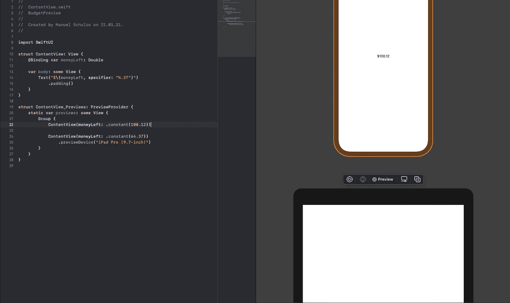

作者创作的照片

您可以通过在画布本身进行更改来获得相同的结果。只需在右侧的属性检查器中选择您想要更改的预览，然后更改设备。这将生成与我们编写的代码相同的代码。

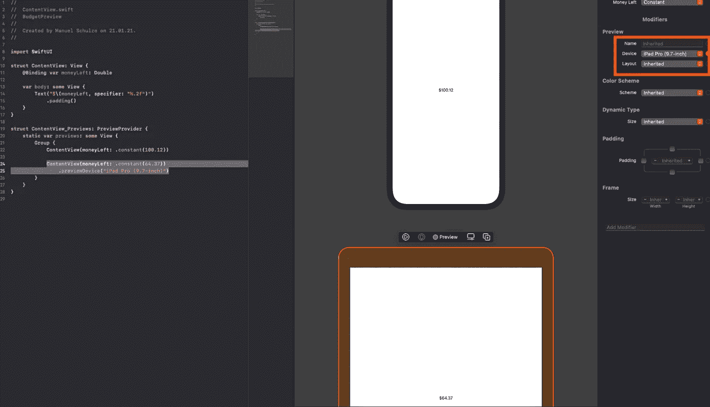

作者创作的照片

**注意:**你可以通过代码或者直接在属性检查器中完成我在本教程中描述的大部分事情。在这两种情况下，它会同时改变预览和代码。然而，我更喜欢通过代码进行更改，并将在本文中始终坚持这一点。

虽然在不同的设备上显示视图对于全屏视图来说是一个很好的特性，但是我不喜欢子视图只占据部分屏幕。在这些情况下，我通常将预览设置为特定的帧尺寸。

为此，用`previewLayout`和`sizeThatFits`值替换`previewDevice`修改器。这将使视图只占用它需要的空间。之后，您可以提供特定的帧大小。

第一个预览的大小始终为 100x100，而第二个预览使用的空间正好适合其内容。

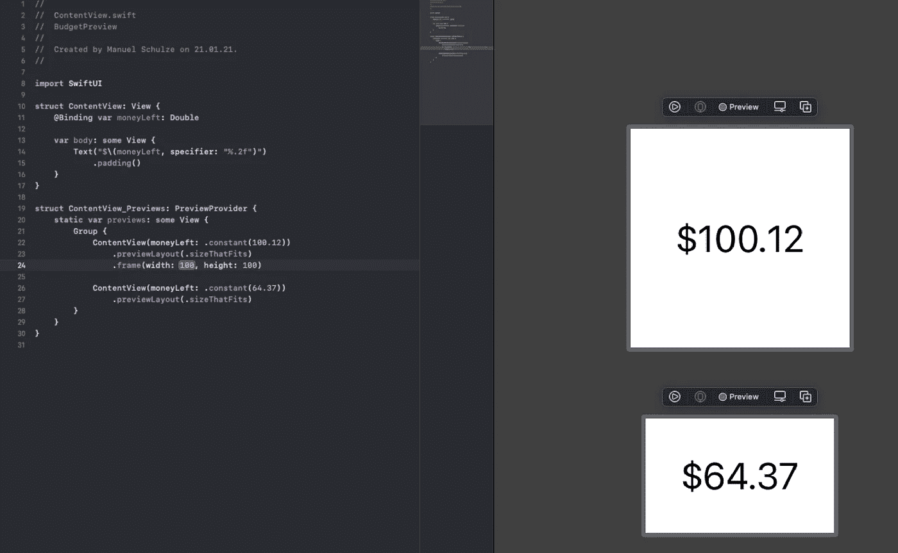

作者创作的照片

这也让我们能够更好地了解不同的预览。

# 为您的 SwiftUI 预览提供动态字体大小

在 iOS 中，用户可以更改内容的大小。这是一个有用的功能，特别是对于我们的长辈，他们不再有最好的眼睛。

作为开发者，我们经常忘记我们的应用程序的可访问性。通过 SwiftUI 预览，您可以轻松地看到调整文本大小时视图的行为。

让我们将动态大小类型设置为`extraExtraExtraLarge`。这可以通过`environment`修改器和`sizeCategory`关键路径来实现。

您可以立即看到，使用这种动态类型，第一个预览看起来不再很好。我们稍后会解决这个问题。

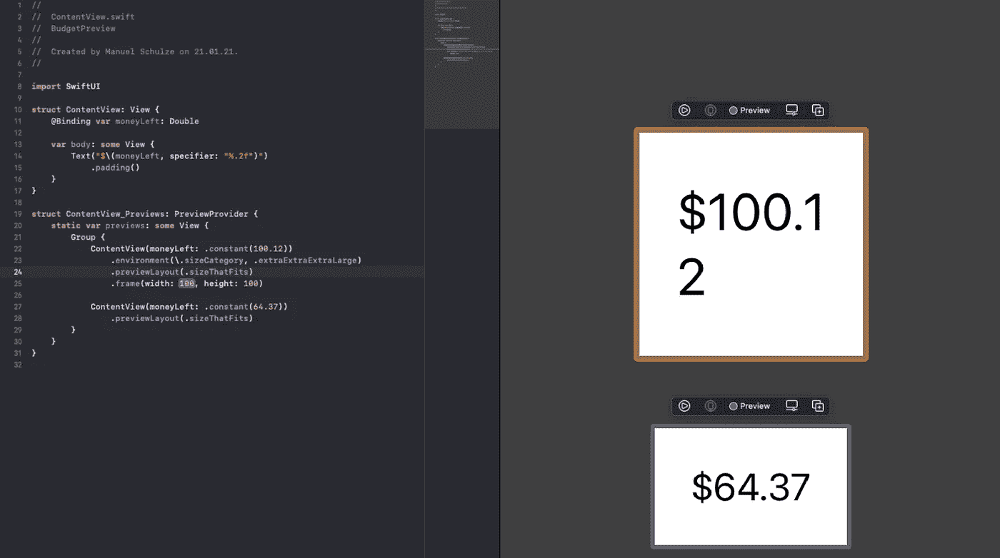

作者创作的照片

# 如何用黑暗模式预览你的视图

在 iOS 13 引入深色模式后，现在大多数应用程序都有望支持浅色和深色两种配色方案。

这就是为什么你应该总是确保在两种设置下测试你的视图。Xcode 预览版允许您通过简单地添加修饰符`preferredColorScheme`来实现。

这将导致第二个预览显示其黑暗模式的表现。

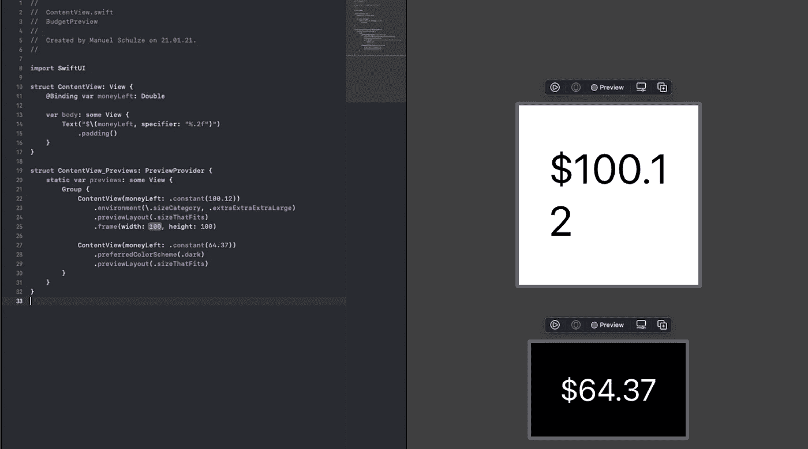

作者创作的照片

# 使用不同的语言环境进行预览

现在你应该知道如何设置预览的基本知识。这就是为什么我们可以更深入地探讨更高级的主题。

如果你想给全世界的用户提供最好的用户体验，本地化是非常重要的。

为了本地化我们的 UI，我们需要采取三个步骤。

1.  将带有本地化字符串(`Localizable.strings`)的文件添加到项目中。
2.  本地化文件本身。
3.  在我们的 Xcode 项目中设置本地化。

首先，使用以下快捷方式在项目中创建一个新文件:

```
Command + N (⌘ + N)
```

使用模板“字符串文件”，并将其命名为`Localizable.strings`。

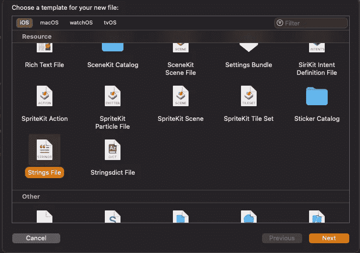

作者创作的照片

现在只需插入下面的键-值对，但不要忘记分号。

```
"Remaining" = "Remaining";
```

然后选择文件，在文件检查器中，点击“本地化…”按钮。

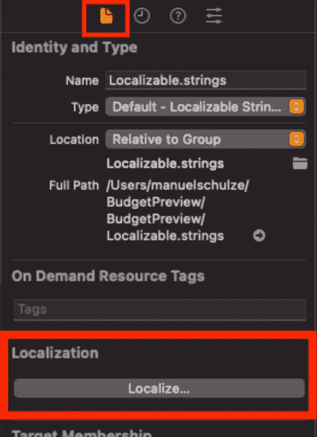

作者创作的照片

这将创建一个只有一种语言(英语)的本地化版本的文件。结果应该是这样的:

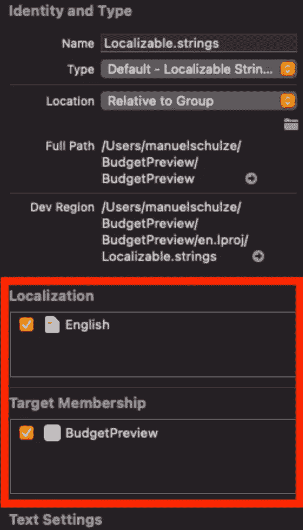

作者创作的照片

最后，我们需要将本地化添加到我们的项目中。在项目导航器中，点击项目，然后在弹出的视图中再次选择项目。“信息”选项卡中有一个名为“本地化”的部分


作者创作的照片

单击加号按钮添加一种语言(我使用的是德语，但也可以随意选择其他语言)。

Xcode 会询问您想要本地化哪些文件。选择`Localizable.strings`，点击“完成”

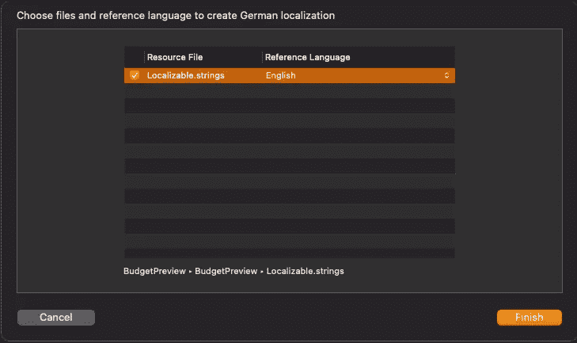

作者创作的照片

如果一切正常，您应该会在文件旁边看到一个小三角形。当你点击它时，它会展开，你会看到文件的两种语言版本。

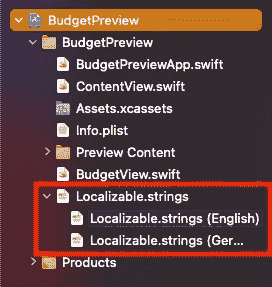

作者创作的照片

最后，点击德语版。并用单词`Noch verfügbar`替换键值对的值。

```
"Remaining" = "Noch verfügbar";
```

现在我们有了一个本地化的文本，让我们在视图中使用它。导航回`ContentView.swift`，并将我们的`Text`视图包装在`VStack`中。在它上面添加另一个`Text`视图。

这个新的`Text`视图应该使用新创建的本地化标识符。幸运的是，`Text`有另一个初始化器，可以处理本地化的字符串键。您的`ContentView`现在应该是这样的:

我们的预览不会因为单独这样做而改变语言。让我们再次使用`environment`修饰符在第二个预览中注入区域设置。此外，让我们增加第一个视图的框架大小，以便它能够适应内容。

您的预览代码应该是这样的:

画布中的结果将包含两种不同语言的预览。

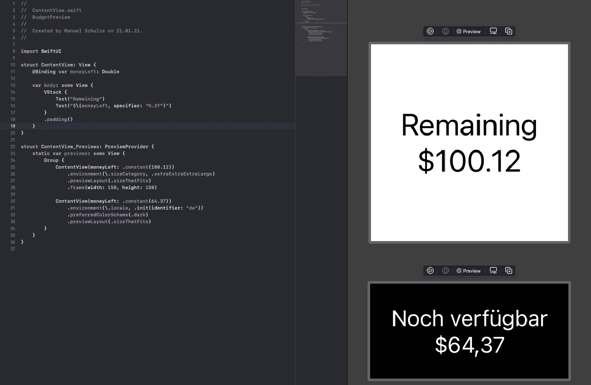

作者创作的照片

# 使用 SwiftUI 预览预览 UIViews 和 UIViewControllers

虽然 SwiftUI 已经有了很大的发展，并且已经支持了许多我们从 UIKit 中了解到的特性。它仍然没有赶上我们以前能够做的所有事情。

我们有时也有遗留代码或框架没有转换成 SwiftUI。

在这些情况下，我们可以轻松地在 SwiftUI 和 UIKit 视图之间切换，这很好。我们可以从 SwiftUI 打开`UIViewControllers`，从`UIViewControllers`打开 SwiftUI 视图。

还没完呢！我们甚至可以为我们的 UIKit 视图和视图控制器使用预览功能。

为了看到实际效果，在项目中添加一个`UIViewController`。再次使用快捷方式创建新文件。

```
Command + N (⌘ + N)
```

这一次，选择“Cocoa Touch Class”模板。

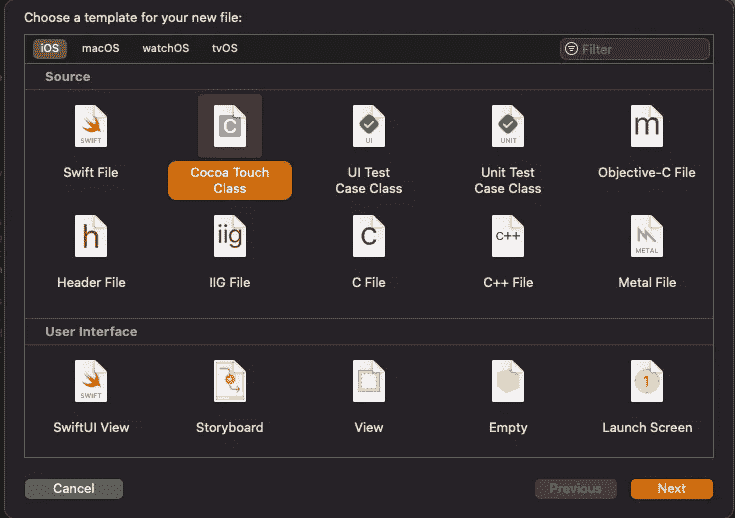

作者创作的照片

在下面的对话框中，输入名称`PreviewViewController`，并确保将子类设置为`UIViewController`。

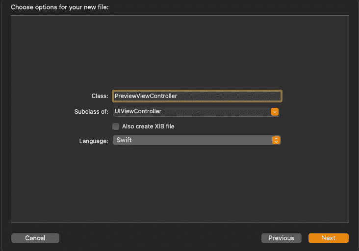

作者创作的照片

用以下代码替换样板代码:

这将在屏幕中间添加一个标签。

现在创建另一个文件，但是这次使用“Swift File”模板，并将其命名为`PreviewView`。

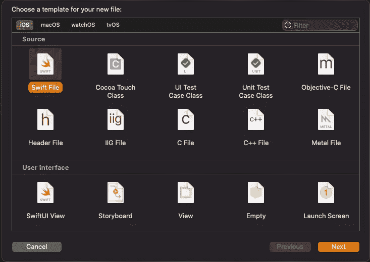

作者创作的照片

在这个文件中，确保导入 SwiftUI。创建一个 struct，`PreviewView`，它符合协议`UIViewControllerRepresentable`(对于`UIViews`你需要符合`UIViewRepresentable`)，这是 Apple 添加的，用来在`UIViewControllers`和 SwiftUI 视图之间建立一座桥梁。

您还需要实现该协议的两个方法来创建和更新视图控制器。

最后，您需要添加一个`PreviewProvider`来使您的预览工作。

代码应该如下所示:

`makeUIViewController(:)`方法将创建我们需要的`PreviewViewController`。update 方法故意留空，因为我们不需要任何更新逻辑。

如果您继续预览，画布应该包含一个显示视图控制器的设备，标签在中间。


作者创作的照片

**注意:**只有当你的应用支持旧的操作系统(iOS 12 及以下)时，才需要这两个`@available(iOS 13, *)`属性。如果您从事 SwiftUI 项目，那么这是不太可能的，您可以忽略它们。

# 从这里去哪里

SwiftUI 正在快速发展，你必须跟上这种为苹果生态系统编写用户界面的新方式的发展。

如果您想在预览方面走得更远，并基于您新获得的知识，我可以热情地向您推荐两篇文章。

大约一年前，Antoine van der Lee 写了一篇关于 SwiftUI 预览的文章。我特别喜欢他关于编写一个通用预览视图的想法，您可以围绕自己的预览。这样，你就不必一遍又一遍地创建黑暗模式版本或不同的相关尺寸类型。

John Sundell 一直对 Swift 和 iOS 开发有很好的想法。他甚至用 Swift 创建了一个静态网站生成器来构建自己的网站。[在他关于 Xcode 预览的文章](https://www.swiftbysundell.com/articles/getting-the-most-out-of-xcode-previews/)中，他展示了许多你可以在自己的项目中使用的优秀扩展。

精通预览是值得的，因为它将提高我们构建优秀用户界面的速度。因此，我希望这篇文章为您提供了关于这个主题的坚实基础。

我祝你好运，并祝你在 SwiftUI、Xcode 预览和总体编程方面获得更多乐趣。

谢谢你的时间。