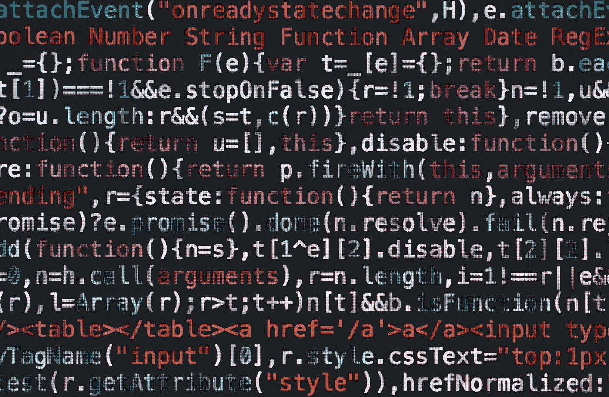

# 深入探究开发人员陷入的 3 个 React 陷阱

> 原文：<https://betterprogramming.pub/a-deep-dive-into-the-3-react-pitfalls-that-developers-fall-into-41b5109870e6>

## 帮助您了解代码是好是坏的提示



作为软件开发人员，您会不时看到代码的准确表示

我曾经指导过初级开发人员，并直接了解他们通常面临的挑战。因此，我列出了一些常见的错误，可能会对刚刚起步的低年级学生，甚至是有一点经验、希望提高自己知识的人有所帮助！

```
[1\. Failing To Pass a Valid Key to Element Arrays](#1711)[2\. Mutating the State](#7e98)[3\. Ending Up With Huge Components](#0ac7)
```

好了，我们走吧。

# 1.无法向元素数组传递有效的键

您可能已经听说过这个:当映射一个数组以将其转换为 React 元素之一时，您必须为每个子元素提供一个惟一的键。

但这是为什么呢？而且一直都是这样吗？要回答这个问题，我们必须先简单地谈谈 React 是如何工作的。

每当你的应用程序中有状态或道具更新时，React 都会运行其 diffing 算法，将旧的 DOM 树与新的进行比较。这是它学习什么改变了，以及最终什么需要被重新渲染的方式。

这意味着它遍历每个节点，并检查更新后是否有任何参数发生更改，然后在其子节点上重复相同的过程。假设我们有这两棵树:

老树在上，新树在下

可以看到，更新在孩子的底部加了一个节点:这样就好了！React 处理得很好，因为它可以理解前两个节点没有改变，还有第三个新节点。然而，让我们来看一个不同的场景:

所有三个节点都被视为新节点

麻烦来了:更新在子节点上添加了一个新节点。当 React 按顺序比较每个子项时，它永远不会找到匹配项。这意味着它也将重新创建那两个没有改变的孩子。

在这种情况下，子元素只是 DOM 元素，所以您可以说这没什么大不了的，但是当每个子元素下面都有一棵树时，这可能是一个更大的性能问题，所有这些都需要重新创建。或者当有许多孩子需要重新创建时。

不仅如此！因为 React 不能唯一地识别每个孩子，所以在某些情况下，它可能会弄乱东西，混淆孩子的状态。这里有一个[例子](https://reactjs.org/redirect-to-codepen/reconciliation/index-used-as-key)你可以看看:在第一个输入中写一些东西，然后“添加新的开始。”

这就是钥匙发挥作用的地方。让我们来看看:

React 知道只有一个新节点

太好了。通过键，React 现在可以识别现有的孩子，第二个和第三个，它知道第一个孩子在聚会上迟到了。它不会重新创建现有的子对象，因为它可以正确地匹配这些子对象。

但是如果我把索引作为一个键呢？React 默认会这样做。它将伴随数组的索引，直到您提供一个实际的唯一键。它仍然会警告您这个问题，以便您可以及时处理它。那么，为什么索引不是有效的键呢？让我们看一个例子:

如您所见，第一个孩子没有被识别为新孩子，因为键匹配。但是，它的内容发生了变化，因此 React 将重新创建节点。其他孩子也一样。此外，您可能会遇到我们之前讨论过的相同的状态混淆问题。

不过，有一个例外，使用索引应该没问题，那就是当你确定子元素不会被重新排序时。尽管如此，我还是建议您将它绑定到一个惟一的 id，并选择使用索引作为最后的手段。

唷，太多了。让我们进入下一个！

# 2.改变状态

同样，我也会解释这一点的原因和方法。前一点的解释给了我们一个良好的开端。

如前所述，应用程序的渲染是由道具和状态更新触发的。但是 React 如何知道一个状态何时被更新呢？那是我们的工作！每次我们通过预期的 API 设置状态时，React 都知道。例如:

只要您需要处理原始数据，事情就相当简单。然而，当您必须处理非原始数据时，它们会变得混乱，这是我经常看到出错的地方。看看这个:

这里怎么了？我们知道必须使用 React 的`setSandwich()`函数来触发重新渲染。但这还不够。我们还必须确保不改变状态，以便新旧版本可以进行比较(还记得区别吗？).反应状态是唯一不可变的。这意味着您必须在每次想要更改它时覆盖它的值。

React 在这种情况下看不到变化，因为突变导致两个版本相等。假设您在一个 div 中显示三明治内容:它不会被更新。因此，你仍然会看到洋葱渲染(呸！).

那么，我们该如何解决这个问题呢？让我们看看下面的正确形式:

这是非常不同的事情。我们设置了一个新的对象，它带来了前一个状态的值(注意我们是如何从 setSandwich 回调中获得它的),但也覆盖了 onions 属性。渲染现在将正确工作，因为我们实例化了一个新的对象来设置，同时保持旧的状态不变。

好了，让我们来看一个关于数组的例子:

同样的故事:改变数组可以防止 React 注意到它的变化。现在让我们用正确的方式来做:

同样的原则:我们设置一个新实例化的数组，保持旧数组不变。但是，我们还没有完成！对于那些喜欢打字稿的伟大的人，我有一个技巧可以帮助你在未来避免错误。

如您所见，TypeScript 附带了一个方便的`ReadonlyArray`类型，它省略了我们想要避免的所有可变属性。现在写那个`push()`会抛出一个 TSLint 错误！还有`ReadonlyMap`和`ReadonlySet`类型，你可以用同样的方式使用。

# 3.最终得到巨大的组件

你经常看到这种情况。你需要做一点小小的改变。打开目标组件，500 行代码扑面而来。你 80%的精力都花在了寻找你想要的东西上，同时尽量不去破坏其他东西。

我会给你一些提示，告诉你如何解决这个问题，整理你的组件。首先，慢慢来。就当是写论文吧。你做你的事；你把一切都写下来。然后，只有当你完成后，你才再读一遍，检查语法错误等等。

所以，当你开始写下你的组件时，不要试图立刻优化代码，因为你会在一百次之后重新做一遍。

一旦你认为组件已经准备好了，你就可以看看你已经得到了什么，并考虑哪些可以改进。这就是你要找的东西:

关注点分离。这始终是一个很好的经验法则。一个组件不应该感觉它在做太多的事情。你的组件使用了很多钩子吗？你的 JSX 超过几百行了吗？然后你可能要把事情分解。

试着在视觉上把它分成更小的部分。你应该问自己，“这属于这里吗？”或者“我的组件应该关心知道这些吗？”。这件事没有唯一正确的方法，所以做你觉得最好的，放轻松。一旦你完成了，继续把代码分解成更小的组件。

利用钩子。当我进入一个组件时，我主要关注的是返回的内容。也就是 JSX。这是组件的主要目的，呈现某种 UI。

但是，通常，为了实现所需的 UI，我们必须管理来自后端、来自本地存储的数据、与 UI 相关的状态和逻辑(表单、导航、样式、动画)等等。

但是我们还是要把主要精力放在 JSX 上，对吗？我的下一个建议是尽可能减少组件中的其他内容。

有一些获取请求吗？您可能希望将它们放在单独的文件中，作为 javascript 函数或通过创建自己的钩子。或者，可能更好的是，您可以利用像 [redux](https://www.npmjs.com/package/@reduxjs/toolkit) (带 RTK 查询)或 [react-query](https://www.npmjs.com/package/react-query) 这样的库。

有可能涉及到国家管理的任何形式的逻辑吗？将所有相关的东西外推到一个定制的钩子中，或者尝试一下。

当管理复杂的状态结构时，您可能想要考虑`[useReducer(](https://it.reactjs.org/docs/hooks-reference.html#usereducer))`而不是`useState()`。这是您可以推断您的状态管理的另一种方式，并给您带来其他好处。

所以你明白了。我经常喜欢制作钩子或使用别人的，因为你可以发挥创意，做任何事情，同时保持你的组件整洁干净。

我现在要做的是给你一个这个过程的现实例子，把我刚刚给你的大部分建议付诸实践:

这是我们开始使用的示例组件

这是我虚构的比萨店的页面。您可以通过表单选择披萨和饮料，然后提交您的订单。很棒，是吧？

请记住，这只是一个例子。因此，组件并不冗长或复杂，但为了演示起见，我们仍将应用我们的原则。如您所见，我们还将页眉和页脚与表单编码在一起，因此我们肯定会进行一些重构。

同时，表单逻辑和获取请求都被直接写入组件中，所以我们还可以改进这一点。

让我们看看结果:

像魔术一样！现在更容易理解发生了什么

下面是我所做的:首先，我将页眉、表单和页脚移动到三个独立的组件中。说到表单，你看到的道具允许它像以前一样和父组件说话。这是最简单的部分。现在，让我们来看看新的挂钩。

我已经将所有的逻辑导出到两个不同的钩子中:`useForm()`负责表单的状态和事件管理，而`useApi()`负责表单提交和发布。下面是它们的样子:

`useForm()`钩子处理表单的值状态和事件

useApi()钩子提供 post 函数并返回相应的响应

所以我按照关注点分离原则分离了逻辑。除此之外，代码几乎和以前一样，因此这也不是一个昂贵的重构任务。

好了，各位，我想我们可以结束了。我希望它不会太无聊，并教会你一些新的东西。很快我将会写一篇关于 React hooks 的文章，所以你会感兴趣吗

感谢您的阅读，敬请期待更多内容。再见。

# 参考

*   [https://en.reactjs.org/docs/reconciliation.html](https://en.reactjs.org/docs/reconciliation.html)
*   [https://en.reactjs.org/docs/hooks-reference.html#usestate](https://en.reactjs.org/docs/hooks-reference.html#usestate)
*   [https://en . react js . org/docs/state-and-life cycle . html # using-state-correctly](https://en.reactjs.org/docs/state-and-lifecycle.html#using-state-correctly)
*   【https://en.wikipedia.org/wiki/Separation_of_concerns 
*   [https://redux-toolkit.js.org/](https://redux-toolkit.js.org/)
*   [https://tanstack.com/query/v4](https://tanstack.com/query/v4)
*   [https://www.npmjs.com/package/formik](https://www.npmjs.com/package/formik)
*   [https://it.reactjs.org/docs/hooks-reference.html#usereducer](https://it.reactjs.org/docs/hooks-reference.html#usereducer)
*   [https://en.reactjs.org/docs/hooks-custom.html](https://en.reactjs.org/docs/hooks-custom.html)

# 封面图像

*   [马库斯·斯皮斯凯](https://unsplash.com/@markusspiske?utm_source=unsplash&utm_medium=referral&utm_content=creditCopyText)在 [Unsplash](https://unsplash.com/s/photos/code?utm_source=unsplash&utm_medium=referral&utm_content=creditCopyText)