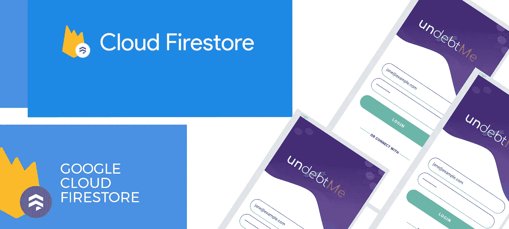

# 使用 Firestore 的离线模式和 React Native 时需要考虑的几个问题

> 原文：<https://betterprogramming.pub/a-few-gotchas-to-consider-when-working-with-firestores-offline-mode-and-react-native-97fec1604209>

## Firestore 的离线持久化是如何工作的？

作者照片。

我最近参与的一个 React Native 项目使用了 [Cloud Firestore](https://firebase.google.com/docs/firestore) 的力量。该应用程序的核心思想是允许用户执行在线和离线任务，并为用户提供透明的同步过程。

这正是云 Firestore 提供的强大功能，但我想提到一些关于离线模式的问题和发现。他们可能会节省你的时间和头痛。

# Firestore 的离线模式是如何运作的？

让我们概述一个假设的场景，以便更好地理解。

让我们假设 Blarz(用户)正在使用 *MyFavouritesOfflineApp* ，它处理他最喜欢的电影和书籍。所以我们有两个主要的 Firebase/Firestore 收藏:书籍和电影。

布拉兹登录，一旦他在主页上，应用程序将开始获取他最喜欢的书籍和电影。

## 阅读动作

基本上，Blarz 在与应用程序交互时下载各种文档。

这些文档的下载通过查询或单独的文档获取来进行。一旦发生这种情况，所有这些文件都缓存在布拉兹的手机上。

*注意:请记住，如果您没有以编程方式设置检索这些集合，或者如果用户没有与任何查询或文档交互，那么这些数据在脱机模式下也是不可用的。*

## 书写动作

让我们继续前面的场景，以便更好地理解。

假设布拉兹想要更新他最喜欢的电影之一。这是一个对`movie`集合和与 Blarz 想要更新的电影相关联的文档进行更改的请求。

请记住，数据保留在缓存中，因此即使数据没有进入服务器，您也可以立即看到变化。

# 脱机工作时的陷阱

我不得不承认:我是在调试了一段时间后才发现这些问题的，当时我正着手解决吉拉上的一个报告错误。当然，没有足够的离线测试，所以我没有意识到所有这些。

当使用 Firestore 的离线模式时，我们需要避免在某些事情上使用`await`,比如在 Firebase 上创建或更新东西。

在服务器上成功写入文档之前，由`await`表达式生成的承诺不会完成。这将阻止您的 UI，即使在缓存中进行了更改。

有两种方法可以解决这个问题。

## 1.避免等待，而是使用回调或承诺(推荐)

如果你想确定一个写服务器已经发生了，使用回调或者承诺都可以。但是你不需要通过使用`await`表达式来阻塞线程。

所以代替这个的是:

换成承诺的用法。类似于以下内容:

通过这样做，你将解锁你的用户界面，应用程序将在离线模式下正常工作。

## 2.检查连接状态

这可能不是一个奇特的解决方案，但是如果您仍然想要使用`await`表达式的糖语法，您可以只检查连接状态并依赖它来决定做什么。

# 在添加之前获取 id

这是另一场战斗。我需要归还用户文档。

由于`await`表达式的问题，我需要找到一种方法在添加文档之前返回它的 ID。

我有过这样的经历:

在我删除了`await`表达式之后，代码看起来如下:

这个代码片段基本上是创建一个用户引用—一个文档引用。然后你甚至不用在云 Firestore 上创建就可以获得用户的 ID。请记住，我们仍在离线模式下工作。

最后几行代码使用一个承诺添加用户。我们不等待服务器的响应，所以我们返回刚刚创建的新用户。

仅此而已。

# 最后的想法

云 Firestore 以一种奇特的方式为我们提供了在线和离线工作的能力。在离线模式下工作时，我们不需要担心任何事情，因为对于 iOS 和 Android，离线持久性是默认启用的。

也就是说，在离线工作时，你需要记住一些问题。其中最重要的是避免使用`await`表达。

这一点很重要，因为如果您不这样做，UI 将被锁定，因为您将等待响应，即使这些更改已经完成并在缓存中。

解决方法是使用回电或承诺。

我希望这篇文章是有帮助的。下一集再见！