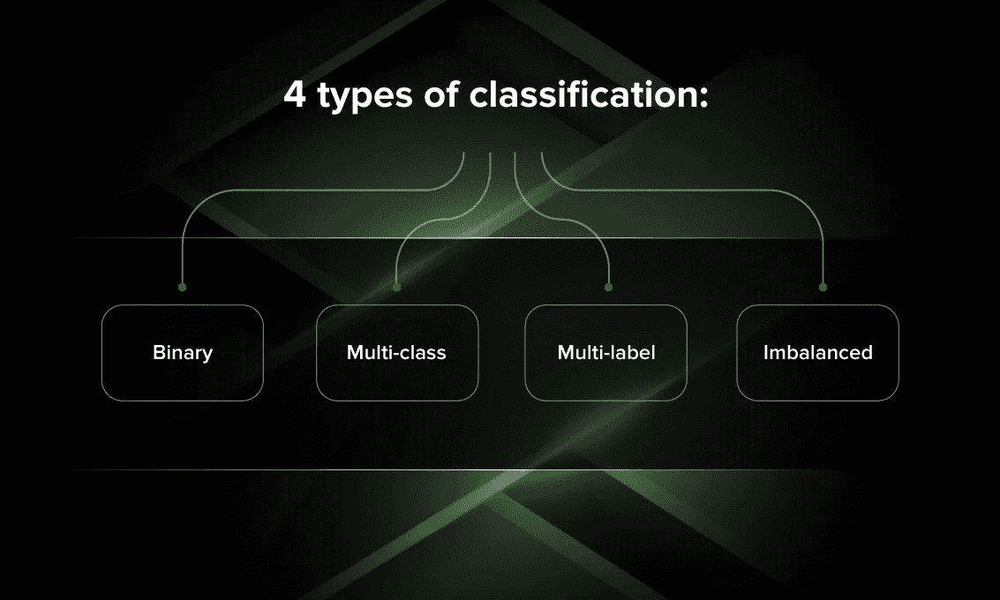
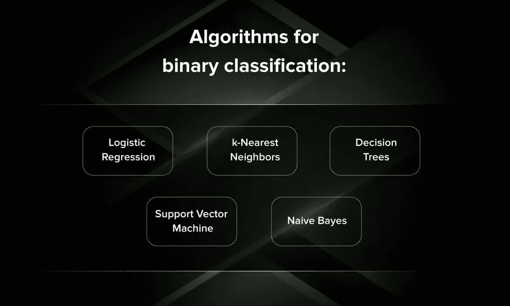
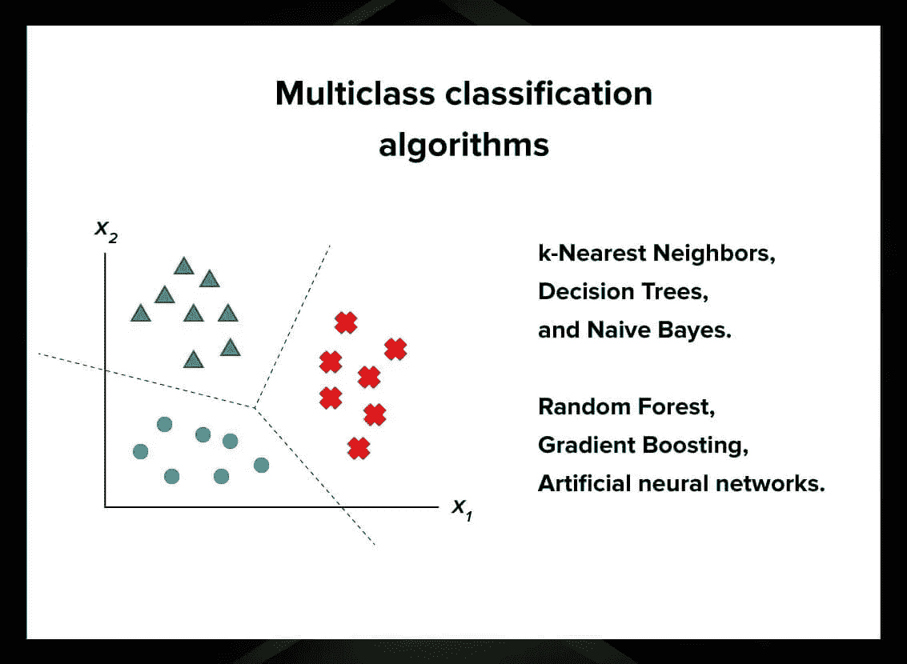
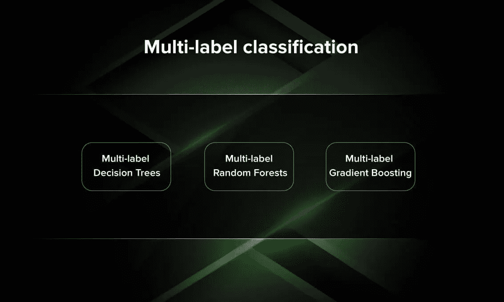
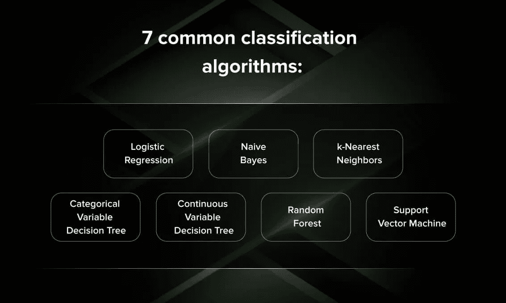

# 分类算法指南

> 原文：<https://betterprogramming.pub/a-guide-to-classification-algorithms-fdaabb538b26>

## 二元、多类、多标签和不平衡分类

照片由[edu·格兰德](https://unsplash.com/@edgr?utm_source=medium&utm_medium=referral)在 [Unsplash](https://unsplash.com?utm_source=medium&utm_medium=referral) 上拍摄

今天，我们将看到流行的分类算法是如何工作的，并帮助我们，例如，挑选和分类美味多汁的西红柿。

我要提醒你，没有一种算法在所有可能的情况下都是最优的。机器学习算法是一种微妙的工具，你可以根据问题集进行调整，特别是在有监督的机器学习中。

# 分类如何工作

我们每天预测一个事物是否可以被称为特定的类。举个例子，分类帮助我们在超市挑选西红柿时做决定(“绿的”、“完美的”、“腐烂的”)。用机器学习的术语来说，我们给我们手里拿着的每一个番茄分配一个类别的标签。

你的番茄采摘比赛的效率(有人称之为分类模型)取决于其结果的准确性。你自己去超市的次数越多(而不是让你的父母或你的另一半去)，你就越能挑选出新鲜美味的西红柿。

电脑也是一样。对于学习准确预测结果的分类模型来说，它需要大量的训练示例。

# 4 种分类

图片来源:作者

## 二进制的

二元分类意味着有两个相互关联的类，即真和假。想象你面前有一个巨大的盒子，里面有黄色和红色的西红柿。但是你的意大利通心粉食谱上说你只需要红色的。

你是做什么的？显然，您使用了[标签编码](https://medium.com/@contactsunny/label-encoder-vs-one-hot-encoder-in-machine-learning-3fc273365621#:~:text=Label%20Encoding&text=And%20to%20convert%20this%20kind,use%20the%20Label%20Encoder%20class.&text=That's%20all%20label%20encoding%20is,country%20names%20into%20numerical%20data.)，在这种情况下，将 1 分配给“红色”，将 0 分配给“非红色”分拣西红柿从未如此简单。

图片来源:作者

## 多类

你在这张照片中看到了什么？

资料来源:freepik.com

红牛排西红柿。樱桃番茄。鸡尾酒西红柿。祖传番茄。

这里没有非黑即白，没有像二元分类中的正常和异常。我们欢迎各种各样的美味蔬菜(或浆果)来到我们的餐桌上。

如果你不是番茄烹饪的爱好者，你可能不知道的是，对于同一道菜来说，不是所有的番茄都一样好。红色的牛排番茄非常适合做沙拉，但是你不能腌制它们。樱桃番茄适合做沙拉，但不适合做意大利面。所以知道自己面对的是什么很重要。

多类分类帮助我们对盒子里的所有番茄进行分类，不管有多少类。

图片来源:作者

## 多标签

当一个输入可以属于多个类别时，例如一个人是两个国家的公民，则应用多标签分类。

要使用这种类型的分类，您需要构建一个可以预测多个输出的模型。

例如，当您不仅需要识别西红柿，还需要识别同一幅图像中的其他不同种类的对象:苹果、西葫芦、洋葱等时，您需要对照片中的对象进行多标签分类。

**所有番茄爱好者的重要注意事项**:你不能只采用二元或多类分类算法，并将其直接应用于多标签分类。但是您可以使用:

图片来源:作者

您还可以尝试对每个类使用单独的算法来预测每个类别的标签。

## 失去平衡的

当每个类别中的示例分布不均匀时，我们使用不平衡分类。

不平衡分类用于欺诈检测软件和医疗诊断。在超市的一大堆西红柿中发现意外溢出的稀有精致的生物种植西红柿，就是分类失衡的一个例子。

图片来源:作者

我推荐你访问[机器学习大师](https://machinelearningmastery.com/types-of-classification-in-machine-learning/#:~:text=In%20machine%20learning%2C%20classification%20refers,one%20of%20the%20known%20characters.)的精彩博客，在那里你可以阅读不同类型的分类，并研究更多的机器学习材料。

# 构建分类模型的步骤

一旦你知道你正在处理什么样的分类任务，就该建立一个模型了。

1.  选择分类器。您需要选择一种将应用于您的数据的 ML 算法。
2.  训练它。你要准备一个带有标注结果的训练数据集(例子越多越好)。
3.  预测产量。使用模型得到一些结果。
4.  评估分类器模型。最好准备一组您在培训中没有使用过的验证数据来检查结果。

现在让我们来看看最广泛使用的分类算法。

# 最流行的分类算法

图片来源:作者

[Scikit-learn](https://scikit-learn.org/stable/) 是 Python 的顶级 ML 库之一。所以如果你想建立你的模型，去看看吧。它提供了对广泛使用的分类器的访问。

## 逻辑回归

[Logistic 回归](http://faculty.cas.usf.edu/mbrannick/regression/Logistic.html)用于二元分类。

该算法采用逻辑函数来模拟结果发生的概率。当您想要了解几个独立变量如何影响单个结果变量时，这是最有用的。

例题:降水量和土壤成分会导致番茄的繁荣还是过早死亡？

逻辑回归有局限性；所有预测值都应该是独立的，不应该有缺失值。当没有值的线性分离时，该算法将失败。

## 朴素贝叶斯

朴素贝叶斯算法基于[贝叶斯定理](https://www.youtube.com/watch?v=HZGCoVF3YvM&t=780s)。您可以将此算法应用于二进制和多类分类，并根据历史结果对数据进行分类。

任务示例:我需要根据外观将腐烂的西红柿与新鲜的分开。

朴素贝叶斯的优点是这些算法构建起来很快:它们不需要大量的训练集，并且与其他方法相比也很快。然而，由于贝叶斯算法的性能取决于其强假设的准确性，结果可能会变得非常糟糕。

使用贝叶斯定理，可以判断一个事件[的发生如何影响另一个事件的概率](https://www.youtube.com/watch?v=R13BD8qKeTg)。

## k 近邻

kNN 代表“k 最近邻”，是最简单的分类算法之一。

该算法将对象分配到其在[多维特征空间](https://www.quora.com/What-is-a-simple-explanation-of-a-multi-dimensional-feature-space)中的大多数最近邻居所属的类别。数字 k 是特征空间中与被分类的对象相比较的相邻对象的数量。

示例:我想从与之相似的番茄品种中预测番茄的品种。

要使用 k-最近邻对输入进行分类，您需要执行一组操作:

*   计算到训练样本中每个对象的距离。
*   选择 k 个训练样本中距离最小的对象。
*   要分类的对象的类别是在 k 个最近的邻居中出现最频繁的类别。

## 决策图表

决策树可能是可视化决策过程最直观的方式。为了预测输入的类别标签，我们从树根开始。您需要根据您对每个[节点](https://www.analyticsvidhya.com/blog/2015/01/decision-tree-simplified/2/#:~:text=Decision%20Node%3A%20When%20a%20sub,say%20opposite%20process%20of%20splitting.)的决策规则，将可能性空间划分为更小的子集。

这里有一个例子:

图片来源:作者

你不断打破可能性空间，直到你到达树的底部。每个决策节点都有两个或多个分支。上面模型中的叶子包含了一个人是否合适的决定。

例如:你有一篮子不同的西红柿，想选择正确的一个来增加菜肴的味道。

**决策树的类型**

有两种树。它们基于目标变量的性质:

*   分类变量决策树
*   连续变量决策树

因此，决策树对数字和分类数据都很有效。使用决策树的另一个好处是它们需要很少的数据准备。

但是，决策树可能会变得过于复杂，导致[过拟合](https://elitedatascience.com/overfitting-in-machine-learning)。这些算法的一个显著缺点是，训练数据中的微小变化会使它们不稳定，并产生全新的树。

## 随机森林

随机森林分类器在数据集的各种子样本上使用几种不同的决策树。将平均结果作为模型的预测，从总体上提高了模型的预测精度，并克服了过拟合问题。

因此，随机森林可以用来解决复杂的机器学习问题，而不会损害结果的准确性。尽管如此，它们需要更多的时间来形成预测，并且实施起来更具挑战性。

在[走向数据科学博客](https://towardsdatascience.com/understanding-random-forest-58381e0602d2#:~:text=The%20random%20forest%20is%20a,that%20of%20any%20individual%20tree.)中阅读更多关于随机森林如何工作的信息。

## 支持向量机

支持向量机使用 N 维空间中的超平面来分类数据点。这里是特征的数量。基本上，它可以是任何数字，但是它越大，就越难建立模型。

人们可以把超平面想象成一条线(对于二维空间)。一旦你通过三维空间，我们就很难想象这个模型了。

落在超平面不同侧的数据点属于不同的类别。

示例:根据形状、重量和颜色对番茄进行分类的自动系统。

我们选择的超平面直接影响结果的准确性。因此，我们搜索两类数据点之间距离最大的平面。

当你有许多特征时，支持向量机以最小的计算能力显示精确的结果。

# 总结

正如你所看到的，机器学习可以像在商店里捡蔬菜一样简单。但是如果你不想搞砸的话，有很多细节要记住。