# 使用 Autocode 通过 Webhooks 连接应用程序的指南

> 原文：<https://betterprogramming.pub/a-guide-to-connecting-your-apps-via-webhooks-with-autocode-685accab8eae>

## 了解在 Autocode 上构建端点以配置 webhooks 的基础知识。


当特定事件发生时，应用程序使用 webhooks 通知外部应用程序。例如，webhooks 是 [Stripe](https://stripe.com/docs/api/webhook_endpoints) 如何在新客户订阅时通过电子邮件通知您，当提交表单时 [Webflow](http://developers.webflow.com/#webhook-events) 如何将新的销售线索信息保存到 Airtable，以及当有新的购买时 [Shopify](https://shopify.dev/api/admin-rest/2022-04/resources/webhook) 如何通过 Slack 提醒您。了解如何配置 webhook 集成可以帮助您节省时间并提高工作效率。

在本指南中，我们将介绍在 Autocode 上构建端点来配置 webhooks 的基础知识。为了巩固我们的学习，我们将构建一个端点并配置一个 webhook，以便在 [Tally.so](https://tally.so/) 提交表单时，自动发送一条定制的 SMS 消息和电子邮件。

# 我们将学到什么:

*   什么是 webhook？
*   什么是端点？
*   真实世界 webhook 示例
*   在 Autocode 上创建具有短信和电子邮件功能的端点
*   在 Tally.so 上将我们的端点配置为 webhook
*   使用 Autocode 上的事件数据定制短信和电子邮件

# 什么是 Webhook？

Webhooks 将事件驱动的即时消息从一个应用程序传递到另一个应用程序。这里的关键定义是“事件驱动”消息。

当应用程序中发生一个事件时，比如 Stripe 中发生了一次购买，一个有效负载数据被发送到一个 webhook URL。这个 webhook 将充当一个“监听器”，这意味着它将从该事件接收数据的有效载荷。它还可以处理事件，这意味着它可以执行代码向多个 API 发出请求。为了让我们配置 webhook，应用程序必须支持 web hook。我们在工作中使用的很多应用，比如 Github、Salesforce、Hubspot、Slack，都有通过 webhooks 扩展其应用的能力，但有些没有。

# 什么是端点？

端点是一个包含托管在 Autocode.com 上的代码的文件。部署后，该代码可通过对自动生成的端点 URL 的 HTTP 请求来执行。您的端点 URL 包含您的 Autocode 用户名，后跟项目名称和开发环境。例如:


# 真实的 Webhook 示例

Webhooks 消除了信息滞后，提供了更好的客户体验。例如，假设您正在使用 Stripe，并且您希望在客户订阅您的服务后立即联系他们。通过在 Stripe 上设置 webhook 来将更新推送到您的客户成功团队，您可以确保您的团队对新订户做出快速响应。

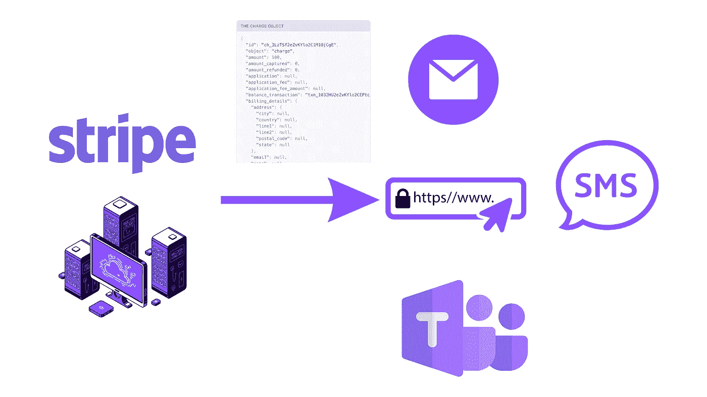

# 关键术语

*   **web hook**——一种从一个应用程序向另一个发送数据的方式。您将一个端点 URL 配置为一个 webhook，告诉应用程序向何处发送数据。
*   **端点**—Autocode 上的一个文件，每当应用程序通过 webhook 配置向它发送数据时，它就运行代码
*   **有效负载** —通过 webhook 从一个应用程序发送到另一个应用程序的数据
*   **API** —应用程序编程接口是更复杂的定义指令，用于一个应用程序如何使用代码与另一个应用程序进行通信。您可以通过在 Autocode 编辑器中键入 await lib 来尝试 Autocode 本身支持的 API。

我们现在对 webhooks 的工作原理有了更高层次的理解。然而，没有比实践更好的学习方法了，所以让我们开始在 Autocode 上构建端点，并在 Tally 上配置 webhook。Tally 让我们构建类似于 Typeform 和 Google Forms 的表单，并且它方便地支持在提交表单时向 webhook 发送数据！

# 在 Autocode 上创建具有 SMS 功能的端点

登录到您的[自动编码仪表板](https://autocode.com/dashboard)并点击`New Web Service`按钮。


选择您希望此项目存在的帐户，为其命名，然后点按“创建项目”。分配给项目的名称将构成端点 URL 的一部分。

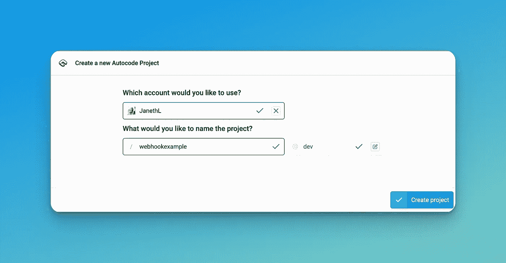

您将被重定向到 Autocode 的代码编辑器。删除第 3 行以下的所有内容。在第 3 行，我们包含了我们的`lib` Node.js 包。这允许你用一行代码连接到 [Autocode 的标准库](https://autocode.com/lib)中的任何 API。

让我们从为我们的端点添加 SMS 功能开始。您可以通过键入 await lib 来搜索可用的 API。将出现可用 API 列表。

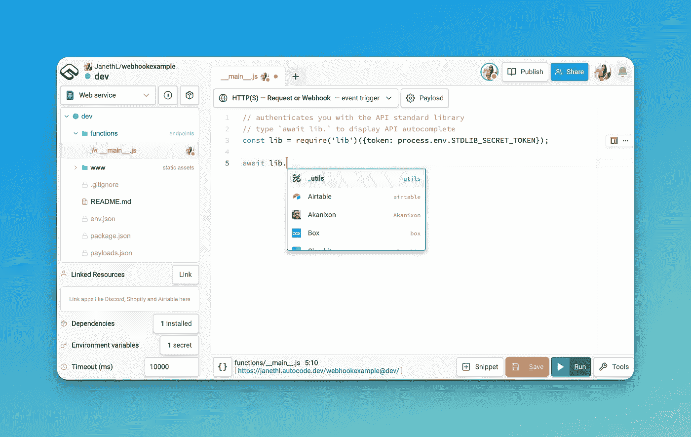

将弹出所有可用 API 集成的列表。选择`utils` API 选项并搜索允许我们**发送 SMS 消息的方法(仅限美国和 CA)。**

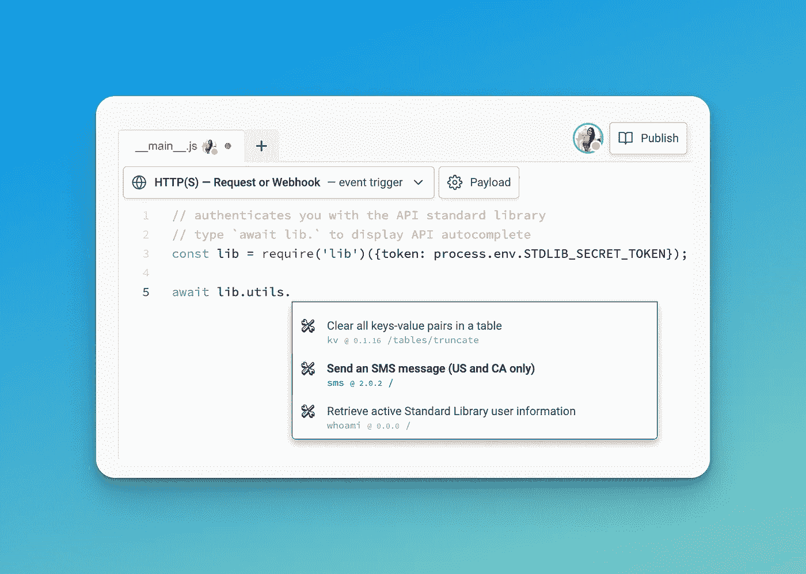

Autocode 将弹出一个窗口，帮助准备这个 SMS API 的 API 请求。您将被要求输入两个参数。

*   第一个参数是接收消息的电话号码。在此输入您的电话号码！
*   第二个参数是您希望在提交计数表单时发送的消息。现在，我们保持简单，只输入`A form was submitted!`。


完成 API 请求的配置后，单击蓝色的完成配置按钮，然后单击橙色的保存按钮。

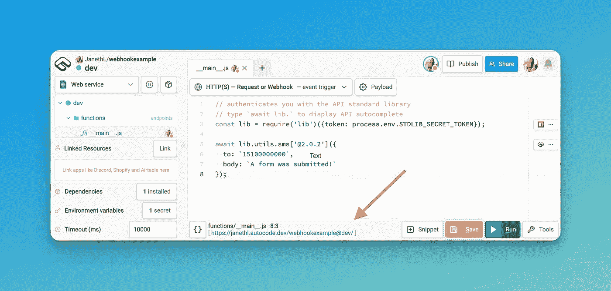

将编辑器底部的端点 URL 复制到安全的地方。在本教程的后面，您将需要它！

它由您的用户名、项目名和您选择的开发环境组成:

```
https://<username>.autocode.dev/<projectname>@dev/.
```


将编辑器底部的端点 URL 复制到安全的地方。在本教程的后面，您将需要它！现在我们已经有了端点 URL，让我们尝试使用 Tally 向它发送数据。Tally 是一种创建表格和调查的简单方法。我们将在 Tally 上构建并发布一个示例表单，然后尝试使用 webhook 将数据发送到 Autocode。前往[理财师](https://tally.so/)，注册账户。

# 在 Tally 上配置 Webhook

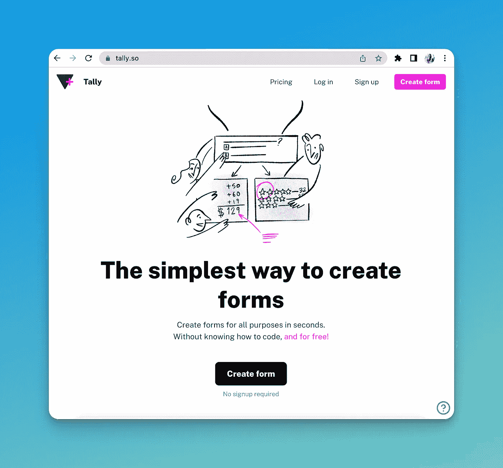

出于演示目的，我们将使用以下销售线索挖掘模板:

[销售线索生成表单模板](https://tally.so/templates/lead-generation-form/l3jQmM)

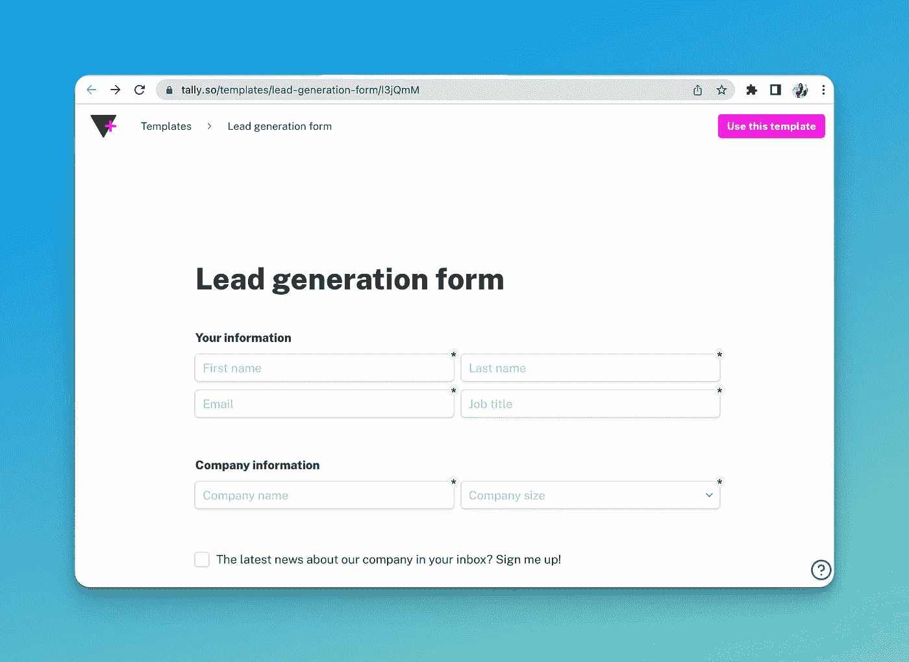

这是一个简单的表单，接受几个输入。选择**使用此模板**，然后在顶部菜单栏选择**发布**。一旦我们完成了这个示例，您可以返回并根据自己的喜好进行修改。


一旦您发布，Tally 将生成一个到您表单的唯一链接。复制此链接，在单独的选项卡上打开表单，然后选择“集成”选项卡。

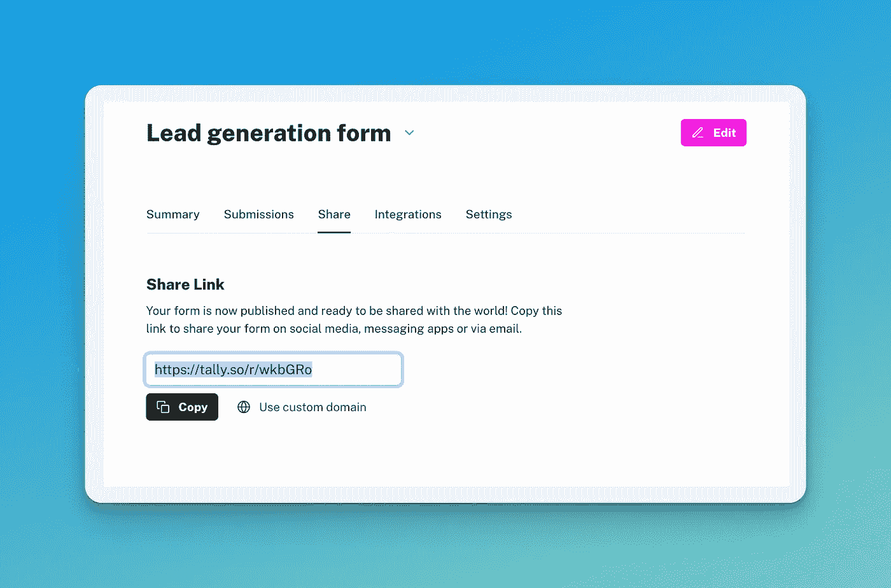

正如你所看到的，Tally 提供了本地集成，这使得它很容易连接到其他平台和工具。然而，它本身并不支持 Twilio 或 Gmail。幸运的是，我们可以将表单提交发送到 Autocode 端点来绕过这个限制。


选择 Webhooks 选项，并通过注册您在 Autcode 上创建的端点的 URL 来设置您的 webhook。确保不要在端点 URL 前后留下任何空格，并选择 Connect。

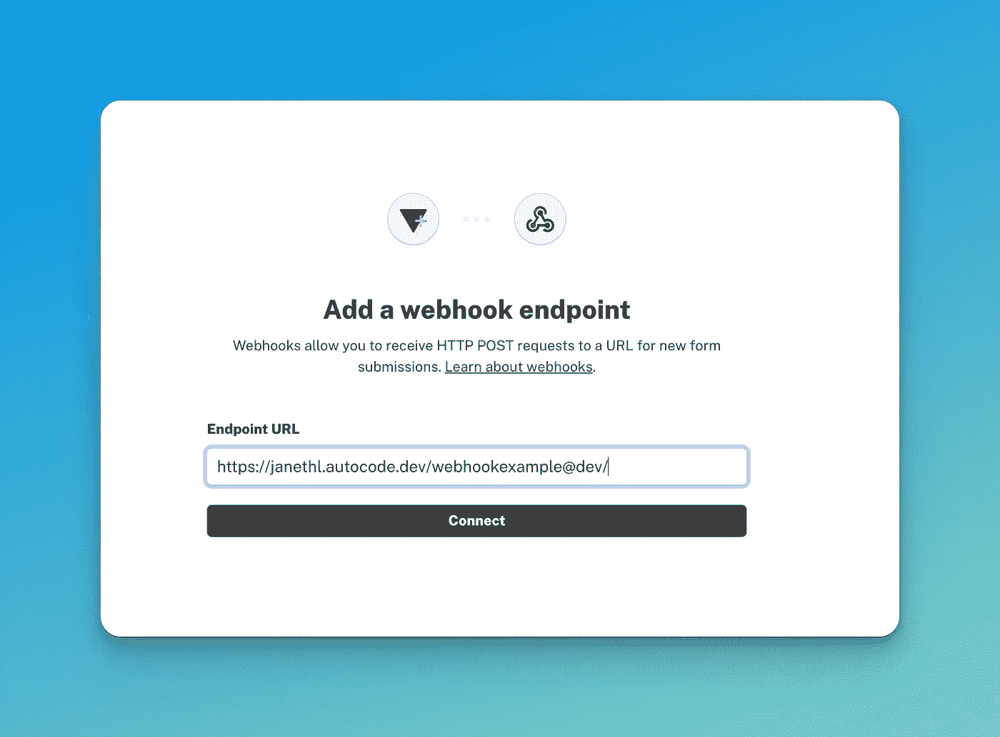

一旦您设置了 webhook 端点，您将返回到您的销售线索生成表单的控制面板。您应该通过切换`enable`选项来确保 webhook 已打开。

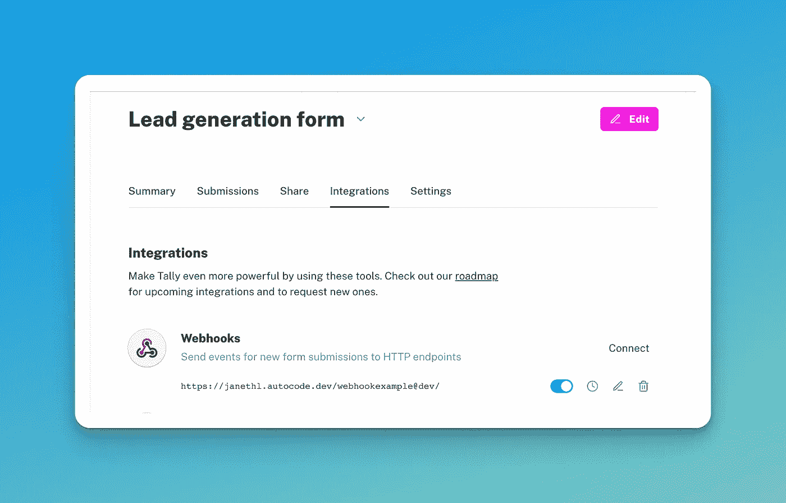

通过提交表格来测试你的 webhook。当您在 Autocode 中配置参数时，您应该会收到一条消息，发送到您设置的号码。

# 使用事件数据定制 SMS 消息

到目前为止，我们已经能够部署一个端点，配置一个 webhook URL，并触发一个通知。接下来，让我们学习如何从事件有效负载中提取数据，以便根据发送者的姓名、电子邮件地址和职位定制每个文本。返回 Autocode 编辑器，点击编辑器右下角的`Tools`按钮。


将弹出一个窗口，让您访问四个不同的选项卡。`Logs`选项卡将显示对您的端点的任何错误消息和请求。

# 检查请求

通过这里，我们可以检查发送到 Autocode 的单个 HTTP(S)请求和事件。我们还能够将事件有效负载直接复制到 Autocode IDE 中，以调试和迭代我们的代码。将鼠标悬停在最新请求上方，并选择`Inspect Request`。

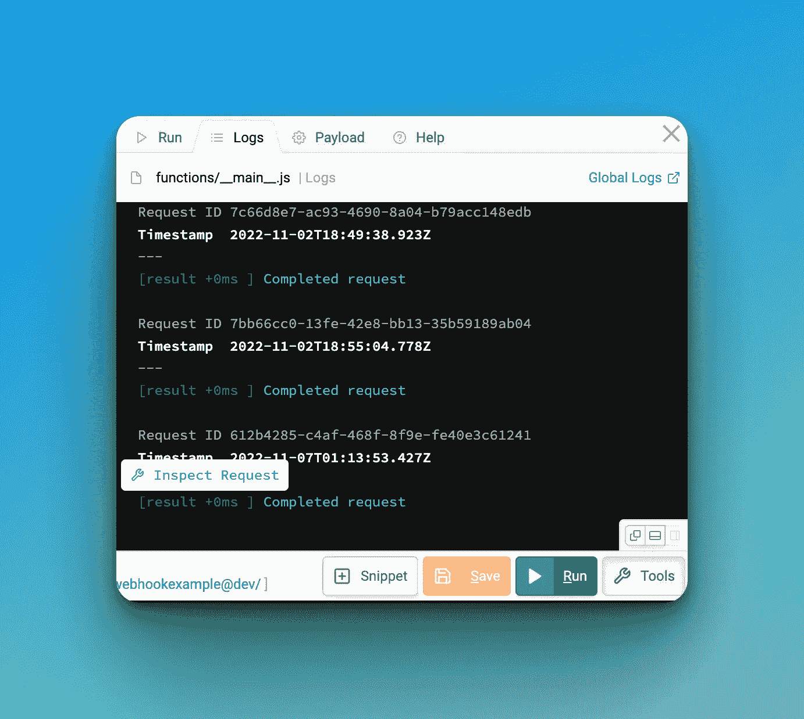

在这里，我们可以访问事件被接收的时间，从计数，标题和更多的数据完整的事件有效载荷。

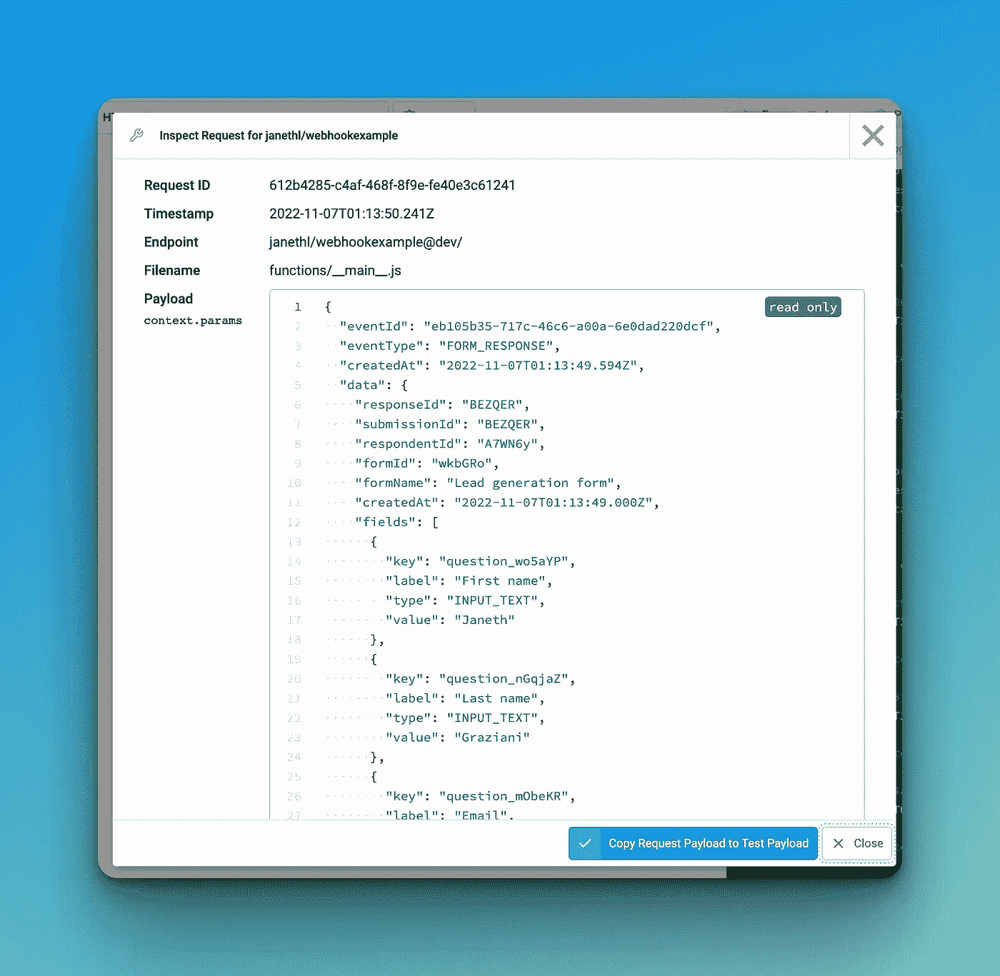

您可以通过单击蓝色的 Copy Request Payload to Test Payload 按钮，将此请求负载复制到您的测试负载。这将导致您的有效负载数据自动填充到 Autocode IDE 中的`Payload`选项卡上。这允许您通过按下编辑器右下角的绿色`Run`按钮来模拟一个事件，从而大大加快端点代码的迭代速度。


既然我们在迭代代码时有了实际的事件数据可以使用，让我们回到编辑每次提交计数表单时发送的 SMS 消息。我们可以使用点符号和模板文字从事件负载中提取值。我们将格式化我们的消息，为通过 SMS 提交表单的每个人发送名字、姓氏、电子邮件和角色。

```
// authenticates you with the API standard library
// type `await lib.` to display API autocomplete
const lib = require('lib')({token: process.env.STDLIB_SECRET_TOKEN});
await lib.utils.sms['@2.0.2']({
  to: `10000000000`, //your number here
  body: `A form was submitted here is the info:
  name: ${context.params.data.fields[0].value} ${context.params.data.fields[1].value}!
  email: ${context.params.data.fields[2].value}
  role: ${context.params.data.fields[3].value}`,
});
return "message sent"
```

现在，我们可以通过按绿色的 run 按钮来模拟一个事件，而不是返回到 Tally，填写并提交表单来触发事件。


# 添加电子邮件通知

现在，让我们添加向端点发送电子邮件通知的逻辑。让我们向提交表单的人发送一封定制的电子邮件，并附上一条简单的确认消息，说明我们已经收到了他们的请求。使用 API 自动完成功能，通过键入`await lib.`来搜索 Gmail API，并选择撰写和发送邮件的方法。

填写相应的参数，点击**完成配置。**

```
// authenticates you with the API standard library
// type `await lib.` to display API autocomplete
const lib = require('lib')({token: process.env.STDLIB_SECRET_TOKEN});
await lib.utils.sms['@2.0.2']({
  to: `15100000000`, //your number here
  body: `A form was submitted here is the info:
  name: ${context.params.data.fields[0].value} ${context.params.data.fields[1].value}!
  email: ${context.params.data.fields[2].value}
  role: ${context.params.data.fields[3].value}`,
});
await lib.gmail.messages['@0.2.8'].create({
  to: `${context.params.data.fields[2].value}`,
  subject: `Hey ${context.params.data.fields[0].value} - we received your request!`,
  text: `Hey ${context.params.data.fields[0].value},\n\nThank you for submitting a request. We will get back to you shortly!\n\n-Janeth \nDeveloper Advocate`
});
```

如果这是第一次向 Gmail API 发出请求，请单击编辑器左下角的红色`required`按钮，并按照说明链接新资源。

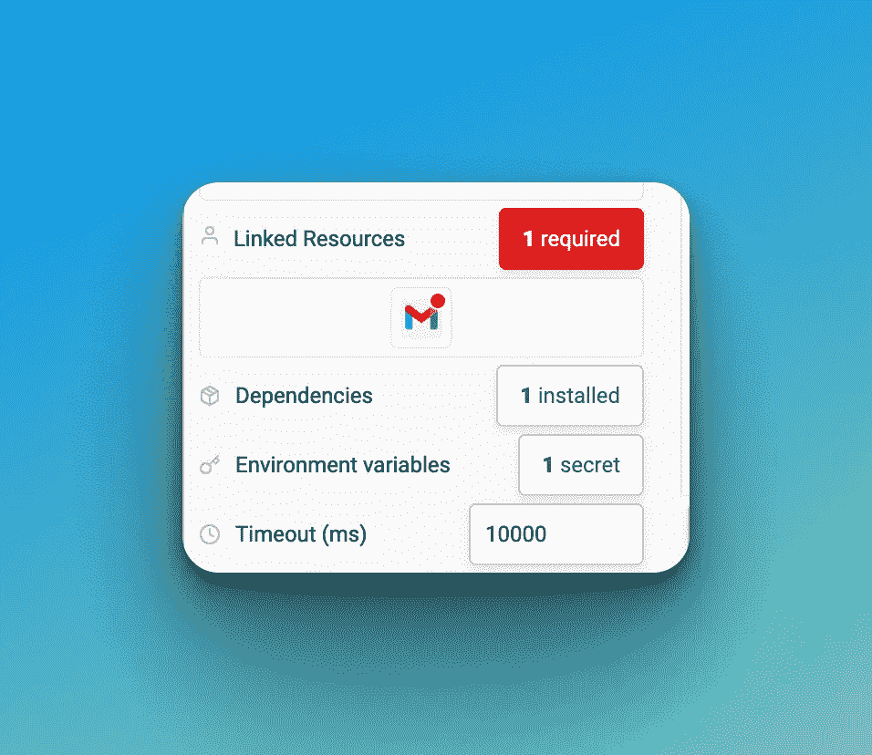

用你的电子邮件提交一份表格，你将在几秒钟内收到一封电子邮件。


# 是时候开始建造了

恭喜你！现在，您已经具备了构建 webhook 功能的 webhook 语言和工具。