# 深度学习和神经网络指南

> 原文：<https://betterprogramming.pub/a-guide-to-deep-learning-and-neural-networks-a2379c42f59b>

## 什么是神经网络，是什么让它“深”起来的？

由[乌列尔 SC](https://unsplash.com/photos/11KDtiUWRq4) 在 [Unsplash](https://unsplash.com/) 上拍摄的照片。

作为人工智能的一个子集，深度学习是各种创新的核心:自动驾驶汽车、自然语言处理、图像识别等等。提供 DL 解决方案的公司(如亚马逊、特斯拉、Salesforce)处于股票市场的前沿，吸引了令人印象深刻的投资。根据 [Statista](https://www.statista.com/statistics/621468/worldwide-artificial-intelligence-startup-company-funding-by-year/) 的数据，2014-2019 年全球人工智能创业公司的资金总额等于 260 多亿美元。这种高度兴趣可以用深度学习及其架构——人工神经网络——的惊人好处来解释。

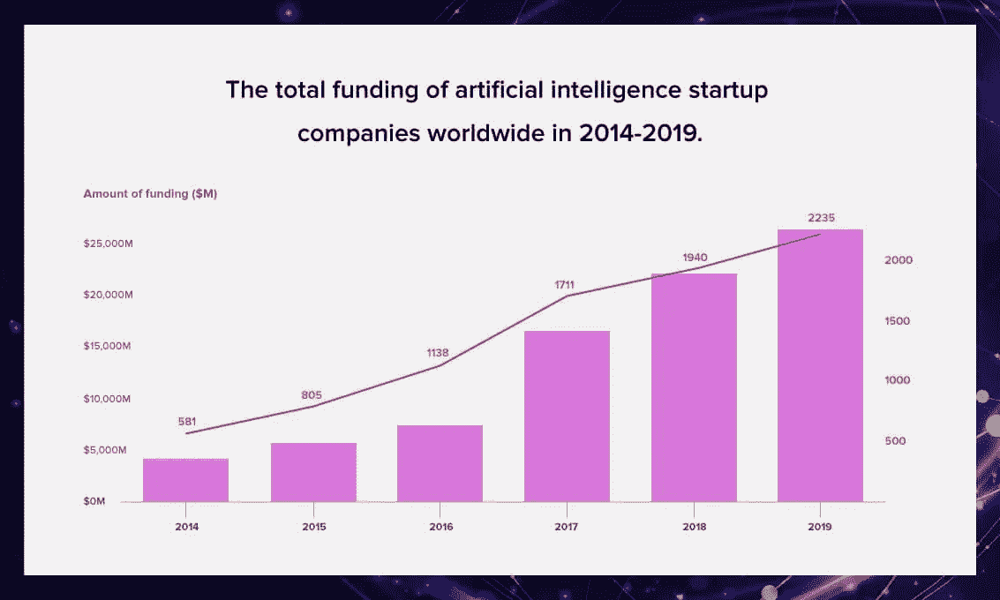

# 什么是深度学习？

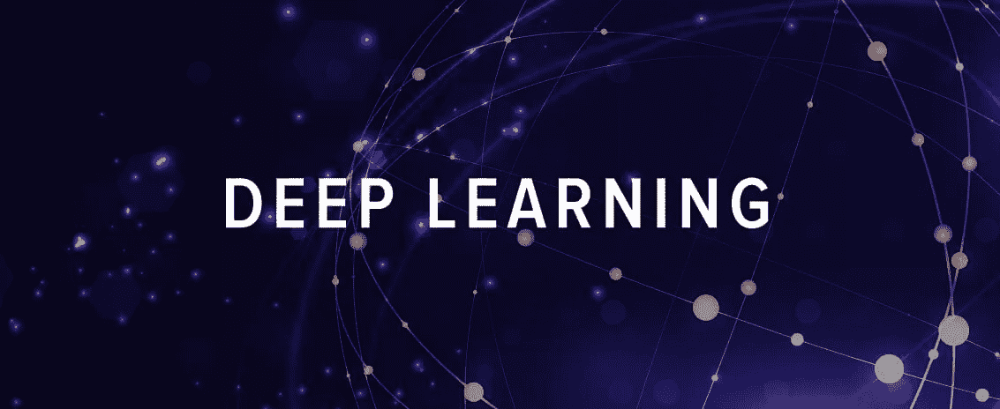

深度学习是机器学习的子集之一，它使用深度学习算法，根据输入数据隐式地得出重要的结论。

通常，深度学习是无监督或半监督的。深度学习基于[表征学习](https://en.wikipedia.org/wiki/Feature_learning#:~:text=In%20machine%20learning%2C%20feature%20learning,or%20classification%20from%20raw%20data.)。它不是使用特定于任务的算法，而是从有代表性的例子中学习。例如，如果您想要建立一个按物种识别猫的模型，您需要准备一个包含大量不同猫图像的数据库。

深度学习的主要架构有:

*   卷积神经网络
*   递归神经网络
*   生成对抗网络

我们将在本文后面更详细地讨论它们。

# 机器学习和深度学习的区别

机器学习试图从加载到系统中的大量预处理数据中提取新知识。程序员需要为机器制定规则，机器根据这些规则进行学习。有时，人类可能会介入来纠正它的错误。

然而，深度学习有点不同。虽然常规的机器学习可以处理小数据集，并且计算量没有那么大，但深度学习需要大量的计算资源和大量的数据集才能正常工作。此外，深度学习模型决策背后的逻辑并不透明。

作为回报，深度学习模型提供了更大的机会。

# 深度学习的优势

以下是深度学习的一些优势。

*   在大量原始数据中识别模式和异常的能力使深度学习能够高效地向专业人员提供准确可靠的分析结果。例如，亚马逊网站上有超过[5.6 亿件商品和 3 亿+用户](https://www.digitalcommerce360.com/article/amazon-sales/)。没有人工智能工具，没有会计人员，甚至没有一整支会计队伍能够跟踪这么多交易。
*   深度学习不像传统的机器学习那样依赖人类的专业知识。DL 允许我们在数据中有所发现，即使开发人员不确定他们想要找到什么。例如，您希望您的算法能够[预测客户保持率](https://www.digitalocean.com/community/tutorials/how-to-build-a-deep-learning-model-to-predict-employee-retention-using-keras-and-tensorflow)，但是您不确定客户的哪些特征将使系统能够做出这种预测。

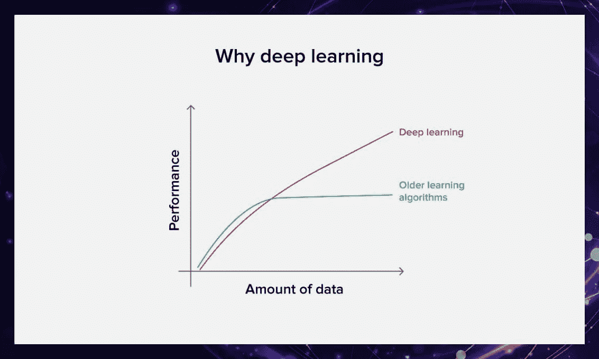

# 深度学习的问题

*   收集大量高质量的数据需要耗费大量资源。多年来，最大和准备最充分的样本集合是 [ImageNet，拥有 1400 万张不同的图像](https://www.zdnet.com/article/worlds-largest-image-database-to-help-computers-learn-to-see/#:~:text=To%20develop%20a%20system%20that,holds%2014%20million%20labeled%20images.)和 20，000 多个类别。它成立于 2012 年，仅在去年，[腾讯发布了一个更大、更通用的数据库](https://neurohive.io/en/datasets/tencent-dataset/)。
*   深度学习技术的另一个困难是，它不能为其结论提供理由。因此，如果您不知道输出应该是什么，就很难评估模型的性能。与传统的机器学习不同，你将无法测试算法，并找出为什么你的系统决定，例如，它是图片中的一只猫，而不是一只狗。
*   构建深度学习算法的成本非常高。没有受过复杂数学训练的合格员工，这是不可能的。而且，深度学习是一项资源密集型技术。它需要强大的 GPU 和大量内存来训练模型。当输入通过网络传播时，需要大量内存来存储输入数据、权重参数和激活函数。有时深度学习算法变得如此耗电，以至于研究人员宁愿使用其他算法，甚至牺牲预测的准确性。

但是，在很多情况下，深度学习是不可替代的。

# 你如何将 DL 应用于现实生活中的问题？

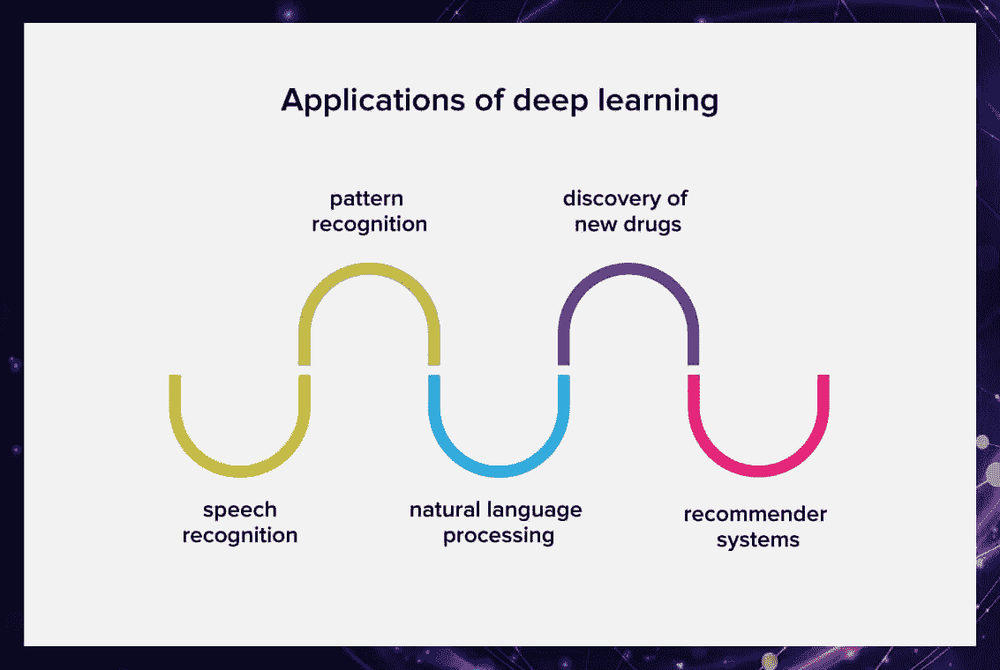

如今，深度学习被应用于不同行业的各种用例:

*   **语音识别。**所有主流的商业语音识别系统(像微软 Cortana、Alexa、谷歌助手、苹果 Siri)都是基于深度学习的。
*   **模式识别。**在[医疗诊断](https://www.bbc.com/news/health-50857759#:~:text=Artificial%20intelligence%20is%20more%20accurate,images%20from%20nearly%2029%2C000%20women.)中，模式识别系统已经能够给出比人眼更准确的结果。
*   **自然语言处理。**自 21 世纪初以来，神经网络一直被用于实现语言模型。LSTM 的发明帮助改进了机器翻译和语言建模。
*   **新药的发现。**例如， [AtomNet 神经网络](https://arxiv.org/abs/1510.02855)已经被用于预测可能治愈埃博拉和多发性硬化症等疾病的新生物分子。
*   **推荐系统。**如今，深度学习正被用于研究许多领域的用户偏好。网飞是这个领域最聪明的例子之一。

# 什么是人工神经网络？

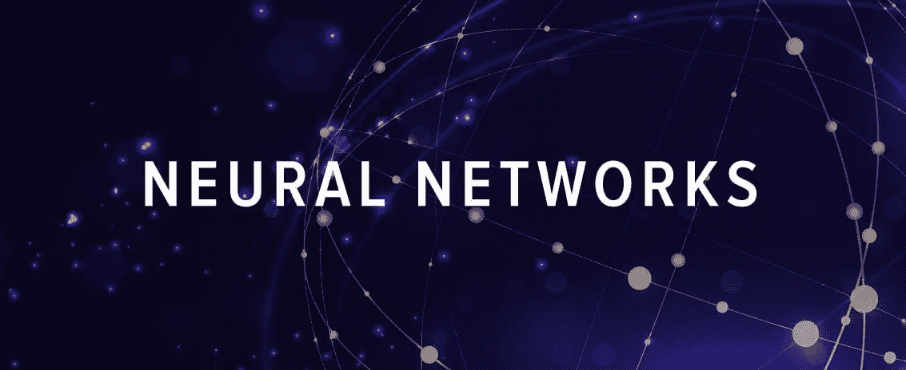

*人工神经网络*和*深度学习*经常互换使用，这并不真正正确。不是所有的神经网络都是“深度的”，意思是“有很多隐藏层”，也不是所有的深度学习架构都是神经网络。还有[深度信念网络](https://en.wikipedia.org/wiki/Deep_belief_network#:~:text=In%20machine%20learning%2C%20a%20deep,between%20units%20within%20each%20layer.)，比如。

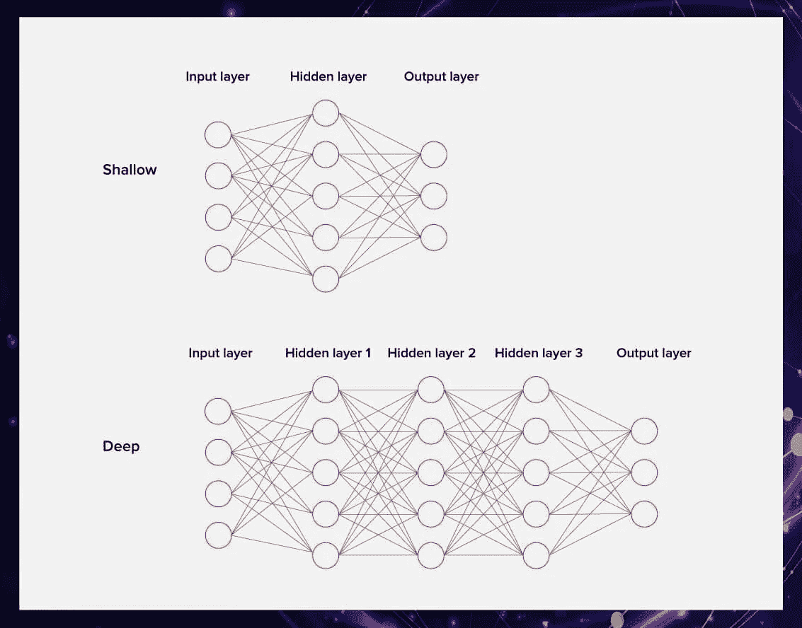

然而，由于神经网络是目前最热门的算法，事实上，它对于解决复杂的任务非常有用，所以我们将在本文中讨论它们。

# 人工神经网络的定义

人工神经网络在很大程度上受到人类大脑结构的启发。简而言之，人工神经网络代表了由突触连接的神经元序列。这些序列通常被组织成层。

系统中有许多(有时数百万)输入神经元，机器学习分析甚至记忆各种信息。由于这种结构，神经网络可以非常快速地处理大量的信息。

这里有一个视频，适合那些想更深入地了解人工神经网络如何工作的技术细节的人。

人工神经网络不仅在分析输入信息方面，而且在从记忆中复制信息方面，都具有不可思议的价值。

# 神经网络的组件

每个神经网络都由神经元、突触、权重、偏差和功能组成。

## 神经元

神经元或神经网络的节点是一个计算单元，它接收信息，用信息执行简单的计算，并进一步传递信息。

网络中的所有神经元分为三组:

*   从外界接收信息的输入神经元
*   处理这些信息的隐藏神经元
*   产生结论的输出神经元

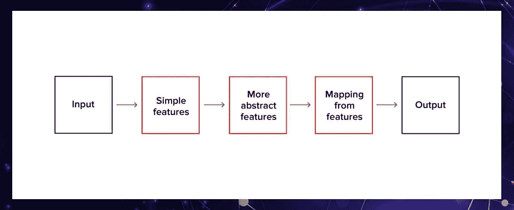

在具有许多神经元和神经元之间的连接的大型神经网络中，神经元被组织成层。一个输入层接收信息， *n* 个隐藏层(至少三个或更多)处理它，一个输出层提供一些结果。

每个神经元输入和输出一些数据。如果这是第一层，输入=输出。在其他情况下，神经元从前一层接收的信息被传递给输入。然后，它使用一个激活函数来获得新的输出，该输出被传递给系统中的下一层神经元。

神经元只处理[0，1]或[-1，1]范围内的数字。为了将数据转化为神经元可以处理的东西，我们需要标准化。我们在[关于回归分析](https://serokell.io/blog/regression-analysis-overview)的帖子中讨论了它是什么。

等等，但是神经元是怎么交流的呢？通过突触。

## 突触和重量

如果我们没有突触，我们就会被困在一堆不活跃、无用的神经元中。突触是两个神经元之间的连接。每个突触都有重量。当输入信息从一个神经元传输到另一个神经元时，权重改变了输入信息。权重较大的神经元将在下一个神经元中占主导地位。可以说，[权重矩阵](https://en.wikipedia.org/wiki/Weighing_matrix)是整个神经系统的大脑。

正是由于这些权重，输入信息被处理并转换成结果。在初始化期间(NN 的第一次启动)，权重是随机分配的。后来，它们被优化。

## 偏见

偏置神经元允许存储更多的权重变化。偏差为模型权重添加了更丰富的输入空间表示。

在神经网络的情况下，一个偏置神经元被添加到每一层。它通过使激活功能在图表上向左或向右移动而发挥重要作用。

的确，人工神经网络可以在没有偏向神经元的情况下工作。然而，它们几乎总是被添加进来，并作为整体模型中不可或缺的一部分。

# 人工神经网络如何工作

每个神经元处理输入数据以提取特征。假设我们有特征 x1、x2、x3 和三个神经元，每个神经元都与所有这些特征相关联。

每个神经元都有自己的权重，用于对特征进行加权。在训练网络的过程中，你需要为每个神经元选择这样的权重，使得整个网络提供的输出是真实的。

为了执行转换并获得输出，每个神经元都有一个激活功能。这让我们可以得到一些新的特征空间。这种函数组合执行一种由普通函数 F 描述的变换——这描述了神经网络魔力背后的公式。

有很多激活功能。我们将考虑最常见的:线性，sigmoid 和双曲正切。他们的主要区别是他们使用的价值观的范围。

## 线性函数

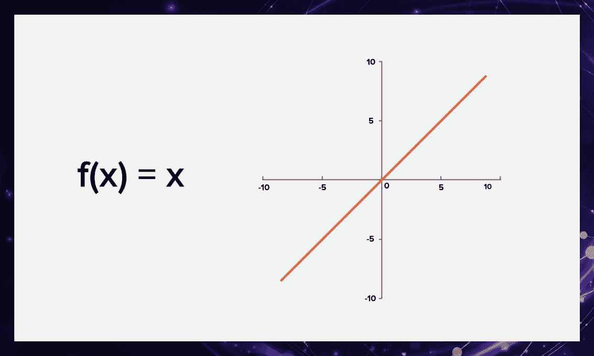

这个函数几乎从不使用，除非您需要测试一个神经网络或者不经过转换就传递一个值。

## 乙状结肠的

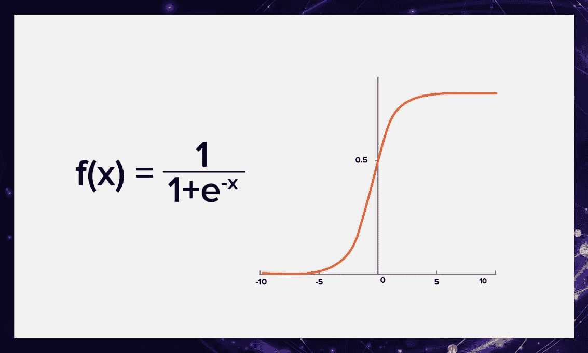

这是最常见的激活功能。其取值范围为[0，1]。然而，如果你的研究中有负值，你就不能使用它(例如，股票不仅可以上涨，也可以下跌)。在这种情况下，您将需要一个处理负值的函数。

## 双曲正切

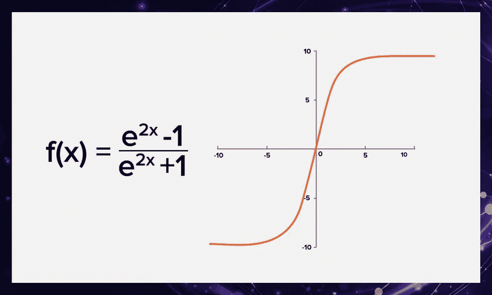

因为函数的范围是[-1，1]，所以只有当您的值既可以是负值也可以是正值时，使用双曲正切才有意义。不建议仅将此函数用于正值，因为这会显著降低神经网络结果的准确性。

# 你如何训练一个算法？

神经网络是如何训练的？基本上，和其他学习算法一样。我们有一些想要获得的输出，例如，一个类标签。有一些参考输出，我们知道这些功能应该有。例如，我们希望我们的神经网络能够区分猫和狗的照片，我们知道这些照片应该是什么样子。

Delta 是数据和神经网络输出之间的差值。我们使用微积分魔法，反复优化网络的权重，直到 delta 为零。显然，一旦增量为零，我们的模型就能够正确地预测我们的示例数据。

## 循环

这是一种计数器，每当神经网络通过一个训练集时，它就会增加。换句话说，这是神经网络完成的训练集的总数。

## 世

初始化神经网络时，该值设置为 0。时期越大，网络训练得越好，相应地，其结果也越好。每次我们遍历整个训练集时，历元都会增加。

## 一批

批量大小等于一次向前/向后传递中训练样本的数量。批量越大，需要的内存空间就越大。

迭代和纪元的区别是什么？

*   一个时期是所有训练示例的一个向前传递和一个向后传递
*   迭代的次数是通过的次数，每次通过使用[批量]数量的例子。明确一下，一次传球等于一次向前传球+一次向后传球(我们不把向前传球和向后传球算作两次不同的传球)。

# 那么错误呢？

误差是反映预期输出和接收输出之间差异的偏差。在每个时期之后，误差应该变得更小。如果这没有发生，那么你做错了。

误差可以用不同的方法计算，但我们只考虑三种主要方法:均方误差、均方根误差和反正切。

对于使用哪种方法没有限制，您可以自由选择哪种方法可以获得最佳结果。但是每种方法计算误差的方式不同:

*   在 Arctan 中，误差几乎总是较大，因为它的工作原理是差值越大，误差越大。
*   在根 MSE 中，误差最小，在误差计算中更均衡。MSE 是最常用的。

# 存在哪种神经网络？

存在如此多不同的神经网络，以至于不可能一一提及。如果你想了解更多关于这个品种的信息，请访问神经网络动物园，在那里你可以看到它们都被图形化了。

## 前馈神经网络

这是最简单的神经网络算法。前馈网络没有任何记忆。也就是说，在前馈网络中没有回头路。在许多任务中，这种方法不太适用。例如，当我们处理文本时，单词形成了一定的序列，我们希望机器能够理解它。

当您处理的数据不是顺序的或时间相关的时，前馈神经网络可以应用于监督学习。如果您不知道输出应该如何构造，但希望构建一个相对快速简单的神经网络，也可以使用它。

## 递归神经网络

递归神经网络可以处理文本、视频或图像集，每次都变得更加精确，因为它记住了上一次迭代的结果，并可以使用这些信息做出更好的决策。

递归神经网络广泛应用于自然语言处理和语音识别。

## 卷积神经网络

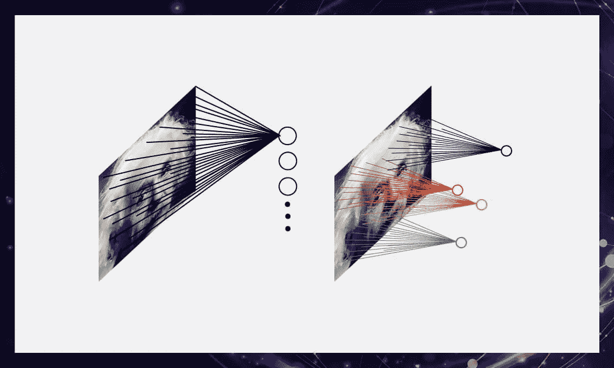

卷积神经网络是当今深度机器学习的标准，用于解决大多数问题。卷积神经网络可以是前馈的，也可以是递归的。

让我们看看它们是如何工作的。想象一下我们有一张阿尔伯特·爱因斯坦的照片。我们可以给输入图像中的所有像素分配一个神经元。

但是这里有一个很大的问题:如果你把每个神经元连接到所有像素，那么首先你会得到很多权重。因此，这将是一个计算量非常大的操作，需要很长时间。那么权重会非常多，这种方法对过拟合会非常不稳定。它将在训练样本上很好地预测一切，但在其他图像上效果很差。

因此，程序员提出了一种不同的架构，其中每个神经元只连接到图像中的一个小方块。所有这些神经元将具有相同的权重，这种设计被称为图像卷积。我们可以说，我们已经改变了画面，用一个简化过程的过滤器走过了画面。重量更轻，计数更快，不容易过度拟合。

想要了解卷积神经网络如何工作的精彩解释，请观看 Luis Serrano 的视频。

## 生成对抗性神经网络

生成式对抗网络是一种无监督的机器学习算法，它是两个神经网络的组合，一个(网络 G)生成模式，另一个(网络 A)试图区分真假样本。由于网络有相反的目标——创造样本和拒绝样本——它们开始了一场对抗性的游戏，结果证明非常有效。

例如，GANs 被用于生成被人眼感知为自然图像或深度假像的照片(真实的人在视频中说和做他们在现实生活中从未做过的事情)。

# NNs 解决什么样的问题？

神经网络用于解决需要类似于人脑的分析计算的复杂问题。神经网络最常见的用途是:

*   **分类。** NNs 通过隐式分析数据的参数将数据分类。例如，神经网络可以分析银行客户的参数(如年龄、偿付能力、信用记录)，并决定是否贷款给他们。
*   **预言。**算法有预测能力。例如，它可以根据股票市场的情况预测股票的上涨或下跌。
*   **认可。**这是目前神经网络最广泛的应用。例如，安全系统可以使用面部识别，只让授权的人进入大楼。

# 摘要

深度学习和神经网络是扩展人类智能和技能的有用技术。神经网络只是深度学习架构的一种类型。然而，它们已经变得广为人知，因为神经网络可以有效地解决各种各样的任务，并且比其他算法更好地处理它们。