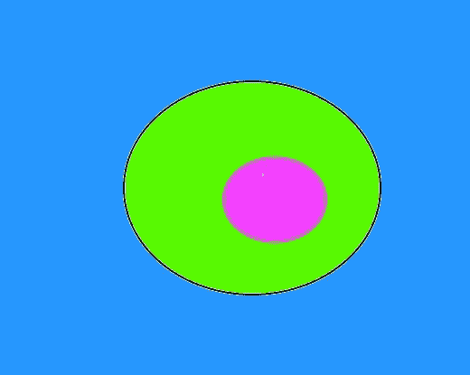

# JavaScript 作用域一览

> 原文：<https://betterprogramming.pub/a-look-at-javascript-scopes-acb0f5e9cd77>

## 了解作用域在不同场景中的工作方式


深度观察镜

程序员需要知道变量的范围，才能知道从哪里可以访问函数。简而言之，作用域是我们可以访问变量或函数的地方。

本博客的内容:

*   范围链和嵌套范围
*   块范围与函数范围
*   变量的生命周期

为了更好地理解作用域的工作机制，您需要知道词法作用域是如何工作的。在之前的博客中，我解释了 [***词法范围***](/scope-closure-lexical-scope-9a18d0579d66) 和[***闭包*** *的机制。*](/a-look-at-javascript-closures-6de9b9ac4f8b)

## 范围链和嵌套范围

在上面的示例代码中有 3 个作用域。这里的三个范围相互交织在一起。交错作用域被称为**嵌套作用域**。如果我们从内向外数这些范围。

1.  它从第 4 行的 arrow 函数开始，以第 6 行的第一个花括号结束。
2.  它从第 3 行的 getBiggerNumbers 函数开始，一直到第 9 行的花括号。
3.  所有剩余字段都包括在此范围内。此外，这个作用域被专门命名为全局作用域。



嵌套作用域

它是为了更好地理解上述视觉范围。粉色区域代表 1.scope，绿色区域代表 2 . scope。蓝色区域是全球范围。相互之间有嵌套作用域关系的作用域称为**作用域链**。因为这里有 3 个嵌套的作用域，所以这个例子也是一个作用域链的例子。

## 块范围与函数范围

根据维基百科，函数作用域可以定义为“当一个函数内声明的变量的作用域没有扩展到该函数之外时，这被称为**函数作用域**”。块作用域定义为“一个名称绑定的作用域是一个块，称为**块作用域**”。让我们通过例子来更好地理解这些定义。

你在上面看到的代码片段是一个函数作用域的例子。如果你是一个曾经使用块作用域的程序员，你可能认为这段代码会有问题。因为第 8 行中的变量名没有定义，并且错误消息应该已经发出，因为它试图在第 8 行被访问。但是功能范围不是这样工作的。当编译这个代码片段时，词法范围在函数的顶部定义了一个未定义的变量名。因此，变量名是可访问的。另外，将这个变量移动到函数顶部的过程，词法作用域所做的，叫做**提升**。现在，让我们用块范围编写同样的代码，看看会得到什么结果。

正如您所看到的，这是变量定义中 let 和 const 关键字比 var 关键字更受欢迎的主要原因之一。因为 let 和 const 块被定义为作用域，所以它们将可能出现的错误减到最小。

## 变量的生命周期

我们将研究一个已定义的变量在相同的作用域中用相同的名字再次定义时的行为，或者在定义变量之前是否要读取它的值。词法作用域提供了访问变量的方式和时间。

## 功能提升:

```
sum(1 + 3); // 4function sum(a, b){
	console.log(a+b);
}
```

虽然代码片段中的 sum 函数是在定义之前执行的，但是没有错误。为什么？词法作用域将定义的 sum 函数放在编译时所在作用域的顶部。因此，当调用 sum 函数时，它可以正确无误地运行。这个移动过程叫做**吊装**。

```
sum(1 + 3); // TypeError: sum is not a functionvar sum = function sum(a, b){
	console.log(a+b);
}
```

从这段代码中可以看出，已经抛出了一个错误。该错误作为 TypeError 返回:sum 不是函数。这里，Javascript 没有返回任何没有定义 sum 函数的内容。这个错误告诉我们找到了变量 Sum，但是它的引用不是一个函数。如果 Javascript 无法访问变量名 sum，它将返回错误 ReferenceError: sum 未定义。此处定义的 sum 函数的值未定义。

## 可变提升:

```
console.log(name); // undefined
name = 'Caner';
console.log(name); // Caner
var name = "Karaman"
console.log(name); // Karaman
```

虽然打印到控制台第一行的变量名以前没有定义，但是在写入控制台时不会抛出任何错误。同样，在这里，词法作用域在作用域的顶部将变量“name”定义为未定义。因此，第一行中的 console.log(name)返回 undefined，而不是给出错误。由于 name 变量是在词法作用域的帮助下在作用域的顶部定义的，所以可以在第二行中为 name 变量赋值，而不需要任何关键字。因此，第 3 行的 console.log(name)返回了' Caner '。同样的过程在第 4 和第 5 行继续。

为了更好地理解，让我们看一下编译后的相同代码。

```
var name;
console.log(name); // undefined
name = 'Caner';
console.log(name); // Caner
name = "Karaman"
console.log(name); // Karaman
```

如您所见，词法作用域已经将 var 变量移到了作用域的顶部。因此，不会遇到任何错误。