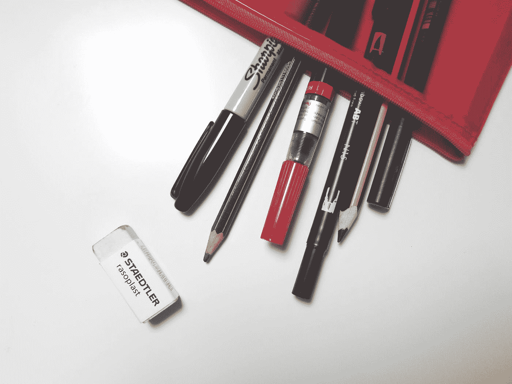

# 一包混合的 SwiftUI

> 原文：<https://betterprogramming.pub/a-mixed-bag-of-swiftui-11e018a280b7>

## 当返回混合内容时，控制 SwiftUI 视图。常见陷阱及其解决方法



照片由[你好，我是尼克🎞](https://unsplash.com/@helloimnik?utm_source=medium&utm_medium=referral) on [Unsplash](https://unsplash.com?utm_source=medium&utm_medium=referral) 。

# 介绍

SwiftUI 向我们介绍了一种全新的界面设计和编码方式。划分 UIKit(或 AppKit)类的子类和硬布线布局约束的老方法已经一去不复返了。相反，我们现在有了一个很好的、声明式的方法来构造和设计我们的控件，并确保每当新的信息或事件到来时，界面都会更新。

为了促进这种新的架构，苹果的优秀人员采用了 Swift 的一些最佳特性(如协议、泛型、不透明类型)并将它们合并到 SwiftUI 中。然而，这也带来了一个隐藏的代价:如果你还不熟悉这些特性，将会有一个学习曲线，并且很可能会有很多神秘的错误信息将你送到你最喜欢的搜索引擎。本文将研究其中的一些错误消息，并解释它们的含义以及您可以做些什么来防止它们。

# 构建视图

当实施一个新的 SwiftUI 视图时，您通常从小处着手。向`body`添加一些组件，设计它们的样式，并处理任何交互。在某一点上，你的简单视图开始变得太大，或者在你的`body`中有很多条件逻辑或重复。因此，您决定将一些逻辑从`body`中移出，放到一个单独的函数中。该函数将负责为您构建一些复杂的组件，由于在 SwiftUI 中一切都是一个`View`，您只需像这样定义函数类型签名:

```
**private** **func** buildComplexButton() -> View
```

太好了！嗯……除了抱怨的编译器，

> "协议“View”只能用作一般约束，因为它具有自身或关联的类型要求。"

这里的问题在于错误消息的最后部分:任何符合`View`协议的对象都需要有一个关联类型`Body`，它决定了视图实际上是如何实现的。试图从你的函数中返回一个普通的`View`会导致编译器放弃它的手，说:“如果没有任何关于符合这个协议的实际类型的附加信息，我不知道返回的类型会是什么。”这有点像在没有指定类型参数列表的情况下返回泛型类型(比如`Array`)(`Array`包含什么？).但这正是问题的关键！我们还不想把自己束缚在一个具体的类型上。我们的函数可能会生成具有不同具体类型的各种不同视图。幸运的是，Swift 5.1 引入了关键字`some`来帮助解决这个问题，您已经在创建新视图时看到了:

```
**var** body: **some** View
```

天真地说，这意味着你认为它意味着:我们返回*一些* `View`并且我们真的不关心什么类型。这通常被称为不透明类型:一种具有一些功能的类型(它是一个`View`)，但是我们不知道确切的*是什么样的*视图。因此，我们将我们的函数更新为新的签名，并给它一个实现:

一切又都好了！嗯……只要你确保从这个函数返回的每一个可能的`View`都有完全相同的*类型。对不透明类型的限制是，只有当每个可用的代码路径都返回相同的具体类型时，编译器才会允许它们。我们只返回相同的按钮，所以这里没有问题。然而，假设我们正在实现一个键盘用户界面。*


我们选择将它实现为一个`Buttons`网格。因为所有的按钮或多或少都是相同的，我们不想对它们中的每一个都进行硬编码，所以我们使用一个构建器函数来创建它们。有两种主要类型的按钮:带有文本标签(数字)的按钮和带有图像的按钮(在这种情况下，删除和 Face ID 符号来自 SF 符号)。简化后，看起来是这样的:

我们还在返回`Buttons`，所以这一定行得通，对吧？不幸的是，编译器拒绝了:

> "函数声明了不透明的返回类型，但函数体中的返回语句没有匹配的基础类型."

奇怪。按钮就是按钮，对吧？但是如果我们检查文档中的[，我们会发现`Button`实际上是一个泛型类型，而不是像`Text`一样的普通结构:](https://developer.apple.com/documentation/swiftui/button)

```
struct Button<Label> where Label : View
```

这适用于许多 SwiftUI 内置类型——最显著的是那些可以包含其他视图或内容的类型。因此，我们试图返回一个`Button<Text>`或一个`Button<Image>`，编译器(正确地)识别为两个不同的类型，因此拒绝合作。这是 Swift 的严格分类对我们不利的情况之一。

幸运的是，有两种方法可以解决这个问题，这两种方法都能满足编译器的要求，使我们能够编译和运行我们的代码:

1.  将我们的视图嵌入到`[Group](https://developer.apple.com/documentation/swiftui/group)`，*中，尽可能多地保留*类型信息。
2.  在`[AnyView](https://developer.apple.com/documentation/swiftui/anyview)`中包装我们的视图，有效地*移除*类型信息。

这两种方法各有特点，最终由你来决定哪一种最适合你。

# 嵌入到组中

这是一些人认为的“最干净”的方法，因为在`Group`中嵌入混合内容保留了所有的输入信息。然而，它引入了一些您可能想不到的类型，并且您目前仅限于使用简单的`if`语句进行条件切换。这意味着没有`if case let`或`switch`语句。如果这不是问题，那就继续吧。它看起来像这样:

现在，这不是什么改变不透明类型工作方式的“神奇”修复。它只是引入了一些额外的类型，确保从编译器的角度来看，这个函数总是返回相同的类型。如果我们检查它，我们会看到返回的类型是:

```
Group<_ConditionalContent<Button<Text>, Button<Image>>>
```

同样，`Group`是一个泛型类型，但是它引入了一个额外的(泛型)类型`_ConditionalContent`，在类型参数列表中有我们的按钮类型(同样是泛型)。这实际上是 SwiftUI 的锦囊妙计:通过变得聪明和引入额外的类型，它可以保留所有的原始类型，并且仍然让编译器满意，因为我们总是返回相同的类型来满足`some View`返回类型。但是正如我提到的，您受到 SwiftUI 实际能够表达的内容的限制。因此，举例来说，任何复杂的逻辑切换现在都是不可能的。此外，要明白这是一个非常简单的例子，它已经生成了一个复杂的结果类型。现在想象有许多嵌套的逻辑和泛型类型，这将很快变得难以阅读和理解。

因此，好处是我们维护了所有的类型信息，但坏处是我们将生成许多复杂的类型，并且我们受限于 SwiftUI 视图构建器的表达能力。

# 在任意视图中换行

包装在 AnyView 中是另一种方法，它涉及到称为类型擦除的东西，以有效地去除关于视图类型的信息，并使它们看起来都是相同的。它看起来像这样:

我们在这里将视图包装在一个符合`View`协议的`AnyView`中，并将对它的任何调用委托给被包装的视图(我们的按钮)。对于外界(即编译器)，我们的函数现在总是返回完全相同的类型(`AnyView`)，不会抱怨。

我们可以通过引入一个对`View`的扩展来使这变得更容易，提供一个可以为我们返回类型擦除视图的函数，并使它像许多其他修饰符一样工作:

这里的好处是，我们可以在控制逻辑方面使用 Swift 的全部表达能力(而不仅仅是 SwiftUI 实现的任何东西):`if case let`或`switch`或甚至其他复杂的逻辑——这都是可能的。缺点是您实际上失去了对常规类型的访问，只能访问`AnyView`向您公开的部分。因为，大多数时候，`AnyView`中的包装是你做的最后一件事，这不是一个很大的问题，你仍然可以访问`View`协议提供的所有属性(因为`AnyView`符合`View`)。

由于每当`AnyView`内包装的`View`发生变化时，SwiftUI 都必须破坏并重建视图层次结构，因此存在一些关于性能的担忧，但是如果您不经常*这样做(大多数用户界面不这样做)，应该不会有问题。*

# *结论*

*在 SwiftUI 中构建复杂的用户界面很快会成为一种令人沮丧的体验，因为编译器规定了我们如何处理泛型类型、具有关联类型的协议以及不透明类型。迟早，你会遇到前面提到的一些问题。我们已经看到了两种规避这些问题的方法:一种是将内容嵌入到一个`Group`(保留类型，但有一个警告，即您受限于 SwiftUI 可以表达的内容)和一种是通过包装在`AnyView`(有效地对编译器隐藏类型信息，但获得更多的表达能力)。这两种方法都是有效的，可以考虑在您自己的应用程序中使用，现在您应该知道为什么您会选择其中一种。*

*作为结束语，令人印象深刻的是 Swift 在构建视图时是如何保存所有的类型信息的，以及在编译器进行严格的类型检查的情况下，它“大部分时间”是如何工作的。如果你对此感兴趣，我建议你看看`[ViewBuilder](https://developer.apple.com/documentation/swiftui/viewbuilder)`是如何工作的。这用于构建包含一个或多个子视图的 SwiftUI 视图，并提供支持视图模板中基本逻辑的功能，例如使用`TupleView`和`_ConditionalContent`(后者不幸被标记为私有)。[Sundell 的 Swift 对 Swift 5.1 中支持 SwiftUI/ViewBuilder 的许多特性进行了很好的概述](https://www.swiftbysundell.com/articles/the-swift-51-features-that-power-swiftuis-api/)。*

*我们也在某种程度上掩饰了类型擦除在 Swift 中的确切工作方式，但它实际上在 Swift 中的更多地方使用，例如`[AnySequence](https://developer.apple.com/documentation/swift/anysequence)`和`[AnyPublisher](https://developer.apple.com/documentation/combine/anypublisher)`。在后一种情况下，不仅对编译器，而且对其他人隐藏一些类型信息实际上是有帮助的。*

> *以这种方式使用类型擦除时，您可以随着时间的推移更改底层发布者实施，而不会影响现有客户端— [苹果官方文档](https://developer.apple.com/documentation/combine/anypublisher)*

*我再次向[推荐一篇由 Sundell](https://www.swiftbysundell.com/articles/type-erasure-using-closures-in-swift/) 撰写的 Swift 的文章来解决类型擦除问题。*