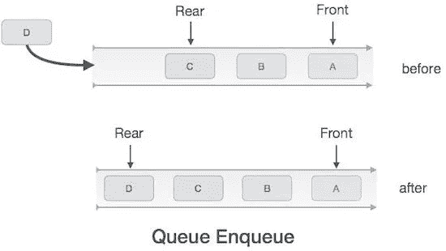

# 堆栈和队列入门

> 原文：<https://betterprogramming.pub/a-primer-on-stacks-and-queues-f40dda17604d>

## 涵盖了两个关键数据结构的实现

数据结构，即存储数据的格式，允许我们对一组数据做四件主要的事情:(1)输入，(2)修改，(3)维护，和(4)检索。所有的数据结构都给了我们这些基本的能力。这些功能中的每一个都以独特的方式对我们有用，所以在为我们的数据选择数据结构之前，我们需要考虑一些事情。我们需要用我们的数据做什么？我们关心内存使用吗？我们需要我们的程序运行多快？每种数据结构在功能、内存和运行时方面都有所不同，理解这一点很重要。

首先，我将讨论两种数据结构的实现:堆栈和队列。您不太可能需要自己实现这些结构——大多数语言都内置了这些结构——但是知道如何实现将有助于您理解这些数据结构，并为面试问题做好准备。

# 大量

堆栈是遵循后进先出(“LIFO”)方法的线性数据结构。顾名思义，元素是堆叠在一起的，唯一可以移除的元素是堆栈中的最后一个元素。想象一下，试着从一堆煎饼中间拿走一块。嗯，它很可能会倒，所以你最好的办法是每次都把最上面的煎饼拿走，直到这一叠都没了。这是一个现实世界的场景，在这个场景中，你将应用后进先出法。你每次上网也会遇到书库。强大的“后退按钮”只是一堆你以前访问过的网站，按照你访问它们的顺序排列！

## 基本操作:

*   在堆栈顶部插入一个元素(push)
*   从堆栈中移除顶部元素(pop)
*   返回顶部元件，但不要移除它(peek)
*   检查堆栈是空的还是满的

## 一般流程:

1.  创建一个指针来跟踪顶部的元素。
2.  Push:检查堆栈是否已满。如果是，返回一个错误并退出。如果堆栈未满，则递增*顶部*的索引，以指向下一个空白空间。将元素添加到由*顶部*指针指示的开放空间。返回成功。
3.  检查堆栈是否为空。如果是，返回一个错误并退出。如果不为空，则访问 *top* 所指向的元素，并将 *top* 的值减 1。返回成功。

# 行列

队列类似于堆栈，因为它也是一种以顺序方式存储数据的线性数据结构。但是，队列遵循先进先出(“FIFO”)方法。我们每个人都可能在每天早上喝咖啡或买午餐时遇到这种方法。每一个新顾客都加入到队伍的末尾，第一个排队的人是第一个点餐和离开队伍的人。

与只能访问顶端的堆栈相反，队列的两端都是开放的:一端用于插入数据，另一端用于删除数据。

## 基本操作:

*   向队列中添加元素(入队)
*   从队列中删除元素(出列)
*   返回队列前面的元素而不删除它(peek)
*   检查队列是满的还是空的

## 一般流程:

1.  创建两个指针，一个跟踪*前端*，一个跟踪*后端*。
2.  入队:检查队列是否已满。如果是，返回一个错误并退出。如果不是，增加*后*指针指向下一个空位。将元素添加到由*后*指针指示的队列位置。返回成功。
3.  出列:检查队列是否为空。如果是，返回一个错误并退出。如果不是，找到*前*指针。将*前端*指针递增到下一个元素并返回该元素。返回成功。

# 选择适当的数据结构

堆栈和队列本质上是灵活性较差的列表或数组。那么，为什么我们要将数据存储在堆栈或队列中，而不是数组中呢？为了选择合适的数据结构，我们需要考虑我们希望如何处理我们的数据，以及我们希望以多快的速度来处理这些数据。

我们可能希望将数据存储在堆栈或队列中，以便对数据执行某些操作方法。数组不建立任何必须添加或移除元素的顺序。因此，您需要移动您正在添加或移除的元素之后或之前的所有元素。这需要对整个列表进行迭代。相反，如果您的算法始终需要访问数组中的顶部元素，请使用堆栈。如果您的算法需要访问数组中的第一个和最后一个元素，请使用队列。这将使你的代码更干净，并使你的算法运行更有效。

就大 O 符号而言，在数组中插入和删除元素是 O(N)，这意味着算法的性能将与数据集的大小成比例地线性增长，因为这些操作需要在整个数据集上迭代。相比之下，在堆栈和队列中插入和删除元素是 O(1)，这意味着无论数据大小如何，它们总是在相同的时间内执行。这非常直观，因为堆栈和队列消除了对数据集进行迭代的需要。

数据结构是编程的基本构件。记住，在构建代码时，要批判性地思考你所使用的数据结构——它们会对你的最终产品产生影响。在这篇文章中，我只提到了一些类型，但是还有很多其他的类型，我强烈建议你也去读一读，以便对你的选择有一个全面的了解。