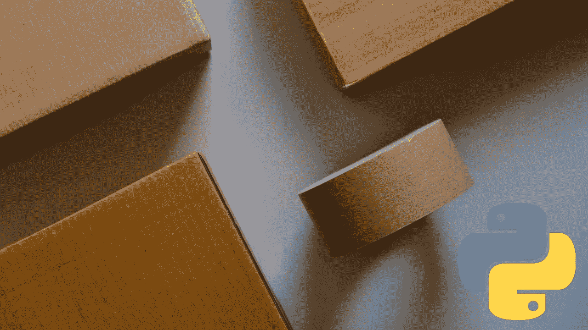

# pyproject.toml 开发人员备忘单

> 原文：<https://betterprogramming.pub/a-pyproject-toml-developers-cheat-sheet-5782801fb3ed>

## 关于如何建立 pyproject.toml 文件的想法和注意事项



背景图片由 [Klára Vernarcová](https://unsplash.com/@klerwonder?utm_source=unsplash&utm_medium=referral&utm_content=creditCopyText) 在 [Unsplash](https://unsplash.com/s/photos/package?utm_source=unsplash&utm_medium=referral&utm_content=creditCopyText) 上拍摄

大约三年前，我写了一篇关于设计干净的 Python 包结构的指南，它依赖于`setup.py`和`setup.cfg`文件，以及 [Setuptools](https://setuptools.pypa.io/) 构建系统。Python 生态系统在不断发展，如今，开发人员可以更加灵活地选择更适合他们需求的构建系统——例如， [Bento](https://cournape.github.io/Bento/) 、 [Flit](https://flit.pypa.io/en/latest/index.html) 或[poem](https://python-poetry.org/)。

PEP 517 提出了一种标准的方法来定义 Python 项目的可选构建系统。多亏了 [PEP 518](https://peps.python.org/pep-0518/) ，开发者可以使用`pyproject.toml`配置文件来建立项目的构建需求。

PEP 517 还引入了构建前端和后端的概念。根据规范，构建前端是一个工具，它可以获取任意代码并从中构建轮子。实际的构建是由构建后端完成的。在类似`pip wheel some-directory/`的命令中，Pip 充当构建前端。从这个意义上说，PEP 517 推动的一个根本变化是 Pip 不再“硬编码”使用 Setuptools 作为构建后端。然后，正如第一段中提到的，新的构建工具正在出现，并且有一个官方的编程接口来确保它们之间的兼容性。

本文描述了如何使用`pyproject.toml`和 [Flit](https://flit.pypa.io/en/latest/index.html) 来获得与之前的包设置指南相似的结果。我使用 Flit 有两个不同的原因:

1.  演示如何使用 Setuptools 之外的另一个构建系统。 [Flit 声称更容易使用](https://flit.pypa.io/en/latest/rationale.html)。
2.  它符合 [PEP 517](https://peps.python.org/pep-0517/) 和 [PEP 660](https://peps.python.org/pep-0660/) ，支持可编辑的安装——这对开发者非常有用——无需进一步配置。在 2022 年 7 月撰写本文时，Setuptools 需要一个小的变通方法。

# 干净的包装结构

建议的包装结构如下所示:

```
project-root
├──src/
   └──package_name/
      └──__init__.py
├──tests/
   └──package_name/
├──.gitignore
├──LICENSE
├──pyproject.toml
└──README.md
```

你会注意到`pyproject.toml`取代了`setup.py`和`setup.cgf`。以下代码片段提供了该文件的初始工作版本:

pyproject.toml 备忘单—初始版本

尽管采用了 [TOML](https://toml.io/) 格式，但内容与`setup.py`非常相似，除了`[build-system]`部分(或表，因为这种键/值对在 TOML 规范中被调用)。它用于指定项目的构建系统——在本例中，Flit 作为后端。

`pyproject.toml`文件由构建系统处理，根据您选择的后端，其内容可能会有所不同。比如，诗歌需要`authors`数组元素作为`name <email>`字符串([源](https://python-poetry.org/docs/pyproject/#authors))，而 Flit 需要一个带有`name`和`email`键的表列表([源](https://flit.pypa.io/en/latest/pyproject_toml.html#new-style-metadata))。在编写`pyproject.toml`文件时，请始终参考构建后端文档，以避免语法问题。通过谷歌搜索`<build backend> pyproject.toml`(例如`flit pyproject.toml`或`poetry pyproject.toml`)可以很容易地找到这样的文档。

# 附加功能

在接下来的章节中，您将会看到如何向项目中添加一些不错的特性，比如开发依赖管理、自动化测试和林挺。一个完整的工作示例可以在配套的资源库中找到:

[](https://github.com/ricardolsmendes/pyproject-toml-cheat-sheet) [## GitHub-ricardolsmendes/py project-toml-cheat-sheet:关于 clean pyproject.toml 的想法和注释…

### 关于 clean pyproject.toml 设计的思考与笔记。pyproject.toml:包的描述符文件，其中有多个…

github.com](https://github.com/ricardolsmendes/pyproject-toml-cheat-sheet) 

为了将 Flit 用作构建前端(`flit`命令)，正如我接下来将要展示的，您需要从 PyPI 安装 [Flit。运行`pip install flit~=3.7.1`来这样做，以防万一，用您喜欢的版本替换`3.7.1`。如果 Pip 用作前端，则不需要此步骤。](https://pypi.org/project/flit/)

## 开发依赖性

Flit 的`pyproject.toml`文档描述了如何向给定的项目添加可选的依赖项。在这个上下文中，Optional 意味着依赖项不是包完成其核心工作所必需的，而是出于测试或文档的目的。

> `[project.optional-dependencies]`表包含每个可选特性所需的包列表。([来源](https://flit.pypa.io/en/latest/pyproject_toml.html#pyproject-project-dependencies))

以下代码在配套项目中用于枚举开发依赖项:

```
[project.optional-dependencies]
dev = [
    "pylint ~=2.14.0",
    "toml ~=0.10.2",
    "yapf ~=0.32.0",
]
test = [
    "pytest-cov ~=3.0.0",
]
```

要将它们与您的软件包一起安装，只需运行`flit install --deps=develop`。

## 自动化测试

Pytest 6.0 中引入了对`pyproject.toml`的支持[。此后，可以使用`[tool.pytest.ini_options]`表为给定的项目设置 Pytest。在配套的存储库中，我使用了下面几行来设置默认选项:](https://docs.pytest.org/en/6.2.x/customize.html#pyproject-toml)

```
[tool.pytest.ini_options]
addopts = "--cov --cov-report html --cov-report term-missing --cov-fail-under 95"
```

和下表来确定在计算测试覆盖率时应该考虑哪个目录`pytest-cov`:

```
[tool.coverage.run]
source = ["src"]
```

然后，从根文件夹运行`pytest`即可。

## 代码格式

[YAPF](https://github.com/google/yapf) 是已经[支持](https://github.com/google/yapf/issues/708) `[pyproject.toml](https://github.com/google/yapf/issues/708)`的代码格式化工具的一个例子，提供了`setup.cfg`的替代方案。下面的代码片段显示了如何使用它:

```
[tool.yapf]
blank_line_before_nested_class_or_def = true
column_limit = 88
```

从项目的根文件夹运行`yapf --in-place --recursive ./src ./tests`，然后*瞧*！

请参考您首选的格式化程序文档，以确保它们也支持`pyproject.toml`。

## 林挺

鉴于林挺的简单，它通常是我的第一选择。不幸的是，当我写这篇博文时，它仍然不支持`pyproject.toml`的配置，所以我决定使用 [Pylint](https://github.com/PyCQA/pylint) :

```
[tool.pylint]
max-line-length = 88
disable = [
    "C0103", # (invalid-name)
    "C0114", # (missing-module-docstring)
    "C0115", # (missing-class-docstring)
    "C0116", # (missing-function-docstring)
    "R0903", # (too-few-public-methods)
    "R0913", # (too-many-arguments)
    "W0105", # (pointless-string-statement)
]
```

从根文件夹运行`pylint ./src ./tests`来查看结果。

同样，请参考您首选的 linter 文档，以确保它们支持`pyproject.toml`。

## 可编辑安装

使用 Pip 的开发人员依靠`pip install -e .`(又名可编辑安装或开发模式)来模拟从源代码安装他们的包，并动态测试更改。如果你有 Flit 作为构建后端，它将会工作，因为 Flit 符合 PEP 660。

Flit 的 CLI 通过`flit install -s`提供了类似的特性。你可以在[官方文件](https://flit.pypa.io/en/latest/cmdline.html#flit-install)中找到更多关于`flit install`的信息。

Sidenote:我注意到当使用 Flit 安装包时，`pytest-cov`要求项目的源代码在安装时使用`-s`标志来报告覆盖率，这意味着即使在 CI 管道上运行测试时也应该使用该标志。

# 构建并发布

用 Flit 构建很简单，你可以在[官方文档](https://flit.pypa.io/en/latest/cmdline.html#flit-build)中找到可用的选项。让我们做一个本地构建并安装生成的包，看看它是什么样子的。

1.  从以前的安装中删除工作包:`pip uninstall -y pyproject-toml-cheat-sheet stringcase`(我没有找到使用 Flit CLI 来做这件事的方法)。
2.  从源代码:`flit build`构建一个轮子和一个 sdist (tarball)。当构建完成时，您应该在控制台中看到类似于`Buit wheel: dist/pyproject_toml_cheat_sheet-1.0.0-py3-none-any.whl`的消息。
3.  使用 Pip 安装以确保软件包与 Pip 兼容:`pip install dist/pyproject_toml_cheat_sheet-1.0.0-py3-none-any.whl`。

现在，让我们使用 Python 交互式 Shell 调用`pyproject_cheat_sheet.StringFormatter.format_to_snakecase`方法:

```
python
>>> from pyproject_cheat_sheet import StringFormatter
>>> print(StringFormatter.format_to_snakecase('FooBar'))
foo_bar
>>> exit()
```

正如您所看到的，`foo_bar`是`StringFormatter.format_to_snakecase('FooBar')`的输出，这意味着包按预期工作。

发布也很简单。详情请参考 [Flit 文档](https://flit.pypa.io/en/latest/cmdline.html#flit-publish)。

# 还想用 Setuptools 吗？

我们很擅长使用 Flit，但是如果您出于某种原因仍然想要使用 Setuptools，比如避免对现有的构建管道进行破坏性的更改，该怎么办呢？不用担心…这只是一个通过`pyproject.toml`配置构建系统的问题，从以下内容开始:

```
[build-system]
build-backend = "setuptools.build_meta"
requires = [
    "setuptools ~=63.2.0",
    "wheel ~=0.37.1",
]
```

然后你可能想检查特定于 Setuptools 的配置，在[他们的文档](https://setuptools.pypa.io/en/latest/userguide/pyproject_config.html)中有大量信息。

# 结束语

我们向代码库添加的功能和依赖越多，它就变得越复杂，但我们可以合理地做到这一点。保持代码尽可能干净的一些关键好处是让新的团队成员加入进来，促进长期维护，减轻相关人员的负担。我真的相信它始于我们如何设置我们的包，这就是为什么我分享这样的想法。

我希望你喜欢它！

# 参考

*   [**Carlos perate/awesome-py project**](https://github.com/carlosperate/awesome-pyproject):一个使用`pyproject.toml` Python 配置文件的 Awesome 项目列表。