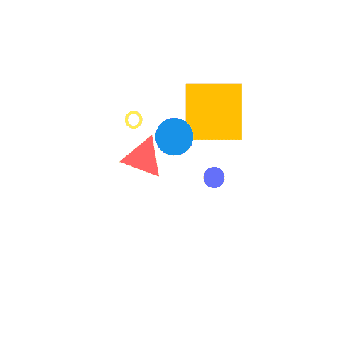

# 用 React 钩子构建一个快速简单的加载屏幕

> 原文：<https://betterprogramming.pub/a-quick-and-easy-react-js-loading-screen-with-hooks-940feccd553f>

## 仅仅 5 分钟后

蹦蹦跳跳。

# ***我会从这个教程中得到什么？***

加载屏幕对于提高 UX 和网站的外观和感觉非常有用。等到 DOM 完全呈现后再显示页面可以给用户带来无缝的体验。通过本教程，你将学会创建一个类似于 www.intentionalkreative.com 的加载屏幕。

# 入门指南

## 步骤 1:在 React 应用程序中，创建一个加载组件

在这里，我创建了自己的加载 GIF 动画。你可以使用任何你想要的东西:

## 步骤 2:在 App.js 中

app.js

## ***这里发生了什么？***

*   首先，导入`LoadingScreen`组件。
*   然后`useState`钩子返回一个有状态值`loading`，以及一个更新它的函数`setLoading`。`loading`值的初始状态被设置为`true`。
*   在渲染提交到屏幕后，传递给`useEffect`钩子的函数被执行。传递空数组`[]`作为第二个参数，让 React 知道效果不依赖于任何来自 props 或 state 的值。`setTimeout`方法在 6000 毫秒(6 秒)后执行`setLoading`功能，将`loading`状态设置为`false`。
*   带有条件操作符的内联`if-else`像 jsx 中的`[condition ? true : false](https://developer.mozilla.org/en/docs/Web/JavaScript/Reference/Operators/Conditional_Operator)`一样工作。
*   如果`loading`为 falsey，将会渲染你的 app。
*   如果为 true，它将加载您的`LoadingScreen`组件。

# 就是这样！

**有更多问题吗？让我知道！**