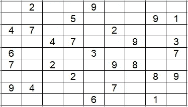

# 一个七十多岁的人学习 Java

> 原文：<https://betterprogramming.pub/a-septuagenarian-learns-java-83d2a950bfc2>

## 我在 1966 年第一次学习 FORTRAN II 编程，现在已经 70 多岁了，我认为学习 Java 是保持我大脑活跃和敏捷的合适任务

作者图片

作为我妻子的看护人，意味着退休后大部分时间都在家里活动。随着年龄的增长，保持活跃的身心变得越来越重要。因此，阅读、写作/写博客、填字游戏和游戏都是很好的大脑训练工具。数独是我最喜欢的游戏，因为它需要各种各样的解决问题的策略，而且凭借我的 IT 背景，我开始思考解决数独的算法方法。

我的 IT 职业生涯总是包含大量的业务分析部分，从分析师编程开始。我的编程语言跨越了 FORTRAN、汇编器、Lisp、SNOBOL、函数式、SQL，然后是几个传统的 3gl，然后是一些 4gl 和 SQL。

我职业生涯的后半部分转向了技术写作、质量保证、咨询和项目管理。所以从技术上来说，我从来没有进入 OOPs，虽然我在 69 年用过 Simula67(面向对象的 Algol60)。退休后，我做了一些 web 开发(HTML+CSS)和一点 XML-XSLT。

所以现在，在退休后，我在寻找一些新的刺激，并决定自学 Java 和解决数独问题。

## 九宫格游戏

对于百万分之一不知道数独的人，这里有一个简单的描述。该板包括一个 9×9 的网格，该网格被进一步分成 9 个 3×3 单元的子矩阵。该难题的目标是:给定一些预填充有解答数字/线索的单元格，用数字 1-9 完成每行、每列和每个子矩阵。

**一个“难”数独谜题的例子。**

## 最简单的解决方案策略

基本的计算方法是“蛮力”，即所有的空单元格依次填入九个数字，并检查每个潜在解决方案的有效性。如果有 20 个预填充的线索，那么有 61 个空单元格，就有 9⁶可能的组合要测试，显然这是一个不可能的大方法。下面讨论了修剪搜索树的方法。

## 候选人

所有更聪明的策略都依赖于根据在每个空单元格处相交的行、列和子矩阵中完整的线索数字来确定每个空单元格的候选数字集。这是一个非常简单的演绎型算法。基本上，首先假设一个单元中的所有九位数字都是候选数字，然后消除那些已经存在于该单元的任何行/列/子矩阵中的其他位置的数字。

## 基于单例的策略

如果一个空单元格只有一个候选数字，那么这个数字就是最终解——这就是所谓的“裸单例”一个简单的扫描就能识别这些。

如果单元格中的某个候选数字在所有三个相交维度(行、列、子矩阵)中都是唯一的，那么它也存在于最终解中，被称为“隐藏单例”如果单元素解也是行/列/子矩阵中要求解的最后一个数字，则该解也称为“满堂红”

## 程序数据结构

对于性能、效率、灵活性和扩展来说，最重要的程序设计决策是内部数据结构的选择，这反过来又决定了迭代方法的选择。

凭借我在数据分析和 SQL 方面的经验，我可以立即看到使用“位掩码”进行一些“面向集合”处理的潜力整数的位被设置为代表一个数字——位#0 到#8 代表数字 1..9.有三个阶段:

1.  每个行、列和子矩阵的一个位掩码整数表示线索/解中存在哪些数字，而不考虑数字在行、列或子矩阵中的位置
2.  逻辑“补码”(将每个“0”变为“1”，反之亦然)，上述位掩码指示哪些数字不存在于每行、列或子矩阵中。
3.  对在一个单元处相交的三个候选位掩码执行逻辑“与”,给出该单元的有效候选的列表。(在逻辑 AND 中，对于每个位位置，只有在所有输入掩码中设置了相同的位时，才会设置输出位)。这个过程避免了嵌套迭代。

对于每一行/列/子矩阵，我保存了一个数组(由数字(1-9)索引)，它是该数字作为候选项在行/列/子矩阵的单元中出现的次数的计数。有了这些计数，就很容易确定单一解决方案。

## 修剪解决方案搜索树

当找到每个单一解时，它被记录在结果板上，并且该数字被从在结果单元处相交的行/列/子矩阵的候选集合中移除。

一旦在处理过程中找到所有单个结果，就进行“强力”处理，在最后处理的单元中选择“下一个”可用的候选项，或者继续到下一个空单元的候选项—注意，仅使用候选项可以避免尝试所有九个数字，包括任何不是候选项的数字。

将选择的数字作为试验解放入板中，更新所有候选数据结构，并重复上述对单例解的搜索。每个新的单例解决方案还减少了“强力”解决方案搜索中使用的候选项数量，“修剪”了搜索树。上面的整个过程是递归的，如果一个无效解在一个“分支”上的搜索中停止，那么处理退出并继续下一个搜索分支。

## 扩展和参数化

在开发过程中，游戏板的大小被参数化为 4x4，以简化调试。由于 Java 字是 32 位，我立即想到可以处理其他大小的游戏板。16x16 的板是可能的，但是只有 15 个十六进制“数字”(1-F)，但是可以使用 A-P。一个 25x25 的谜题看起来更直观，使用了记号 A-Y(因此，我把它命名为 No zeku——“No-Zee-Ku”)。我将有效的令牌字符集参数化，它们映射到位矩阵索引数字 0 到 n。

有了有效标记字符的列表，可能是字母，我将所有输入字符转换成大写。然后，可以使用任何无效的输入标记字符来标记空单元格。我用`_`(下划线)代替它们，作为标准的内部空单元格表示，并在输出解决方案中使用。

## 结论

这个项目提供了一两个月有趣的时间来掌握 Java 和解决方案技术。该程序表现非常好，解决方案从简单问题的一秒钟到极端情况的一两秒钟不等。

我最初想在 Android 下用 Java 学习 GUI 编程，但是没有逻辑上的挑战，这看起来有点乏味，所以就推迟了。

偶然看到 Andrew Stuart 的网站描述了几十种(我最近看了大约 39 种)数独解决方案的不同技术，特别是手动解决方案，我正在考虑一个版本，它有选项显示各种解决方案技术的提示。这个想法是，它将帮助用户学习更复杂的技术。但同时，我有新的园艺要整理。