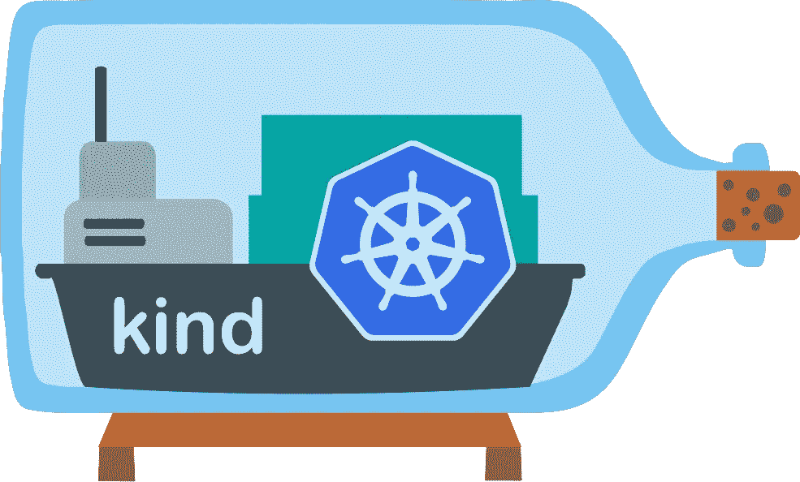

# 使用 kind 在本地创建 Kubernetes 集群的简单方法

> 原文：<https://betterprogramming.pub/a-simple-way-to-create-kubernetes-clusters-locally-using-kind-efc4b21e6788>

## 使用 K8s 更好地进行本地开发



[亲切的官方 logo](https://kind.sigs.k8s.io/docs/user/quick-start/)

# 介绍

是另一个 Kubernetes SIGs 项目，但是与 minikube 相比有很大的不同。它将集群移动到 Docker 容器中。与生成虚拟机相比，这将大大加快启动速度。

[kind](https://sigs.k8s.io/kind) 是一个使用 Docker 容器节点运行本地 Kubernetes 集群的工具(CLI)。

让我们开始吧。

## 先决条件

下面的东西应该是本地系统里有的。

*   [去](https://golang.org/)
*   Docker 服务需要运行

# 装置

下面的命令应该下载并安装`kind`二进制文件。

```
GO111MODULE=”on” go get sigs.k8s.io/kind@v0.8.1
```

# 确保二进制类型存在

```
> **kind** version
kind v0.8.1 go1.14.2 darwin/amd64
```

现在，我们应该能够使用`kind` CLI 来启动 K8s 集群。

`kind`的用法:

```
Usage:
  kind [command]Available Commands:
  build       Build one of [node-image]
  completion  Output shell completion code for the specified shell
  create      Creates one of [cluster]
  delete      Deletes one of [cluster]
  export      Exports one of [kubeconfig, logs]
  get         Gets one of [clusters, nodes, kubeconfig]
  help        Help about any command
  load        Loads images into nodes
  version     Prints the kind CLI version
```

在本文中，我们将主要关注`create`、`get`和`delete`命令。

# 创建一个集群

要创建集群，只需执行。

**cmd:**

```
> **kind** create cluster
Creating cluster "kind" ...
 ✓ Ensuring node image (kindest/node:v1.18.2) 🖼
 ✓ Preparing nodes 📦
 ✓ Writing configuration 📜
 ✓ Starting control-plane 🕹️
 ✓ Installing CNI 🔌
 ✓ Installing StorageClass 💾
Set kubectl context to "kind-kind"
You can now use your cluster with:kubectl cluster-info --context kind-kind Have a nice day! 👋
```

这将通过拉最新的 Kubernetes 节点(1.18.2 版)来创建一个 Kubernetes 集群。我们刚刚创建了 1.18.2 版的 Kubernetes 集群。

如果我们在创建集群时没有传递`--name`参数，那么集群名称默认设置为`kind`。

# 创建特定版本的 K8s 集群

我们可以通过`--image`参数来部署特定版本的 K8s 集群。

**cmd:**

```
> **kind** create cluster --image kindest/node:v1.15.6 --name kind-1.15.6
Creating cluster "kind" ...
 ✓ Ensuring node image (kindest/node:v1.15.6) 🖼
 ✓ Preparing nodes 📦
 ✓ Writing configuration 📜
 ✓ Starting control-plane 🕹️
 ✓ Installing CNI 🔌
 ✓ Installing StorageClass 💾
Set kubectl context to "kind-kind"
You can now use your cluster with:kubectl cluster-info --context kind-kind Have a nice day! 👋
```

提供所有支持的 K8s 版本标签的列表可以在[这里](https://hub.docker.com/r/kindest/node/tags)找到。

# 列出已部署的集群

**命令:**

```
> **kind** get clusters
kind
kind-1.15.6
```

这应该会列出自从我们为两个不同的 K8s 版本执行`kind create cluster`以来创建的两个集群。

# 为 kubectl 设置上下文

创建集群后，`kubectl`将始终指向最近创建的 K8s 集群。

让我们检查所有可用的上下文。

```
> **kubectl** config get-contextsCURRENT   NAME                               CLUSTER                      
          kind-kind                          kind-kind            
*         kind-kind-1.15.6                   kind-kind-1.15.6
```

从输出中，我们可以得出结论，`kubectl`上下文当前已经被设置为最新的集群，即`kind-1.15.6`。

(上下文名称以`kind`为前缀。)

要将`kubectl`上下文设置为`kind`集群(即版本 1.18.2 ),我们需要:

```
> **kubectl** config set-context kind-kind 
Context "kind-kind" modified.
```

为了验证`kubectl`是否指向正确的集群，让我们检查节点。

```
> **kubectl** get nodes
NAME                        STATUS   ROLES    AGE     VERSION
kind-1.18.2-control-plane   Ready    master   8m20s   v1.18.2
```

# 删除集群

要删除特定的集群，可以将集群名称传递给`--name`参数中的`delete`命令。

**cmd:**

```
> **kind** delete cluster --name kind
Deleting cluster "kind" ...
```

# 删除您的所有集群

如果要一次性删除所有集群，请执行:

**cmd:**。

```
> **kind** delete clusters --all
Deleted clusters: ["kind-1.15.6"]
```

# 为什么善良？

*   kind 支持多节点(包括 HA)集群
*   kind 支持 Linux、macOS 和 Windows
*   kind 通过了云本地计算基金会[的认证，并符合该基金会(CNCF](https://landscape.cncf.io/selected=kind)