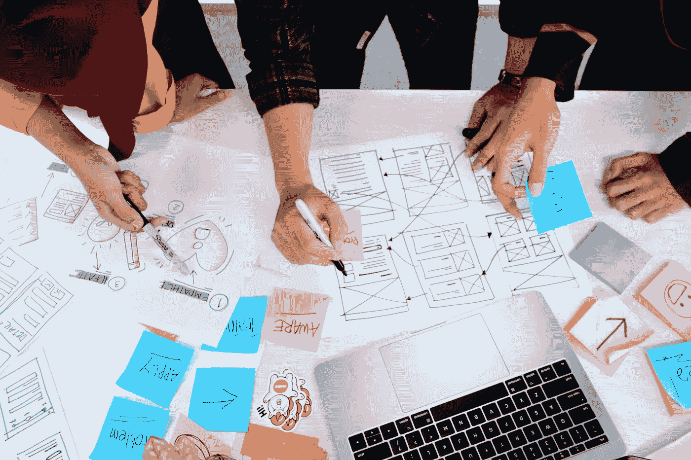
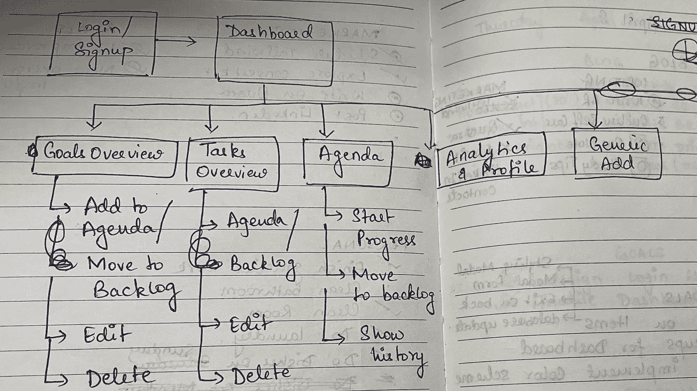
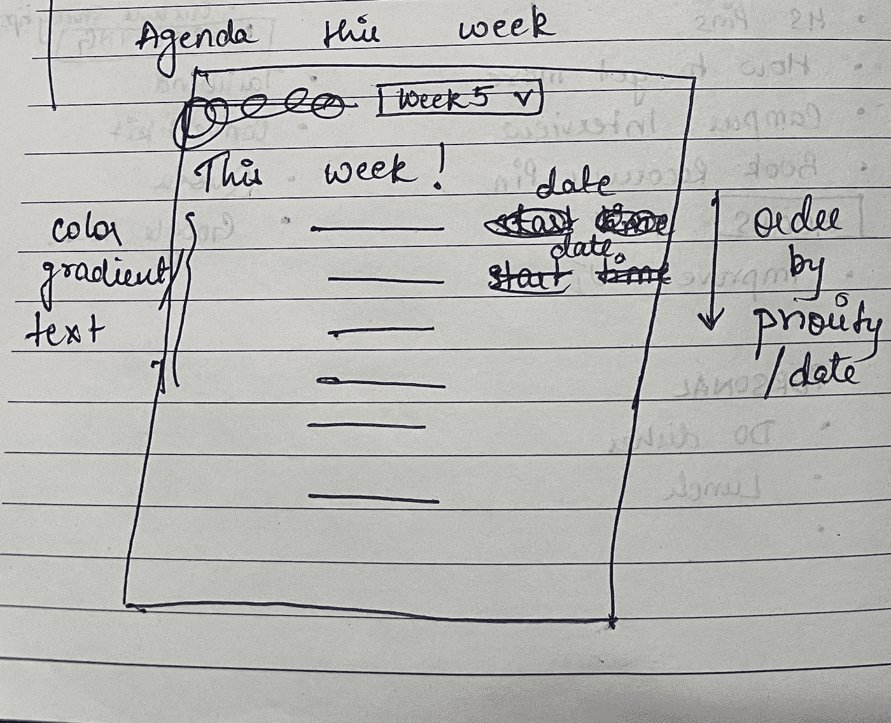
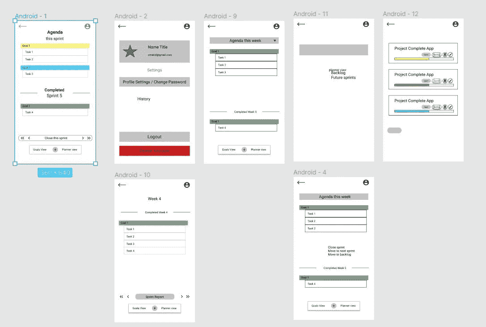

# 软件工程师从头开始构建应用程序的指南

> 原文：<https://betterprogramming.pub/a-software-engineers-guide-to-building-an-app-from-scratch-f0c043cd8ca7>

## 从一个想法到游戏商店

巴格斯·赫纳万在 [Unsplash](https://unsplash.com?utm_source=medium&utm_medium=referral) 上拍摄的照片。

一个晴朗的日子，我决定我要建立一个任务管理应用程序。类似于[吉拉](https://www.atlassian.com/software/jira)的东西，但对于所有正在进行的个人项目，我一直在进行。

我浏览了许多博客帖子、YouTube 视频和教程，尽可能多地吸收关于应用程序的知识。我涉猎了如何充实你的想法、市场研究、UI/UX、配色方案、不同类型开发框架的不同技术栈以及哪一个是最好的等等。

我开发应用程序是为了好玩，所以我跳过了繁重的市场调查的最初几步。我就是我为之开发这个应用的客户。我从 Basecamp 等产品的成功中意识到，在开始这段旅程时，这可能不是一件坏事。

为了我的读者，我把我混乱的学习曲线分成了几个阶段。但是有一个警告:这些阶段并不是互相排斥的。它们更像是制作一个 app 所涉及的不同流程。稍后将详细介绍。

这是我在开始我的应用程序之旅之前想要阅读的指南。当终点线遥遥无期时，这就是起点。

# 创意阶段

你可能有一个应用程序的想法，也可能没有。当我开始的时候，我不知道我想要建立一个任务管理应用程序。我想做点什么。作为一名渴望了解这个世界的软件工程师，我想亲自动手。

找到 app 创意的最好方法就是找到你自己面临的问题。世界上有 70 亿人，其他人也有同样问题的可能性很大。

“在线子弹日志”就是任务管理应用程序——目标。

我意识到我喜欢吉拉作为我工作场所的一个工具。它是 Scrum 和敏捷概念在产品中的模型。我也用类似的“敏捷”概念来记录我的生活。所有这些都发生在我的子弹日记中，它变得杂乱无章，不容易维护，因为我不是一个真正的艺术家，没有大量的时间来让它变得漂亮。

但是我可以编码并有可能构建产品，所以这就是我决定要做的。

我有更多的想法。一旦开始思考，就有很多问题可以用各种 app 解决。这件事一直困扰着我。

所以你有了一个应用程序的想法。下一步是什么？

你可以开始编码，随着想法的发展，你会陷入大量的麻烦和返工。或者你可以把这个想法具体化一点。它试图解决什么问题？目标客户是谁？由于我创建这个应用程序是作为一个宠物项目，所以我没有深入了解目标客户是否真的存在。如果你正在为你的企业开发一个应用程序，这将有助于做市场调查，并找到你的客户的需求。

我建议把这些事情写下来。在开始实际构建之前，回答所有的*为什么*、*谁*和*如何*的问题。在随后的阶段，将你的应用程序的目标放在前面和中心，将有助于在做出关键决定时记住它们。

让我开始思考的几个问题是:

1.  我为什么需要这个应用程序？我想修复什么？
2.  我需要这个应用程序做什么？我需要它不做什么？
3.  一个 app 如何最有效的解决我的问题？还有别的办法吗？
4.  这个 app 会有什么样的高级功能(用文字来说)？

# 设计阶段

一旦你感觉到这个想法实际上是什么(不仅仅是一句俏皮话)，你就会自然而然地开始想象它会是什么样子。

印尼[UX](https://unsplash.com/@uxindo?utm_source=unsplash&utm_medium=referral&utm_content=creditCopyText)在 [Unsplash](https://unsplash.com/s/photos/fat-marker?utm_source=unsplash&utm_medium=referral&utm_content=creditCopyText) 上拍照。

## 胖记号笔草图

很容易陷入像按钮位置这样的细节问题。在早期阶段，我们不希望这样。我们只想知道用户(即你)将如何在屏幕上跟随以安抚瘙痒(即问题)。

一个胖记号笔草图是最好的这样一个模型。只需拿一支笔尖较粗的马克笔，开始在 A4 大小的纸上画草图。胖标记所允许的详细程度对于绘制用户的旅行地图来说是完美的，而且它又快又脏。如果我们想尝试许多不同的地图，我们希望快速和肮脏。

脂肪标记法有助于你专注于正确的细节层次。一旦你选择了你的用户旅程地图(从你将要绘制并最终废弃的少数地图中)，每个屏幕都应该有一个单一的主要功能来执行。这更像是一个指导方针，让你的最终应用程序不会变得混乱和笨拙，但这不是一个规则。

我在隔离区没有带脂肪笔，但是你知道。

## 低保真度屏幕

这样你就有了用户旅程图。请记住，这不是一成不变的。你可以随时修改它或者换一个全新的。所有这些想法甚至可能会改变你在构思阶段对问题的回答。没关系。只要把你的观察和你的想法分析放在同一个地方。

另一个用户旅行地图的例子，列出了每个屏幕的动作。这些都是思考工具，最终的应用程序将在经历这些阶段的多次迭代后产生。

现在看看用户过程中的每一步，列出用户将在每个屏幕上执行的最重要的操作。这些动作应该是屏幕上最容易执行的。像按钮大小和位置将取决于这一点。现在看看你之前定义的想法/目标用户，再看看这些新的草图，再多一点细节，会有所帮助。

我不想在这里看颜色、阴影或任何一种美学。我们仍然希望应用程序屏幕只是功能性的，只是纸上谈兵。还没有铃铛和哨子。

我有一个想法，我希望着陆屏幕看起来像什么。

一旦我对用户将如何与屏幕交互有了一个非常高层次的想法，我更喜欢使用草图或设计工具来构建尽可能看起来最基本的屏幕。我选择的工具是 Figma。与 Adobe 工具套件相比，它是免费的，学习曲线更短，并且预装了许多应用程序中常见的小部件，如常见的屏幕大小、按钮、图标等。

我强烈要求你不要使用图标，除非它们在屏幕上意味着一个可操作的目的。这只是关于功能。我们不想要一个漂亮的应用程序，它不能做它设定要做的事情。

一旦你的低保真度草图看起来有些完成(因为它们永远不会完全完成，它们也不需要完成) [Figma](http://www.figma.com) 给你选择将动作附加到屏幕上的元素。这样，您可以使用您在界面上绘制的按钮来模拟屏幕之间的移动。这是一个令人惊讶的功能，因为它有助于验证您的用户旅程地图(在您的 fat marker 草图中形式化)在现实生活中有多准确！真的是在解决你想解决的问题吗？在屏幕上做应该最容易做的事情真的很容易吗？

这并不像我希望的那么低级。但这是我犯的错误——在这上面花了这么多时间。最终，设计发生了很大的变化，许多开发工作不得不取消。

在应用程序开发的早期阶段，需要进行大量的验证。我的意思是，我们甚至还没有考虑编码这个东西，我们对我们非常模糊的想法有了更具体的理解。

## 侧栏:调色板

现在你必须为你的应用程序选择一个配色方案。你可以考虑很多，或者根本不考虑。我将把它留给你。

这对我来说是重要的一步，因为一旦我开始编码，我不想因为研究颜色而分心，但我也想以看起来完成且漂亮的东西来结束我的编码日。这对于我作为开发者的动力来说超级重要。

第二个原因是颜色有意义。绿色代表新鲜，紫色代表自信，红色代表侵略或危险，蓝色让你保持清醒，等等。如果你是为了影响(指你的想法阶段分析的输出)而构建这个应用程序，那么选择哪种颜色将代表你的品牌可能很重要。我说“可能”是因为除非你解决了你的品牌所说的要解决的问题，否则配色方案只能带你走这么远。

但是看颜色很有趣，所以我还是会花点时间做这个。我们把时间框定在几个小时内。毕竟我建造这个是为了好玩。

# 发展阶段

## 特征选择

现在你已经准备好了你潜在应用的许多部分。问题是碎片太多了。

因此，我们将所有东西分解成功能集，然后对它们进行优先级排序。

前三个特性将成为 MVP(最小可行产品)。没有这三点，我们的应用程序将无法实现它在构思阶段设定的目标。

选择 MVP 有很多好处:

1.  您不会承诺可能还不需要的功能。
2.  如果你承担了太多的功能，你会在开发阶段失去重点和动力。
3.  MVP 已经被分解成可管理的特性，使得工作可见。

将功能削减到最低限度，然后开始构建。

## 选择技术堆栈

这个决定不能轻易做出。通常情况下，在应用程序即将到来的生命中，你会被这个决定所困扰(除非你决定完全重写)。因此，花大量的时间探索你的选择。

请记住一些注意事项:

1.  你不想选择一个有巨大学习曲线的堆栈。快脏只要稳就好。
2.  你不想要一个没有社区支持的技术。如果你不能谷歌它们，调试你不可避免遇到的问题是非常困难的。
3.  我喜欢首先选择前端，因为它帮助我确切地知道后端 API 实际上服务于什么。前端为客户服务，后端为前端服务。我们从客户、他们的需求出发，向后推进。

以下是我的一些选择。

前端:

1.  Android:Android Studio 中的 Java 或 Kotlin
2.  iOS:搭载苹果 XCode 的 Swift
3.  跨平台:React Native + TypeScript，或者 Flutter

我选择 React Native 是因为社区支持和它的跨平台特性。

后端:

1.  巴斯:火焰基地
2.  传统后端:带有数据库解决方案的 Java 或 Node.js

我很快意识到，由于我所做的所有分析，我的应用程序将是前端繁重的。我不需要打两场仗，所以我决定选择 Firebase 作为我的后端。

## 编码

终于可以开始编码了！我不是来教编码的。有一百万篇文章和大量的文档以及社区可以帮助你编写代码。

但是我可以告诉你记住一些这些资源没有提到的事情:

*   有一个好的文件夹结构——大多数框架都有一个基本的入门包。从长远来看，选择一个好的目录结构来组织您的特性会带来巨大的好处。它使未来的开发更快，同时确保当前的功能不会中断。
*   创建一个全局的 CSS 主题——我犯了一个错误，没有用我在设计阶段已经确定的调色板来创建 CSS 主题。这导致了前端的大量重复代码，使它变得不必要的沉重和难以维护。所以要么做，要么不做。你的选择。我希望下次在编码的最初几天就能解决这个问题。
*   边编码边测试——编码和测试必须齐头并进。保持快速测试小的变化，并在此过程中修复错误。寻找边缘案例，因为你的用户会为你找到它们。早期，在不同的形状大小和方向上测试骨架。如果你发现了设计上的缺陷，现在修复会比以后更容易。

## 高保真设计(是的，我们又开始设计了)

我意识到，虽然纸上谈兵看起来很容易，但编码完全是另一回事。低保真度设计给了我所需要的功能。一旦我有了这些特性以及它们如何在代码中相互配合，我就有了一些功能性的东西。它工作了。它看起来不漂亮，但它很有效。

一旦你有了某种功能——至少有一个功能——就去追求高保真的设计。在 Figma 中，我能够真正专注于每个屏幕的可用性和体验。因为我已经开始了开发，所以我对我将要面临的障碍有一个公平的想法。考虑到这两点，我开始为设计添加更多的细节，从颜色到通知的外观，以及按钮上的文本应该有多大或多小。

正如我所说的，我最终改变了设计的许多元素，并在开始编码时获得了更多的想法。这一次，我只进入了我需要清晰的屏幕上的许多细节。与你在 UX 集体中看到的相比，这些模型仍然非常简单。

这也有助于我识别设计中任何明显的错误。有很多。在实际编写了一些特性之后，我能够识别潜在的流程问题。然后，我回到绘图板来修复它们，并重新编写代码来进行必要的提升和转换。

# 部署阶段

我使用 React 本地前端和 Firebase 后端。Firebase 是一个令人惊叹的后端即服务基础设施，它提供了许多功能，如登录、实时数据库、Firestore 等等。要从前面到后面快速获得功能，这是一个不错的选择。

使用 React Native 的另一个好处是有 Expo。Expo 为我提供了开箱即用的特性，让我可以在 CLI 上通过一个命令创建部署包。

但是在大多数情况下，你需要一个`.apk`文件来上传到谷歌 Play 商店。Play Store 对应用开发者的要求不像 T2 的 App Store 那么严格，Android 仍然是市场上领先的移动操作系统之一。

本指南中的[详细介绍了创建您的 Google 开发者帐户和访问 Google 控制台的步骤。](https://orangesoft.co/blog/how-to-publish-an-android-app-on-google-play-store)

你的谷歌商店列表需要几样东西:

1.  应用捆绑包(当然)。
2.  它在用户设备上所需的权限和访问权限。
3.  如果您从用户处获取任何个人信息(如他们的电子邮件地址)，则需要隐私政策。
4.  应用程序的截图，展示了功能。
5.  一个 logo(我在 Canva 上做了一个很简单的)。
6.  对您的应用程序的描述。

# 关于维修的几点思考

循环还在继续！

现在你有了可以展示给世界的东西，可以利用自己了。您将有更多的增强功能，您可以添加到这一点。你可以添加功能，删除功能，使它更漂亮，使它没有错误。

但是*这个*现在存在于现实世界中。你的应用已经发布出去了。现在是时候照顾它了。

声明:我对我的应用程序的维护很糟糕，所以照我说的做——不要照我做的做。

## 修复 bug

除了谷歌会一次又一次地提醒你的日常维护之外，一定要让你的朋友和家人使用这个应用并报告错误。快速或根据优先级修复它们。

## 功能增强

您可以跟上上面提到的阶段，进行敏捷冲刺来构建功能和发送更新。这是一个过程。该应用程序将不断发展。

## 开放源码

您可以将代码发布给其他开发人员来贡献和增强它。软件开发最好的部分是社区。由于以上两点我都没有做，我想以后做这一点。如果有人有兴趣和我一起工作，请联系我！

# 对于那些坚持到最后的人…

下面是几张 [app](https://play.google.com/store/apps/details?id=com.meghnabhave.goals) 的截图！

图片来自作者。

嗨，我是 Meghna，一名软件工程师，写关于技术、职业和生活的文章。如果你喜欢你所读的，可以考虑[加入我的时事通讯](https://newsletter.meghnabhave.com/)“一个接一个”来做一些小改变，让生活变得更好 1%。