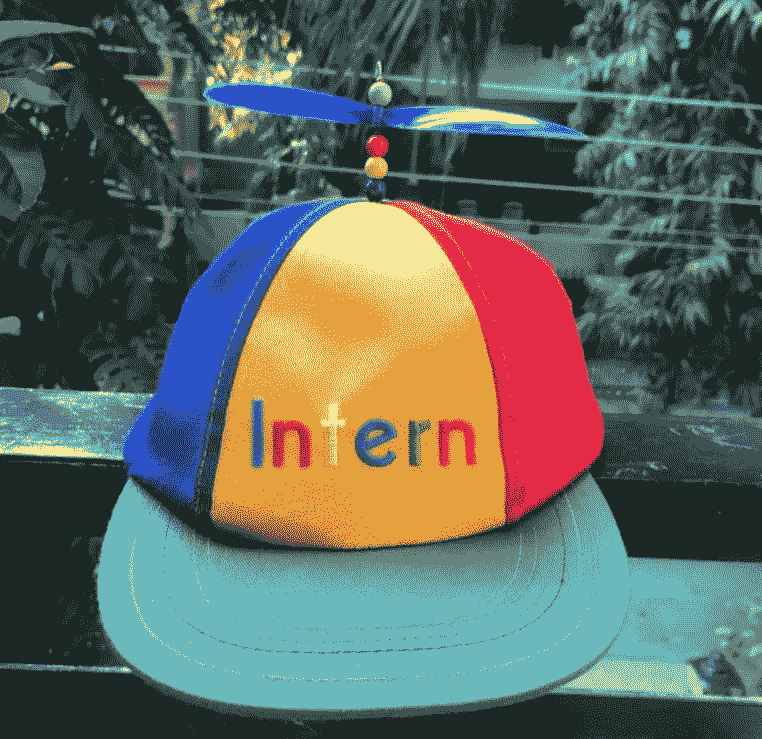

# 获得谷歌实习的一步一步指南

> 原文：<https://betterprogramming.pub/a-step-by-step-guide-to-a-google-internship-d440eb1af4ee>

## 如何进入谷歌的学生工程培训项目

STEP 代表谷歌提供的学生工程培训项目。这是一个为期 8 到 12 周的实习，专门为追求计算机科学和相关领域的二年级女生(三年级双学位学生也有资格)设计。

我有幸成为 STEP intern 2020 群组的一员，并将在本文中详细介绍申请流程、时间表、面试程序和我的经历。

# 关于该计划

STEP 实习生在一个技术项目上两三人一组工作，由谷歌工程师指导。我在构建高质量解决方案和向高层领导展示我的工作方面有很好的学习经历。实习生还可以参加谷歌员工的技术讲座，了解谷歌技术和编码实践，并发展重要的企业技能。我最喜欢的部分是与对技术有着共同热情的不同实习生交流。谷歌印度招聘软件和硬件职位，所以你绝对应该考虑申请你感兴趣的职位。

# 应用进程

有很多方法可以接到面试电话。以上是我遇到的一些常见的方法。

## 校园招聘

11 月底，谷歌从印度各个校园招聘学生。他们根据简历、成绩单以及相关的编程和开发经验来筛选学生。虽然 GPA 确实发挥了作用，但它不是唯一的标准，因为候选人的总体情况也会得到评估。在你的简历中一定要包括你以前的实习经历和在大学内外担任的技术职务。包括个人和学术项目也有助于提升你的形象，突出实用知识。

## **谷歌的编码竞赛**

谷歌在一年的不同时间组织各种[在线编程竞赛](https://codingcompetitions.withgoogle.com/)。这些包括(但不限于)代码阻塞、启动和哈希代码。谷歌根据人们在这些竞赛中的表现联系他们获得实习和全职职位。根据比赛发生的时间，这种情况全年都会发生。我的队友在 Kick Start 中获得了一个好的排名，她在 12 月份被联系，与招聘人员分享了她的简历。即使你正在考虑不同的申请模式，参加这些竞赛也是一个好主意，因为它们突出了你对谷歌的兴趣，并且是一次丰富的学习经历。

## 参考

如果以上两个步骤不适用于你，你可以联系谷歌公司推荐你去实习。这比直接在网站上申请更有效，因为它确保你的简历至少会被考虑。在设计你的简历时，请记住我上面列出的要点。

## 多方面的

为了被关注，你可以参加谷歌组织的各种节目。谷歌女性科技创客学者项目就是一个例子，通过这个项目你有机会在谷歌面试。你可以在谷歌[学生](https://careers.google.com/students/)页面跟踪更多这样的机会。

# 采访

一旦入围，你就进入了面试阶段。我在 11 月底申请，两周内收到了回复。我的面试被安排在邀请后的第五天。这个阶段包括两个背靠背的 45 分钟长的算法面试，测试你对数据结构的理解和编码能力。

面试完全是技术性的，要求你在谷歌文档中编码。这在第一次可能会有挑战性，因为我们大多数人都习惯于 ide，所以我建议您事先练习一次。面试是语言不可知的，所以你可以选择用哪种语言来编码。

虽然我不能透露确切的问题，但我可以提及我被问到的话题。我的第一次面试围绕着字符串操作，第二次是基于图的遍历和递归。面试时你可能会被问到一两个问题，这取决于你有多少时间。

问题可以是开放式的，所以你应该要求面试官澄清，而不是继续解决错误的问题。你也应该不断地和面试官交流你的想法，因为他们只有 45 分钟来评估你。这有助于他们理解你的思维过程，并对你的方法给予反馈。试着在解释你的想法时举些例子，并强调你是如何处理边缘情况的。

如果你被卡住了，完全不知道如何继续，请面试官给你一个提示——他们会在面试过程中帮助你。一旦你和面试官就解决方案达成一致，就进入编码部分。当你写程序时，通常很难进行对话，所以你可以在中间休息一下，解释代码片段并给出例子。

总的来说，把你的时间有效地分配在思考解决方案和编码上，因为这两者都是你面试的重要方面。

# 准备

我根据自己和其他实习生的经验整理了一些面试题目，如下:排序、搜索、字符串操作、贪婪、散列表、图(遍历、最短路径算法、拓扑排序)和递归。以前也有人问过我数学题，但那些很少。一定要通过你喜欢的学习方式，比如在线课程、视频、博客、大学课程或其他方法，来很好地理解这些概念。

更接近面试，可以参考 [LeetCode](https://leetcode.com/) 和 [GeeksForGeeks](https://www.geeksforgeeks.org/) 等网站练习面试问题。一定要从头到尾练习问题，从理论化解决方案到编码。虽然根据上述主题解决问题是必要的，但你也应该在没有事先看到主题的情况下解决问题。这样你就摆脱了知道问题来自哪个题目的偏见，获得了一个面试问题更真实的体验。在面试前的最后一周，你可以和你的大学学长安排一次模拟面试，练习说出你的想法和在谷歌文档上编码。

# 后续步骤

面试十天后(准确的说是 12 月 26 日)我收到了最终的选拔邮件。在某些情况下，如果谷歌不确定你的候选资格或者想了解更多细节，他们可能会进行第三次面试。所有的正式手续在二月份完成，我在五月到七月间实习。

# 结束语

我希望这篇文章对你有所帮助，并给你一些指导。在你走之前，我想提最后一件事。不要只是为了获得这些机会而工作，因为这会极大地限制你的学习。探索不同的领域，找出你的兴趣所在，而不是随大流。有很多机会会出现在你的面前，所以你不必执着于一件事。设定目标固然很好，但它们永远不应该是我们唯一的激励因素。对技术和学习新概念有潜在的热情，剩下的事情就会水到渠成！:)