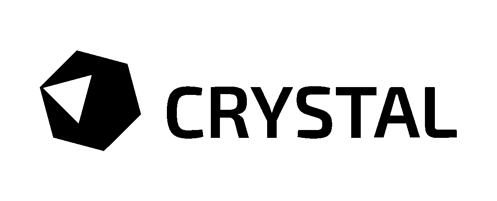

# 两个工程师发现水晶编程语言的故事

> 原文：<https://betterprogramming.pub/a-tale-of-two-engineers-discovering-the-crystal-programming-language-104b1fdbe525>

## 开始使用 Crystal lang

来源:维基百科

听说过务实的程序员吗？这是一本由戴维·托马斯和安德鲁·亨特写的名著。两位作者都就如何提高开发人员的技能和编写更好的程序给出了建议。

对我来说，这是最好的编程书籍之一，还有[干净的代码:敏捷软件工艺手册](https://www.amazon.com/Clean-Code-Handbook-Software-Craftsmanship/dp/0132350882/ref=sr_1_1?crid=Y3NN1ZBX3POV&keywords=CLean+code&qid=1643015153&sprefix=clean+code%2Caps%2C137&sr=8-1)和[设计模式:可重用面向对象软件的元素](https://www.amazon.com/Design-Patterns-Elements-Reusable-Object-Oriented/dp/0201633612/ref=sr_1_1?crid=3AMM2FGIFDE3K&keywords=Design+patterns&qid=1643015171&sprefix=design+pattern%2Caps%2C130&sr=8-1)。

其中一条建议特别引起了我的注意:“*不断学习*”。根据作者所说，你应该每年学习一门新的编程语言。

比如你是前端开发人员，没有后端开发的知识，那就去学 Go 或者 Python。或者，如果你已经知道一种后端编程语言，你可以转向 Rust 或 Elm。学习它并不意味着你会每天使用它，只是你会学到解决常见问题的新方法和新概念，例如，函数式编程语言和面向对象编程语言。

我就是这样学习了 Swift、Python、Rust 以及最近的 Crystal 等编程语言。几周前，我的一位同事马修·埃尔米特带着一个问题来找我。他想在 Datadog 中的一个类似谷歌地图的应用程序上显示标记。每个标记都需要在地图上显示纬度和经度，这些数据是根据用户的 IP 地址收集的。

这就是你在第二篇博文的结尾会得到的。

这是一系列博客文章的第一篇，在这些文章中，你会读到关于 Crystal 的内容。第二个是关于如何创建一个定制的 Datadog 小部件，显示一个带有定制标记的 OpenStreetMap。你可以在 GitHub 上找到[该项目的源代码。](https://github.com/DataDog/apps)

**不需要晶体的先验知识**。我们将涵盖所有基本的和更高级的概念。但是，您应该至少掌握一门编程语言的基本知识。例如，我不会讨论什么是函数或变量，而是讨论这些部分在 Crystal 中是如何实现的。

# 选择 Crystal 而不是另一种编程语言

当我向我的开发者朋友展示这个项目时，他们都有第一个相同的问题:为什么是 Crystal？你为什么选择 Crystal 而不是另一种更流行的编程语言？Crystal 提供了其他现有编程语言没有的东西吗？是不是更灵活，更快，更容易使用等。比围棋，JavaScript，还是 Python？

"*快如 C，滑如红宝石*":是我发现水晶时读到的。Crystal 确实非常注重性能。它提供了 C/C++的性能和 Ruby 的语法。因此，您不必在性能和可读性之间做出选择，您可以创建兼顾两者的应用程序。

使用 Crystal 还有很多其他优势，我建议你看看[的官方文档](https://crystal-lang.org/)。我特别喜欢文档让您构建的两个示例项目:一个小型 HTTP 服务器和一个 CLI。这是一个完美的起点，使用真实世界的用例/场景，而不是无聊无用的“你好，世界”。是的，我总是会在开始的时候打印一个“Hello，World ”,但这只是第一步。

Crystal 的语法真的很棒。正如该项目的主页所说:如果你知道并喜欢 Ruby 语法，你会喜欢用 Crystal 编码。还介绍了静态类型和面向对象的概念。我还没有尝过，但是下次我一定会尝一尝。

2017 年，Crystal 受到空前的欢迎，在 TIOBE 指数中排名第 32 位。我在写这篇文章之前看了一下，我找不到水晶。似乎没有 2017/2018 年那么受欢迎了。这种受欢迎程度的下降伴随着其他潜在的问题。

我也很难找到示例项目或代码库。StackOverflow 上常见问题的答案也是如此。对我来说，这是一个很大的缺点。如果你将它与任何其他编程语言进行比较，甚至与 Rust 进行比较，你会找到更多解决你的问题的答案。例如，我很难找到如何在 Crystal 中创建函数，甚至到今天，我仍然不确定在哪里可以找到这些信息。

Crystal 中的依赖项或*碎片*也有同样的问题。有一些非常有趣的碎片，我甚至发现了一些数据狗的碎片。但是它们没有得到真正的维护，而且数量太少。我知道这是一种赢/赢或输/输的情况:你越受欢迎，人们就会建立更多的碎片。

无论如何，即使水晶也许不像几年前那样受欢迎，但这并不意味着我们不应该使用它。正如我在文章开头告诉你的，学习一门新的语言总是有趣和令人兴奋的。这就像学习一种新的乐器，但是是用你从以前的尝试中获得的所有知识。现在，您对项目的背景有了更多的了解，是时候深入项目本身了！

# 检索与 IP 地址相关的地理位置信息

当你开始阅读这篇文章时，我提到了 Matthieu 项目，我决定在 Crystal 中构建一个简单的代理服务器。这个代理将与 IfConfig.co 通信，并将 IP 地址传递给它。然后会返回一个带有纬度和经度的响应，我们会将它发送回客户端。

下面是它在一个图像中的工作原理:

我们的 Crystal-api 充当客户端和 ifconfig 之间的代理

一旦我们从 ifconfig 得到响应，我们就把它传递给 web 浏览器。就这么简单！

在查看应用程序代码之前，先简单介绍一下 ifconfig.co。这是一种网络服务，可以让你找到你的 IP 地址和相关信息。你可以得到很多信息，例如，国家，地区，城市，纬度和经度，用户代理等。请注意，源代码和文档可以在 [GitHub](https://github.com/mpolden/echoip) 上公开获得。

如果你想运行这个项目，你可以在这个 GitHub 库上找到[的源代码。克隆它，然后转到`examples/geomap`文件夹。有三个文件夹，但我们将只使用`crystal-api`文件夹中的内容。我们还将使用`docker-compose-api.yml`文件。如果你想知道其他两个文件夹里有什么，这些将在第二篇博文中讨论。](https://github.com/DataDog/apps)

如果要在您的计算机上启动项目，请运行以下命令:

*   `docker-compose -f docker-compose-api.yml build`:它提取水晶图像，通过创建二进制文件来构建整个项目。
*   `docker-compose -f docker-compose-api.yml up`:运行容器，即代理服务器，在端口 8080 公开。然后，您将不得不打开您的 web 浏览器到以下地址: [http://localhost:8080](http://localhost:8080) 。

# 编写 Crystal 应用程序

先说如何在你的机器上安装 Crystal！根据您的操作系统，您可以用不同的方式安装 Crystal。您可以在文档中查看[的安装步骤。](https://crystal-lang.org/install/)

然而，我认为这是主要问题之一:Crystal 编译器不能在 Windows 上本地运行。2018 年已经如此，今天依然如此。Linux 可以用 Windows 子系统，但是我觉得你需要 Windows 10 或者 11。

或者你可以用开发者最好的朋友之一:Docker。Docker 图片有不同的[版本，包括阿尔卑斯山的](https://hub.docker.com/r/crystallang/crystal/)。然而，我发现 DockerHub 上的文档有点少，尤其是与 [Python](https://hub.docker.com/_/python) 或 [NodeJS](https://hub.docker.com/_/node) 图片相比。获得更多关于不同类型图像的信息和指导可能会很有趣。

现在让我们分解我们的`main.cr`文件中的代码，并逐个元素地检查它。

以下是如何在 Crystal 中导入或要求一个文件或库。`http/server`和`json`是内置库，不需要安装。但是，如果需要安装一个依赖项，就需要更新`shard.yml`文件。

一旦完成，运行`shards install`命令。它不仅会安装依赖项，而且，你知道的，依赖项的依赖项，它还会生成一个“shard . lock”。[shards . info](https://shards.info/)网站包含一个存储库列表，包括最近的和流行的存储库。如果你想知道更多关于所有 shards 命令的信息，[这里是参考](https://crystal-lang.org/reference/1.3/the_shards_command/index.html#shards-commands)。

您可以创建局部或全局变量，而不必指定它们的类型。局部变量以小写字母开头。它们的类型是从它们的使用中推断出来的，而不仅仅是它们的初始化器。在上面的代码片段中，我们在寻找环境变量。如果它们被定义，我们使用它，否则我们设置默认值。这些环境变量在`docker-compose-api.yml`文件的环境属性中定义。

创建一个函数或方法与在 Ruby 中是一样的:必须在函数的开头使用`def`关键字，在函数的结尾使用`end`。还要注意，关键字`return`是存在的，但它不是必需的，如果你愿意，你可以省略它。你可以在官方文档中了解更多关于方法[的信息。](https://crystal-lang.org/reference/1.3/syntax_and_semantics/the_program.html)

在上面的代码示例中，我们通过使用点符号来访问对象中的属性和方法。

整个项目包括创建一个代理服务器，将与 ifconfig.co 通信。要在 Crystal 中创建 web 服务器，首先需要导入`http/server`依赖项，然后初始化它，绑定一个端口，最后用`server.listen`启动它。

能够在程序中编写控制流，或`if`、`else if`和`else`，是我们通常要学习的第一件事。在 Crystal 中，测试条件时不需要括号。开关操作符被称为`case`，其中`until`只是一个`while`条件的语法。文档包含了很多关于控制表达式的信息，你可以在这里找到[。](https://crystal-lang.org/reference/1.3/syntax_and_semantics/control_expressions.html)

如果你想用`try...catch`块捕捉代码中的错误，我们将不得不使用`begin...rescue`语法。和 Ruby 里的一样。该项目用它来解析 JSON 数据。如果你想了解更多关于异常处理的知识，你可以在这里查看文档。

最后，在我们进入更高级的概念之前，如果您想知道如何记录信息，如 Python 中的`print`或 JavaScript 中的`console.log`，您可以使用关键字`puts`。`"puts "My variable is #{my_variable}"”`允许您添加记录语句。然而，我不知道如何在 Crystal 中创建正确的日志。

# 还有更多

还有一些东西没有在这篇文章中涉及到。例如，Crystal 是一种面向对象的编程语言，我们在这篇博文中没有涉及到。框架和库也是如此。Matthieu 和我目前正在 Crystal 中进行其他项目，我们将继续在这个系列中添加内容。

同时，如果你已经渴望更多，这里有一个教程，它将解释如何在 Crystal 中创建一个简单的静态文件服务器。[入门教程](https://crystal-lang.org/reference/1.3/getting_started/index.html)也在 Crystal 中提供了两个有趣的小项目。

如果你有任何问题，不要犹豫问他们，我将非常乐意与你讨论！下次见，感谢阅读，再见！