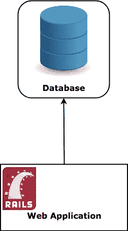
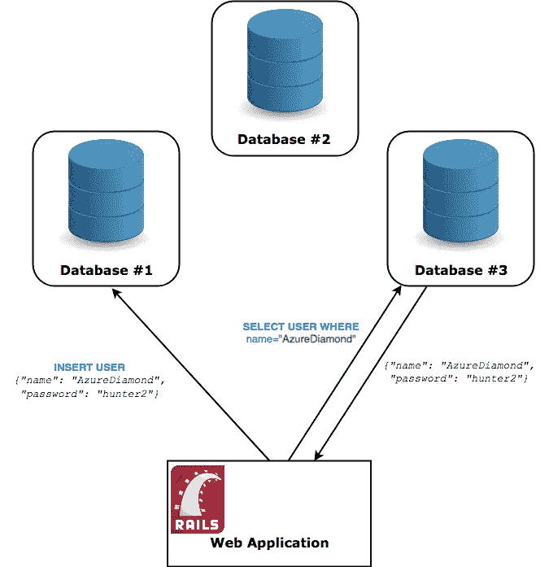
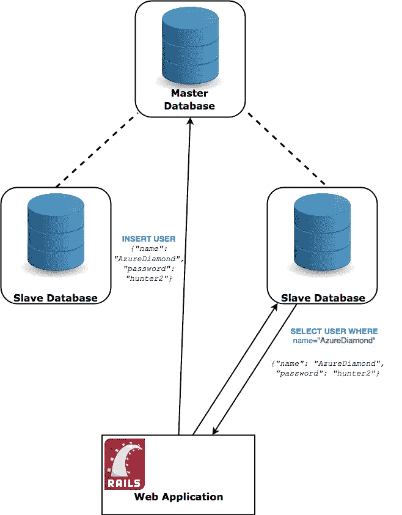
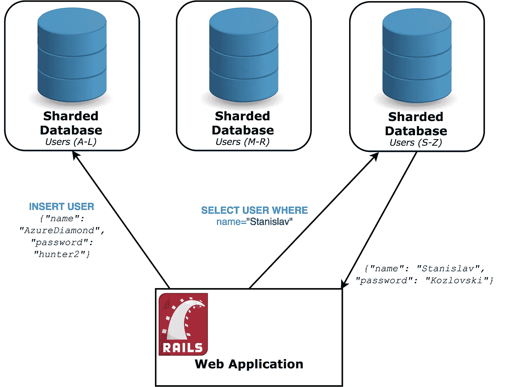
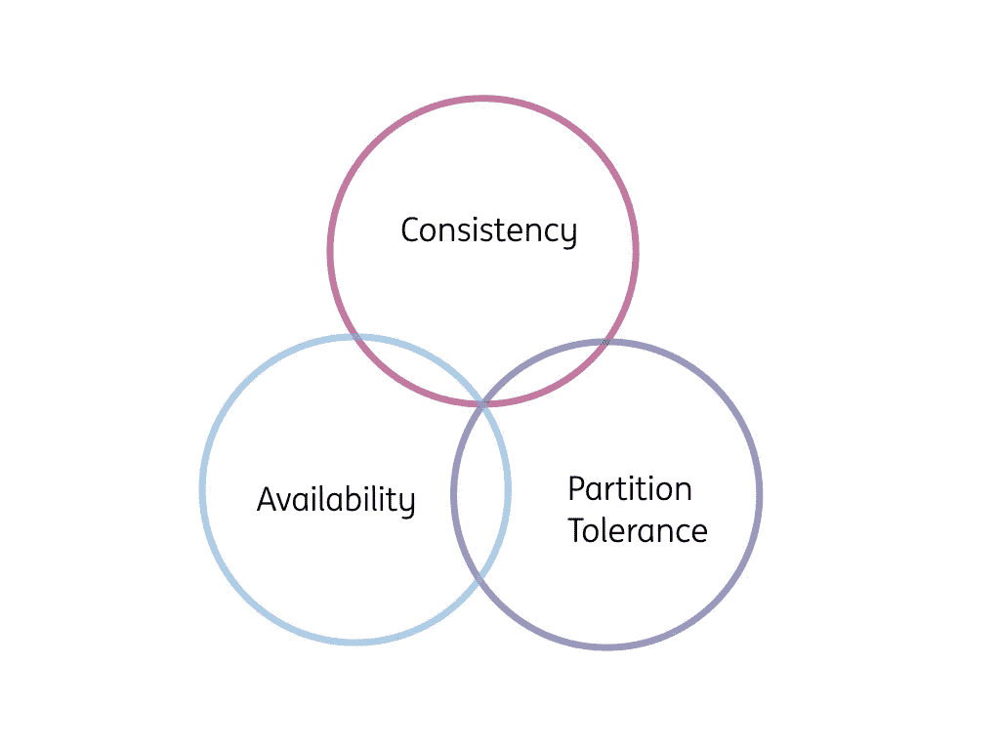
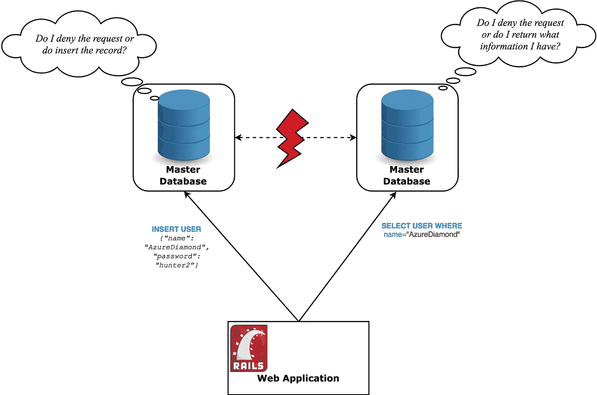
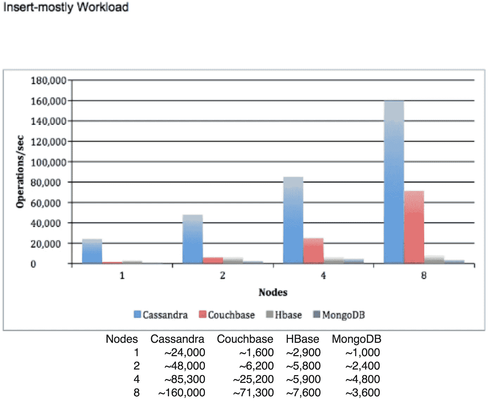
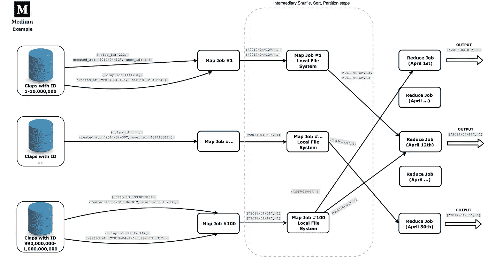
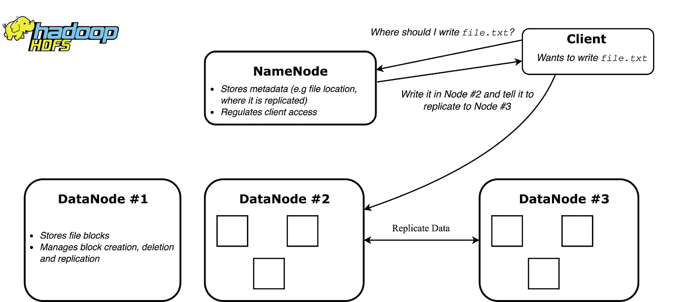
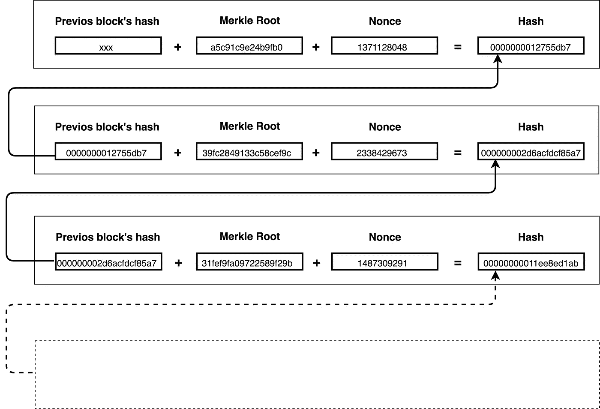

# 分布式系统的全面介绍

> 原文：<https://betterprogramming.pub/a-thorough-introduction-to-distributed-systems-3b91562c9b3c>

## 什么是分布式系统，为什么它们如此复杂？


一头思考分布式系统的熊

```
**Table of Contents** **Introduction**
1\. What is a distributed system?
2\. Why distribute a system?
3\. Database scaling example
4\. Decentralized vs. distributed**Distributed System Categories** 1\. Distributed Data Stores
2\. Distributed Computing
3\. Distributed File Systems
4\. Distributed Messaging
5\. Distributed Applications
6\. Distributed Ledgers**Summary**
```

# 介绍

随着世界技术的不断发展，分布式系统变得越来越普遍。它们是计算机科学中一个庞大而复杂的研究领域。

本文旨在以一种基本的方式向您介绍分布式系统，向您展示这种系统的不同类别，同时不要太深入地探究细节。

## 什么是分布式系统？

分布式系统最简单的定义是一组协同工作的计算机，对最终用户来说就像一台计算机。

这些机器有一个共享状态，并发运行，并且可以独立地发生故障，而不会影响整个系统的正常运行时间。

我建议我们通过一个分布式系统的例子来渐进地工作，这样你可以更好地理解它。



传统堆栈

我们用数据库吧！传统的数据库存储在一台机器的文件系统上。每当你想在里面获取/插入信息时，你就直接和那台机器说话。

对于我们来说，要分发这个数据库系统，我们需要让这个数据库同时在多台机器上运行。用户必须能够与他选择的任何一台机器对话，并且不能说他不是在与一台机器对话——如果他向节点#1 插入一条记录，节点#3 必须能够返回该记录。



可以被认为是分布式的架构

## 为什么要分发系统？

系统总是根据需要分配的。事实是，管理分布式系统是一个充满陷阱和地雷的复杂话题。部署、维护和调试分布式系统是一件令人头痛的事情——那么为什么要去那里呢？

分布式系统使你能够做的是**水平扩展**。回到我们前面的单数据库服务器的例子，处理更多流量的唯一方法是升级运行数据库的硬件。这被称为**垂直缩放**。

如果可以的话，纵向扩展当然很好，但在某个点之后，您会发现即使最好的硬件也不足以支持足够的流量，更不用说托管了。

**横向扩展**简单来说就是增加更多的电脑，而不是升级单台电脑的硬件。


在某个阈值之后，水平缩放变得**更便宜**

在某个阈值之后，它比垂直扩展要便宜得多，但这不是它首选的主要原因。

垂直扩展只能将您的性能提升到最新的硬件能力。事实证明，这些能力不足以满足中等至大型工作负载的科技公司的需求。

水平扩展最好的一点是，您可以扩展的范围没有上限——每当性能下降时，您只需添加另一台机器，就有可能无限扩展。

易于扩展并不是分布式系统的唯一好处。 ***容错*** 和 ***低延迟*** 也同样重要。

***容错*** 是指跨两个数据中心的十台机器组成的集群，本来就比单台机器容错能力更强。即使一个数据中心着火，您的应用程序仍然可以工作。

***低延迟*** 指的是一个网络数据包在世界上传播的时间在物理上受限于光速的想法。例如，在纽约到悉尼的光缆中，一个请求的**往返时间**(即来回)的最短可能时间是[160 毫秒](https://www.oreilly.com/learning/primer-on-latency-and-bandwidth)。分布式系统允许您在两个城市都有一个节点，允许流量到达离它最近的节点。

然而，要使分布式系统工作，你需要在那些机器上运行的软件被特别设计成同时在多台计算机上运行，并处理随之而来的问题。事实证明这并非易事。

# 扩展我们的数据库

想象一下，我们的 web 应用程序变得异常流行。想象一下，我们的数据库开始每秒处理两倍的查询。您的应用程序将立即开始性能下降，这将会被您的用户注意到。

让我们一起努力，使我们的数据库能够满足我们的高需求。

在一个典型的 web 应用程序中，阅读信息通常比插入新信息或修改旧信息要频繁得多。



有一种方法可以提高读取性能，那就是采用主-辅复制策略。在这里，您创建了两个新的数据库服务器，它们与主服务器同步。问题是您只能从这些新实例中读取。

每当您插入或修改信息时，您都要与主数据库进行对话。反过来，它异步地将更改通知辅助数据库，辅助数据库也保存更改。

恭喜，您现在可以执行 3 倍的读取查询了！这不是很棒吗？

## 陷阱

抓住你了。我们立即失去了关系数据库的[](https://en.wikipedia.org/wiki/ACID)**保证中的 ***C*** ，这代表着一致性。**

**您看，现在存在这样一种可能性:我们向数据库中插入一条新记录，然后立即发出一个读查询，然后什么也没有得到——就好像它不存在一样！**

**将新信息从主数据库传播到辅助数据库不会立即发生。实际上存在一个时间窗口，您可以在其中获取陈旧的信息。如果不是这样，您的写入性能会受到影响，因为它必须同步等待数据传播。**

**分布式系统有一些缺点。如果您想要充分扩展，这个特殊的问题是您必须面对的。**

## ****继续缩放****

**使用辅助数据库方法，我们可以在一定程度上横向扩展我们的读取流量。这很好，但是我们在写入流量方面遇到了瓶颈—它仍然都在一台服务器上！**

**我们没有太多选择。我们只需要将我们的写流量分割到多个服务器上，因为一个服务器无法处理它。**

**一种方法是采用[多主复制策略](https://en.wikipedia.org/wiki/Multi-master_replication)。在那里，您有多个支持读取和写入的主节点，而不是只能读取的辅助数据库。不幸的是，这很快变得复杂起来，因为你现在有能力[创建冲突](http://datacharmer.blogspot.bg/2013/03/multi-master-data-conflicts-part-1.html)(例如，插入两个具有相同 ID 的记录)。**

**我们再来看看另一种叫做 [***分片***](https://medium.com/@jeeyoungk/how-sharding-works-b4dec46b3f6) (也叫 ***分区*** )的技术。**

**使用分片，您将您的服务器分成多个更小的服务器，称为 ***分片。*** 这些碎片都保存着不同的记录——你创建一个规则来决定哪种记录进入哪个碎片。创建规则使数据以统一的方式传播是非常重要的。**

**一种可能的方法是根据某个记录的一些信息来定义范围(例如名字为 A-D 的用户)。**

****

**应该非常小心地选择这个分片键，因为基于任意列的负载并不总是相等的。(例如，名字以 C 开头的人比以 Z 开头的人多)。比其他碎片接收更多请求的单个碎片被称为 ***热点*** ，必须避免。一旦分割，重新分割数据会变得非常昂贵，并可能导致长时间的停机，FourSquare 臭名昭著的 11 小时停机就是一例。**

**为了使我们的例子简单，假设我们的客户机(Rails 应用程序)知道每个记录使用哪个数据库。同样值得注意的是，分片有许多策略，这是一个简单的例子来说明这个概念。**

**我们现在已经赢得了很多—我们可以将我们的写入流量增加 ***N*** 倍，其中 ***N*** 是碎片的数量。这实际上给了我们几乎没有限制——想象一下我们可以通过这种划分获得多么细粒度的划分。**

## **陷阱**

**软件工程中的一切或多或少都是一种权衡，这也不例外。分片不是一件简单的事情，除非真的需要，否则最好避免[。](https://www.percona.com/blog/2009/08/06/why-you-dont-want-to-shard/)**

**我们现在通过键**而不是分区键**进行查询，效率非常低(他们需要遍历所有的碎片)。SQL `JOIN`查询甚至更糟，复杂的查询实际上变得不可用。**

## **分散与分布式**

**在我们进一步讨论之前，我想区分一下这两个术语。**

**尽管这两个词听起来很相似，并且在逻辑上可以得出相同的结论，但它们的差异会产生重大的技术和政治影响。**

*****去中心化*** 在技术意义上仍然是 ***分布式*** ，但整个去中心化系统并不归一个行动者所有。没有一家公司可以拥有一个分散的系统；否则就不会再去中心化了。**

**这意味着我们今天要讨论的大多数系统都可以被认为是 ***分布式集中式系统***——这就是它们的设计初衷。**

**如果你想一想，创建一个分散的系统是很困难的，因为你需要处理一些参与者是恶意的情况。这与普通的分布式系统不同，因为您知道您拥有所有的节点。**

***注:这个定义已经被*[](https://github.com/WebOfTrustInfo/rebooting-the-web-of-trust/issues/50#issuecomment-154995201)**争论了很多，可以和其他(点对点，联邦)混淆。* [*在早期文献中，对它也有不同的定义。*](https://ethereum.stackexchange.com/a/7829) *不管怎样，我给你的定义是我认为现在使用最广泛的，因为区块链和加密货币普及了这个术语。****

# ***分布式系统类别***

***我们现在将讨论几个分布式系统类别，并列出它们最大的众所周知的生产用途。请记住，大多数显示的数字都是过时的，而且在您阅读本文时，这些数字很可能要大得多。***

## ***分布式数据存储***

***分布式数据存储被广泛使用并被认为是分布式数据库。大多数分布式数据库是 [NoSQL](https://en.wikipedia.org/wiki/NoSQL) 非关系数据库，仅限于键值语义。它们以牺牲一致性或可用性为代价，提供了令人难以置信的性能和可扩展性。***

*****已知规模** — [众所周知，苹果在 2015 年使用了 75，000 个 Apache Cassandra 节点，存储了超过 10pb 的数据，](http://cassandra.apache.org/)。***

***如果不首先介绍一下 **CAP 定理，我们就无法讨论分布式数据存储。*****

## ***CAP 定理***

***[早在 2002 年](https://mwhittaker.github.io/blog/an_illustrated_proof_of_the_cap_theorem/)就被证明了，CAP 定理指出分布式数据存储不能同时具有一致性、可用性和分区容错性。***

******

***3 选 2(但不包括一致性和可用性)***

***一些快速定义:***

*   *****一致性:**您按顺序读取和写入的内容是所期望的(还记得几段前关于数据库复制的问题吗？)***
*   *****可用性:**整个系统不会死——每个非故障节点总是返回一个响应。***
*   *****分区容忍度:**尽管有[网络分区](https://www.symantec.com/security_response/glossary/define.jsp?letter=n&word=network-partition)，系统仍继续运行并维护其一致性/可用性保证。***

***实际上，对于任何分布式数据存储，分区容差都必须是给定的。正如在许多地方提到的，[其中之一就是这篇伟大的文章](https://codahale.com/you-cant-sacrifice-partition-tolerance/)，没有分区容差，就不可能有一致性和可用性。***

***想想看:如果您有两个接受信息的节点，但它们的连接断开了——它们如何同时可用并为您提供一致性？他们无法知道另一个节点正在做什么，因此，要么离线*(不可用)*，要么使用陈旧信息*(不一致)*。***

******

***我们该怎么办？***

***最后，您可以选择是否希望您的系统在一个网络分区 下具有强一致性或者高可用性**。*****

***实践表明，大多数应用程序更重视可用性。你不一定总是需要很强的一致性。即使这样，也不一定要进行权衡，因为您需要 100%的可用性保证，而是因为当必须同步机器以实现强一致性时，网络延迟可能是一个问题。这些以及更多因素使得应用程序通常选择提供高可用性的解决方案。***

***这类数据库采用最弱的一致性模型— ***最终一致性*** [(强对最终一致性解释)](https://hackernoon.com/eventual-vs-strong-consistency-in-distributed-databases-282fdad37cf7)。这个模型保证，如果没有对给定的项目进行新的更新，**最终**对该项目的所有访问将返回最新的更新值。***

***这些系统提供了基本属性(与传统数据库的 ACID 相反):***

*   ***B 基本上 **A** 可用——系统总是返回一个响应。***
*   ***oft 状态——系统可能会随着时间而改变，甚至在没有输入的时候也是如此(由于最终的一致性)。***
*   ***事件一致性——在没有输入的情况下，数据迟早会传播到每个节点——从而变得一致。***

***这种可用的分布式数据库的例子有 [Cassandra](http://cassandra.apache.org/) 、 [Riak](http://basho.com/products/riak-kv/) 、 [Voldemort](http://www.project-voldemort.com/voldemort/) 。***

***当然，还有其他数据存储更喜欢更强的一致性— [HBase](https://hbase.apache.org/) 、 [Couchbase](https://www.couchbase.com/) 、 [Redis、](https://redis.io/) [Zookeeper](https://zookeeper.apache.org/) 。***

***CAP 定理本身就值得写多篇文章——一些是关于如何[根据客户端的行为来调整系统的 CAP 属性](http://www.goland.org/blockchain_and_cap/),另一些是关于[如何不被正确理解](https://martin.kleppmann.com/2015/05/11/please-stop-calling-databases-cp-or-ap.html)。***

## ***卡桑德拉***

***如上所述，Cassandra 是一个分布式非 SQL 数据库，它更喜欢 AP 属性，并最终保持一致性。我必须承认这可能有点误导，因为 Cassandra 是高度可配置的——你可以让它以可用性为代价提供强大的一致性，但这不是它的常见用例。***

***Cassandra 使用[一致散列](https://en.wikipedia.org/wiki/Consistent_hashing)来确定集群中的哪些节点必须管理您传入的数据。您设置了一个**复制因子**，它基本上说明了您想要复制多少个节点的数据。***

******

***样本写入***

***读取时，您将只从那些节点读取。***

***Cassandra 具有巨大的可伸缩性，提供了高得离谱的写吞吐量。***

******

***可能有偏差的图表，显示每秒写入数基准。[取自这里。](https://academy.datastax.com/planet-cassandra/nosql-performance-benchmarks)***

***尽管该图可能有所偏差，并且看起来它将 Cassandra 与数据库进行了比较，以提供强大的一致性(否则我看不出为什么 MongoDB 在从 4 个节点升级到 8 个节点时会降低性能)，但它仍然应该显示了正确设置的 Cassandra 集群的能力。***

***无论如何，在支持水平扩展和难以置信的高吞吐量的分布式系统权衡中，Cassandra 没有提供 ACID 数据库的一些基本特性——即事务。***

## ***共识；一致***

***数据库事务在分布式系统中很难实现，因为它们需要每个节点同意采取正确的行动(中止或提交)。这被称为 ***共识*** ，是分布式系统中的一个基本问题。***

***如果参与的进程和网络是完全可靠的，那么达成“事务提交”问题所需的协议类型是很简单的。然而，真实的系统容易出现许多可能的故障，比如进程崩溃、网络分割以及丢失、扭曲或重复的消息。***

***这就提出了一个问题——已经证明[不可能](http://the-paper-trail.org/blog/a-brief-tour-of-flp-impossibility/)在一个不可靠的网络上保证在有限的时间内达成正确的共识。***

***然而在实践中，有一些算法可以在不可靠的网络上很快达成共识。Cassandra 实际上通过使用用于分布式共识的 [Paxos](https://en.wikipedia.org/wiki/Paxos_(computer_science)) 算法来提供[轻量级事务](https://www.beyondthelines.net/databases/cassandra-lightweight-transactions/)。***

# ***分布式计算***

***分布式计算是我们近年来看到的大数据处理涌入的关键。它是一种将一项巨大的任务(例如，总计 1000 亿条记录)分解成许多较小的任务的技术，没有一台计算机能够独立执行这些任务，而每一项任务都可以装入一台商用机器中。您将庞大的任务分成许多较小的任务，让它们在许多机器上并行执行，适当地聚合数据，这样您就解决了最初的问题。这种方法再次使您能够水平扩展—当您有更大的任务时，只需在计算中包含更多的节点。***

> ***已知规模—[Folding @ Home](https://en.wikipedia.org/wiki/Folding@home)2012 年有 [16 万台活跃机](https://www.webcitation.org/6CWRdkzP0?url=http://fah-web.stanford.edu/cgi-bin/main.py?qtype=osstats2)***

***这一领域的早期创新者是 Google，由于需要大量的数据，他们不得不发明一种新的分布式计算模式——MapReduce。他们在 2004 年发表了一篇关于它的论文，开源社区后来基于它创建了 Apache Hadoop。***

## ***MapReduce***

***MapReduce 可以简单地定义为两步— [映射](https://en.wikipedia.org/wiki/Map_(higher-order_function))数据和[将](https://en.wikipedia.org/wiki/Fold_(higher-order_function))数据还原成有意义的东西。***

***让我们再看一个例子:***

***假设我们是中型企业，我们将大量信息存储在二级分布式数据库中，用于仓储目的。我们想要获取代表 2017 年 4 月(一年前)每天发出的鼓掌次数的数据。***

***这个例子尽可能的简短、清晰和简单，但是想象一下我们正在处理大量的数据(比如分析数十亿个掌声)。显然，我们不会将所有这些信息都存储在一台机器上，也不会只用一台机器来分析所有这些信息。我们也不会查询生产数据库，而是一些专门为低优先级离线作业构建的“仓库”数据库。***

******

***每个地图作业都是一个独立的节点，尽可能多地转换数据。每个作业遍历给定存储节点中的所有数据，并将其映射到一个简单的日期和数字 1 的元组。然后，完成了三个中间步骤*(没人谈论这个)*——洗牌、排序和分区。他们基本上进一步整理数据并将其删除到适当的 Reduce 作业中。当我们处理大数据时，我们将每个 Reduce 任务分离出来，只在一个日期工作。***

***这是一个很好的范例，令人惊讶的是，它让您可以做很多事情——例如，您可以链接多个 MapReduce 作业。***

## ***更好的技术***

***MapReduce 现在有点过时了，带来了一些问题。因为它以批处理(作业)方式工作，所以如果您的作业失败，就会出现一个问题——您需要重新启动整个过程。两个小时的作业失败真的会降低整个数据处理流程的速度，这是您不希望看到的，尤其是在高峰时段。***

***另一个问题是你等待收到结果的时间。在实时分析系统(这些系统都有大数据，因此使用分布式计算)中，让最新处理的数据尽可能新鲜非常重要，当然不能是几个小时前的数据。***

***因此，出现了解决这些问题的其他[架构](https://www.talend.com/blog/2017/08/28/lambda-kappa-real-time-big-data-architectures/)，即 [Lambda 架构](http://lambda-architecture.net/)(批处理和流处理的混合)和 [Kappa 架构](http://milinda.pathirage.org/kappa-architecture.com/)(仅流处理)。该领域的这些进步带来了新的工具，使他们能够——[Kafka Streams、](https://kafka.apache.org/documentation/streams/) [Apache Spark](https://spark.apache.org/) 、 [Apache Storm](http://storm.apache.org/) 、 [Apache Samza](http://samza.apache.org/) 。***

# ***分布式文件系统***

***分布式文件系统可以被认为是分布式数据存储。它们在概念上是一样的——在一个机器集群上存储和访问大量数据，所有这些数据都表现为一个整体。它们通常与分布式计算携手并进。***

****已知规模—* [*早在 2011 年*](https://www.slideshare.net/Hadoop_Summit/what-it-takes-to-run-hadoop-at-scale-yahoo-perspectives) *，雅虎就因在超过 42000 个节点上运行 HDFS 以存储 600 数据而闻名。****

***维基百科定义的区别是，分布式文件系统允许使用与本地文件相同的接口和语义来访问文件，而不是通过像卡珊德拉查询语言 [(CQL)](https://docs.datastax.com/en/cql/3.3/cql/cqlIntro.html) 这样的自定义 API。***

## ***HDFS***

***Hadoop 分布式文件系统(HDFS)是通过 Hadoop 框架用于分布式计算的分布式文件系统。它被广泛采用，用于在许多机器上存储和复制大文件(GB 或 TB 大小)。***

***架构主要由***NameNode***和***datanode***组成。NameNodes 负责保存有关群集的元数据，例如哪个节点包含哪些文件块。它们充当网络的协调者，找出存储和复制文件的最佳位置，跟踪系统的健康状况。DataNodes 只是存储文件和执行命令，如复制文件、写入新文件等。***

******

***不出所料，HDFS 最适合与 Hadoop 一起用于计算，因为它为计算作业提供了数据感知。然后，作业在存储数据的节点上运行。这利用了数据局部性，优化了计算，并减少了网络上的流量。***

## ***IPFS***

***[星际文件系统(IPFS)](https://ipfs.io/) 是一个令人兴奋的新的对等协议/网络，用于分布式文件系统。利用区块链技术，它拥有完全分散的架构，没有单一所有者，也没有故障点。***

***IPFS 提供了一个名为 IPNS 的命名系统(类似于 DNS ),让用户可以方便地获取信息。它通过历史版本存储文件，类似于 [Git](https://en.wikipedia.org/wiki/Git) 的做法。这允许访问文件以前的所有状态。***

***它仍在进行大量的开发(撰写本文时是 v0.4)，但已经有项目对在它之上进行构建感兴趣( [FileCoin](https://filecoin.io/) )。***

# ***分布式消息传递***

***消息传递系统为整个系统中消息/事件的存储和传播提供了一个中心位置。它们允许您将应用程序逻辑从与其他系统的直接对话中分离出来。***

****已知规模—* [*LinkedIn 的 Kafka 集群每天处理 1 万亿条消息，峰值为每秒 450 万条消息。*](https://engineering.linkedin.com/apache-kafka/how-we_re-improving-and-advancing-kafka-linkedin)***

******

***简而言之，消息传递平台以如下方式工作:***

***消息从潜在创建它的应用程序(称为**生产者**)广播，进入平台，并被对其感兴趣的潜在多个应用程序(称为**消费者** s)读取。***

***如果你需要将某个事件保存到几个地方(例如，用户创建到数据库、仓库、电子邮件发送服务，以及你能想到的任何其他东西)，消息平台是传播该消息的最干净的方式。***

***消费者既可以从代理那里获取信息(拉模式)，也可以让代理将信息直接推给消费者(推模式)。***

***有几个流行的顶级消息平台:***

***[RabbitMQ](https://www.rabbitmq.com/) : Message broker，它允许您通过路由规则和其他容易配置的设置来更细粒度地控制消息轨迹。这可以称为智能代理，因为它有很多逻辑，并紧密跟踪通过它的消息。从 **CAP** 为 **AP** 和 **CP** 提供设置。使用推送模式通知消费者。***

***[Kafka](https://kafka.apache.org/) : Message broker(和 all-out platform ),层次稍低，因为它不跟踪哪些消息已被阅读，也不支持复杂的路由逻辑。这有助于它实现惊人的性能。在我看来，在开源社区的积极开发和[融合团队](https://www.confluent.io/blog)的支持下，这是这个领域最大的前景。可以说，顶级科技公司对卡夫卡的使用最为广泛。我写了一篇关于这方面的全面介绍，详细介绍了它的所有优点。***

***Apache ActiveMQ:最老的一个，可以追溯到 2004 年。使用 JMS API，这意味着它面向 Java EE 应用程序。它被重写为 ActiveMQ Artemis，提供了与 Kafka 不相上下的出色性能。***

***[亚马逊 SQS](https://aws.amazon.com/sqs/):AWS 提供的消息服务。允许您快速将其与现有应用程序集成，并消除处理您自己的基础架构的需要，这可能是一个很大的好处，因为像 Kafka 这样的系统是出了名的难以设置。亚马逊也提供两种类似的服务——[SNS](https://aws.amazon.com/sns/)和 [MQ](https://aws.amazon.com/amazon-mq/) ，后者基本上是 ActiveMQ，但由亚马逊管理。***

# ***分布式应用***

***如果您将五台 Rails 服务器放在一个负载均衡器后面，全部连接到一个数据库，您能称之为分布式应用程序吗？回想一下我上面的定义:***

> ***分布式系统是一组协同工作的计算机，对最终用户来说就像一台计算机。这些机器有一个共享的状态，并发运行，可以独立出现故障，而不会影响整个系统的正常运行时间。***

***如果您将数据库算作共享状态，您可能会认为这可以归类为分布式系统——但是您错了，因为您已经错过了定义中的“*协同工作*”部分。***

***只有当节点相互通信以协调它们的动作时，系统才是分布式的。***

***因此，在[对等网络](https://en.wikipedia.org/wiki/Peer-to-peer)上运行其后端代码的应用程序可以更好地归类为分布式应用程序。无论如何，这都是不必要的分类，没有任何意义，只是为了说明我们是多么的挑剔。***

****已知规模—*[*2014 年 4 月《权力的游戏》一集 19.3 万节点的 BitTorrent 群*](https://torrentfreak.com/game-of-thrones-sets-new-torrent-swarm-record-140415/) *。****

## ***Erlang 虚拟机***

***Erlang 是一种函数式语言，在并发性、分布性和容错性方面有很好的语义。Erlang 虚拟机本身处理 Erlang 应用程序的分发。***

***它的模型通过许多**隔离的** [轻量级进程](https://en.wikipedia.org/wiki/Light-weight_process)来工作，所有这些进程都能够通过内置的消息传递系统相互交流。这被称为 [**Actor 模型**](http://berb.github.io/diploma-thesis/original/054_actors.html) ，Erlang OTP 库可以被认为是一个分布式 Actor 框架(类似于 JVM 的 [Akka](https://akka.io/) )。***

***这个模型帮助 it 实现了很好的并发性——进程分布在运行它们的系统的可用内核上。由于这与网络设置没有区别(除了丢弃消息的能力)，Erlang 的 VM 可以连接到运行在同一个数据中心甚至另一个洲的其他 Erlang VMs。这一群虚拟机运行一个应用程序，并通过接管处理机器故障(另一个节点被安排运行)。***

***事实上，语言的分布式层是为了提供容错而添加的。在一台机器上运行的软件总是面临着这台机器死机和应用程序离线的风险。在许多节点上运行的软件允许更容易地处理硬件故障，前提是应用程序构建时考虑到了这一点。***

## ***比特流***

***BitTorrent 是使用最广泛的协议之一，用于通过 Torrent 在 web 上传输大文件。主要思想是促进网络中不同对等点之间的文件传输，而不必通过主服务器。***

***使用 BitTorrent 客户端，您可以连接到世界各地的多台计算机来下载文件。当你打开一个. torrent 文件时，你连接了一个所谓的 [***追踪器***](https://en.wikipedia.org/wiki/BitTorrent_tracker) ，这是一个充当协调器的机器。它有助于对等点发现，向您显示网络中拥有您想要的文件的节点。***

******

***样本网络***

***你有两种类型的用户，一个 ***吸取者*** 和一个 ***播种者*** 。下载者是下载文件的用户，播种者是上传所述文件的用户。***

***点对点网络的搞笑之处在于，你作为一个普通用户，有能力加入网络，为网络做贡献。***

***BitTorrent 及其前身( [Gnutella](https://en.wikipedia.org/wiki/Gnutella) ， [Napster](https://computer.howstuffworks.com/napster2.htm) )允许你自愿托管文件并上传给其他想要的用户。BitTorrent 如此受欢迎的原因是它是同类产品中第一个为网络贡献提供激励的。免费搭车 ，用户只能下载文件，这是以前的文件共享协议的一个问题。***

***BitTorrent 在一定程度上解决了搭便车问题，它让种子用户向那些提供最佳下载率的用户上传更多内容。它的工作原理是鼓励你在下载文件的同时上传。不幸的是，在你完成之后，没有什么能让你在网络中保持活跃。这导致网络中缺少具有完整文件的种子。由于该协议严重依赖于这些用户，像私人追踪器这样的解决方案应运而生。私人追踪器要求你成为一个社区的成员(通常只有被邀请的人)才能加入分布式网络。***

***在该领域取得进展后，无轨道的种子被发明出来。这是对 BitTorrent 协议的升级，该协议不依赖于集中式跟踪器来收集元数据和寻找对等点，而是使用新的算法。一个这样的例子是 [Kademlia](https://en.wikipedia.org/wiki/Kademlia) ( [主线分布式哈希表](https://en.wikipedia.org/wiki/Mainline_DHT))，一个分布式哈希表(DHT)，允许你通过其他对等点找到对等点。实际上，每个用户都在履行一个追踪者的职责。***

# ***分布式分类帐***

***分布式分类帐可以被认为是不可变的、只附加的数据库，它在分布式网络中的所有节点上被复制、同步和共享。***

****已知规模—* [*以太坊网曾在 2018 年 1 月 4 日出现一天 130 万笔交易的峰值*](https://etherscan.io/chart/tx) *。****

***它们利用[事件源](https://martinfowler.com/eaaDev/EventSourcing.html)模式，允许您在其历史中的任何时间重建分类帐的状态。***

## ***区块链***

***区块链是当前用于分布式账本的底层技术，事实上，标志着它们的开始。这一分布式领域最新、最伟大的创新创造了有史以来第一个真正的分布式支付协议——比特币。***

***区块链是一个分布式账本，载有在其网络中发生的所有交易的有序列表。事务被分组并存储在块中。整个区块链本质上是一个[链表](https://www.cs.cmu.edu/~adamchik/15-121/lectures/Linked%20Lists/linked%20lists.html)的块*(因此得名)*。创建所述块在计算上是昂贵的，并且通过密码术彼此紧密链接。***

***简单地说，每个块都包含当前块内容(以 Merkle 树的形式)加上前一个块的散列的特殊散列(从 X 个零开始)。产生这种散列需要大量的 CPU 能力，因为产生它的唯一方法是通过蛮力。***

******

***简化的区块链***

*****挖掘器**是试图计算散列值(通过蛮力)的节点。矿工们互相竞争，看谁能想出一个随机字符串(称为 ***随机数*** )，当它与内容结合时，就产生了前面提到的散列。一旦有人找到正确的随机数，他就向整个网络广播。然后，每个节点自行验证该字符串，并将其纳入链中。***

***这就转化为一个系统，在这个系统中，修改区块链的成本高得离谱，而验证它没有被篡改的难度也高得离谱。***

***改变块的内容代价很高，因为这会产生不同的散列。请记住，每个后续块的哈希都依赖于它。如果您要更改上图第一块中的事务，您将更改 Merkle 根。这将依次改变块的散列(很可能没有所需的前导零)，这将改变块#2 的散列，等等。这意味着您需要在刚刚修改的 nonce 之后为每个块强行生成一个新的 nonce。***

***网络总是信任并复制最长的有效链。为了欺骗系统并最终让**产生一个更长的链，你需要所有节点使用超过 50%的总 CPU 功率。*****

***区块链可以被认为是 ***突发共识*** 的分布式机制。共识不是明确达成的——没有选举或达成共识的固定时刻。相反，共识是成千上万个独立节点异步交互的*产物，都遵循协议规则。****

****这项前所未有的创新最近在技术领域蓬勃发展，人们预测它将标志着 Web 3.0 的诞生。这绝对是目前软件工程世界中最令人兴奋的领域，充满了等待解决的极具挑战性和有趣的问题。****

## ****比特币****

****以前的分布式支付协议所缺乏的是一种以分布式方式实时防止[重复花费问题](https://en.wikipedia.org/wiki/Double-spending)的方法。研究产生了有趣的命题[1]，但比特币是第一个实现实际解决方案的，与其他方案相比具有明显的优势。****

****双重花费问题表明一个参与者(例如 Bob)不能在两个地方花费他的单一资源。如果 Bob 有 1 美元，他不应该同时给 Alice 和 Zack——这只是一项资产，不能复制。事实证明，在分布式系统中很难真正实现这种保证。在区块链之前有一些有趣的缓解方法，但是它们并没有以实用的方式完全解决问题。****

****比特币很容易解决重复消费，因为每次只有一个区块被添加到链中。在一个街区内不可能出现双重支出；因此，即使同时创建了两个块，最终只有一个块会出现在最长的链上。****

********

****比特币依靠的是积累 CPU 能力的难度。****

****虽然在投票系统中，攻击者只需要向网络添加节点(这很容易，因为自由访问网络是一个设计目标)，但在基于 CPU 功率的方案中，攻击者面临物理限制:访问越来越强大的硬件。****

****这也是恶意节点群需要控制超过 50%的网络计算能力来进行任何成功攻击的原因。少于这个数字，网络的其余部分就会更快地创造出一个更长的区块链。****

## ****以太坊****

****以太坊可以被认为是一个基于区块链的可编程软件平台。它有自己的加密货币(Ether ),这推动了区块链上 ***智能合约*** 的部署。****

****智能合约是一段代码，作为单一交易存储在以太坊区块链中。要运行代码，您只需发出一个以智能合约为目的地的事务。这反过来又使 miner 节点执行代码和它所引起的任何变化。代码在以太坊虚拟机内部执行。****

*******Solidity*** ，以太坊的原生编程语言，就是用来写智能合约的。这是一种图灵完全编程语言，直接与以太坊区块链接口，允许您查询状态，如余额或其他智能合同结果。为了防止无限循环，运行代码需要一些乙醚。****

****由于区块链可以被解释为一系列的*，所以在以太坊和类似的平台上已经构建了很多分布式应用( [DApps](https://medium.com/the-mission/2018-the-year-of-dapps-dbe108860bcb) )。*****

## *****分布式分类帐的其他用途*****

*****[***存在证明***](https://en.wikipedia.org/wiki/Proof_of_Existence)***:***匿名安全存储某个数字文档在某个时间点存在的证明的服务。有助于确保文档完整性、所有权和时间戳。*****

****[***【道】***](https://en.wikipedia.org/wiki/Decentralized_autonomous_organization) ***:*** 以区块链为手段对组织的改进主张达成共识的组织。例子有 [Dash 的治理系统](https://www.dash.org/governance/)和[smart cash 项目](https://smartcash.cc/what-is-smartcash/)。****

*******分散认证:*** 将您的身份存储在区块链上，使您可以在任何地方使用[单点登录](https://en.wikipedia.org/wiki/Single_sign-on) (SSO)。例子:[索夫林](https://sovrin.org/)，[思域](https://www.civic.com/products/secure-identity-platform)。****

****还有很多很多。分布式账本技术确实开辟了无限的可能性。在我们说话的时候，有些可能正在被发明！****

# ****摘要****

****在这篇文章中，我们设法定义了什么是分布式系统，为什么要使用分布式系统，并对每一类做了一点介绍。需要记住的一些重要事项是:****

*   ****分布式系统很复杂。****
*   ****它们是根据规模和价格的需要来选择的。****
*   ****他们更难共事。****
*   ****上限定理——一致性/可用性权衡。****
*   ****它们有六个类别—数据存储、计算、文件系统、消息传递系统、分类帐和应用程序。****

****坦率地说，我们几乎没有触及分布式系统的表面。我没有机会彻底解决和解释核心问题，如[共识](https://www.cs.rutgers.edu/~pxk/417/notes/content/consensus.html)、[复制策略](http://www.cloudbus.org/papers/DataReplicationInDSChapter2006.pdf)、[事件排序&时间](https://swizec.com/blog/week-7-time-clocks-and-ordering-of-events-in-a-distributed-system/swizec/6444)、[容错](http://blog.empathybox.com/post/19574936361/getting-real-about-distributed-system-reliability)、[跨网络广播消息](https://www.distributed-systems.net/my-data/papers/2007.osr.pdf)、[其他](http://the-paper-trail.org/blog/distributed-systems-theory-for-the-distributed-systems-engineer/)。****

## ****警告****

****让我给你一个临别前的警告:****

****您必须尽可能远离分布式系统。如果您可以通过不同的方式或其他现成的解决方案来避免这个问题，那么它们所带来的复杂性和开销就不值得付出努力。****

*******【1】*** [使用合作 P2P 系统打击重复消费](https://ieeexplore.ieee.org/document/4268195/)，2007 年 6 月 25-27 日—一个提议的解决方案，其中每个“硬币”可以过期，并被分配一个见证人(验证者)来证明它被消费。****

****[*比特币*](http://web.archive.org/web/20060329122942/http://unenumerated.blogspot.com/2005/12/bit-gold.html) ，2005 年 12 月——这是一个与比特币极其相似的协议的高级概述。据说这是比特币的前身。****

# ****更多分布式系统阅读****

****[*设计数据密集型应用程序，Martin Kleppmann*](https://dataintensive.net/)*:*这是一本很棒的书，介绍了分布式系统中的所有内容以及更多内容。****

****[*云计算专业，伊利诺伊大学，Coursera*](https://www.coursera.org/specializations/cloud-computing) *:* 一长串课程(6)复习分布式系统概念和应用。****

****[*杰普森*](https://aphyr.com/tags/Jepsen) *:* A *b* 日志解释了很多分布式技术(ElasticSearch，Redis，MongoDB 等)。****

****感谢您花时间通读这篇长文！****

****如果你碰巧发现了这篇文章，或者认为它为你提供了价值，请考虑与一位朋友分享，他可能需要这一精彩研究领域的介绍。****