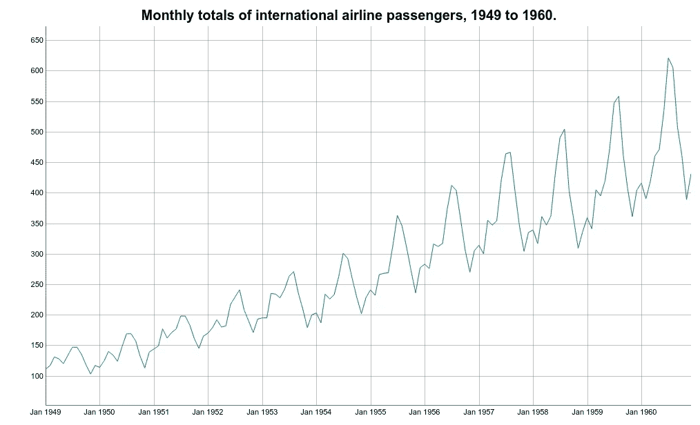
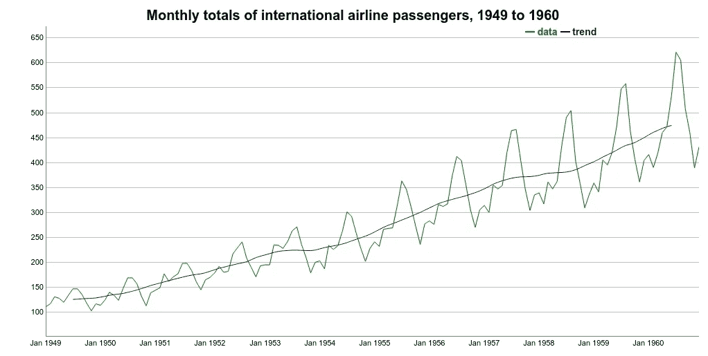
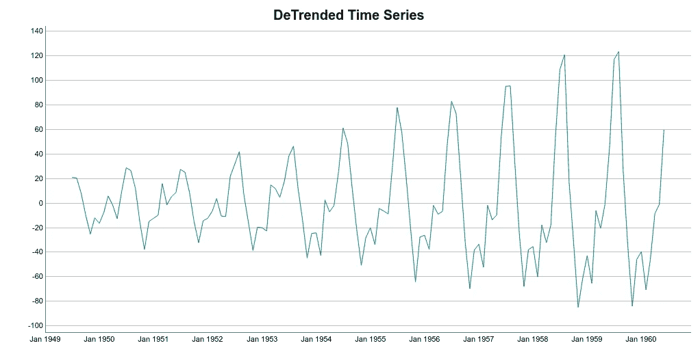
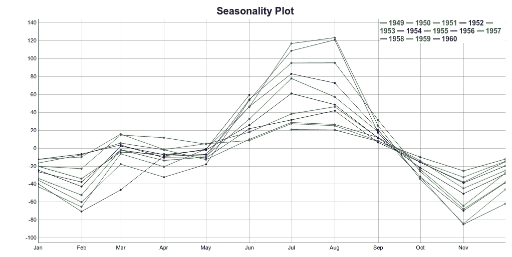
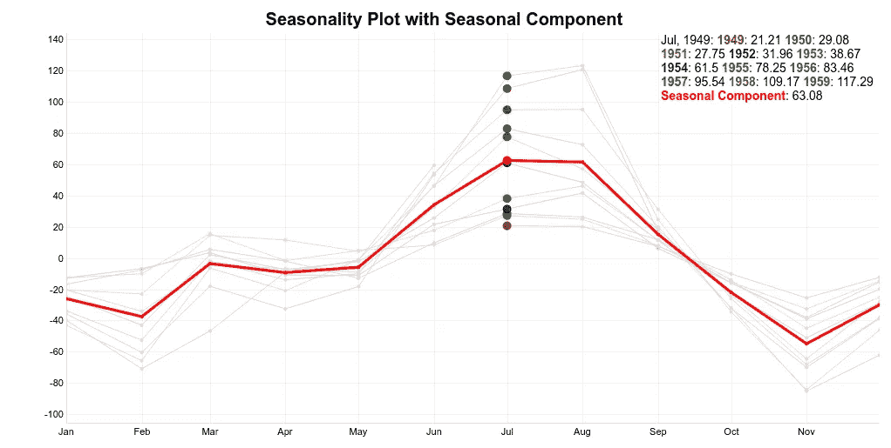
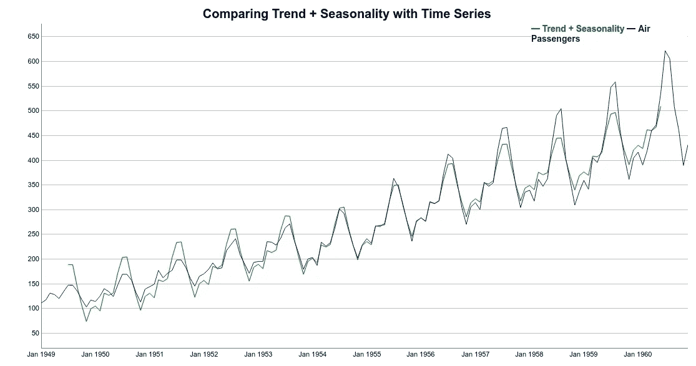
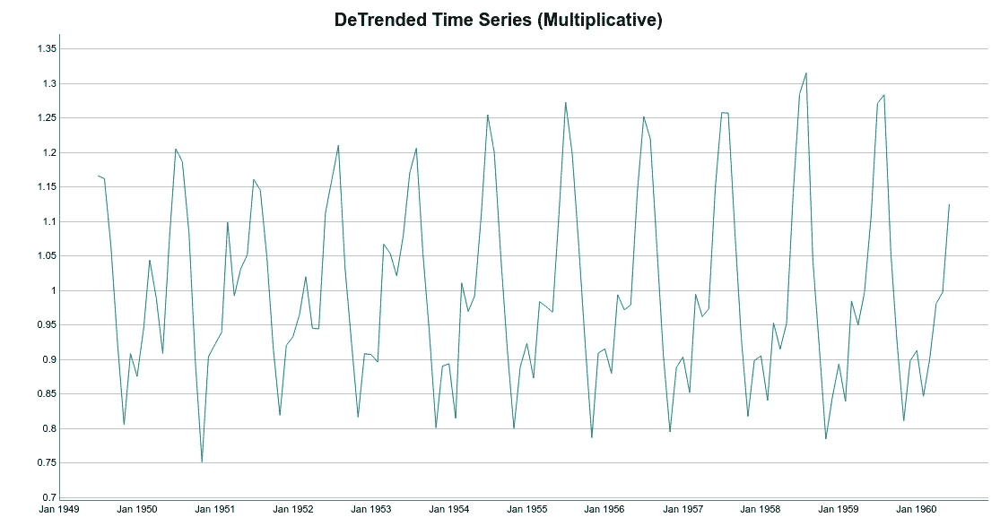
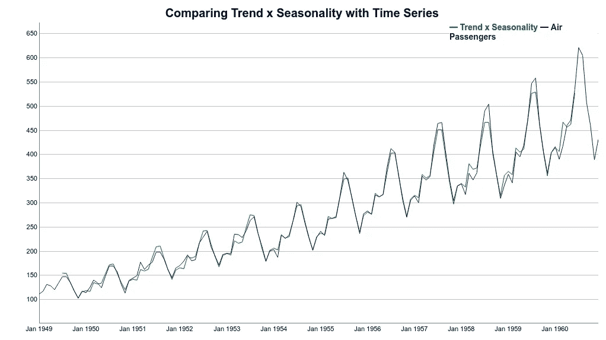

# 时间序列分解分析的可视化指南

> 原文：<https://betterprogramming.pub/a-visual-guide-to-time-series-decomposition-analysis-a1472bb9c930>

## 执行加法和乘法分解的分步指南

[上一次](https://medium.com/better-programming/fundamentals-of-time-series-data-and-forecasting-15e9490b2618?source=friends_link&sk=64d214d3759c331341ff4eeb44bce1b3)，我们谈到了时间序列数据中发现的主要模式。我们看到，趋势、季节和周期是随着时间记录的数据中最常见的变化。然而，每种模式都可能以不同的方式影响时间序列。事实上，在选择预测模型时，在确定了趋势和季节等模式后，我们需要了解每个模式在序列中的表现。带着这个目标，让我们来探索两种不同的预处理技术——加法和乘法分解。

# 介绍

像 [ETS](https://otexts.com/fpp2/ets-forecasting.html) 和 [ARIMA](https://otexts.com/fpp2/arima.html) 这样的经典预测方法已经存在了相当一段时间。然而，最近的机器学习革命也给预测带来了一些新的曙光。时间序列数据从未如此容易获得，这是一个主要因素。此外，深度学习的流行也促进了最近对该主题的兴趣增加。最近，脸书和谷歌开源了他们的时间序列算法——[脸书先知](https://facebook.github.io/prophet/docs/quick_start.html)和[因果影响](https://arxiv.org/abs/1506.00356)。此外，[一些新的实现](https://eng.uber.com/neural-networks-uncertainty-estimation/)使用深度学习技术，如长短期记忆(LSTMs)网络。

尽管如此，时间序列预测并不是一个容易的问题。

在这一部分中，我们着重于进一步探索时间序列数据的方法。我们的目标是理解时间序列的各个组成部分是如何表现的。

最后，我们希望这样的见解能够帮助我们完成机器学习管道中最关键的步骤之一——模型选择。

事实上，选择一个合适的预测方法是分析师必须做出的最重要的决定之一。虽然有经验的数据科学家只能通过查看时间序列图来提取有用的直觉，但时间序列分解是理解时间序列行为的最佳方式之一。

# 时序数据

简单回顾一下，时间序列数据通常表现出不同的模式。最常见的有:

*   趋势
*   周期
*   季节性

此外，根据我们选择的方法，我们可以不同地应用这些组件中的每一个。了解这些模式的一个好方法是将时间序列分成许多不同的部分。每个组成部分代表特定的模式，如趋势、周期和季节性。

让我们从经典的分解方法开始。

我们首先加载国际航班乘客的时间序列数据集。这包含了从 1949 年到 1960 年的 144 次月度观测。

让我们以此为例，进行两种类型的分解:*加法和乘法分解*。

在我们开始之前，一个简单的加法分解假设一个时间序列由三个加法项组成。

同样，乘法分解假设各项通过乘法合并。

这里:

*   *S* 代表*季节性*变化
*   *T* 编码*趋势加周期*
*   *R* 描述残差或*误差*分量。

让我们一步一步地探索加法和乘法分解。

# 加法分解

第一步是提取国际航班乘客时间序列的趋势分量。有很多方法可以做到这一点。在这里，我们将其计算为数据的中心移动平均值。移动平均平滑器对每次观察的最近的 N 个周期进行平均。

使用 R，我们可以使用预测包中的 [*ma()*](https://www.rdocumentation.org/packages/aTSA/versions/3.1.2/topics/MA) 函数。一个重要的提示是定义顺序参数等于时间序列的频率。在这种情况下，频率是 12，因为时间序列包含月数据。

我们可以看到原始时间序列的趋势如下:

一旦我们有了趋势组件，我们就可以用它从原始数据中去除趋势变化。换句话说，我们可以通过从时间序列中减去趋势成分来*去趋势*。

如果我们绘制时间序列，我们会看到一个非常有趣的模式。去趋势数据*强调时间序列的季节性变化。*

我们可以看到季节性是有规律发生的。此外，其规模随着时间的推移而增加。暂时记住这一点。

下一步是提取数据的季节性成分。这里的方法是平均每年的月度去趋势数据。这可以在季节性曲线图中更容易地看到。

季节性图中的每条线对应一年的数据(12 个数据点)。每条垂直线按频率对数据点进行分组。在这种情况下，x 轴对每个特定月份的数据点进行分组。例如，对于我们的数据集，二月的季节性部分是时间序列中所有去趋势二月值的平均值。

因此，提取季节性的一个简单方法是*平均每个月*的数据点。您可以在该图中看到结果:

季节性成分用红色表示。这个想法是重复使用这个模式来解释时间序列的季节性变化。

理想情况下，趋势和季节性应该能够捕捉时间序列中的大多数模式。因此，**残差**代表从原始信号中去除趋势和季节之后，时间序列中剩余的部分。

显然，我们希望残差尽可能小。

最后，我们可以将所有这些放在一个季节性图表中:

现在，让我们尝试使用趋势和季节成分来重构时间序列:

注意，重构信号(趋势+季节性)遵循数据的递增模式。然而，很明显，在这种情况下，季节变化没有得到很好的体现。重构的时间序列和原始时间序列之间存在差异。*请注意，趋势+季节性变化在序列开始时太宽，但在序列结束时不够宽。*

这是因为加法分解假设季节模式是周期性的。换句话说，*季节模式每年都有相同的数量级，它们增加了趋势。*

但是如果我们再看一下 detrend 时间序列图，我们会发现这不是真的。更具体地说，季节变化的幅度逐年增加。换句话说，乘客的数量逐年增加。

现在让我们来研究乘法分解。

# 乘法分解

对于乘法分解，趋势不变。还是数据的*居中移动平均线。但是，为了取消时间序列的趋势，我们不是从时间序列中减去趋势，而是将其除以:*

请注意加法和乘法的去趋势数据之间的差异。对于加法分解，去趋势数据以零为中心。这是因为加零不会改变趋势。

另一方面，对于乘法情况，去趋势数据集中在*一个*处。这是因为趋势乘以 1 也没有效果。

按照类似的推理，我们可以找到*季节性*和*误差*成分:

用于乘法分解。

看看下面完整的乘法分解图。*由于是乘法模型，请注意季节性和残差都以 1 为中心(而不是零)。*

最后，我们可以尝试使用趋势和季节成分来重构时间序列。乘法模型如何更好地解释原始时间序列的变化是显而易见的。在这里，季节因素不是增加趋势，而是增加趋势。

请注意季节性波动如何跟随原始系列的起伏。此外，如果我们比较加法和乘法残差，我们可以看到后者要小得多。因此，乘法模型(趋势 x 季节性)更符合原始数据。

# 警告和结论

需要注意的是，简单的分解方法有一些缺点。在此，我重点介绍其中两个。

首先，使用移动平均线来估计趋势+周期成分有一些缺点。*具体来说，该方法为序列的前几个和最后一个值创建缺失值。*对于月度数据(频率等于 12)，我们没有前六个月和后六个月的估计值。这在上面的趋势图中有所描述。

*季节模式的估计假设每年重复一次。* 对于模式可能会改变的较长系列来说，这可能是个问题。你可以在两个分解图上看到这个假设。注意加法和乘法季节模式是如何随时间重复的。

还有更强大的方法，如使用黄土的季节和趋势分解，解决了其中的一些问题。在以后的文章中，我们将讨论 STL 分解以及如何使用它来构建指数平滑预测方法。

*敬请期待！*

 [## 时间序列数据和预测基础

### 趋势、季节性和几分钟内的周期

medium.com](https://medium.com/better-programming/fundamentals-of-time-series-data-and-forecasting-15e9490b2618) 

*thal les Silva，作为 Daitan 对人工智能多方面研究的一部分& ML。感谢致力于时间序列预测概念验证和演示的团队:布鲁诺·希奥纳托、迭戈·多明戈斯、费尔南多·莫赖斯、古斯塔沃·罗萨托、伊萨克·索萨、马塞洛·梅尔古尔霍和马西亚诺·纳尔迪。*