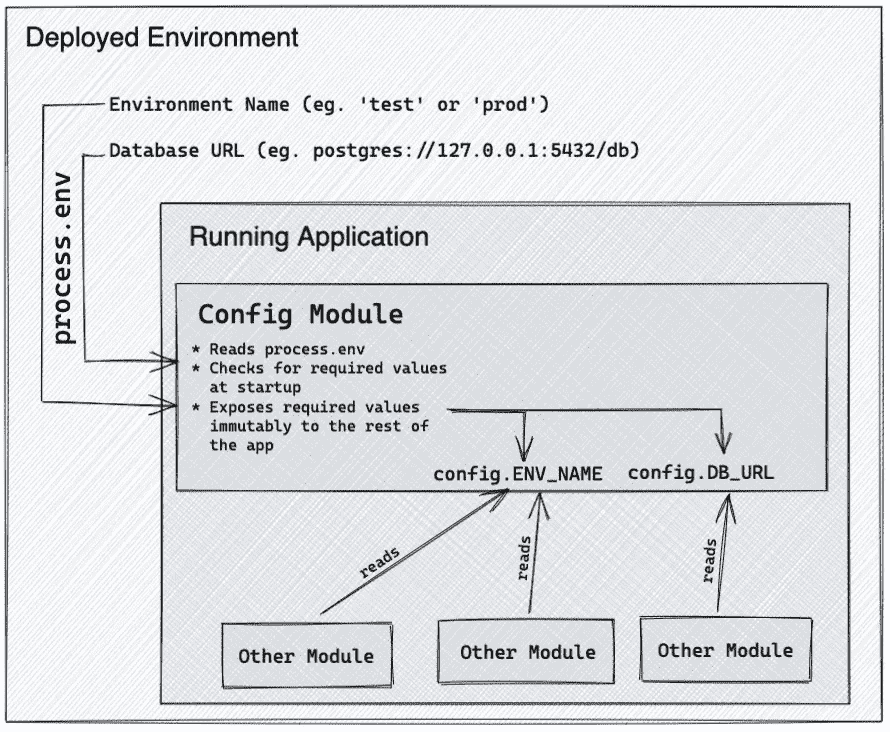

# 为什么这种常见的配置模式是完全错误的

> 原文：<https://betterprogramming.pub/abstraction-and-limiting-information-flow-550e23931d25>

## 你认得这个图案吗？

我们正在查询已知环境名称的列表，以便决定连接到哪个数据库 URL。具体的变量名`DATABASE_URL`并不重要。我们可以讨论 API_URL 或日志策略。这段代码可以是客户端的，也可以是服务器端的。关键是，我们正在基于对代码被部署到何处的*的了解，做出关于我们的代码应该如何行为的*运行时*决定。*

这是一个反模式！不要这样做！

# 为什么不呢？

这不是一篇关于配置管理的文章。我希望您从这篇文章中得到的教训不是“不要硬编码我的配置值并按环境对它们进行分组”(尽管您不应该这样做。 [12factor](https://12factor.net/config) 连这么说)。相反，我将用它作为一个具体的案例来说明关于应用程序契约和抽象的更一般的概念，尤其是知识在应用程序中流动的方向。

这种硬编码和分组方法有问题的原因是它要求你的应用程序知道它被部署在哪里。如果您决定添加另一个部署环境(比如说，`test`或`uat`)，您将需要回到您的应用程序代码并处理这种情况。如果你想为一个特定的用例只改变一个变量，你需要添加一个特殊的用例，或者在完成后记得把它改回来。您需要确保相当随意的环境名称随着时间的推移保持一致。所有这些问题的发生都是因为您正在将机构和操作决策编码到运行时行为中。

那很糟糕。

# 干净的合同

你写的代码不应该知道谁或者什么在使用它。它应该清楚地描述它需要什么来完成它的工作，只要消费实体提供这些元素，代码就应该无一例外地运行。这就是所谓的代码契约。

一个干净的合同是一个使它的所有要求明确和一致的合同。具有声明的参数和返回值的函数有一个干净的契约。通过向函数提供输入，您将获得记录的输出。如果该功能隐式依赖于一些可用的外部服务，或者范围内的一些其他变量，那么契约就开始变得模糊。

这个想法可以向外扩展到类、模块和整个应用程序。契约是有问题的代码的表面区域。它定义了消费代码需要提供什么，以及它期望得到什么回报，并理解消费代码可以安全地忽略被调用代码中的所有实现细节。

# 知识应该单向流动

因此，消费代码应该只知道被调用代码的契约，而不是它的内部。并且被调用的代码应该只知道为完成其契约而提供的值，而不知道是什么提供了这些值。

当您将您的类和模块组合成更大的系统并仔细应用这些规则时，一种模式开始出现。一个类或一组类形成在应用程序的外层，充当应用程序的交互接口。该层调用一些类来执行一些业务逻辑。交互层知道业务层的契约，但是业务层不知道它是如何被调用的。业务层反过来可能会调用包含较低级别的域逻辑的其他类。类似地，业务层知道域类的契约，但是域类不知道它们是如何被调用的。

换句话说，应用程序中的知识通过这些层单向流动。任何一层都可能知道它下面的层，但是没有一层知道上面的层。

这个系统以各种形式被称为[分层](https://en.wikipedia.org/wiki/Multitier_architecture#Three-tier_architecture)架构、[六边形](https://en.wikipedia.org/wiki/Hexagonal_architecture_(software))(又名端口和适配器)架构，或者[洋葱](https://jeffreypalermo.com/2008/07/the-onion-architecture-part-1/)架构。这些是组织应用程序关注点的不同方法，但是它们都是按照从最频繁变化(顶层/外层)到最不频繁变化(底层/内层)的顺序来组织的。模块可能依赖于它们自己的层或较低/内层中的其他模块，但是可能不隐式或显式地依赖于外部/较高层中的模块。

这是一种很难内化的心态。当您试图解决一个问题、发布一个特性或修复一个 bug 时，很容易将所有代码视为达到您期望的最终状态的公平游戏。尽管您是应用程序的无所不知的创建者，但是您必须使用这种无所不知来创建组件系统，这些组件需要尽可能少的相互了解。这被称为*关注点分离*。

# 基础设施是顶层/外层

但是让我们回到如何管理环境变量和配置值的问题上来。

洋葱/十六进制/分层图在处理基础架构的方式或是否处理基础架构方面有所不同，但就我们本次对话的目的而言，基础架构是最外层。您可能没有想到这一点，但是基础架构每天都会发生多次变化。如果您在本地开发，您将推送到 ci/测试环境，该环境部署到试运行环境，最终部署到生产环境。

有了所有这些可变性，您的应用程序需要向它运行的环境公开一个干净的契约，并且不应该要求任何关于该环境的特定知识。一个能显著改善事情的简单改变就是直接使用环境值。我们将很快改进这个解决方案，但是现在让我们从简单性开始。

```
const DATABASE_URL = process.env.DATABASE_URL
```

那么这个例子怎么比我们的原始例子好呢？

新的和改进的版本公开了任何环境都可以遵守的外部契约，而原始版本要求应用程序逻辑了解环境。

在改进的例子中，我们定义了一个必须满足的需求，作为契约的一部分，以便运行代码。运行应用程序时，必须定义一个指向数据库的环境变量。这与定义函数的参数是一样的。您正在定义函数的使用方式，由消费代码来提供正确的参数。

在最初的示例中，如果您为数据库创建一个具有不同 URL 的新环境，那么您需要使用对该新环境的引用来更新您的代码。这打破了我们关于信息流的规则。代码必须知道它被部署在哪里才能完成它的工作。它需要了解它之外的那一层。再说一次，这很糟糕。

# 从定义责任开始

那么，我们如何着眼于干净的契约和单向信息流来组合我们的应用程序呢？

学会围绕你的系统的职责划分界限。

作为一名软件开发人员，你的工作是着眼于一个大问题，将它分解成小问题，然后设计一个可以解决这些小问题的系统，以便找到大问题的解决方案。

一旦你在更小的问题周围画出边界，确定在每个边界内应该存在什么信息。

只有在您决定了哪些信息需要存在于何处之后，您才应该决定*特别是*哪些信息应该跨越边界以及如何跨越边界。

在我们的环境变量的例子中，讨论中的边界在部署的环境和应用程序代码之间。假设在我们的应用程序中，我们需要设置两个值，一个环境名和一个数据库 url。

环境负责定义价值观。环境名称可以是`test`、`prod`、`staging`、`qa`、`uat`、`dev-local`等。应用程序代码不应该跟踪它被部署在哪里。

数据库 URL 同样不受限制。如果我们愿意，我们可以将应用程序的本地运行 dev 版本连接到在我们部署的登台环境中运行的数据库，应用程序应该不会知道。(可能有基础设施的原因使这变得困难或不明智，但这些困难应该与网络拓扑等相关，而不是代码逻辑。)


应用程序只需要这两个值的不透明变量。应用程序知道环境有一个名称，并可能记录该值或在某处的 UI 中显示它，但它不应该将逻辑决策基于变量的文字值。这不是应用程序的责任，它会违反知识流动的方向。

同样，应用程序实际上不应该知道 DB_URL 的值。只要环境提供了一个可连接的字符串，应用程序就可以自由地传递它，而不必知道它的值。

# 责任导致抽象

了解了我们的职责分工，我们现在可以看看如何定义保持分工完整的抽象，同时提供正确的信息移动。

每种语言在运行过程中都有一些访问环境变量的方法。在 JavaScript(特别是 Node)中，那就是`process.env`。在 Ruby 中是`ENV`，在 Python 中是`os.environ`。

在我们的第一次迭代中，我们使用了一个非常简单的抽象，它基本上是免费提供给我们的。我们正在定义一个已知的环境变量列表，为了运行应用程序，必须定义这些变量。也就是我们的应用期望`ENV_NAME`、`DB_URL`等。在运行时定义。这两个环境变量的存在是环境与应用程序契约的一部分。

与我们最初的硬编码和分组方法相比，这确实改善了环境方面的事情。我们不再受应用程序强加的环境名称的隐式约束，我们可以自由地修改配置中的单个值，而无需修改源代码。

然而，我不喜欢在应用程序中直接访问`process.env`(或其类似物)，原因有三:

1)工具太钝。在应用程序内部，我们实际上并不想知道所有的环境变量。为了理解我的意思，在终端提示符下键入`env`,看看在任何给定的时间有多少环境变量存在。

2)契约还是隐性的。对于运行应用程序时需要定义哪些环境变量的*,没有规范的地方可以参考。*

3) `process.env`在您的应用程序代码*中是全局可用的，并且它是可变的*。您的应用程序的任何部分不仅可以读取它，还可以更改它。这意味着，当您在应用程序中访问某个值时，无法保证该值与启动应用程序时的值相同。最坏的情况是，这会鼓励开发人员开始使用 process.env 作为一种全局状态对象。相信我，当我告诉你这是疯狂的推理和调试。

因此，在我们的应用程序代码中，我们希望为配置管理创建一个更集中的抽象。会的

*   仅提取我们定义为应用程序启动契约一部分的值
*   使合同明确
*   保证值不能在应用程序内更改。



现在我们有了一个*专用的*配置对象，它的接口(也称为抽象)更适合我们的需求。一个非常简单的实现可能如下所示:

这个实现只提供了我们需要的环境值的允许列表，并确保它们不会在应用程序的任何地方被更改。如果缺少这些值中的任何一个，它将在启动时抛出一个显式错误。并且可以很容易地对其进行增强，以提供将配置值放入应用程序的替代方法(例如，一个`.env`文件或启动命令的参数)

通过创建一个定义的职责是配置管理的模块，我们获得了一个隐式契约(process.env 上提供的环境变量)并使其显式化。config 模块现在负责定义应用程序与配置相关的外部契约:哪些值是必需的，如何传入它们，如何在应用程序中访问它们，以及如果缺少它们会发生什么。

如果您在团队环境中工作，最后一步可能是添加一个不允许直接访问`process.env`的 linter 规则。`process.env`众所周知，这是一个人们在紧急情况下伸手可及的简单工具。然而，它绕过了我们定义的契约。如果对`process.env`的直接调用开始在代码库中扩散，我们闪亮的新配置模块很快就会被废弃和失修。

# 定义责任和抽象导致可测试的行为

定义责任和抽象使得具体定义应用程序组件的行为成为可能。行为的具体定义使得组件易于测试。我在我的课程 [*测试中详细介绍了这一点，就像一个技术带头人*](https://tlatl.benwilhelm.com) 一样。

例如，我们可以这样描述配置模块的行为:

> ***给定*** *定义的环境变量* `*ENV_NAME*` *和* `*DB_URL*` *，* ***当****config 模块初始化后，* ***然后*** *它应该用这些值暴露只读属性*

从这个声明到您选择的测试框架并不是一个很长的跳跃。

行为是你的抽象的具体化。在可以描述抽象的地方，可以评估行为的正确性。该评估成为一个测试案例。

也就是说，学习抽象思维教会你编写可测试的代码。

```
**Want to Connect?**This story was originally published at [https://benwilhelm.com](https://benwilhelm.com/articles/abstraction-and-limiting-information-flow.html).
```