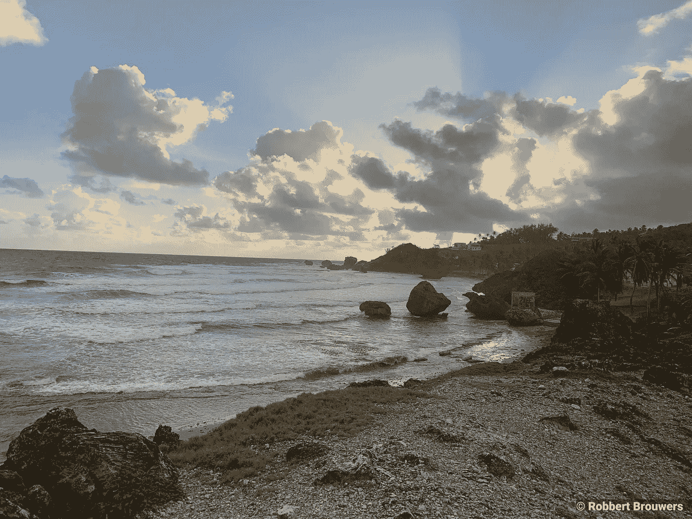

# 如何使用 Python 为照片添加版权或水印

> 原文：<https://betterprogramming.pub/add-copyright-or-watermark-to-photos-using-python-a3773c71d431>

## 保护你的形象，帮助传播你的名字


雅各布·欧文斯在 [Unsplash](https://unsplash.com/s/photos/photos?utm_source=unsplash&utm_medium=referral&utm_content=creditCopyText) 上的照片

你的照片应该有水印，这样你可以保护你的作品，或者你必须应用其他人的水印，以便使用他们的作品。本教程向您展示了如何自动化这个过程，并能够使用 Python 处理任意数量的照片(在合理的范围内)。

*本文假设你对 Python 有基本的了解。更具体地说，你知道如何安装一个* [***库***](https://packaging.python.org/tutorials/installing-packages/) *，并且能够复制和粘贴代码示例。代码的完整版本可以在文章的底部找到。*

假设你已经拍摄了一些照片，比如最近去巴巴多斯岛旅行时拍的这张:


巴巴多斯的芭丝谢芭。罗伯特·布鲁沃斯

你要确保你的努力不会被忽视。尽管未经所有者许可复制和重复使用图片是不允许的，但人们这样做还是有风险的。这就是为什么你可以在照片上添加你的名字、网站或其他任何东西，以确保你被认出是主人。

*我们如何确保我们的版权声明在照片上，而不是作为文字添加在照片的下方或上方？*



不再需要手动输入版权声明！

Python 允许我们以自动化的方式做到这一点。也就是说，无论我们是想获得一张还是一千张照片的版权，努力是一样的。

但是在深入研究一些代码之前，让我们再看一下上面的照片，讨论一下我们具体想要实现什么。

## 要求:我们实际上在做什么？

在给照片添加水印或商标时，我们必须决定几件事情:

*   **它应该说什么？**
*   ****我们要把它放在哪里？****
*   *****应该是什么样子？*****

***在我的例子中。我已经决定把水印放在照片的右下方，略高于底部。***

*****什么—** 我保持了商标的简洁，决定使用一个“”标志和我的名字，并在照片的右边缘留出几个空格。***

*****如何—** 商标在略显饱和的黑框上有一个白色的文字。此外，方框会移到照片的边缘，而文字不会。这种设计将确保无论照片颜色如何，商标都清晰可见。***

***此外，我们想考虑一下，如果我们指定一张需要申请商标的照片，我们将如何使用这个 Python 程序？我们应该能够选择一组照片吗？***

***牢记这些需求将有助于我们编写正确的代码。***

***在本教程中，我将向您展示如何读取图像文件夹，但是您可以在以后修改代码以做最适合您的事情。***

# ***准备***

***如果你还没有，[安装 Python](https://www.python.org/downloads/) 。我运行的是 3.7 版:***

```
***Robberts-MacBook-Air:~ robbert$ python
Python 3.7.2 (v3.7.2:9a3ffc0492, Dec 24 2018, 02:44:43)
[Clang 6.0 (clang-600.0.57)] on darwin
Type "help", "copyright", "credits" or "license" for more information.
>>>***
```

***我们将使用一个名为`[Pillow](https://pillow.readthedocs.io/en/stable/)`的方便的 Python 库。在您的终端中使用以下命令安装它(*不知道如何做？* [*先看这个*](https://packaging.python.org/tutorials/installing-packages/) *)* :***

```
**$ pip install pillow**
```

**一切就绪！让我们编辑一些照片。**

# **开始有趣的事情吧！**

**我们将编写一些代码来让一切正常工作。如果愿意，您可以在 mac 终端、windows 命令提示符或 IDE 中编写代码，但这不是必需的。**

**我们的第一步是从 PIL 库中导入几个模块。当涉及到处理照片时，PIL (Python 图像库)为我们做了实际的艰苦工作。然后，我们可以利用这些模块为我们的照片添加水印。**

```
**from PIL import Image
from PIL import ImageDraw
from PIL import ImageFont**
```

**之后，我们使用第一个模块映像打开一个映像。打开图像可以对其执行操作。**

```
**photo = Image.open(‘yourimage/filename.jpg’)

#Store image width and height
w, h = photo.size
print(w,h)**
```

**我们刚刚打开了一张照片，保存了它的宽度和高度并打印出来。在我的案例中，它导致了:**

```
**4032 3024**
```

**接下来，我们使图像可绘制，并为我们的版权文本设置字体:**

```
**# make the image editable
drawing = ImageDraw.Draw(photo)
font = ImageFont.truetype(“RobotoBlack.ttf”, 68)**
```

***注意:我的本地字体有些问题，所以我做的是从 google fonts (* [*此处*](https://fonts.google.com/specimen/Roboto?selection.family=Roboto) *)下载 Roboto 字体，并将字体文件保存在保存 Python 脚本的同一个目录中。***

**太好了，我们已经使图像可绘制，并将字体设置为 Roboto，大小设置为 68px。**

**接下来是设置版权文本，同时存储该文本的宽度和高度(我们将需要文本和图像的宽度和高度来计算水印的正确位置):**

```
**#get text width and height

 text = “© Robbert Brouwers   “
 text_w, text_h = drawing.textsize(text, font)**
```

**知道了图像的宽度和高度以及文本的宽度和高度，我就可以计算版权文本将被放置在哪里，并将其存储在一个名为`pos`的变量中:**

```
**pos = w — text_w, (h — text_h) — 50**
```

**这将文本放置在图像的右侧(因为它的起始位置正好是文本的宽度)，距离底部 50 个像素(因此为-50)。稍后尝试这些设置，看看不同的位置看起来如何。**

**我最初的计划是给文本一个背景颜色，并使其有点透明。但是，我知道在 PIL 不可能对文本对象进行这些修改。我的解决方法是创建一个具有版权文本大小的新图像，并赋予其背景颜色和不透明度，然后将文本放在该图像中，并将完整的图像放在原始照片的顶部。**

```
**c_text = Image.new('RGB', (text_w, (text_h)), color = '#000000')
drawing = ImageDraw.Draw(c_text)drawing.text((0,0), text, fill="#ffffff", font=font)
c_text.putalpha(100)**
```

**我们上面所做的是用版权文本的宽度和高度以及黑色(#000000)创建一个新图像，然后通过调用`ImageDraw.Draw`使这个新图像可绘制。**

**然后，从我们新创建的图像的位置 0，0 开始，我们放置版权文本，使其为白色(#ffffff)，并分配前面定义的字体。**

**为了完成版权图像，我们用`putalpha()`函数应用一个 alpha，使它稍微透明。同样，使用输入值 100 来测试不同的透明度设置。**

**快到了。我们现在有了我们的照片和一个版权图像，我们想把它放在我们定义为`pos`的位置上。**

```
**photo.paste(c_text, pos, c_text)
photo.save('yourimage/filename_out.jpg')**
```

**粘贴函数有三个参数:要粘贴到照片上的图像、位置(坐标)和遮罩。蒙版确保我们应用来自我们图像的阿尔法(在[文档](http://effbot.org/imagingbook/image.htm#tag-Image.Image.paste)中有更多相关内容)。**

**最后一步是将我们的图像保存到计算机上的一个理想位置。**

**太棒了。我们有自己的脚本来决定**版权应该说什么**，**它应该看起来怎么样**，以及**它应该在哪里应用**。我们的最后一步是允许我们读入一个照片目录，并输出每一张带有水印的照片。**

**但首先，这是目前为止完整的脚本:**

```
****from** **PIL** **import** Image
**from** **PIL** **import** ImageDraw
**from** **PIL** **import** ImageFont
**def** copyright_apply(input_image_path,
                   output_image_path,
                   text):
    photo = Image.open(input_image_path)

    *#Store image width and height*
    w, h = photo.size

    *# make the image editable*
    drawing = ImageDraw.Draw(photo)
    font = ImageFont.truetype("RobotoBlack.ttf", 68)

    *#get text width and height*
    text = "© " + text + "   "
    text_w, text_h = drawing.textsize(text, font)

    pos = w - text_w, (h - text_h) - 50

    c_text = Image.new('RGB', (text_w, (text_h)), color = '#000000')
    drawing = ImageDraw.Draw(c_text)

    drawing.text((0,0), text, fill="#ffffff", font=font)
    c_text.putalpha(100)

    photo.paste(c_text, pos, c_text)
    photo.save(output_image_path)**
```

**我做了一些改动，让它更容易用于完整的照片目录。**

**首先，我把所有东西都打包到一个名为`copyright_apply()`的函数中。这样做的想法是，我们可以为每张照片调用这个函数，并以这种方式遍历照片列表。**

**其次，我改变了输入路径、输出路径和版权文本的硬编码变量。这样我们可以输入文件名，并自动输出到另一个文件夹，这样我们就不会覆盖原始图像。文本将接受任何字符串输入，然后在它前面加上' '符号，后面加上几个空格。**

# **将您的照片列表放入 Python**

**我已经创建了一个名为`python_images`的文件夹，在这个文件夹中我又创建了两个文件夹:`in`和`out`。在`in`文件夹中，我放了两张我想应用水印的照片。**

```
****import** **glob**
list = glob.glob("python_images/in/*.*")
print(list)>>>>['python_images/in/9C9595ED-BED3-4856-A74A-046DA4F54427.jpg', 'python_images/in/91F94C10-E1C4-471C-B89C-3E7FE78C2032.jpg']**
```

**`glob`是另一个方便的库，允许我们在一个特定的文件夹中获取所有文件名。太好了！这意味着我们可以一张一张地处理这些照片，并将它们传递给我们上面创建的函数:**

```
**for photo in list: #create output path based off input path
 out = photo.replace(‘in’,’out’)
 copyright_apply(photo,
 out,
 ‘Image editing is awesome!’)**
```

## ****就是这样！****

**我已经将其保存为`copyright.py`，每当我想要应用水印时，我都会确保在脚本中分配了正确的文件夹并运行(在 mac 终端、windows 命令提示符或 IDE/Jupyter 笔记本中):**

```
**python copyright.py**
```

**这样就可以把带水印的照片整齐的输出到 out 文件夹里了！**

***完整代码(如果您使用不同的文件夹/名称，记得调整任何文件路径:***

```
**#!/usr/bin/env python
# coding: utf-8# In[29]:from PIL import Image
from PIL import ImageDraw
from PIL import ImageFont
import glob
def copyright_apply(input_image_path,
 output_image_path,
 text):
 photo = Image.open(input_image_path)

 #Store image width and heigth
 w, h = photo.size
 #print(w, h )# make the image editable
 drawing = ImageDraw.Draw(photo)
 black = (3, 8, 12)
 font = ImageFont.truetype(“RobotoBlack.ttf”, 68)

 #get text width and heigth

 text = “© “ + text + “ “
 text_w, text_h = drawing.textsize(text, font)

 pos = w — text_w, (h — text_h) — 50

 c_text = Image.new(‘RGB’, (text_w, (text_h)), color = ‘#000000’)
 drawing = ImageDraw.Draw(c_text)

 drawing.text((0,0), text, fill=”#ffffff”, font=font)
 c_text.putalpha(100)

 photo.paste(c_text, pos, c_text)
 photo.save(output_image_path)list = glob.glob(“python_images/in/*.*”)for photo in list:

 out = photo.replace(‘in’,’out’)
 copyright_apply(photo,
 out,
 ‘Image editing is awesome!’)**
```

# **接下来呢？**

**从这里开始，您可以做一些事情来改进脚本:**

*   **根据图像大小设置动态字体大小。**
*   **要求用户输入文件夹和版权文本。**
*   **创建一个用户可以放入图像的界面，脚本将输出带水印的图像。**

**看看我的第二张照片，现在有版权了:**

****

**让我知道你和 PIL 图书馆或者其他图书馆一起创造的任何酷的东西。**