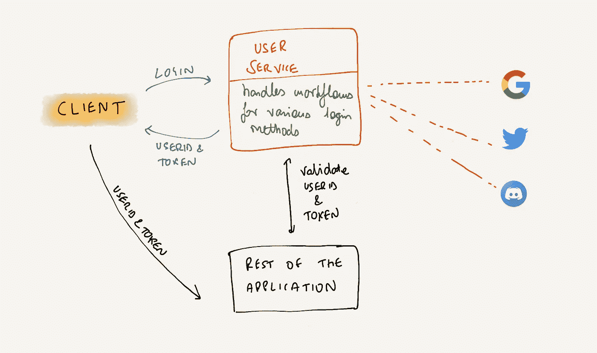
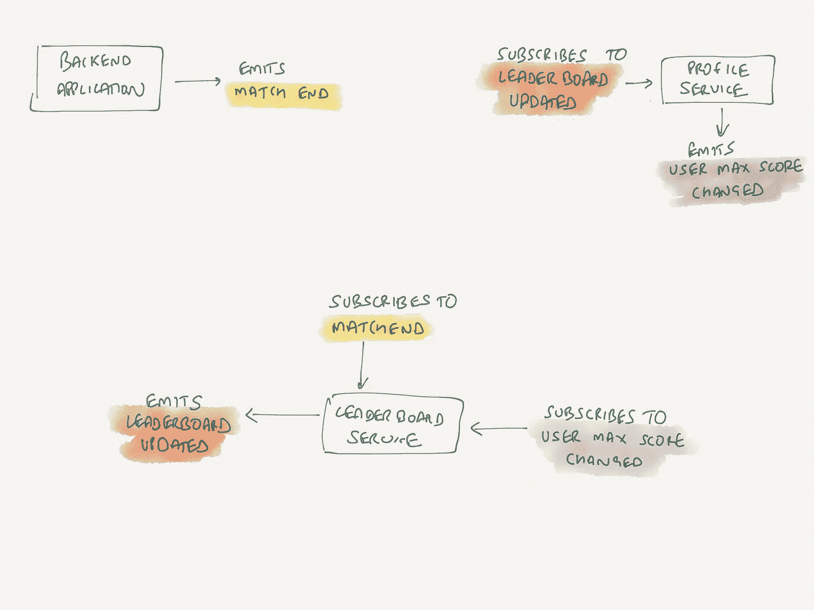

# 添加新的微服务

> 原文：<https://betterprogramming.pub/adding-a-new-microservice-be191e6451ac>

## 有这么简单吗？哦，等等，不！

revac 电影公司的&摄影来自 [Pexels](https://www.pexels.com/photo/bokeh-hd-wallpaper-54278/?utm_content=attributionCopyText&utm_medium=referral&utm_source=pexels)

当你过去一直在使用 monolith，并且厌倦了维护 monolith 应用程序中出现的开销和错误时，微服务是一件非常自然的事情。

我的第一个微服务是一个用户服务，为用户管理登录/注销/认证。我们在我们的应用程序中增加了更多的登录，因为仅仅一个 Google 登录是不够的。我知道我们将来会添加/删除更多登录用户的方式。所以我想创建一个单独的服务来管理这一切，并且在我们添加/删除新的登录方法时不会影响应用程序的其他部分。

我们一致认为用户服务可以处理所有这些事情。登录后，它将向客户机提供一个令牌，客户机可以使用这个令牌在调用应用程序的其他部分(其他服务)时验证用户的身份。

这是一次成功。我们增加了更多的登录，并根据地区配置了不同登录的可用性，微服务架构帮助很大。我们可以独立地部署用户服务，而不用担心破坏应用程序的其他部分。无论使用什么登录方法，其他服务总是会获得一个 auth 令牌来验证用户的身份。

从一开始就很优雅。所有与管理用户相关的操作都可以由这个服务单独处理，我的应用程序不需要担心这个问题。

毫无疑问，这是一个非常基本和简单的微服务用例，甚至可能是一个经验丰富的微服务架构师的现状，但对我来说，这是一个快乐的时刻。我想出了一个模式来创建自己的微服务。

微服务的这种分解(决定你是否需要微服务来做某事)对于如此简单的用例来说是如此自然，以至于我被骗相信微服务很容易，并且我对它们有所了解。好天真！

几个其他微服务之后…

# 排行榜

最近，我们正在为我们的应用开发排行榜。这些排行榜将对游戏中的用户和社区分别进行排名。所以我们想到，也许排行榜这个东西应该被提取出来，成为一个独立的服务。

我们希望有一个典型的排行榜，将维护一个实体的分数，并根据分数，在其他实体中排名。

我们希望排行榜是什么样的

注意:为了简单起见，从现在开始，我们将只在用户排行榜的上下文中进行讨论。

我们开始讨论，并定义了排行榜服务的角色:

1.  接受匹配结束有效载荷。(当两个用户之间的比赛结束时，排行榜将会更新。)
2.  获取参与该比赛的用户的当前分数。
3.  根据匹配结果，应用“算法”来更新分数。(您可以假设该算法是一个黑盒，它接收当前分数并根据比赛结果返回更新的分数。)
4.  更新排行榜上的新分数。
5.  排行榜应该根据新的分数为用户重新排序。

我们认为，如果我们可以创建一个服务，可以接受匹配端的有效负载，并在其他服务一无所知的情况下抽象地完成所有这些工作，那将是非常棒的。

我希望排行榜服务是愚蠢的，可以被任何其他想要维护排行榜的服务重用。我的想法是，每一个想要排行榜的服务都应该用一个通用的有效负载来调用排行榜服务，并期望排行榜服务处理一切，从初始化排行榜到更新排行榜。

但我很难概括出在不把排行榜服务搞得一团糟的情况下，将排行榜更新到一个单一服务中的逻辑。例如，如果堡垒之夜的一场比赛刚刚结束，我们希望用这场比赛中用户的最新分数来更新堡垒之夜的排行榜。但在更新堡垒之夜排行榜(即特定游戏排行榜)后，我们还想更新全球总排行榜。

全球排行榜将是对所有用户进行排名的通用尺度，而特定于游戏的排行榜将维持用户对单个游戏的排名。更新全球排行榜的逻辑并不是我引以为豪的事情，但事实就是这样:全球排行榜的分数将根据用户在所有游戏特定排行榜中的最高分数来决定。

因此，一个常规的场景将是这样的:一场比赛结束→我们更新特定游戏排行榜的分数→在所有特定游戏排行榜上汇总用户的新最高分数→更新全球排行榜的分数。

比赛结束后排行榜将如何更新

为了更新全球排行榜，我不需要应用“算法”来根据之前的分数和比赛结果计算新的分数。我只需要获得用户在所有游戏排行榜上的最高分，并将其作为全球排行榜的分数。

# 有效的参数

在当前的思维模式下，很明显我们需要将分数计算逻辑与排行榜的存储分开。我们都同意可以将计算逻辑合并成一个库。对于排行榜的存储，我的一些同行希望将排行榜的存储放在一个单独的服务中。另一方面，我想创建另一个库来管理每个服务的排行榜的存储。

我想运送两个库，一个用于计算，另一个用于存储排行榜。任何想要排行榜的服务只需要实现这些排行榜库并拥有排行榜。

但我的同行提出了一些有效的论点，主张为排行榜的存储创建一个单独的服务，并将分数的计算算法放在一个库中。每个需要排行榜的服务将使用该库来计算分数，然后联系排行榜服务来更新/获取分数。

我试图列出一些我的同行提出的支持排行榜存储独立服务的论点:

1.  排行榜存储逻辑的改变将需要部署整个服务，或者可能是实现排行榜存储库的所有服务。相反，如果存储由单独的服务处理，则只需更改一个服务。这是第一次表明我可能错了。
2.  排行榜存储可能不需要与维护排行榜的服务相同的资源，并且如果排行榜请求的负载增加，则仅仅为了服务于排行榜请求而产生特定服务的昂贵实例是没有意义的。*我几乎要倒下了。*
3.  *最后，让我失望的最后一个原因是更新排行榜时单线程操作的执行*。对排行榜的更新不能同时进行，必须调整/分批按顺序执行，以避免并行更新。通过库在每个服务中确保这一点将是每个服务的开销。我们可以把它隐藏在排行榜服务中，这样其他服务就不用担心了。

嗯，我不能拒绝这些论点，所以同意开发一项服务。但是由于我们必须管理不同的计算逻辑，我们认为最好是排行榜服务只实现排行榜的存储部分，并且只有 API 来获取分数/排名和设置分数，并最终根据新的分数更新排名。

分数如何变化将由希望保持排行榜的相应服务来管理。我们会发布一个库，里面有我们用来更新分数的算法。

所以新的流程应该是这样的:比赛结束→从排行榜服务获取当前比分→根据比赛结果更新比分→在排行榜服务设置新比分。

# 启示录

上面的方法解决了我们的用例，但是我确信还有更好的东西等着我们。

我认为，如果我们要实现排行榜服务，它应该抽象出管理排行榜的所有复杂性，并且没有其他服务应该担心与排行榜相关的东西。唯一阻碍我们实现这种抽象的是无法概括分数计算逻辑——准确地说，是所有游戏的最高分数。

任何更新分数的通用算法都应该基于比赛结果——谁赢了，谁输了——而不是像 max 这样的聚合。这个 max 逻辑是一个临时需求；排行榜的正确算法总是基于一些输赢结果。

十篇微服务文章之后…

幸运的是，我设法为排行榜服务创建了一个我满意的解耦架构。它抽象出了排行榜的复杂性，可扩展到我们拥有的不同类型的场景，并将支持我们想要的不同类型的计算逻辑。

服务于我们所有用例的最终设计

显然，发布/订阅架构是我们所需要的，而且排行榜更新也需要一些分离。我们增加了两种更新排行榜的方法。

一—收听比赛结束的赛事并更新特定于比赛的排行榜。

二—收听用户最高分数更改事件以更新全球排行榜。

## 冗长的解释

排行榜服务将订阅比赛结束事件，并为用户更新每场比赛的排行榜。排行榜服务将实现用于根据比赛结果更新分数的算法。因此，通过这种方式，它将抽象出排行榜的复杂性，并且没有其他服务需要担心排行榜是如何更新的。这是容易的部分；我们开始的时候就有这样的想法。阻碍我们的是全球排行榜分数的最大聚合。

困难的部分是以合理的方式实现最高分数聚合，以便为用户更新全球排行榜。我本可以在排行榜服务中加入这一逻辑，并通过从特定游戏排行榜中为该用户获取分数来更新全球排行榜，但这似乎不是正确的做法，因为排行榜服务不知道不同排行榜之间的依赖关系。所有排行榜都是相互独立的，至少是为了排行榜服务。

为了解决这个问题，我引入了一个新的排行榜更新事件，排行榜服务将发布该事件，而个人资料服务(用户个人资料的所有者)将订阅该事件。因此，当任何特定于游戏的排行榜为用户更新时，排行榜服务将发出事件，而个人资料服务将订阅它。然后，个人资料服务可以从排行榜服务获得所有游戏的分数，并对它们应用最大值聚合。然后，个人资料服务将向排行榜服务发送另一个事件，以直接更新全球排行榜的分数。

# 结论

因此，我们为排行榜服务开放了另一个接口，允许在排行榜中直接更新分数，绕过计算分数的算法应用程序。

最后，这种方法看起来足够明智，并且操作是一般化的。我现在可以睡觉了。

这只是我个人经验中的一个例子，说明了微服务有多难，以及它们如何需要大量思考才能以支持您需求的方式实现。这让我了解了设计微服务的不同[模式。](https://amzn.to/32bkz2s)

我欢迎任何针对上述模式的改进或争论。我不是专家，很想听听我们是否能改进这个实现。