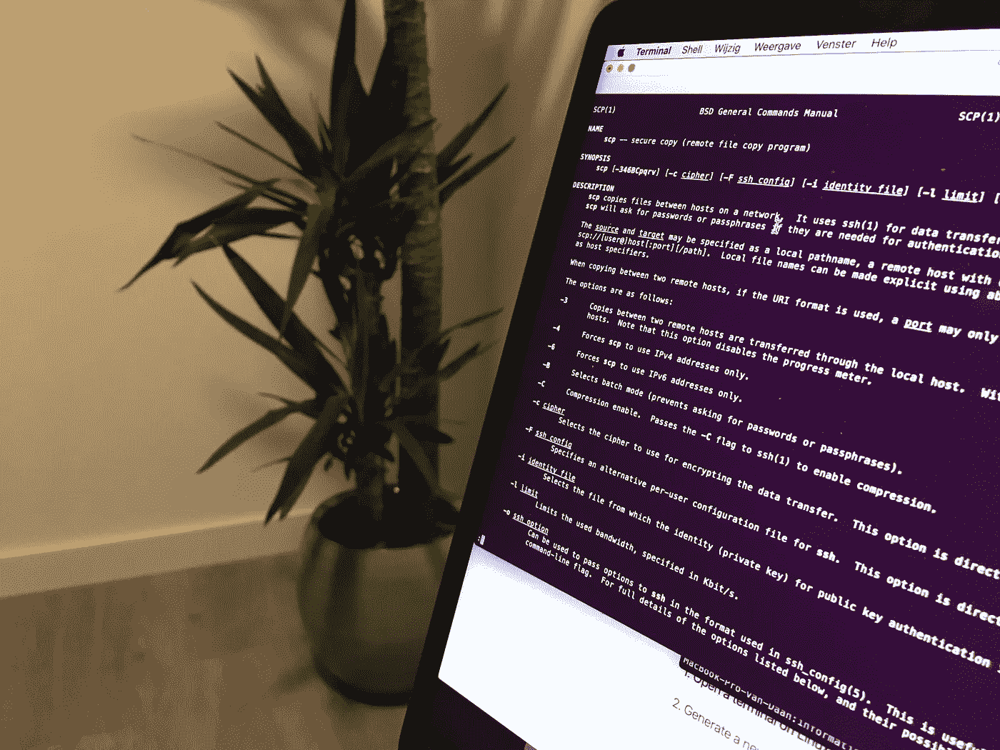

# 高级 CLI:作为开发人员应该知道的命令

> 原文：<https://betterprogramming.pub/advanced-cli-commands-you-should-know-as-a-developer-7bc48c752a5e>

## 高级命令；完成更多工作



不，在这篇文章中，我们不会重复基本命令，如`ls`、`rm`和`cd`。您不应该因为看到这些命令而感到震惊。你甚至可能对它们非常熟悉。尤其是如果您非常熟悉命令行的话。我假设您以前至少使用过(或试图使用)命令行。如果您以前从未使用过命令行，我建议您从阅读基础知识开始。

这篇文章是为那些对命令行有一些经验并对基本命令有所了解的人准备的。对于那些觉得是时候深入研究使用命令行的可能性的人。我在本文中为您列出了六个命令，并在底部提供了一些提示。

# 1.wget

在类似 Unix 的操作系统上，`wget`命令通过网络下载由 HTTP、HTTPS 或 FTP 提供的文件。默认情况下，它包含在所有独立的 Linux 发行版中。

使用`wget`最简单的方法是向它提供一个文件的位置，以便通过 HTTP 下载。使用`wget`下载文件`http://website.com/static/images/header.jpg`可以通过以下命令完成:

```
wget http://website.com/static/images/header.jpg
```

wget 的一个优点是它是非交互式的，这意味着当用户没有登录时，它可以在后台运行。这允许你启动一个检索并从系统断开，让`wget`完成工作。

# 2.单细胞蛋白质

您是否遇到过这样的问题:您需要在本地机器上从远程服务器获取文件？例如，获取用户上传的文件导致了一些麻烦。

您可以通过命令行使用`scp`命令下载这个文件。Scp 是*安全拷贝*的简称。但更重要的是，它是一个**远程**安全副本。这个命令类似于您可能已经知道的`cp`命令，但是源或目标在另一个系统上。

以下命令将文件`foobar.txt`从远程服务器复制到本地目录。

```
scp username@remotehost.com:/path/to/foobar.txt /some/local/directory
```

但是`scp`也可以用来将文件从本地目录复制到远程服务器。

```
scp /some/local/directory/foobar.txt username@remotehost.com:/destination/path/
```

使用`-r`选项可以对目录做同样的事情，它递归地复制整个目录。

# 3.ssh-keygen

`ssh-keygen`命令用于生成一个新的 SSH 密钥对。这个命令生成的公共 SSH 密钥可以在 Gitlab 或 Bitbucket 中用来建立安全连接。

一旦您将 SSH 密钥添加到 Gitlab 或 Bitbucket 中，您就不会在每次尝试将文件推送到远程分支时被提示输入密码。

要生成 SSH 密钥对，请使用以下命令:

```
ssh-keygen -t ed25519
```

注意，在上面的例子中，我们使用了 ED25519 签名算法。虽然 ED25519 被认为是最佳实践，但您应该始终对不同的可用签名算法进行一些研究。

生成 SSH 密钥对并在 Gitlab 或 Bitbucket 中正确设置它最多花费您 10 分钟(可能更像是 3 分钟),但这是完全值得的！

# 4.chmod

> 在 Unix 和类 Unix 操作系统中，chmod 是命令和系统调用，用于更改文件系统对象(文件和目录)的访问权限。

根据[维基百科](https://en.wikipedia.org/wiki/Chmod)，这是`chmod`命令的定义。我们都遇到过这样的情况，由于文件权限配置错误，服务器无法访问某个文件。

`chmod`命令本身相当简单，但是给文件和目录正确的权限是完全不同的事情。

```
chmod 664 robots.txt
chmod 775 public/images
```

第一个示例向用户和组授予对`robots.txt`文件的读写权限。授予其他人对此文件的读取权限。

第二个例子授予用户和组对`public/images`文件夹的读、写和执行权限。其他人被授予对此文件夹的读取和执行权限。

如果你想了解更多关于给文件和目录设置正确权限的信息，我建议你阅读维基百科关于`chmod`的页面。

# 5.水手

Linux `tar`代表*磁带存档*。它用于将许多文件收集到一个归档文件中。`Tar`是创建压缩归档文件最广泛使用的命令。

让我们从如何为特定目录创建归档文件开始:

```
tar -cvf my-archive.tar /path/to/directory
```

该命令将生成一个名为`my-archive.tar`的存档文件，其中包含在当前工作目录中创建的`/path/to/directory`的所有文件。

创建归档文件是第一部分。第二部分包括解压缩归档文件，因为在某些时候我们想要使用 tar 文件中的文件。您可以通过键入以下命令将文件解压缩到特定目录:

```
tar -xvf my-archive.tar -C /home/myfolder/
```

# 6.别名

每个人都使用一些有点太长或太复杂的命令来完全记住。幸运的是，您可以为该命令创建一个`alias`，这样您就不必记住整个命令。

```
alias short-command="your custom and very long command here"
```

尽管以这种方式创建别名有一个问题:这个别名是临时的。如果您以这种方式创建别名，它将只能用于您当前的终端会话。

要在会话之间保留别名，可以将它们保存在用户的 shell 配置文件中。这个概要文件可能位于 *~/。bashrc* 或者 *~/。zshrc* 如果你分别使用 Bash 或者 ZSH。

# 技巧 1:指导输出

标准的输出设备是屏幕。但是有时你不想在屏幕上输出所有内容。在某些情况下，您可能更喜欢将某些命令的结果输出到文件中。例如，为了记录目的。

要重定向输出，可以使用 *>。在下面的命令中，`ls -al`的输出被重定向到文件`myfile`而不是屏幕。*

```
ls -al > myfile
```

我在这个例子中使用了`ls`，但是它也可以是任何有输出的命令。为了确认这一点，你可以检查一下`myfile`文件。

```
cat myfile
```

# 技巧 2:组合命令

可以同时运行两个或更多的命令。分号(；)运算符允许您这样做。您可以连续执行多个命令，而不管前面的每个命令是否成功。

```
ls -al; pwd;
```

如果想让第二个命令只在第一个命令成功时运行，用逻辑*和*运算符将命令分开，这就是`*&&*`。

```
mkdir images && cd images
```

如果我们成功地创建了文件夹，我们只想将`cd`移动到`images`文件夹。

有时，只有在第一个命令**没有**成功的情况下，您才可能想要执行第二个命令。为此，我们使用逻辑操作符*或*，即`*||*`。