# JavaScript 开发人员的 5 个基本编程概念

> 原文：<https://betterprogramming.pub/advanced-javascript-concepts-you-should-know-460be406711e>

## 对核心编程概念的深入理解


照片由[纳丁·沙巴纳](https://unsplash.com/@nadineshaabana?utm_source=medium&utm_medium=referral)在 [Unsplash](https://unsplash.com?utm_source=medium&utm_medium=referral) 上拍摄

JavaScript 是一种弱类型编程语言，这意味着它不强制变量的数据类型。当某些变量被转换为不同的数据类型时，强类型语言会在编译时抛出错误，而 JavaScript 通常不会，有时甚至会在后台执行类型转换，这可能会导致错误和无法预见的问题。TypeScript 解决了这个问题，但是对于用 JavaScript 开发的人来说，这篇文章是了解如何避免弱类型语言的陷阱的好地方。

我们将涵盖 JavaScript 中的五个概念:运算符优先级、结合性、短路、原语和(隐式)类型转换。

这些概念中有许多是与语言无关的，唯一的变化是每种编程语言的规则可能不同。无论你是一个经验丰富的开发人员还是刚刚起步，你一定会学到一些新的东西！

# 运算符、优先级和结合性

运算符是编程语言中的保留符号，用于对变量和值(称为操作数)执行数学计算、赋值、比较和逻辑运算。有:

*   *非元*运算符——作用于一个操作数(即`!` 非运算符)
*   *二元*运算符——作用于两个操作数(即`%`模数运算符)
*   *三进制*运算符——作用于三个操作数(即`?`三进制运算符)
*   *n*-数组运算符——作用于 *n* 个操作数(即`()`函数调用运算符)

绝大多数操作符要么是二元的，要么是一元的(有时，根据上下文，一个符号可能既是二元的也是一元的)。

## 运算符执行的顺序

优先级是指运算符执行的顺序。优先值较大的运算符在优先值较低的运算符之前执行。没有先例，像`3 + 4 * 5`这样的表达会产生意想不到的结果和混乱。

下面是 Mozilla 的 JS [运算符优先级](https://developer.mozilla.org/en-US/docs/Web/JavaScript/Reference/Operators/Operator_Precedence#table)表的一个片段。


列(从左到右):优先级、运算符—来源 [[2]](https://developer.mozilla.org/en-US/docs/Web/JavaScript/Reference/Operators/Operator_Precedence#table)

给定表达式`3 + 4 * 5`，由于乘法运算符的优先级高于加法运算符，因此首先执行乘法运算，然后将 3 与该结果相加，得到最终结果 23。

所以基本上`3+4*5`变成了`3 + (4*5)`

给定`**`优先 13，`*`优先 12，`+`优先 11，你能解出`3 + 4 ** 2 * 5`吗？


NodeJS 优先级示例

## 如果优先级相同呢？

关联性决定了操作的执行顺序。当在一个表达式中使用多个优先级相同的操作时，了解这一点非常有用。在之前的图像中，我们看到操作符`+`和`-`具有相同的优先级。

让我们考虑一下`1 + 2 - 3 + 4`的表达方式:

如果`*`和`-`操作符具有从左到右的结合性，那么表达式计算为`(1 + 2) -3) + 4`，其计算结果为 0 + 4 或 4。

如果`+`和`-`操作符具有从右向左的结合性，那么表达式计算为`1 + (2 -(3 + 4)`，其计算结果为 1 - 5 或-4。

或者考虑表达式`3 ** 3 ** 3`，其中`**`是取幂:

如果`**`有从左到右的关联性，那么我们有`(3**3)**3`就是 19683。

但是对于从右到左的结合性，我们有`3**(3**3)`给出 7625597484987。

因此，结合性在决定预期的结果方面起着至关重要的作用！


列(从左到右):优先级、运算符、结合性、运算符表达式—来源[【2】](https://developer.mozilla.org/en-US/docs/Web/JavaScript/Reference/Operators/Operator_Precedence#table)

在 JavaScript 中，虽然大多数算术运算符具有左结合性，但取幂运算符是右结合的

参考上表，我们现在可以在 Node 中检查先前的结果

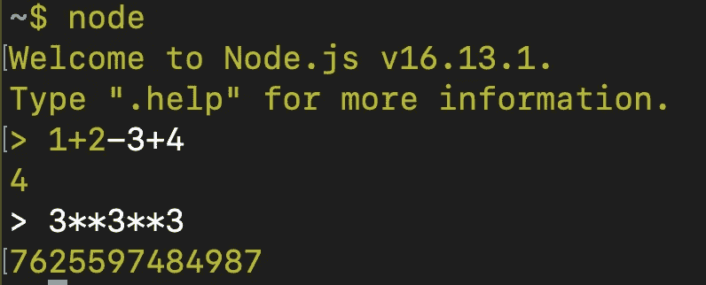

NodeJS 关联性示例

赋值运算符是另一种右关联运算符

因此`a=b=c`翻译成`a=(b=c)`，而`a=b+=c`翻译成`a=(b+=c)`


NodeJS 赋值运算符优先级/结合性—来源[[2】](https://developer.mozilla.org/en-US/docs/Web/JavaScript/Reference/Operators/Operator_Precedence#table)

虽然某些规则可能是相似的，并且适用于大多数编程语言，但这并不意味着所有编程语言都共享相同的规则。

一般来说，运算符的优先级和结合性都是由编程语言的规则决定的，由于不同的语言可能有不同的规则，所以阅读每种语言的文档以了解它们的运算符是如何工作的是很重要的。

对于运算符是非关联的(n/a)情况，建议使用括号对表达式进行分组。

**注意:**我在这里引用了 MDN 文档，因为 ECMAScript 规范指南没有运算符优先级/关联性表

尽管优先级别较高的表达式会首先被计算，但有些情况下这并不成立。用*短路* ***，*** 一个操作数可能根本不求值！

# 短路(和逻辑运算符)

一些逻辑操作符有一个称为短路的特性**，**，在这个特性中，解释器在给定操作数的结果值的情况下停止对表达式求值。

举个例子，假设`x && (y || z)`如果`x`为假(评估为`false`)，那么`(y || z)`永远不会被评估，即使`()`的优先级高于`&&`。

当表达式中的某些条件依赖于其他条件时，通常使用短路，因此并不总是需要对整个表达式求值。


JavaScript 逻辑运算符— [MDN](https://developer.mozilla.org/en-US/docs/Web/JavaScript/Reference/Operators/Operator_Precedence#table)

JS 有三个二元逻辑运算符，都具有从左到右的结合性

```
let user = { name : "George" }

const getUserName = (userObj) => {
 if (user) {
  if (user.name) {
   console.log(user.name);
  } else {
   console.log("User object has no attribute called name");
  }
 } else {
  console.log("User object does not exist");
 }
};

const getUserNameWithShortCircuit = (userObj) => {
 if (user && user.name) {
  console.log(user.name);
 } else {
  console.log(`${user ? "User object has no attribute called name" : "User object does not exist"}`);
 }
}

getUserName(user); // George
getUserNameWithShortCircuit(user); // George

user = {};

getUserName(user); // User object has no attribute called name
getUserNameWithShortCircuit(user); // User object has no attribute called name

user = null;

getUserName(user); // User object does not exist
getUserNameWithShortCircuit(user); // User object does not exist 
```

在上面的代码片段中，`getUserName`函数嵌套了 if 条件来检查是否定义了`user`，如果是，则检查其`name`属性是否存在。如果它们都存在，我们打印出`name`属性。

`getUserNameWithShortCircuit`函数使用逻辑`&&` (AND)运算符，将两个条件聚集在一个表达式中。不同之处在于，如果第一个操作数评估为`false`，那么第二个表达式不被评估，解释器跳转到`else`块。这有助于精简逻辑，并将条件/操作数之间的依赖关系组合在一起。

短路的另一个用例是提供默认值

```
let userName = someNameVar || "default"
```

如果`someNameVar`为*真值*(计算结果为`true`)，则 OR 运算符不会计算右操作数，而是将`someNameVar`值赋给`userName`。否则，如果`someNameVar`为 falsy，那么我们将`userName`设置为字符串`default`。

**注意** : 如果左操作数为 false sy，`||`返回第二个操作数，不管它是`true`还是`false`

```
let userName = "" || false; //returns false
```

`??`无效合并运算符类似于逻辑`||` OR，因为如果左操作数为*真值*，它们都会短路。不同之处在于，只有当左操作数为`null`或`undefined`时，`??`才会计算右操作数。

```
 console.log("" ?? false); // ""
console.log("" || false); // false

console.log(0 ?? false); // 0
console.log(0 || false); // false

console.log(null ?? false); // false
console.log(null || false); // false

console.log(undefined ?? false); // false
console.log(undefined || false); // false

console.log(true ?? false); // true
console.log(true || false); // true
```

因此，使用`||`，任何 falsy 值都计算为右操作数。

以下是关于这些操作员的文档:


二元逻辑运算符— [ECMAScript 指南](https://tc39.es/ecma262/multipage/ecmascript-language-expressions.html#sec-binary-logical-operators-runtime-semantics-evaluation)

## **短路(更多)**

上述运算符(`[&&=](https://developer.mozilla.org/en-US/docs/Web/JavaScript/Reference/Operators/Logical_AND_assignment)`、`[||=](https://developer.mozilla.org/en-US/docs/Web/JavaScript/Reference/Operators/Logical_OR_assignment)`、`[??=](https://developer.mozilla.org/en-US/docs/Web/JavaScript/Reference/Operators/Nullish_coalescing_assignment)`)的赋值对应项也短路，因此赋值根本不会发生。

如果左操作数是`null`或`undefined`，可选链接运算符`?.`也会短路。由于这不是一个逻辑操作符，而是用于访问对象的属性，所以我没有深入研究它，但认为它值得一提。

既然我们已经学习了操作符，是时候学习它们的操作数了！

# 基元

原语被认为是大多数编程语言的构建块。在 JavaScript 中，它们是数据类型，不是对象；因此没有方法或属性。原语也是不可变的，因此它们的值不能改变。

JavaScript 有七种原始数据类型:

*   不明确的
*   空
*   数字
*   bigint
*   标志
*   线
*   布尔型

我将不再赘述`string`或`boolean`数据类型，因为它们通常都很好理解。

## 不明确的

如果变量的值或属性尚未声明或赋值，则变量为`undefined`。


未定义的变量/属性

变量`a`在没有值的情况下初始化时属于类型`undefined`。同样，如果`a`是一个空对象，我们试图访问一个不存在的属性，我们得到的不是错误，而是属性是`undefined`

相反，当试图访问一个不存在/未声明的变量时，就会抛出一个`ReferenceError`


函数返回未定义的

不返回值的函数返回`undefined`


数组索引未定义

访问不存在的数组索引也会返回`undefined`

## 空

与表示没有任何值的变量的`undefined`不同，`null`是分配给变量的值，表示“没有值”。因此，`null`被视为一个*对象值*，尽管`typeof null`的计算结果为`object`，但它不是一个对象，因为它没有属性或方法，也不是可变的。

```
let newObject;

console.log(newObject); // undefined

newObject = null;

console.log(newObject); // null

console.log(newObject === null); // null

newObject = { name: "John Done", age: 30, email: "johndoe@email.com" }

//Clear object's value by assigning null
newObject = null;
```

`null`的一个常见用例是清除、重置或作为已初始化变量的占位符。

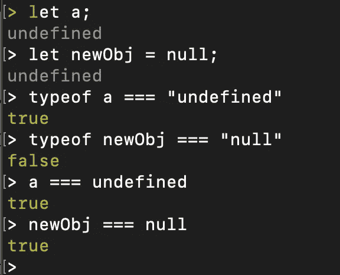

null 数据类型的严格相等与 typeof

因为`typeof null`的计算结果为`object`，为了测试一个对象是否为空，建议使用`===` *严格相等*运算符。所有其他原语都可以使用`typeof`操作符进行测试。

## 标志

`symbol`数据类型是 JS 在 ES6 中推出的一个新特性。符号保证是唯一的，因为它们是不可变的，所以非常适合用作`constants`。

使用内置的`Symbol`对象创建符号，该对象的构造函数采用一个可选参数(设置`description`属性)。

```
const firstName = Symbol("First name");
const lastName = Symbol("Last name");
```

```
let person = {
  [firstName]: "George",
  [lastName]: "Anton",
  age: "Forever Young"
};console.log(person[firstName]); // "George"
console.log(person[lastName]); // "Anton"const new_symbol = Symbol("This is a new symbol");
const new_symbol2 = Symbol();console.log(new_symbol.description) // "This is a new symbol"
console.log(new_symbol2.description) // undefined
```

符号被包在`[]`方括号中，以便设置为对象属性的键。

如果没有提供描述属性，则描述属性为`undefined`。

```
const firstName = Symbol.for("First name");
const lastName = Symbol.for("Last name");
```

```
let person = {
  [firstName]: "George",
  [lastName]: "Anton",
  age: "Forever Young"
};console.log(person[firstName]); // "George"
console.log(person[lastName]); // "Anton"
```

也可以使用`Symbol.for`创建符号，不同之处在于这些符号现在在程序的**全局**范围内。

如下所示，符号不能通过`Member Access`(点)操作符访问，也不能通过`Object.getOwnPropertyNames`和`Object.keys`方法公开。

它们也不能被转换成`string`，所以`JSON.stringify`方法会忽略它们(它们也不能被转换成`number`类型)。


尝试访问值电子邮件地址符号值

尽管这并不意味着符号是私有的。

使用`Computed Member Access`或`Reflect.ownKeys`访问它们的值

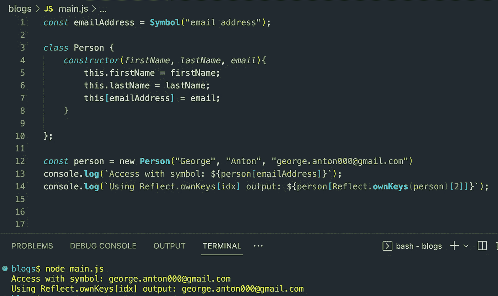

使用符号访问类的值

`symbols`的一个常见用例是作为`object`属性的键，因为它们的唯一性避免了命名冲突的可能性。在符号出现之前，我们必须使用数字或像`uuid`这样的库来为对象键创建唯一的字符串，这并不总是理想的。

## 数字

`number`数据类型是 JavaScript 中数值的默认类型。它包括整数、浮点值和特殊值，如`Infinity`、`-Infinity`、`NaN`(代表“不是一个数”)和两者`+/- 0`。由于数字是用[双精度浮点数](https://en.wikipedia.org/wiki/Floating-point_arithmetic)来表示的，这意味着它们的精度有限，因此具有有限的表示形式。


最大整数值— [ECMAScript 文档](https://tc39.es/ecma262/multipage/ecmascript-data-types-and-values.html#sec-ecmascript-language-types-number-type)

整数值被限制在区间[-2⁵，2⁵ ]内

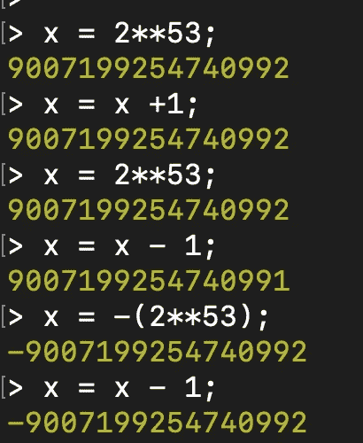

对于整数 x，x 的定义域在[2⁵-2⁵]

`Number.MIN_SAFE_INT`，`Number.MAX_SAFE_INTEGER`返回最大/最小整数值


最小/最大安全整数值

最大/最小浮点值可通过`Number.MAX_VALUE`和`Number.MIN_VALUE`属性找到，超出该范围的值不保证精度。


最大浮点值

范围[-2 ⁰ ⁴,2 ⁰ ⁴]之外的浮点由`+/- Infinity`表示

根据 ECMAScript，存在 2⁵ -2 不同的`NaN`值，每个值都无法区分(它是 JavaScript 中唯一不等于自身的值)。

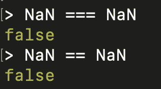

NaN 值彼此不同

`NaN`对非数值执行算术运算或使用`Number`转换非数值/字符串时出现值

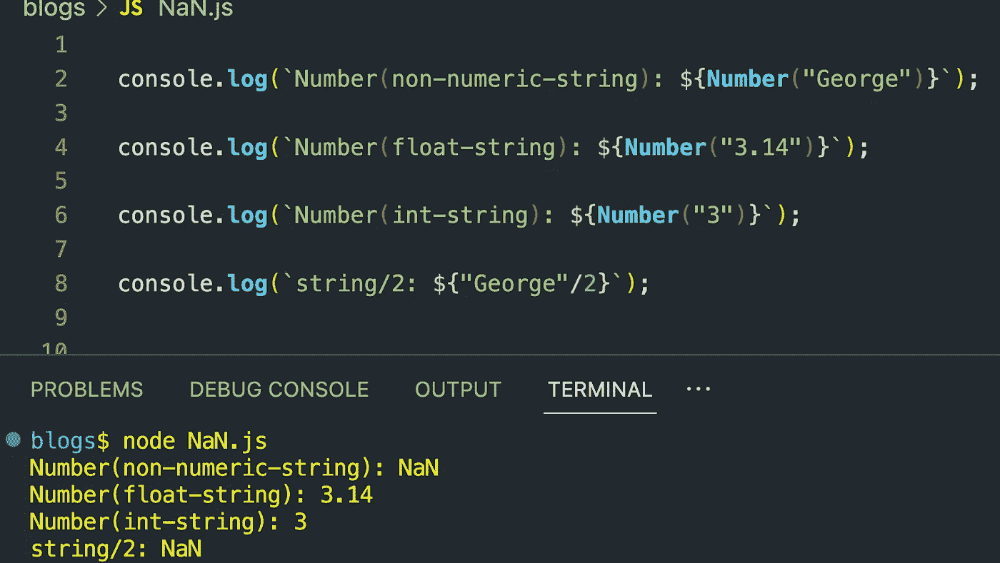

NaN 转换

## bigint

`bigint`是 JavaScript 引入的最新原语，它允许我们在不损失精度的情况下表示任意大小的整数。通过使用[任意精度算法](https://en.wikipedia.org/wiki/Arbitrary-precision_arithmetic)，bigint 表示数字的能力只受主机系统可用内存的限制。

表示一个`bigint`是通过将`n`附加到一个整数文字的末尾来完成的

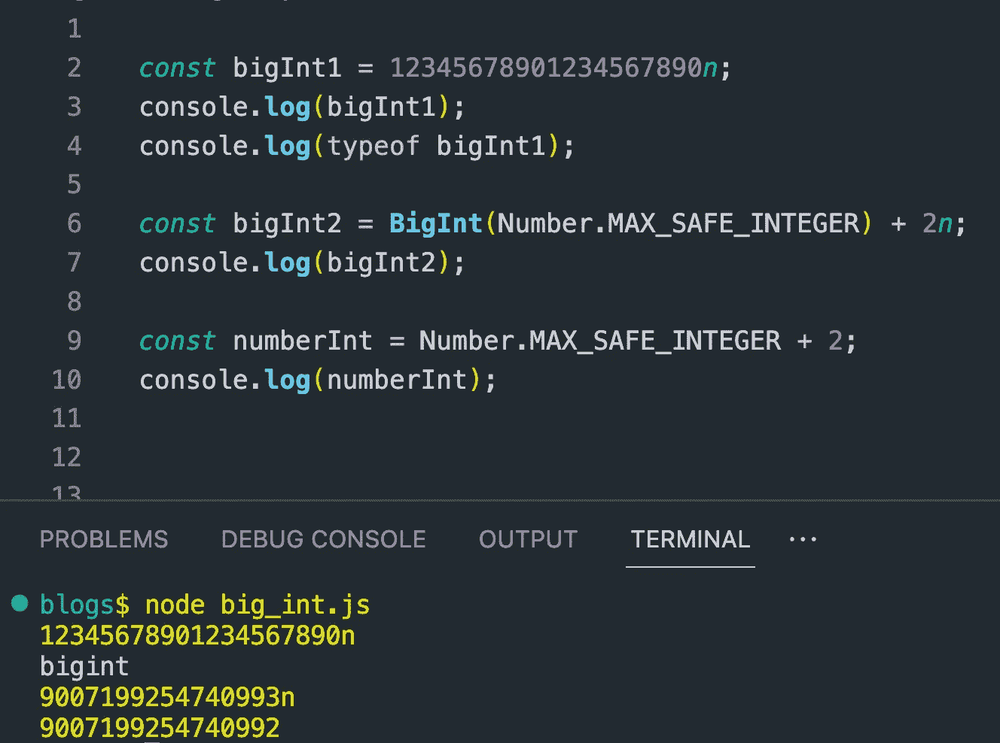

定义大整数和转换

第 7、10 行的日志表明`number`文字在`(2⁵³-1) + 2`的运算过程中会分解，而`bigint`不会

也可以使用全局函数`BigInt()`将数值转换为`bigint`

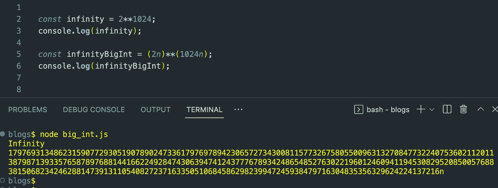

BigInt 文字定义了过去的数字。最大值

当`number`文字使用`Infinity`时，`BigInt`能够处理该值


number 和 bigInt 类型之间算术运算的 TypeError

`bigint`和`number`类型之间的操作将抛出一个`TypeError`


数值类型转换警告— ECMAScript

为了避免计算过程中的精度损失，将抛出`TypeError`。因此，由不同类型的操作符进行的隐式转换对`BigInt`无效。作为最佳实践，建议在程序中单独使用`bigint`或`number`类型，而不是同时使用两种类型。

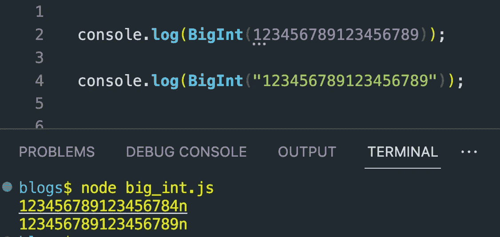

巨大的 int 转换损失

使用`BigInt`功能，当铸造值大于`Number.MAX_SAFE_INTEGER`时，会出现精度损失，如上面使用`number`类型转换所示。当它们是`string`类型时，建议转换更大值以避免这种行为。

`BigInt`使得在没有溢出和精度损失风险的情况下执行整数运算成为可能，并且可能最终形成 JavaScript 中的`BigDecimal`实现的基础！

我们看到在对`bigint`和`number`类型执行算术运算时，解释器抛出一个`TypeError`。虽然，对于操作者来说，在不同的原语上执行计算并不少见(这实际上就是我们如何得到`NaN`值的！).这种计算可能导致意想不到的结果，甚至错误，这是由于所谓的隐式类型转换(或强制)。

# 隐式类型转换(强制)

*类型转换*是将一个值从一种数据类型转换成另一种数据类型的过程。有两种方法执行类型转换:隐式和显式。

当我们使用全局`BigInt()`函数将一个`string`值转换为`bigint`值时，这是一种显式类型转换的形式。`Number()`、`String()`和`Boolean()`是另外三个全局可用的显式造型函数。

另一方面，隐式类型转换是在您不知情的情况下，由语言本身转换数据类型。了解的唯一方法是了解语言实现这些类型转换的规则。

**旁注** : `BigInt`类型在 JavaScript 中没有隐式转换。

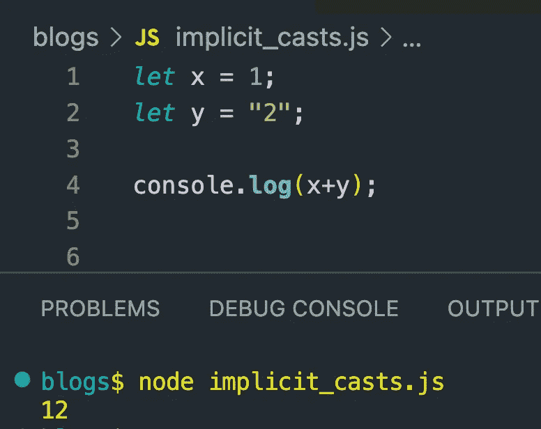

加法运算符隐式转换

上面，我们可以看到一个隐式转换的例子。`+`操作符既可以做字符串连接，也可以做数字加法。虽然当操作数是不同的类型而不是抛出一个`TypeError`时，JavaScript 似乎隐式地将`number`类型转换为`string`，然后返回字符串连接的结果。

因此，我们得到的不是期望值`3`，而是`12`。

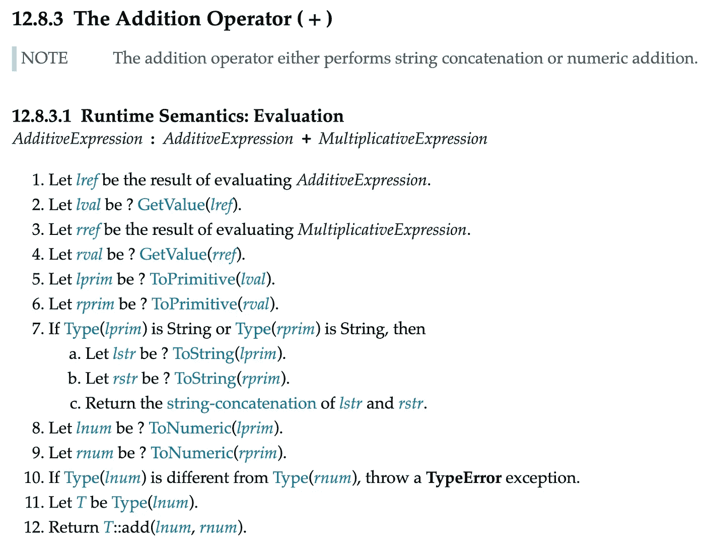

加法运算符— [ECMAScript 指南](https://262.ecma-international.org/11.0/#sec-addition-operator-plus)

让我们看一下评估:

*   步骤 **2** 和 **4** 检索表达式的值，在本例中是我们的操作数`x`和`y`
*   步骤 **5** 和 **6** 被忽略，因为`ToPrimitive()`作用于对象，并且我们的操作数的值是原始类型`number`和`string`
*   步骤 **7** 检查任一值是否为`string`的情况。在这种情况下，`y`为，因此`7a`将我们对`x`的原始值转换为`string`“2”，并且`7c`返回给我们`"1" + "2"`，即`"12"`。

因此，对我们之前的脚本的修正是`Number(x) + Number(y)`得到 3。

现在，如果`x`是一个`boolean`、`null`或`undefined`，我们应该期待什么？

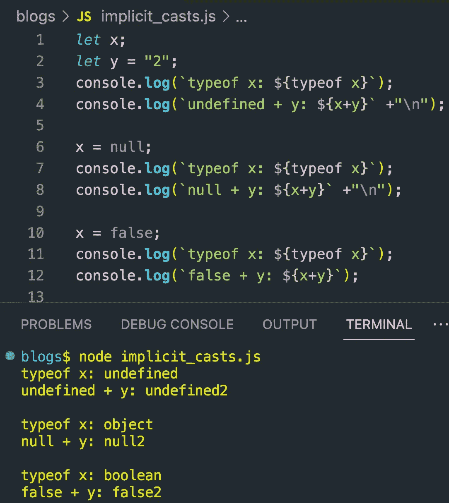

针对字符串的各种数据类型的加法运算

正如我们所看到的，在上面的所有实例中，`x`被转换为`string`类型并与`y`连接在一起。这仅仅是因为`y`属于`string`类型(步骤 **7** )

如果`y`不是`string`类型的怎么办？


非数字和非字符串数据类型之间的加法运算

让我们再看一遍评估:

*   步骤 **2** 和 **4** 检索每个操作数的值
*   步骤 **5** 和 **6** 被忽略，因为所有情况下我们都在处理原语
*   步骤 **7** 被忽略，因为`x`或`y`都不是类型`string`
*   步骤 **8** 和 **9** 将`x`和`y`的值转换为`number`
*   步骤 10 增加了一项检查，以确保两个`number`类型相同，并且之前的`ToNumeric()`转换成功
*   步骤 12 返回`Number::add`的结果，这是对转换后的`number`值的数值运算。

现在来解释输出:

1.  由于`Number(undefined)`是`NaN`而`typeof NaN`是`number`，两个未定义变量变成`NaN`的值按预期求值。

2.`NaN` +任何`number`表达式(包括`Infinity`)总是产生`NaN`

3.`null`转换成数字就是`0`，可以通过`Number(null)`查看，因此有`0 + 0 = 0`。

4/5.`boolean` true 和 false 分别转换为`1`和`0`，给出预期的结果。

因此，了解操作符如何处理不同的数据类型有助于防止错误。隐式强制转换不是`+`操作符独有的！

现在我们跳过的一个案例是，`+`如何处理`objects`？

## ToPrimitive()和原始强制

如果我们回想一下，步骤 **5** 和 **6** 在操作数值上调用`ToPrimitive()`。

在 JavaScript 中，抽象操作是算法或行为的规范，由语言内部使用，以帮助执行特定的任务，如强制。

`ToPrimitive()`是一个抽象操作，开发者无法使用。

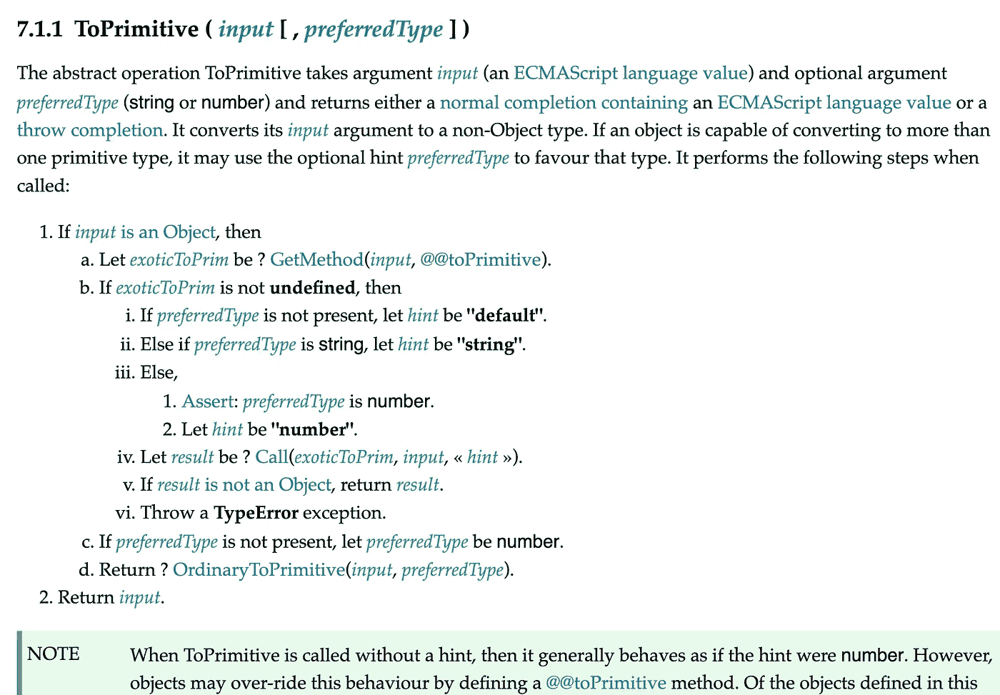

初级抽象操作— [ECMAScript 指南](https://tc39.es/ecma262/#sec-type-conversion)

`ToPrimitive`用于将对象转换为原语，需要 2 个参数。

它的第一个参数，`input`、*、*是要转换的表达式或`object`，第二个，可选`preferredType`、*、*是“默认”、“字符串”或“数字”之一。`preferredType`也被称为**提示**。

步骤 **1 检查输入是否是类型** `**object**` **，**如果不是，则输入已经是原语，并且不执行任何动作(步骤 **2** )。

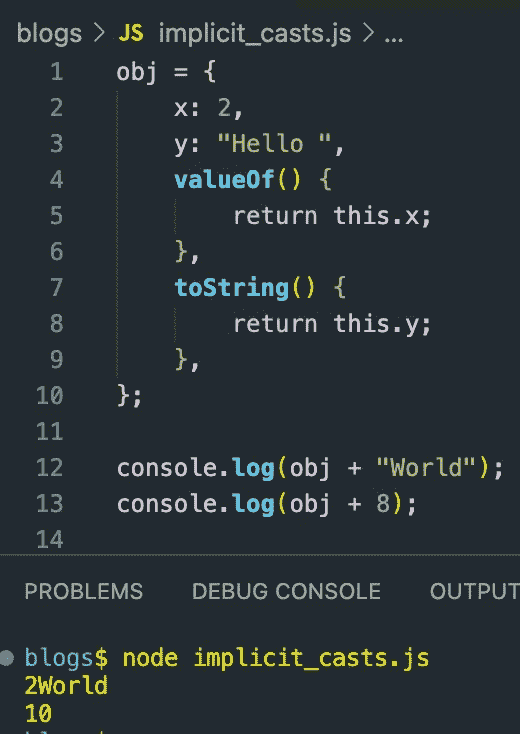

valueOf()和 toString()对象方法

`ToPrimitive`操作按以下顺序进行:

1.  查看对象的`valueOf`方法，如果存在，调用它。如果`valueOf`返回一个原语，则使用该原语值。
2.  如果`valueOf`没有返回原语，那么它查看对象的`toString`方法，如果存在，就调用它。如果`toString`返回一个原语，则使用该值。
3.  如果`toString`没有返回一个原语，那么我们查看`valueOf`和`toString`的`Object.prototype`内置方法(重复步骤 1 和 2，直到返回一个原语)。
4.  如果没有原语被返回，则抛出一个`TypeError`。

在上面的代码中，我们看到`obj + "World"`和`obj + 8`都有“obj”计算为`2`。这是因为`valueOf`方法首先执行，由于`2`是一个`number`类型，那么它就是一个原语，这就是返回的内容。

现在回想一下，这是[步骤中的 **5**](https://262.ecma-international.org/11.0/#sec-addition-operator-plus) 中的`+`符铸造。因此，如果第二个操作数是字符串，原语`2`将被转换为`string`，因此我们有了字符串连接。否则它仍然是一个`number`，我们添加。

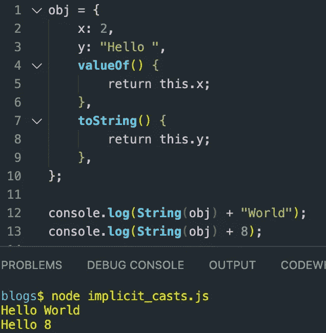

提示=== "字符串"

覆盖前面的`ToPrimitive`操作行为的一种方法是提供一个提示。以前，hint 被设置为“默认”,为了提供提示，我们需要使用显式转换。

当用`String`显式强制转换“obj”时，我们告诉`ToPrimitive`我们想先使用`toString()`(这是我们的`preferredType`)，在两种情况下都返回`Hello`(然后我们回到`+`手册的第 7 步)。

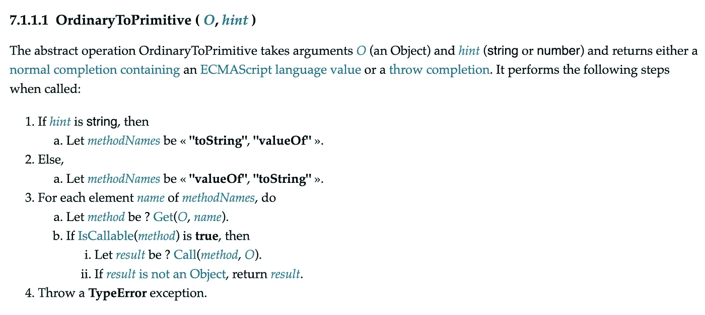

普通操作限制— [ECMAScript 指南](https://262.ecma-international.org/9.0/#sec-ordinarytoprimitive)

我们刚刚概述的步骤实际上是由`OrdinaryToPrimitive`抽象操作定义的，它实际上是`ToPrimitive`中的步骤 1d。我们基本上跳过了 1a — 1c。现在我来讨论 1a 什么时候用，以及`exoticToPrim`是什么意思。

## 内部[@ @ top primitive]()方法

我们已经看到，当我们向抽象的`ToPrimitive`操作传递一个提示时，比如`string`，然后我们在内部调用对象的适当方法(在这个例子中是`toString()`)(如果那些方法存在的话)。

执行这些任务的(内部)函数是一个名为`[@@toPrimitive]()`的*众所周知的*符号(“众所周知的*”*符号由`@@`表示，是 JavaScript 中预定义的符号)。

虽然这个`symbol`方法是 JavaScript 的内部方法，但是可以使用`Symbol.toPrimitive`覆盖它。JavaScript 用这个方法查看对象作为*外来的*和`exoticToPrim`属性被定义(步骤 **1a/b** )。

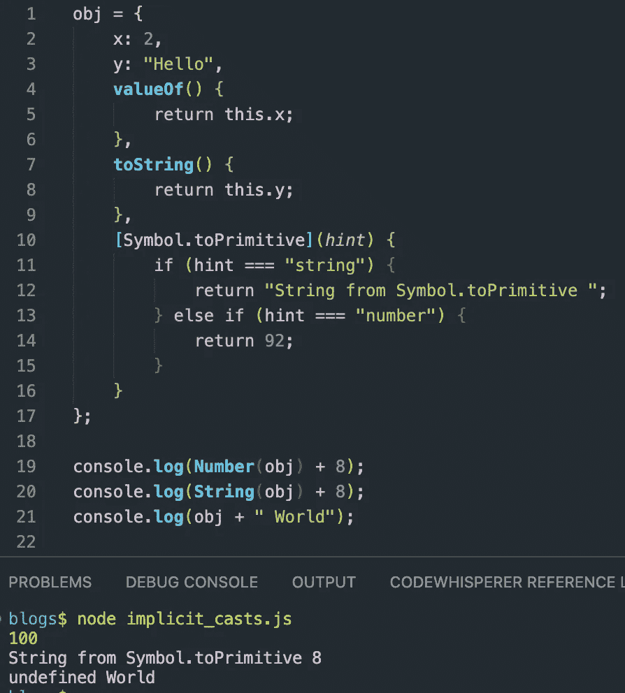

“外来”对象—已定义的[symbol . top primitive]()方法

上面是一个*外来*对象的例子。尽管定义了`valueOf`和`toString`，但是`[Symbol.toPrimitive]()`方法覆盖了这些行为。

因为我们在`if/else-if`块的范围之外没有显式的`hint === "default"`或简单的`return`，那么`obj + " World"`将返回`undefined`。这是因为我们覆盖了“默认”行为，并且`[@@toPrimitive]()`期望从“默认”的提示中得到一个值，但是没有赋值。

## 包扎

为了总结这一点，让我们看看为什么`{} + []`返回`[object Object]`:

1.  `+`操作的步骤 **2、4** 、`GetValue({}) = {}`和`GetValue([]) = []`
2.  由于这些都不是图元，`+`操作的步骤 **5、6** 调用`ToPrimitive`
3.  `ToPrimitive`操作的步骤 **1** 确认`{}`和`[]`为`object`类型。
4.  我们跳过步骤 **1a** 、 **1b** ，因为这些是空的，因此不是*外来的*
5.  步骤 **1c** 使用`OrdinaryToPrimitive`。因为它们是空的，所以没有用户定义的`valueOf`和`toString`方法。
6.  首先考虑左操作数。`{}`是`Object.prototype`的成员，因此继承了`.valueOf()`和`.toString()`方法。默认情况下，`OrdinaryToPrimitive`调用`{}.valueOf()`，后者返回一个`object`。
7.  由于`object`不是原语，它然后调用`{}.toString()`，这返回了`string`类型`[object Object]`。
8.  考虑右操作数。`[]`是`Array.prototype`的成员，也继承了`.valueOf()`和`.toString()`方法。首先调用`[].valueOf()`，它返回一个`object`类型
9.  由于`object`不是一个原语，它然后调用`[].toString()`，这将返回`string`类型`"”`。
10.  `+`操作的第 **7** 步，由于`string`的两个操作数，我们执行字符串连接，因此`[object Object] + ""`计算为字符串`[object Object]`。

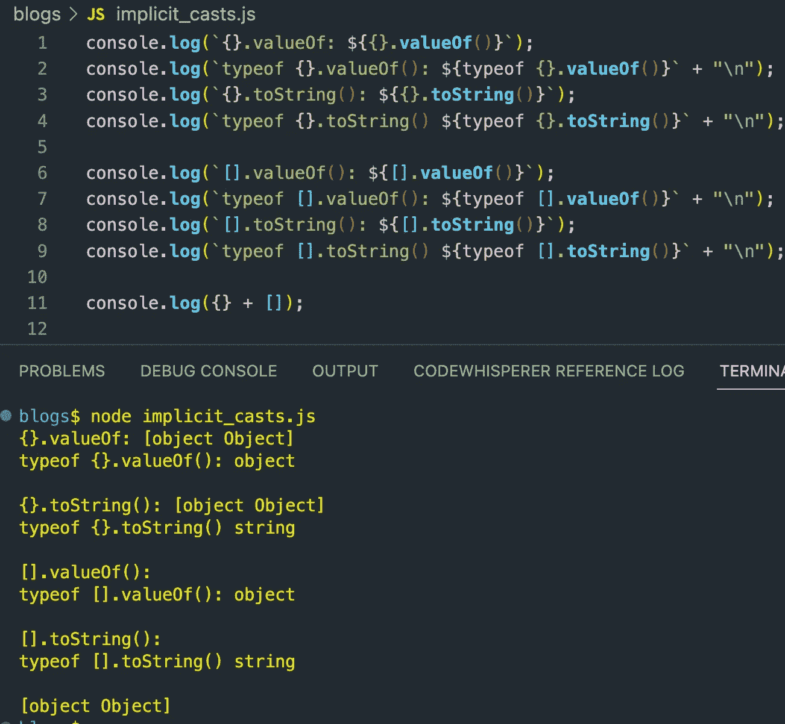

# 灵感

如果你已经做到这一步，我想分享这篇文章的灵感:

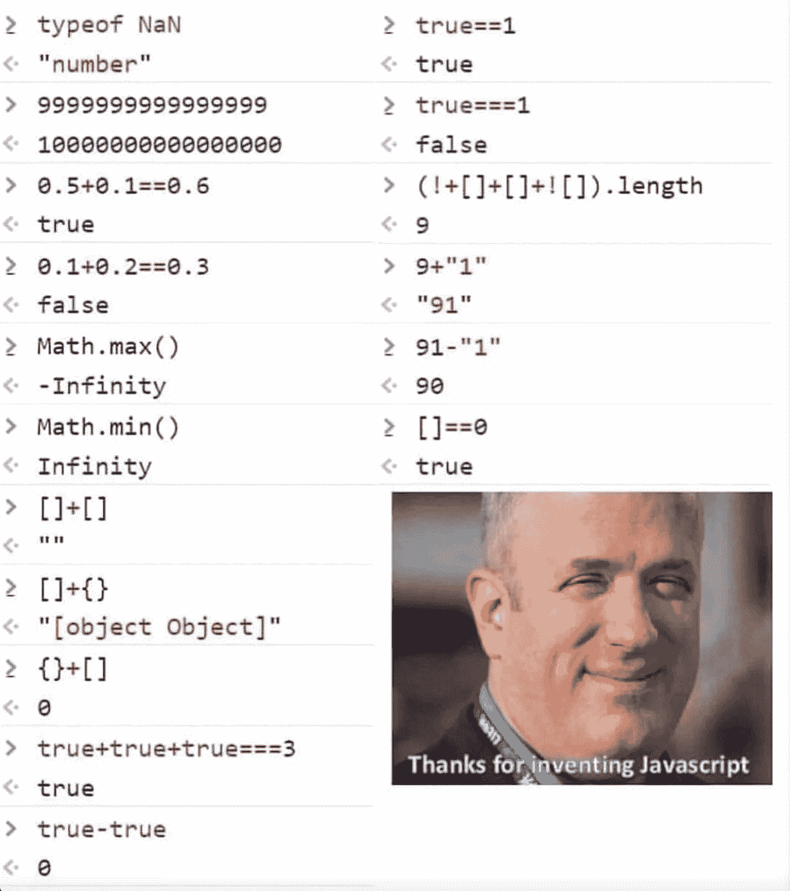

感谢发明 JavaScript！

根据我们现在所知道的，看看你是否能理解输出的意思！

我希望你发现这篇文章内容丰富，最重要的是，感谢你的阅读！

```
Connect with me on [LinkedIn](https://www.linkedin.com/in/ganton000/).
```

# 资源

*   ECMAScript 指南
*   [操作员— ECMAScript 指南](https://tc39.es/ecma262/#sec-ecmascript-language-expressions)
*   [类型转换— ECMAScript 指南](https://tc39.es/ecma262/#sec-abstract-operations)
*   [JS 运算符优先级— MDN 单据](https://developer.mozilla.org/en-US/docs/Web/JavaScript/Reference/Operators/Operator_Precedence)
*   [JavaScript 数据结构— MDN 文档](https://developer.mozilla.org/en-US/docs/Web/JavaScript/Data_structures)
*   [BigInt 原语— V8 文档](https://v8.dev/features/bigint)