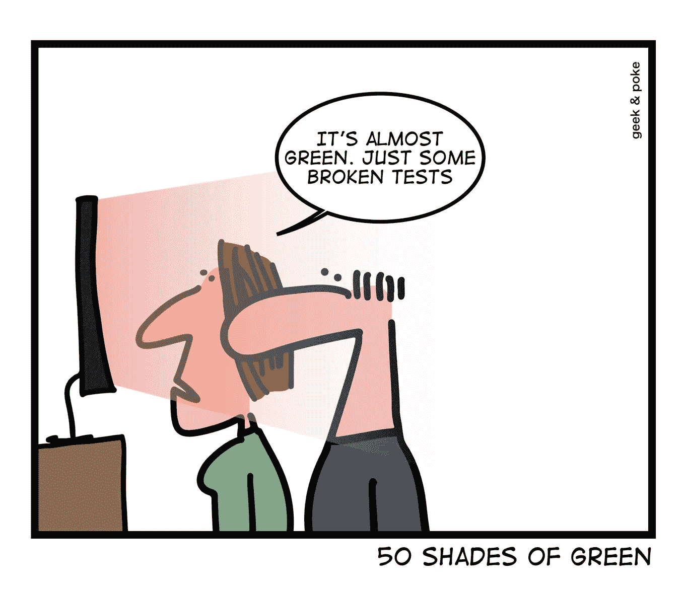
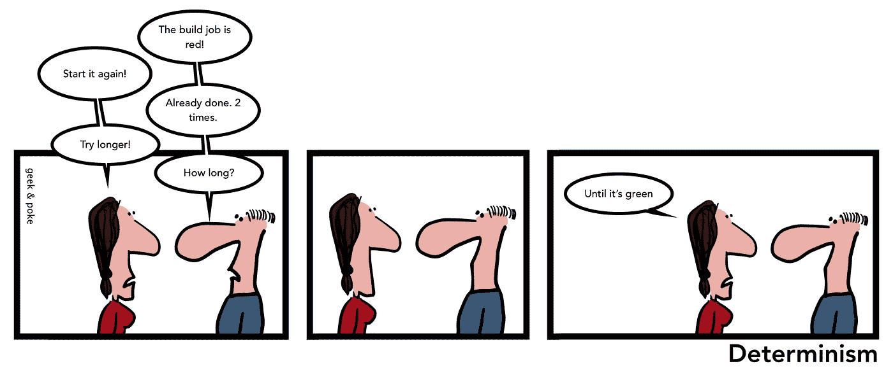

# 高级单元测试:5 个陷阱以及如何避免它们

> 原文：<https://betterprogramming.pub/advanced-unit-tests-5-pitfalls-and-how-to-avoid-them-eb6e04ec9654>

## 并非所有的单元测试都是相同的；有些可能有害

改编自 geek-and-poke.com[的漫画](https://geek-and-poke.com/geekandpoke/2017/2/18/50-shades-part-2)，牌照 [CC-BY-3.0](https://creativecommons.org/licenses/by/3.0/)

单元测试的存在是为了给你信心，让你相信你的软件正在按预期工作，即使软件随着时间而改变。

写了很多测试，看的也多了。他们中的大多数帮助我早期发现错误，提供文档，并防止回归。但是我也发现一些测试没有做到这些。取而代之的是，它们要么太复杂以至于你不知道它们在测试什么，要么会随机失败，甚至根本不会失败。

本文介绍了导致无效单元测试的五个陷阱，以及如何修复它们。

# 1.为每个函数编写一个单元测试

看起来很直白。假设你有一个小函数做一件事。姑且称之为`calculate_average`。它是一个小单元，是单元测试最佳实践想要你测试的。所以你为它写了一个测试，`test_calculate_average`。

这有什么不好？它测试单个代码单元，但是它应该测试测试的单个行为。通常这也被称为在测试中有一个单独的断言。一个更好的测试是`test_calculate_average_return_0_for_empty_list`。一旦你有了几个，他们会免费给你详细的文档。

它也改变了你如何写测试的心态。你必须考虑你期望从一个函数中得到的不同行为。在您知道之前，您正在考虑边缘案例，甚至为它们编写测试。

> "为每个功能单元编写一个单元测试，而不是代码单元."

我曾经帮助一位同事调试一个问题:我们的清理日志程序没有正确清理数据。他们怀疑它不会适当地删除额外的键值对。当我不久前写下这段代码时，我不知道这个理论是否正确。但是我知道我写了大量的测试，并且我很快找到了一个记录问题行为的测试:`scrubbing_logger_scrubs_extra_key_values`！我们可以很快放弃我们最初的假设，节省一些宝贵的时间。

# 2.只为代码覆盖率编写测试

跟踪测试覆盖率通常是一个好主意。如今，许多测试框架都支持这一点，像 [codecov](https://about.codecov.io/) 或 [coveralls](https://coveralls.io/) 这样的平台使得随着时间的推移跟踪它变得容易。那么，为什么沉迷于此不是一个好主意呢？

代码覆盖率只是一个代理测量。100%的代码覆盖率并不意味着你已经覆盖了所有的边缘情况，它只是意味着所有的代码路径都被执行了。这里有一个快速的反例，它有 100%的覆盖率，但是让我们看看当你传入一个空列表时会发生什么？

代码覆盖率的基本问题是它只测量你的程序覆盖了多少行。但是所有的[程序都是状态机](https://www.reddit.com/r/learnprogramming/comments/5iretr/are_all_programs_finite_state_machines/)；为了全面覆盖，你必须覆盖所有的州。这是不可行的。

努力追求完整的，或者至少非常高的覆盖率也会导致大量的测试，而且并不是所有的测试都是有用的。对于“粘合代码”来说尤其如此我见过模拟半个 web 框架(flask)的测试，只是为了测试为端点注册一个函数是否有效。这是测试一点点功能的巨大努力。如果你弄错了，那就很明显了。一旦做对了，以后不太可能改变。

我推荐 Martin Fowler 的建议，而不是努力覆盖每一行代码。将你的测试集中在有风险的代码上。可能要重构的是你自己写的代码，而不是框架。然而，知道什么是有风险的是困难的，但是它来自于经验。

> "你应该将[你的测试努力]集中在风险所在的地方."— [马丁·福勒，重构](https://refactoring.com/)

# 3.严重依赖模仿

使用模拟和存根对于单元测试是必不可少的。大多数情况下，被测试的代码与其他模块交互，在测试期间，您希望控制它们的行为。但你也可以过度嘲讽。

当你不得不写 50 或 100 行模拟来测试一个十函数时，那么你在测试什么呢？您是在测试您的函数，还是在测试您编写的用于测试函数的模拟？

大量的模仿也是代码布局的一个危险信号。当你需要几个非常复杂的模拟来测试一个函数时，这个函数可能会做几件事。因此，您可能希望将它重构为几个功能较少且可以单独测试的函数。

我见过一些非常复杂的模拟。这是一个例子的再现:

过分嘲讽的例子

万一您迷失在其中，我们想要测试我们是否成功地修改了中间件中的响应对象。在这个过程中，我们创建了一个完整的应用程序，包括模拟端点和测试客户端。相反，您可以围绕测试中的代码创建模拟，如下所示:

同样的测试，但是用了不同的嘲笑策略

两个例子测试的是一样的，但是后者要短得多，需要的设置和定制模拟也更少。是的，我们仍然使用模拟，但是它们不那么显眼了。

# 4.编写一个永远不会失败的测试

检测回归是单元测试的一个原因。你写代码，你写通过测试和利润。万一有人破坏了你的代码的功能，测试将会发现它。还是会？如果您不小心，您的测试可能永远不会失败，并且您会错过回归。

但是你怎么能得到一个永远不会失败的测试呢？这里有一个例子:

现在问问你自己:什么变化会使这个测试失败？最明显的一个是改变模拟响应。但是这不算，你并没有改变测试中的代码。更糟糕的是，我最初忘记了`json.dumps`。测试不会发现这个错误。使这个失败的唯一方法是弄乱第四行的代码。考虑到测试的复杂程度，这实际覆盖面小得惊人。

你可以把它想成假阳性和真阳性。您希望测试捕捉的许多更改都没有被检测到。向`get_film`传递无效参数不会被捕获。忘记`json.dumps`不是被抓。`Query`中的错误未被捕获。换句话说，你会得到很多假阳性。

为了防止这种情况，请考虑是什么导致您的测试失败。更好的是，从失败的测试开始，然后编写代码直到它通过。在你知道它之前，你正在做测试驱动的开发。

# 5.在测试中使用非确定性行为

这是一个众所周知的谬误。如果您的测试或测试中的代码以不确定的方式运行，您将对您的测试失去信心。每一次失败，你都会问:我的测试失败了，还是会在重新运行时通过？重新运行会给工作流程带来摩擦。摩擦太多，你想完全丢弃测试套件。

改编自 geek-and-poke.com[的漫画](https://geek-and-poke.com/geekandpoke/2018/8/17/determinism)，牌照 [CC-BY-3.0](https://creativecommons.org/licenses/by/3.0/)

非决定论的缺点对于测试来说是显而易见的，那么是什么导致了这一点呢？

您在测试中使用了当前时间或日期吗？如果是，您的测试每天都在用不同的数据运行。一旦你在这个行业足够长的时间，你会遇到这些类型的测试。它们可能只在一个月的最后一天失败，或者只在午夜前开始，午夜后结束。幸运的是，有一个简单的解决办法:控制时间的流动。例如，Python 有用于此的[冻枪](https://github.com/spulec/freezegun)模块。

你是否使用随机性来生成示例数据？有一个名为 [faker](https://faker.readthedocs.io/en/master/) 的 Python 库，可以很容易地生成真实的数据，如姓名、地址或电话号码。这对于填充演示环境或冒烟测试来说非常好。对于单元测试来说就不是这样了。使用硬编码的静态示例要可靠得多。

我听说过测试中非确定性的论点:随着时间的推移，它将覆盖更多的测试用例，并可能发现更多的 bug。像 Haskell 的 Q [uickCheck](https://hackage.haskell.org/package/QuickCheck) 或 Python 的[假说](https://hypothesis.works/)这样的库包含了这一思想。但是这些库为一个测试生成了多个例子，并提供了失败的种子和例子。如果某个东西由于新发现的边缘情况而失败，库将使它变得明显和容易重现。依赖非决定论的其他来源不会。这就是为什么我的建议是在你的测试中避免非确定性行为。

# 最后的想法

现在你知道了，阻止你编写有效单元测试的五个陷阱。现在您已经了解了它们，您可以通过执行以下操作来避免它们:

*   为功能的每个部分而不是每个功能编写测试
*   不要沉迷于代码覆盖率，而是专注于测试有风险的代码
*   最小化设置和模拟代码
*   确保你的测试会失败
*   将非确定性排除在测试之外

这将给你更多的信心，让你的测试测试你的软件，并且经过良好测试的软件让你充满信心地快速进行修改和部署。

本文中的所有代码示例都在 [GitHub](https://github.com/lucas-sonnabend/unit_test_pitfalls) 上。