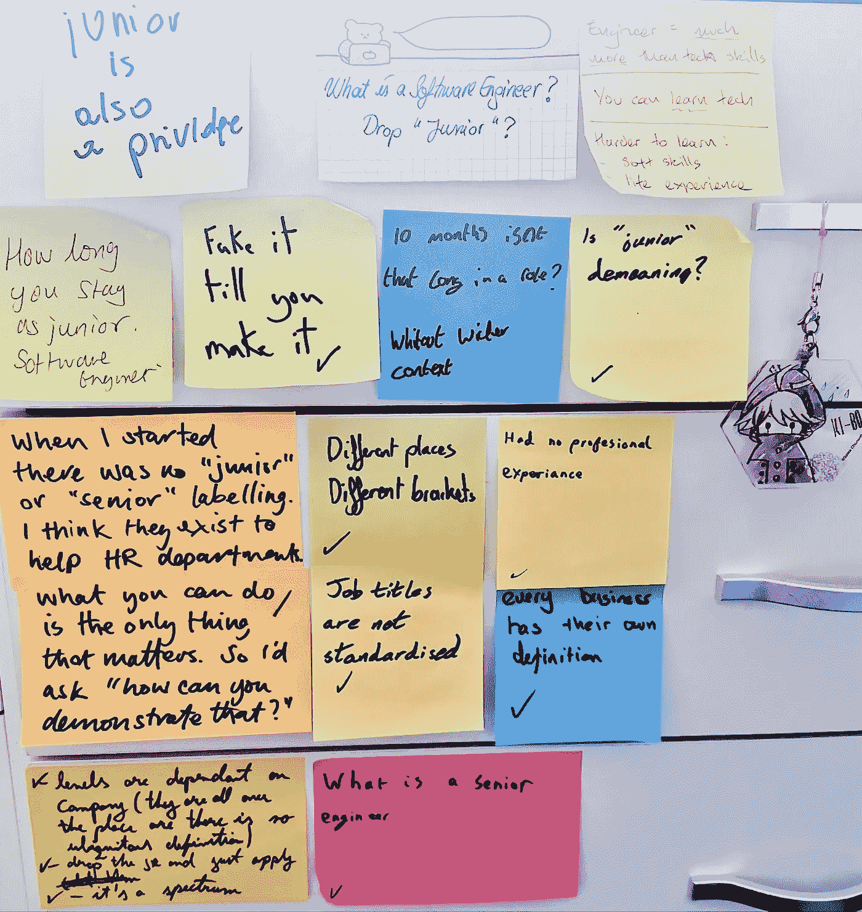

# 倡导早期职业工程师

> 原文：<https://betterprogramming.pub/advocate-for-early-career-engineers-c1a408122e28>

## 对早期职业开发人员的奋斗历程的个人见解，以及为什么它仍然值得追求

由 aut hor 绘制的受 Shutterstock 启发的图像

# 行业——不要气馁

我经历了几个职业，发现作为一名软件工程师和个人，技术是一个很好的学习和发展环境。像许多其他人一样，我热爱编码，因为我想创造和构建帮助他人的惊人产品。

然而，在参加了新兵训练营并获得第一个角色后，我们这些技术创业者发现了冒名顶替综合症的感觉。由于没有真正的指导、培训计划或具体的路线，我们经常感到沮丧，并开始质疑我们选择技术作为职业的决定。这本身就已经够难的了，不考虑作为一个少数民族——科技界的女性——的挣扎。

我们感觉与团队脱节——好像我们不属于这个团队。我们很快发现，即使我们渴望学习，也没有人可以教我们。如果我们找到人来教我们，也只是很短的一段时间，因为现有的开发人员专注于编写代码，不接受他们的部分角色是帮助和鼓励新的开发人员。协作、配对和有效沟通仍然没有被公司认为是学习和工作的好方法。

就英国的职位空缺而言——[未来三年将创造 70 万个](https://www.uktech.news/news/industry-analysis/uk-tech-industry-valued-1tn-20220329#:~:text=It%20was%20revealed%20earlier%20this,bn)%20raised%20by%20fintech%20companies.)工作岗位。但不适合入门级开发者？？"[对高级角色的需求正在迅速增长，而对初级和中级角色的需求已经下降。](https://technation.io/people-and-skills-report-2022/#careers-and-progression)这可能会造成未来的供应问题，能够获得重要技术经验的潜在员工越来越少，公司也很难招聘到有经验的人。要解决这种情况，就需要重新考虑公司招聘的角色，并承认必须承担提高员工技能的责任。”

开发人员学习基本编码技能的平均时间大约是 4-5 个月。然而，任何进入这个行业的人需要的不仅仅是掌握编写代码的基本概念的技术能力。自学的时候很快就能养成坏习惯。

所以，如果你是一个新的开发人员，[很难找到一个角色](https://blog.pragmaticengineer.com/advice-for-junior-software-engineers/)，当我们找到时，我们被鼓励独自学习和工作！

同样，一些开发人员可能会在这种情况下茁壮成长。科技是一个比其他很多人更好的工作环境。但是那些想要合作的人呢？谁想找乐子？谁想通过互动来提高他们的学习？

# 协作和配对

*我们需要针对不同的学习风格做出更好的调整。*与另一个开发人员的第一次接触不应该在代码审查(PR)阶段。

从与更有经验的工程师的交谈中可以明显看出，比起编码的物理任务，关心他们开发的产品要难得多。因此，如果有软技能的话，拥抱它们，并积极鼓励他人发展它们。你教我代码；我教你配对和合作。

然而，当我们寻求帮助时，我们会收到一个无穷无尽的链接列表，这些链接可能会帮助我们在孤立状态下成为更好的开发人员。

我发现自己与开发人员的期望背道而驰——主要关注技术技能的人。喜欢深度技术性工作的同事往往认为我更适合其他职位，例如 UX 设计师、业务分析师、产品经理。

人们是否一致认为，具有沟通/领导技能的人、女性和外向的人应该只被导向管理性和技术性较低的角色？早期职业开发人员被要求坐在他们的盒子里，不展示任何“主要开发技能”,如指导、建议改进或标记问题……除非他们是超级程序员。

一些组织认为自己是[敏捷](https://agilemanifesto.org/)，却没有正确应用甚至理解合作的基本价值和原则。作为一个在开发早期原谅自己和抛弃他人的例子，他们建议“敏捷方法”是让我们开发人员在没有支持的情况下建立自己的培训计划。

我们还被告知不要理会我们以前的所有经历，保留我们的个性，所以我们开始与业务需求保持一致。事实上，我们以前的经验非常重要，因为它为产品开发带来了新鲜、多样和创造性的视角。

会好起来的…我保证？😐

后来，你会遇到志同道合的人，他们主动教你，你会和他们建立非常牢固的关系。这些人会成为你最好的朋友！但是，为什么这个过程留给个人尽最大努力，而不是组织为他们的入职和培训负责？

引用一位朋友的话，“有时感觉公司想让员工上船，但他们不想停止生产。他们希望火车以 60 英里/小时的速度行驶，新人们跳上车，而火车不会减速。”

# 伟大的开发人员可以不太关注技术——去掉“初级”的标签

拥抱早期职业工程师，因为他们带来与软件工程师相同的价值，但方式不同。

敏捷意味着允许人们获得所有权，并为软件贡献他们自己独特的价值(例如，他们的精力、创新和解决问题的能力)。

科技行业还没有准备好在软件工程师职业生涯的早期与他们打交道。大多数组织即使提供全面的入职培训，也不会提供。不知何故，他们忘记了绩效最高的团队是多样化的团队，他们创造并交付适合所有人的产品，而不仅仅是少数人。

作为一名职业改变者，一名技术新手,“初级”的标签印在你身上是为了封装一套期望——比如确定资格程度、薪资水平和责任。在与其他开发者交谈时，他们问我是否认为“初级”是贬低，但一个朋友解释说这也是一种特权。

被称为“晚辈”让一些人松了口气，也给了他们一个提问和学习的安全空间。然而，不仅仅是早期科技职业的人需要学习、发展和接受培训。技术是一个非常广泛的主题，而且变化非常快。因此，无论级别高低，都应该鼓励这些做法。

我认为这个人力资源标签不应该让公众看到。“初级”盒子束缚了程序员，限制了他们的薪水、职业发展和内在能力。它创造了这种无意识的无资格偏见。

我鼓励早期职业开发人员不要满足于做一名“初级”，而要开始申请软件工程师的职位。此外，统计数据显示，女性必须 100%符合工作要求。因此，它们不适用。我在社区和聚会上与其他更有经验的开发人员讨论过这个话题——答案是一致的——人们不应该因为在技术方面没有什么经验而被限制申请软件工程职位。

# 你可以成为一名软件工程师

剩下的唯一障碍就是你自己！实际上，还有……科技行业！转行者对这个行业来说可能是新鲜事物。然而，他们拥有作为软件工程师的重要品质——比如问一些基本问题。

最后，你需要问自己:“你能做到吗？”

编码不是什么难事，谁都能学会。不在于你有多聪明；人们并不是生来就“做微积分”——这是一种和其他技能一样的技能，你越关注它，它就越会成长。

帮助我的是专注于自己的进步，而不是拿自己和别人比较。你需要成为自己的盟友！树立对自己的信心！

让你周围都是想教你和支持你的人。你可以加入一些优秀的技术社区，比如 [Women Rock。](https://sr2rec.com/community/womenrock/)这是一个放大不同声音的伟大平台。

我们可以认为技术是一个不断变化和发展的实体，它不会总是这么难！我们越是提高对这些问题的认识，我们就越能解决它们。

甘巴尔！(祝你好运！)
٩(◕‿◕)۶