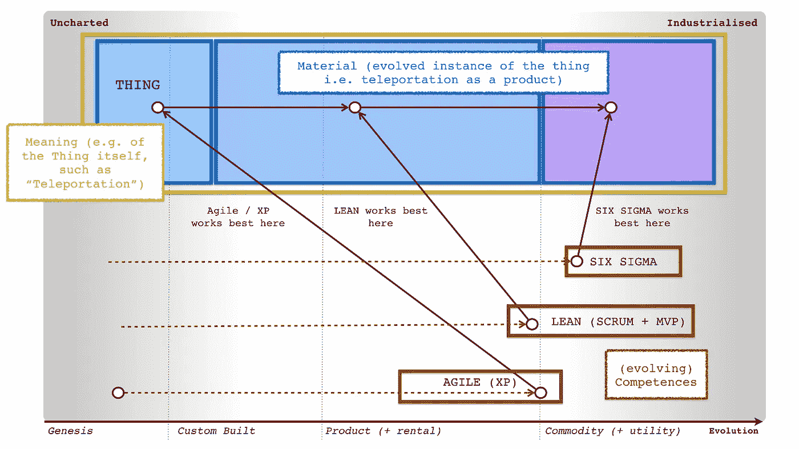

# 大型复杂组织中的敏捷

> 原文：<https://betterprogramming.pub/agile-in-large-complex-organizations-a41dc88fbf09>

## 敏捷中有创新的空间吗？

由 [Unsplash](https://unsplash.com/s/photos/the-future?utm_source=unsplash&utm_medium=referral&utm_content=creditCopyText) 上的 [drmakete 实验室](https://unsplash.com/@drmakete?utm_source=unsplash&utm_medium=referral&utm_content=creditCopyText)拍摄的照片

这个标题听起来可能比预想的更不吉利。我想谈谈我的一些学习和想法。在复杂的系统中，大规模的框架会造成僵化，并且会过度约束一个组织。

向扩展框架扔石头并指责它们各种各样的功能障碍是很容易的，现实情况是，无论是自己还是通过咨询公司的支持，采用它们的人都有共同的责任。

对于寻求打包解决方案的大型复杂组织来说，通过付费来实现企业敏捷性是非常有吸引力的。

> *这有点像买一栋家具齐全的房子，以为你会得到你需要的一切。然后你意识到它是为一个较小的家庭建造的，你现在被迫分享同一个卧室，当然房子里的两张台球桌比你的家庭更重要，有床。*

来源:[https://thinkinsights.net/strategy/crossing-the-chasm/](https://thinkinsights.net/strategy/crossing-the-chasm/)

对于你们中不熟悉杰弗里·摩尔的书《跨越鸿沟》和著名的《创新曲线的扩散》的少数人来说，即使你不知道它的名字/起源，你也已经看过了。它很好地描绘了创新在曲线上的传播，以及每个市场如何有不同的需求需要被说服。

这适用于任何创新，而一个被忽视的部分是从早期采用者阶段过渡到早期大多数阶段所需的惯性——这通常是客户和市场有不同需求并采取不同类型的证明来获得业务的地方。

新兴的和新颖的实践经常能够跨越鸿沟，并且仍然局限于少数人。

Chris Matts 在他的演讲“敏捷——坏掉的学习机器”中谈到了这一点，例如引用特性注入作为一个这样的例子。

# 敏捷并不新鲜

你认为敏捷在这条曲线上真正处于什么位置？我听到许多从业者声称敏捷现在处于后大多数或落后者之间的某个点上(取决于你的观点)。

如果你拿一张类似的图表，在沃德利图上画出敏捷，你会看到类似的进展，尽管西蒙区分了 Scrum 和 XP。重点是他们已经达到了自己的新奇，不再差异化，反而是理所当然。

我不完全同意 Simon 关于敏捷在 X 轴上工作得最好的描述，我会把它留到下次再讲。公平地说，当你在工作中不太确定并且你想降低风险时，你应该使用更短的反馈循环来加快学习。

来源:西蒙·沃德利—[https://Twitter . com/swar dley/status/1214922707764166656/photo/1](https://twitter.com/swardley/status/1214922707764166656/photo/1)

# 敏捷死了吗？

有许多同名的视频和演讲，我不认为敏捷已死，但是我认为敏捷已经变得和大约 20 年前敏捷宣言中最初的定位大不相同。它显然是为软件开发和构建产品而设计的。

现在，它被用来解释任何组织/团队都可以考虑在其工作方式中使用的一组更常见的实践。我不关心如何让方法适应你的环境，并从中获取价值。令人担忧的是，当敏捷变成一个商业/打包产品时，它专注于给每个人一个自上而下的命令和控制结构的角色，看起来一点也不像敏捷。除非系统能够以渐进的方式实现和行动，否则高层的每个人仍将期待大爆炸式的交付。

我是克劳斯·利奥波德提出的绕过[飞行高度层](https://www.flightlevels.io/)的方法的粉丝。这是一种关注战略、协调和工作交付的有趣方式，这样每个人都在考虑限制正在进行的工作，而不仅仅是团队交付。我推荐他关于敏捷团队如何不能自己创造业务敏捷的演讲。

# 敏捷不是一个全公司的运营模式

如今，当敏捷在大型组织中实施时，它倾向于以推的方式而不是拉的方式来实现。丹·梅齐克广泛地讨论过这个问题，他有一系列令人惊奇的书，他提供了一种叫做[开放空间敏捷性](https://openspaceagility.com/)的方法，我强烈推荐你去研究一下。

这个想法是让人们自愿参与变革，而不是自上而下的领导人选择。如果人们被敏捷推进，这将会产生负面影响。当人们参与并希望做出贡献时，他们更有可能接受新事物。

有无数的例子、书籍和谈话是关于敏捷转型后的行为逆转的，在敏捷转型中，人们经历了一次绵羊浸泡练习，他们被分配了角色，接受了几周的培训，然后被推入了深渊。三个月后，他们又回到了以前的工作方式。

留意领导让“敏捷教练”对其他人的承诺和行为负责的地方。他们可能很有天赋，但这是一项团队运动，个人无法对团队的成功负责。

# 敏捷中有创新的空间吗？

是的，仍然有开发新模式的空间，特别是当不清楚如何处理跨组织的复杂依赖链时。这可能是一组足够常见的问题，其他组织也可以分享他们的实践和方法，以便更广泛的社区仍然有东西可以学习。不是每个公司都是科技公司，事实上，大部分都不是。大多数公司从混乱的现状开始，包括许多依赖和大量的技术和组织债务。

随着时间的推移，有很大的空间来减少对大型复杂项目/计划的需求。相反，组织和交付结构被设置为能够随着时间的推移而增量地和更加独立地交付，以便可以使用诸如特性标志之类的东西，以及在测试中创建更多的信任/信心，以便不需要频繁地或者根本不需要完整的前端到后端的测试工作。

这意味着优先考虑解决技术债务的努力，不仅仅是过时的技术，还包括在测试时支持更好的隔离和模块化的架构模式。许多这些概念和实践并不新鲜，挑战在于那些知道这些实践的人在金融服务行业并不普遍。

除了技术和架构上的挑战，当需要复杂的协调时，如果不求助于大规模框架，还有更多可以探索的。我相信我们不需要诉诸“大棒”来完成事情。如果你能早些交货并且经常交货，你就不必“准时”交货。创建这些能力比确保人们按时交付要有弹性得多，尤其是如果这意味着在进行过程中偿还技术债务。

一个值得探索的有趣模式是[六角形架构](https://en.wikipedia.org/wiki/Hexagonal_architecture_(software))(由[阿利斯泰尔·考克伯恩](https://alistair.cockburn.us/hexagonal-architecture/)推广)，它让你以一种抽象端口和适配器的方式对你的代码/架构进行分层，这样事情可以在你的系统内部和外部独立完成，但耦合松散！

因此，与其说敏捷将“解决所有问题”,我更愿意把它表述为敏捷有助于突出问题，并允许实践的实验来探索！实验，学习，分享！