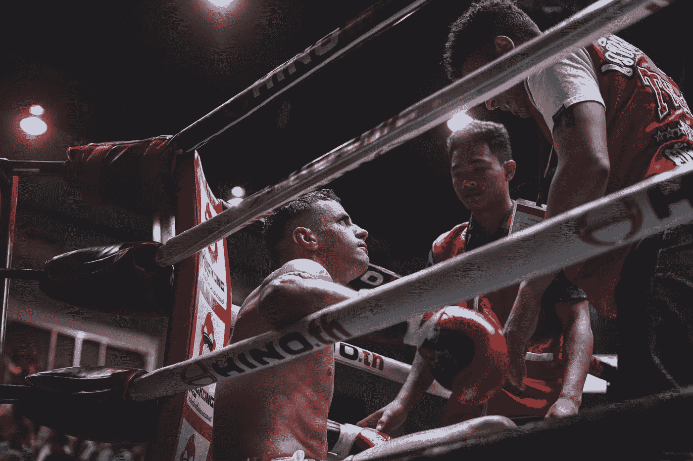

# 敏捷思维的错误# 4:“Coachitis”

> 原文：<https://betterprogramming.pub/agile-thinking-mistake-4-coachitis-abd6c92220f4>

## 应该像对待成年人一样对待员工。为什么他们仍然通过训练变得无能和幼稚？

图片:尼克·王

新的工作和敏捷运动开始于发展尊重工作形式的承诺。应该像对待成年人一样对待员工。为什么他们仍然通过训练变得无能和幼稚？

# 观察

你已经看过我之前关于敏捷思维错误的短篇系列文章了吗？那你就知道我在新工作的开发和敏捷转型中，偶然发现了很多不一致的地方。对我来说，它们有时似乎令人困惑和矛盾。例如，我一直在努力解决以下问题:

*   泰勒主义思维模式的权宜理性主义及其对无限经济增长和利润最大化的驱动力如何与资源稀缺的后现代时代的可持续商业保护相冲突。
*   方法联盟和管理者对复杂问题的简单解决方案的希望如何引发了公司的聚焦和网络动画化。
*   对快速成功的狂热追求是如何威胁敏捷转换的。
*   缺乏客户体验所有者是如何导致组织内部合作失常的。

今天，我将深入探讨敏捷运动的动力和热情所创造的另一个现象。我完全不知道它的意义。

## 管理者的必要性

让我们从更远的地方开始。在遥远的过去，当没有敏捷工作方法的时候，富有成效和建设性的员工的命运掌握在管理者手中。在传统的层级公司结构中，经理是真正的全能人才。他们不仅是员工的决策重心，也是团队绩效内容的专业权威。他们还代表公司作为雇主，从法律角度来看，对下属员工有惩戒权和权威。

恶意的舌头也称这种普遍的经理原型:高薪的智慧。这种智慧在公司层级中的位置越高，薪水就越高。这有许多影响和后果。员工的个人和职业生涯只能在管理层的阶梯上进行。由于这个原因，技术专家迟早会被提升到管理职位——因为缺乏发展选择。

通过这种方式，公司保证了被提升员工的专业技能。同时，它确保最有能力的人监督所有其他专家。

## 彼得原理

这种形式的职业发展导致了劳伦斯·J·彼得提到的一种现象，彼得原理就是以他的名字命名的。它指出，在一个等级制度中，每个员工都倾向于上升到他的无能水平。一旦达到这个水平，任何进一步的发展都被排除，否则失败是不可避免的。

为了抵消这种可能性，公司喜欢派他们的管理人员去参加管理研讨会。在那里，他们被教导管理者任务的实际重点是什么。像彼得·德鲁克或弗雷德蒙德·马利克这样的学者已经花了几十年的时间来教授管理中的任务和职责。

尽管在管理潜力教育方面进行了所有这些努力和投资，但一种情况正在出现:似乎由管理人员和无效管理在组织中造成的问题大于其好处。

## 管理的意义和目的

管理者的核心任务和责任可以集中在两个方面:

1.  提供方向
2.  消除歧义

是的，管理的意义和目的可以用这样一种简单而优雅的方式来理解。无论是董事会成员还是团队领导，无论是部门主管还是部门主管。在他们任务的核心，他们都必须为委托给他们、分配给他们或隶属于他们的员工回答以下问题。

*员工为部门和整个组织工作的目的是什么？*

因此，经理应该为他们员工提供指导。

哪些目标、哪些运营和战略工作内容是为哪些需求者、客户或同事提供服务，以什么水平和什么成本提供服务？

这些定位的内容会引起问题或恼怒。需要确定个别员工或部门的冲突目标。也许员工不确定如何进行操作，以及必须设置哪些优先级。

对于所有这些问题，经理有责任解决已发现或提出的模糊之处。根据所涉及的员工数量和各自责任领域的复杂程度，可以假设一个经理正忙于处理这两个问题。就时间而言，他们很可能被占满了。

是的，亨利·明茨伯格(1973)或亨利·法约尔(1916)的复杂模型详细阐述和解释了管理任务。但是所有这些定义的底线是基本上有两个核心元素:提供方向和解决歧义。

## 敏捷 VUCA 反面乌托邦

尽管有上述模型和原则，但对最佳和最有效管理形式的质疑和探索从未停止。在这种讨论中——所有参与和受影响的人早已习惯了——敏捷运动爆发了。

它声称，在数字革命和高度动态的 VUCA 剧变的时代，组织的等级形式和经典的管理原则已经完全过时了。他们只是太无效了。自我组织，与员工平起平坐，与高管同等重视，不考虑地位或收入群体:这些现在被称为经济成功和适应变化的公司的关键要素。

## 不知所措的帮手:教练

企业领导人和决策者非常乐意相信这种拯救承诺。尤其是当他们被苹果、谷歌或亚马逊等科技巨头的成功故事装点的时候。一定有一些自组织的、敏捷的团队能够达到最佳的表现。艾米·c·埃德蒙森(Amy C. Edmondson)在她对无恐惧组织的研究中科学地证明了这一点。

但是，如何将自组织引入公司呢？你如何向员工和经理传达在当前状态下需要改变什么？你如何教他们获得新的心态？缺乏必要的应用安全性、知识或经验似乎需要教练的指导和建议。

他们应该教授、解释和建立缺失的技能。他们应该给管理者和员工提供自组织合作的方向:没有等级，在平等的基础上。他们应该解决员工和经理之间出现的模糊问题。

## 在临界点上

你注意到什么了吗？澄清后面的问题难道不是管理者的任务吗？管理者不应该给出方向并解决不明确的发展吗，比如冲突？

让我们简单总结一下:对于那些没有学到管理技巧的优秀专家来说，管理是一条充满风险的职业道路。管理实践方面的指导不足以满足 VUCA 动态和敏捷的合作与协作方式的出现。

由于经理们似乎已经被管理压得喘不过气来，教练们必须被激活。他们应该填补自组织实践缺失的空白。现在，经理们站在一旁，看着员工如何在敏捷团队中组织自己，并从教练那里获得必要的指导和冲突解决方案。

## 全职教练，但没有责任

这种发展最初涉及来自公司外部的教练，如自由职业顾问，现在已经有所发展。这几乎已经成为公司的一种新常态。有需要的帮助者应该在合作实践中弥补业务知识的差距。但现在，他们已经成为永久的全职教练。

他们的职业是在运营工作和战略规划中持续观察公司内的员工和团队。他们应该指出应该使用哪种形式的工作、沟通和合作模式，员工在相互交往中做错了什么，以及他们如何解决冲突和弥补不足。

从两个角度来看，这一事实令我震惊。首先，敏捷的工作形式应该使企业组织更有生产力。自我组织、授权、赋能、方法培训以及确保无恐惧和心理安全的工作环境应能提高现有员工的绩效水平。

它们要么应该变得更有生产力，要么减少人员编制，以保持已经达到的生产力水平。然而，所发生的是劳动力的增长和全职教练的增加。但结果是，员工成本增加。很讽刺，不是吗？

第二，教练的支持、训练或观察应该减少组织中现有的沟通和合作的复杂性。在一些公司中，层级甚至减少了，员工被管理层解雇:毕竟，在一个敏捷的、自组织的公司中不再需要他们。

但是每一个永久员工自然需要一个工作的目的，所以他们必须寻求和找到意义。因此，教练成了公司内部合作的额外元素。它们影响业务流程、决策路径以及沟通和合作的形式。所有这些都没有团队中技术专家的操作责任，或者经理的纪律或业务责任。

完全不负责任最大影响全额赔付。又来了，似是而非还是单纯耸人听闻？

# 现在怎么办？

我能理解所描述的发展。我知道临时聘用的顾问和教练的有用性和相关性，并认为他们是必要的。但是，由于长期雇佣或聘请教练而导致的功能障碍是一个严重的误解，原因有二:

## 教练需要观察一个公司的员工和经理的互动和合作。

他们将在反思或监督的背景下向被观察的行为者提供他们的看法。被观察者由此得出什么结论或见解完全是他们的责任。

按照尼可拉斯·卢曼和海因茨·冯·förster 的定义，作为一阶或二阶观察者的教练，如果是一个系统的一部分，就无法观察这个系统。而且他们绝不能干预系统，因为否则他们就变成了行动者，离开了观察者的角色。

## 永久受雇于组织的教练可以，因为他们是一个不可分割的组成部分，因此行动者，充其量只能起到培训者或指导者的作用。

在此功能中，他们可以在传递合作方法和形式的实际应用安全性方面做有价值的工作。他们的绩效贡献可以从员工学习成功的角色中得到认可。因此可以排除操作或管理责任。培训师、经理和员工的互动角色之间没有目标或观点的冲突。

最重要的是，一家公司仍然坚持将员工视为成熟、负责任、独立思考和行动的成年人的原则。它不会继续剥夺和幼稚的劳动力，他们已经在管理阶层的经验，通过教练。