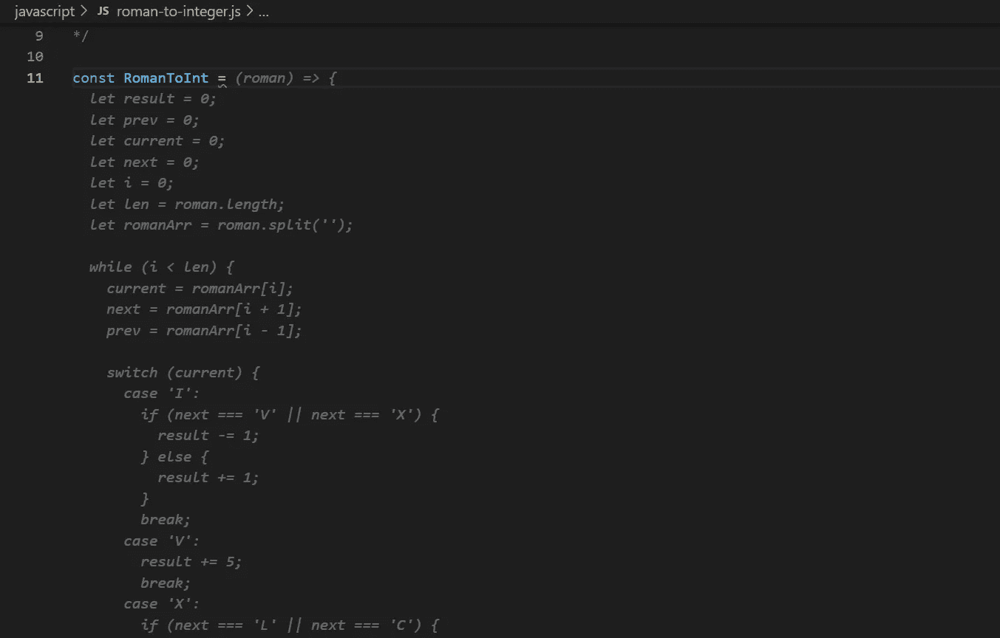
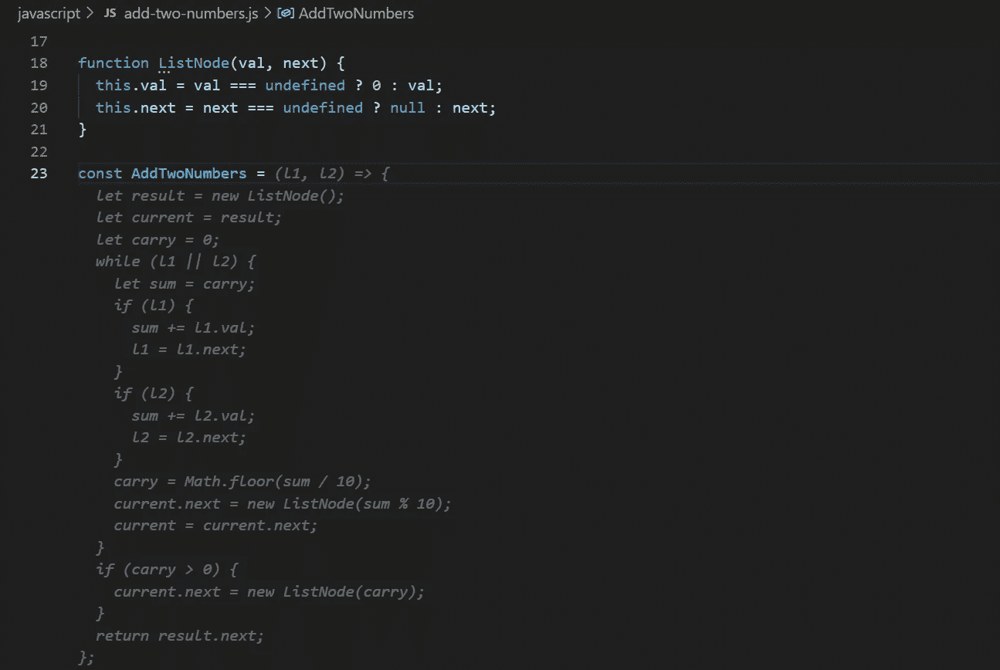
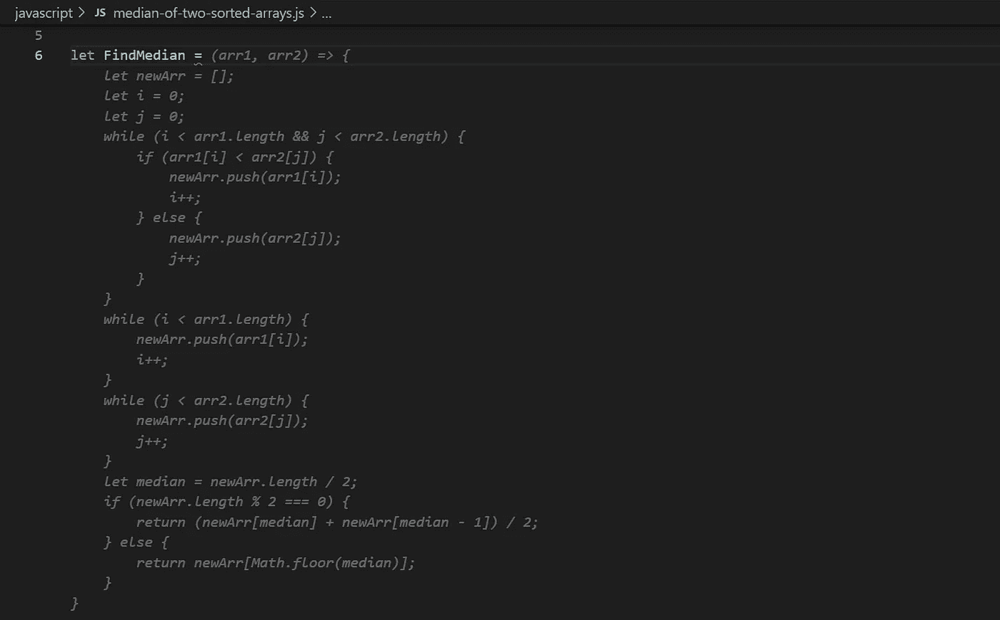
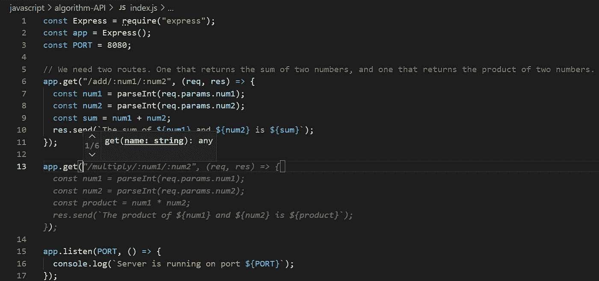

# 深入了解 GitHub Copilot

> 原文：<https://betterprogramming.pub/ai-review-github-copilot-d43afde51a5a>

## GitHub Copilot 如何在引擎盖下工作


```
let GitHub_Copilot = new AI_Review({
 Category: Code Completion,
 Contestant: GitHub Copilot,
 Model: GPT-3,
 Engine: Codex,
 Creator: GitHub,
 Last_Updated: 10/30/2021,
})
```

欢迎来到 AI Review，在这里我们谈论不同的人工智能产品，这些产品旨在让像你我这样的开发人员的生活更轻松。今天我们要谈论的是 GitHub Copilot，这是我在这个博客上广泛谈论过的一款产品，也是我非常兴奋的一款产品。我们将深入了解它是如何工作的，你是否应该费心使用它，以及它如何与它的竞争对手相抗衡。

我们将根据一系列指标来衡量它，这将使我们尽可能客观。这里的目标是弄清楚这个产品实际上有多有用，以及它是否实现了它的主要目标，即通过使开发人员的工作变得更容易来提高他们的工作效率。一个产品可能很酷，华而不实，但最终只不过是一个派对把戏(当然，是一个书呆子派对)，没有真正的价值。

GitHub Copilot 似乎不是这样，然而第一印象可能会产生误导。在一些顶级公司如微软、GitHub 和 OpenAI 的支持下，Copilot 带来了一些很大的期望，我当然希望这些能够实现。也就是说，除非我继续写这篇文章，否则我们永远不会知道。

不再赘述，我们来说说 GitHub Copilot。

# 在后台

一个人工智能产品的工作方式将决定它有多好，简单明了。不良技术在最终产品中会很明显。无论是不一致，缓慢，缺乏足够的培训，或其他任何事情，如果技术是坏的，产品是坏的。也就是说，Copilot 有一个非常好的堆栈可以使用。

GitHub Copilot 基于 OpenAI 创建的 GPT-3 人工智能模型，该模型具有 1750 亿个语言处理参数。故事是这样的，人们试图使用 GPT-3 来完成基于简单英语输入的代码。虽然他们成功地让一些基本代码工作，但他们得到的补全大多是无用的。

然而，OpenAI 对让 GPT-3 编写代码的想法很感兴趣，因此他们基于它开发了一些花哨的代码编写引擎，这成为了他们的 Codex 系列。OpenAI Codex 是一个仍然只在私人测试版中为你我提供的工具，但微软购买了独家许可，可以出于自己的目的使用 GPT-3 及其引擎。

之后，GitHub(归微软所有)开始研究他们的 Copilot 技术。他们微调了 GitHub 上数百万行公共代码的 Codex 引擎，这就是 GitHub Copilot 中运行的代码。当你输入的时候，GitHub Copilot 会自动完成你的代码，根据它从所有被训练的代码中获得的知识，自动完成它能找到的最准确的完成。

然而，这可能会导致训练代码可能被许可的一些问题。人们已经多次发布了由 GitHub Copilot 完成的代码，这些代码未经许可使用是不合法的。尽管 Copilot 接受了开源代码的培训，但其中一些代码可能是剽窃的，因此在生产中使用并不安全。

也就是说，在大多数情况下，这不是一个问题，但它值得[检查](https://copyleaks.com/code-plagiarism-checker)。然而，由于这是一个技术预览，有理由假设 GitHub 将尽最大努力在完整版本中消除这些问题。如果他们不这样做，这可能是真正的产品问题。

## 那又怎样？

因此，GitHub Copilot 的后端出现了一些问题，但在大多数情况下，这些问题并不严重。GPT-3 是一个革命性的型号，是世界上最大和最有能力的型号之一。有了这款驱动 GitHub Copilot，这已经是该产品的一大胜利，并有望完成其代码。

# 界面

任何人工智能产品最重要的部分之一是开发者与它交互的方式。一个产品的界面可以在某些方面创造或破坏它，因为当没有人知道如何使用它时，你的花哨的应用程序、扩展或 API 工作得有多好并不重要。GitHub Copilot 以 Visual Studio 代码或 GitHub 代码空间扩展的形式出现。

一辆巨大的顺便延伸开来。你所要做的就是添加它，启用它，登录 GitHub，然后开始编码:


所有图片均由作者提供

这是与人工智能交互的最好方式之一，因为它忠于它的名字，感觉就像有另一个开发人员在那里帮助你。你带路，它干重活。不需要调用 API，不需要使用网站来与完成引擎进行交互，您所要做的就是编写代码，完成就在您的指尖。

这不一定是一个新想法， [Tabnine](https://www.tabnine.com/) 和 [Kite](https://www.kite.com/) 多年来一直以智能感知片段的形式这样做，但我喜欢 Copilot 通过将它们放在代码本身旁边来提出建议的方式。这样，您就可以预览完整形式的代码，只需按一下按钮就可以使用了(顺便说一下，`TAB` )。

如果你不喜欢它提供的第一个选项，你可以通过按下`ALT + ]`和`ALT + [`、*`Option`*来浏览其他选项，如果你在 Mac 上*。除了检查解决方案是否是您正在寻找的之外，这是简单、干净和易于使用的，不会降低您的打字速度。如果你想关闭它，只需点击右下角的小图标 Copilot 禁用它的全球，或特定的语言:***

****

**也就是说，如果你考虑到它只在 Visual Studio 代码和代码空间上可用的事实，这个接口可能有点缺乏。如果你使用那些 IDE，这是很好的，但是如果你不使用，它对你没有帮助。这又回到了成与败的问题上，对于许多开发人员来说，这个接口很棒，但是在它被更多的 IDE 支持之前，它对其他人来说根本就没用。**

**然而，我们不得不削减副驾驶在这方面有点突破，因为它仍然是在技术预览的形式。虽然开发人员对产品进行了改进，并且只对 beta 测试人员开放，但他们不会在其他平台上发布它是有道理的。因此，当完整版本发布时，这是否会成为一个真正的问题还有待观察。**

**另一个小错误是，有时当你编码时，它会完成一个破坏当前代码格式的部分。快速解决是的，但仍然很烦人:**

****

**如果我选择这段代码，它会抛出一个错误。我可以想象，如果我打字很快，这也很容易错过。当然，在现代 IDE 中，像这样的语法会像圣诞树一样亮起来，但同样的是，像这样的小错误，如果不解决，将来肯定会让产品变得令人讨厌。**

## **那又怎样？**

**综上所述，这个人工智能的界面非常棒。它并不完美，但它真的很坚固，使用它来满足您的需求不会有太大的麻烦。它几乎可以与 IDE 无缝地融合在一起，安装起来没有任何麻烦。看看它是如何被集成到其他 IDE 中的会很有趣，但是我们真的不知道，直到我们看到它。**

# **功能**

**我们测试的下一个方面将是检查这项技术如何解决开发人员面临的最大挑战之一，即功能的设计和创建。基本上有两种类型的函数，查询和命令。一个典型的应用程序使用这两者，所以如果 Copilot 希望使编码更容易，它将需要在功能创建的两个方面都有所帮助。**

## **问题**

**查询获取参数，然后以某种方式操作这些参数以返回结果，所有这些都不需要操作应用程序的状态。这些通常采用算法的形式，其中开发人员有一些数据，并设计一种方法来获取这些数据并返回将数据插入函数的预期结果。**

**我们将从一些 Leetcode 问题开始。一个容易的问题，一个中等的问题，一个难的问题，都是从 Leetcode 首页随机选取的。为了保持一致性，我们将对它们都使用 JavaScript。**

**对于这个简单的问题，我们将解决[罗马到整数](https://leetcode.com/problems/roman-to-integer/)，基本上我们接受一些罗马数字作为输入，并返回整数形式的等价物。在这里，我要给人工智能一些关于我们需要我们的功能做什么的上下文:**

****

**既然它知道我们在谈论什么，让我们从函数开始:**

****

**就这样，它已经找到了解决办法。我不能截图整个事情，所以我将粘贴其输出如下。**

```
**const RomanToInt = (roman) => {let result = 0;let prev = 0;let current = 0;let next = 0;let i = 0;let len = roman.length;let romanArr = roman.split("");while (i < len) {current = romanArr[i];next = romanArr[i + 1];prev = romanArr[i - 1];switch (current) {case "I":if (next === "V" || next === "X") {result -= 1;} else {result += 1;}break;case "V":result += 5;break;case "X":if (next === "L" || next === "C") {result -= 10;} else {result += 10;}break;case "L":result += 50;break;case "C":if (next === "D" || next === "M") {result -= 100;} else {result += 100;}break;case "D":result += 500;break;case "M":result += 1000;break;default:break;}i++;}return result;};**
```

**那是轻而易举的事。我所要做的就是给它一些上下文，它甚至在我写完函数名之前就找到了解决方案。但是对于一个中等的问题，它能做同样的事情吗？让我们找出答案。**

**接下来，我将尝试使用[添加两个数字](https://leetcode.com/problems/add-two-numbers/)问题，其中我们输入两个链表，每个链表以相反的顺序表示一个非负整数，并返回两个整数之和作为一个新的链表。首先，给它一些背景:**

****

**然后制作函数本身:**

****

**经过测试，这可以工作并返回我们期望的链表。这已经令人印象深刻了，我们不仅不必花时间去弄清楚如何创建函数，而且我们也不用浪费太多时间来输入它，因为使用这个解决方案我们所要做的就是按`TAB`。**

**对于这个困难的问题，我将使用排序数组的中间值，我们取两个排序数组，将它们合并到另一个排序数组中，然后找到中间值。背景是这样的:**

****

**其余的:**

****

**对于 GitHub Copilot 来说太简单了，它可以在一秒钟内得到正确的答案。查询和算法遍布互联网，因此在 Copilot 的训练数据中会非常普遍。这意味着它在这类函数中有优势，你只需简单地获取一个输入并返回一个输出。然而，开发的重要部分是能够将它们很好地用于我们下一节的命令。**

## **命令**

**命令不一定会返回结果，但会进入应用程序，并以某种方式操纵其状态。比如 JavaScript 中的 DOM 操作或者 Python 中的渲染窗口。它经常需要使用查询来以正确的方式操作状态。对于较简单的应用程序，这通常是一项重复的任务，但有时需要更多的创造力。**

**为了测试 Copilot 在命令类型功能方面的效率，我们将在一个简单的 web 应用程序中查看几个命令功能示例，从 DOM 操作开始。基本上，我们想要一个小显示器来显示给定位置的当前天气，所以我们需要一个存储该信息的对象，然后我们需要创建新元素来显示它。**

**我将从手动创建对象开始:**

****

**然后，我希望它能够将所有这些信息添加到网站正文中，所以我会告诉它:**

****

**然后，我将继续编写`createElement`函数:**

****

**截屏并向您展示 Copilot 为每个功能所做的每个自动完成似乎很乏味，所以对于其余部分，您可以假设我展示的所有代码都是由 Copilot 编写的，除非另有说明。下面是`createElement`函数:**

****

**附加元素功能:**

****

**创建天气分区:**

****

**然后制作温度段:**

****

**这就是我们遇到的第一个问题，因为我们的`createElement`函数没有内容参数，我们不能在函数调用本身中设置该属性，相反，必须手动设置。也就是说，我将跳过一点脚本，向您展示最终产品:**

****

**作者图片**

**就这样，Copilot 设法编写了代码，从预测中提取大量数据，并将其插入到 DOM 的主体中。然而，实际上，我们需要预测对象是动态的。假设我们有一个很棒的天气 API，我们想从它那里得到天气预报。我将在预测对象前添加说明:**

****

**和呼叫:**

****

**所以现在我们有了一个应用程序，它可以动态获取数据，然后创建一些元素来显示这些数据。这是 web 开发人员的一项常见工作，因此，自动补全在这里实际上非常有用。当然，不同的语言和任务会有不同的表现，但是对于有大量公共代码的最常见的语言来说，这些事情对 Copilot 来说很容易。**

## **那又怎样？**

**功能是副驾驶的面包和黄油，这就是它的目的。该产品的想法是帮助开发人员专注于如何将功能放在一起，而不是如何制作功能本身。在我看来，这已经完成得很好了，通常副驾驶第一次尝试就做对了，如果你不喜欢最初的完成，你可以选择一个不同的。总的来说，Copilot 非常擅长编写函数，仅仅因为这个原因就值得一试。**

# **应用程序构建**

**软件开发人员的主要工作是构建应用程序。这些应用程序有不同的工作，但总体结构相似。例如，一个 web 应用程序的前端可能会使用 React 或 Angular 之类的 JavaScript 框架，而后端则使用 Express 和 Node 之类的东西构建。开发人员的工作是使用可用的工具来满足正在开发的应用程序的特定需求。既然这是开发人员日常工作中不可或缺的一部分，一个好的自动完成人工智能需要能够帮助你。**

**我们将为我们的新算法 API 构建一个非常简单的 Express 服务器。我们将从不同端点的用户那里获取查询，并返回这些查询的结果。我们将从构建服务器本身的框架开始。我已经安装了 Express，并在 index.js 文件的根目录下初始化了一个新的节点项目。我将开始输入，但不会给出太多的上下文，因为这是一个相当简单的任务:**

****

**它会立即恢复。我将继续按下`tab` 并结束快速服务器:**

****

**然而，这里我们遇到了一点问题:`bodyParser`被弃用。由于 GitHub Copilot 是在公共代码上训练出来的，而且很多公共代码都包含了这个`bodyParser`行，它认为我们应该在这里，尽管我们实际上并不想使用被否决的语法。**

**一个好的开发人员应该知道如何使用 GitHub Copilot，而不是在不知道一行代码是做什么的情况下就相信它，尤其是在使用像 Express 这样的 API 和框架时。也就是说，并不是每个开发人员都会如此关注，这可能会导致您的代码中出现难以察觉的错误和漏洞。**

**也就是说，让我们继续我们的设置:**

****

**好了，如果我们用 node 运行它，从技术上讲，我们将有一个服务器在运行。但是，我们确实需要一些路线，所以让我们添加这些路线。在这里，我不介意添加一些人工智能使用的上下文，因为假设它应该读取我们的想法是不公平的:**

****

**所以我们很容易就能找到第一条路。如果我运行这个服务器，然后去`localhost:8080/add/2/2`，我会得到`The sum of 2 and 2 is 4`。继续下一条路线:**

****

**很简单，经过一点上下文，我们得到了现在需要的两条路线，我们可以在以后添加。**

## **那又怎样？**

**基本上，Copilot 可以编码，它可以很好地完成小任务，但需要你引导它向你希望的方向前进。它又一次保持了它的名字，让你带路，并在这个过程中简单地帮助你。然而，这意味着在应用构建方面，你将会做大部分的工作。Copilot 可以帮你写代码行，但是你要知道把它们放在哪里。出于这个原因，副驾驶是有帮助的，但肯定需要指导，因为这是重点。**

# **最后的想法**

**GitHub Copilot 是一款出色的产品。它的目的不是取代开发人员，而是通过减轻他们的负担来提高他们的工作效率。也就是说，它做得有多好？我会说非常好。代码完成并不新鲜，像 [Tabnine](https://www.tabnine.com/) 和 [Kite](https://www.kite.com/) 这样的工具已经存在多年，它们带来了人工智能辅助的代码片段，但在准确性或工作深度方面，它们都无法与 Copilot 相比。**

**我想说的是，如果你想提高你的工作效率，获得准确而有用的代码完成，去注册 GitHub Copilot 的技术预览版，或者最好等待完整版。也就是说，你必须小心，因为 Copilot 会给你代码，但如果你不知道它在做什么，那么你手上就有一个灾难的配方。我建议只使用 GitHub Copilot 来完成任何级别的代码，以避免它编写你无法理解的抽象函数。**

**总而言之，GitHub Copilot 是一款很棒的产品，你可能不会对它感到失望。如果你有想法或者你认为我错过了什么，请在下面告诉我，我很乐意听听你的想法。我计划让这篇评论保持最新，尽可能准确，所以我可能会在未来更新它。**

***大家编码快乐！***